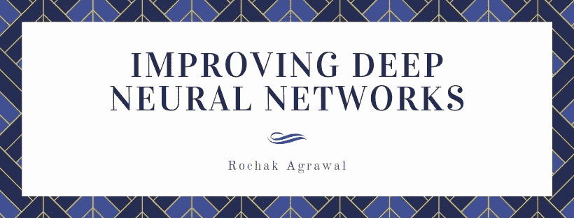
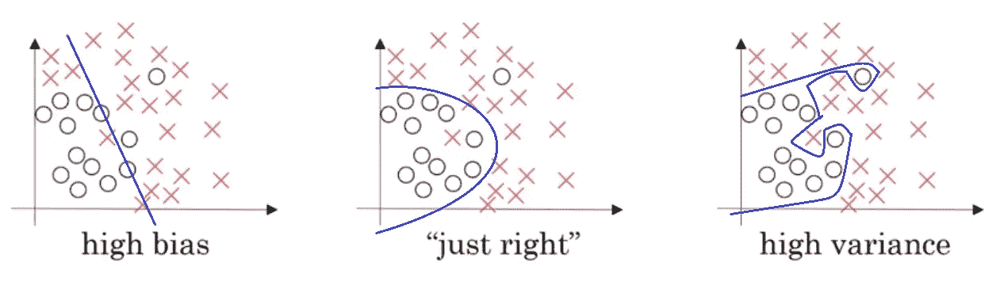
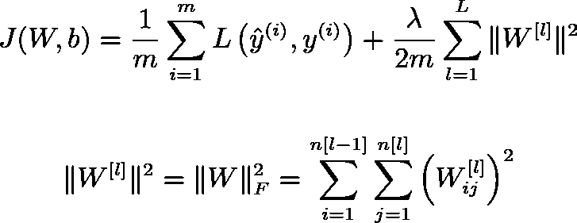
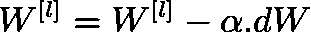
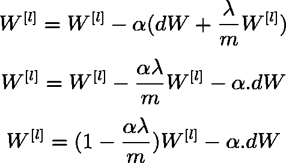
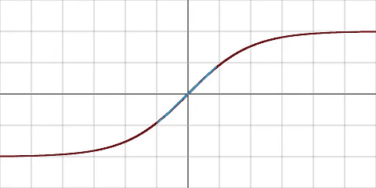
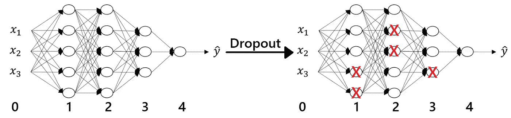
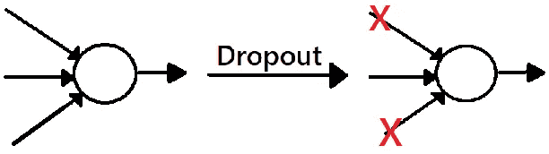
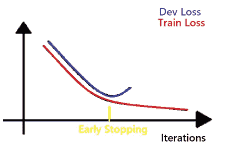

# 改进深度神经网络

> 原文：<https://towardsdatascience.com/improving-deep-neural-networks-b5984e29e336?source=collection_archive---------22----------------------->



深度神经网络是自然语言处理、计算机视觉、语音合成等复杂任务的解决方案。提高他们的表现和理解他们如何工作一样重要。要了解它们是如何工作的，你可以参考我以前的帖子。在这篇文章中，我将解释与改善神经网络相关的各种术语和方法。

# 偏差和方差

偏差和方差是解释网络在训练集和测试集上表现如何的两个基本术语。让我们用一个 2 类问题来简单直观地理解偏差和方差。蓝线表示由神经网络计算的决策边界。



1.  最左图显示神经网络存在**偏高的问题。**在这种情况下，网络已经学习了一个简单的假设，因此不能根据训练数据进行适当的训练。因此，它不能区分不同类别的示例，并且 ***在*** 的训练集和测试集上都表现不佳。我们也可以说这个网络不适合。
2.  最右边的图显示神经网络存在**方差高的问题。在这种情况下，网络已经学习了一个非常复杂的假设，因此不能概括。因此， ***在训练数据上表现出色，而在测试数据*** 上表现不佳。我们也可以说网络**过度拟合。****
3.  中心图显示了一个 ***【恰到好处】*** 的神经网络。它已经学习了理想假设，这有助于网络过滤掉异常，并对数据进行归纳。我们的目标应该是实现这样的网络类型。

# 训练食谱

既然我们知道什么样的神经网络是可取的；让我们看看如何实现我们的目标。这些步骤首先解决偏差问题，然后解决方差问题。

我们应该问的第一个问题是“是否存在高偏差？”如果答案是**是**，那么我们应该尝试以下步骤:

*   培养一个更大的网络。它包括增加隐含层的数目和隐含层中神经元的数目。
*   长时间训练网络。可能的情况是，完整的训练尚未完成，将需要更多的迭代。
*   尝试不同的优化算法。这些算法包括 Adam、Momentum、AdaDelta 等。
*   反复执行上述步骤，直到偏差问题得到解决，然后进入第二个问题。

如果答案是**否，**说明我们已经克服了偏倚问题，是时候关注方差问题了。我们现在应该问的第二个问题是“方差高吗？”如果答案是**是的，**那么我们应该尝试以下步骤:

*   收集更多的训练数据。随着我们收集更多的数据，我们将获得更多的数据变化，从较少变化的数据中习得的假设的复杂性将被打破。
*   试试正规化。我将在下一节谈到它。
*   反复执行上述步骤，直到方差问题得到解决。

如果答案是**否，**说明我们已经克服了方差问题，现在我们的神经网络是 ***【刚刚好】*** 。

# 正规化

正则化是一种逻辑技术，有助于减少神经网络中的过拟合。当我们将正则化加入到我们的网络中时，我们添加了一个新的正则化项，并且损失函数被修改。修改后的成本函数 **J** 的数学公式为:



带有***λ***的第二项称为正则化项。术语 ***||W||*** 通称为 ***弗罗贝纽斯范数*** (矩阵中元素的平方和)。随着正则化的引入，***λ***成为新的超参数，可以对其进行修改以提高神经网络的性能。上述正则化也被称为 ***L-2 正则化。***

之前，我们使用以下更新规则来更新权重:



由于在包括正则化的修改的成本函数 ***J，*** 中有新的正则化项，我们将以如下方式更新权重:



这里我们可以看到权重值减少了一个小于 1 的小数值。因此，我们也将这类正则化称为 ***权重衰减。*** 衰减值取决于学习率***α***和正则项***λ。***

## 为什么正规化行得通？

训练神经网络的最终目标是最小化成本函数 ***J*** 以及正则化项。现在我们知道了什么是正则化，让我们试着理解它为什么有效。

第一个直觉是，如果我们增加***λ、*** 的值，那么 ***Frobenius 范数*** 就变小了，权重值就变得接近 0。这种方法主要清除某些神经元，使网络变得很浅。可以认为是将学习复杂假设的深层网络转换成学习简单假设的浅层网络。我们知道，简单假设导致复杂特征减少，过拟合就会减少，我们就会得到一个 ***【恰到好处】*** 的神经网络。

另一种直觉可以从应用正则化时神经元的激活方式中获得。为此，让我们考虑 ***tanh(x)*** 激活。



如果我们增加***λ***的值，那么 ***Frobenius 范数*** 变小，即权重 ***W*** 变小。因此，该层的输出将变小，并将位于激活函数的蓝色区域。我们可以看到，蓝色区域的激活几乎是线性的，网络将表现得类似于浅层网络，即网络将不学习复杂的假设(将避免尖锐的曲线)，并且过拟合将最终减少，并且我们将获得一个 ***【恰到好处】*** 神经网络。

因此，***λ***的值过小将导致过拟合，因为 ***Frobenius 范数*** 将会很大，并且神经元将不会被清除，并且层的输出将不会在线性区域中。类似地，过大的***λ***值将导致欠拟合。因此，找到***λ***的理想值是提高神经网络性能的一项至关重要的任务。

# 辍学正规化



丢弃正则化是另一种正则化技术，其中我们丢弃某些神经元以及它们在神经网络中的连接。概率 ***keep_prob*** 决定了将要丢弃的神经元。在神经元被移除之后，网络在剩余的神经元上被训练。重要的是要注意，在测试时间/推断时间期间，所有的神经元都被考虑用于确定输出。让我们借助一个例子来理解这个概念:

```
# Define the probablity that a neuron stays.
keep_prob = 0.5# Create a probability mask for a layer eg. layer 2\. The mask should # have same dimensions as the weight matrix so that the connections # can be removed.
d2 = np.random.rand(a2.shape[0],a2.shape[1]) < keep_prob# Obtain the new output matrix.
a2 = np.multiply(a2,d2)# Since few neurons are removed, we need to boost the weights of    # remaining neurons to avoid weight imbalance during test time.
a2 = a2/keep_prob
```

由于我们首先丢弃概率为 ***keep_prob*** 的神经元，然后用 ***keep_prob*** 提升剩余的神经元，这种类型的丢弃称为 ***反向丢弃。***



dropout 之间的直觉是，它禁止神经元只依赖于某些特征，因此，权重是分散的。可能的情况是，神经元变得依赖于某些输入特征来确定输出。在 dropout 正则化的帮助下，对于训练过程中的不同训练样本，特定神经元每次只获得少量特征作为输入。最终，权重分布在所有输入中，网络使用所有输入特征来确定输出，而不依赖于任何一个特征，从而使网络更加健壮。它也被称为***L2 正则化的自适应形式。***

我们也可以为每一层单独设置***【keep _ prob】****。由于被丢弃的神经元数量与 ***keep_prob*** 成反比；建立***keep _ prob****的一般标准是，密集连接应该具有相对较少的***keep _ prob****以便丢弃更多的神经元，反之亦然。***

***另一个直觉是，随着退出正规化，深层网络在训练阶段模仿浅层网络的工作。这进而导致减少过拟合，我们获得一个 ***【恰到好处】*** 神经网络。***

# **提前停止**

**早期停止是一种训练方法，在这种方法中，我们在较早的阶段停止训练神经网络，以防止它过度拟合。我们跟踪 ***train_loss*** 和 ***dev_loss*** 来确定何时停止训练。**

****

**刚好 ***dev_loss*** 开始超调；我们停止训练过程。这种方法论被称为*。但是，由于以下两个原因，早期停止不是训练网络的推荐方法:***

1.  ***当我们停止训练过程时，损失不是最小的。***
2.  ***我们正试图减少训练不当的网络上的过度拟合。***

***过早停止会使事情变得复杂，我们无法获得 ***【恰到好处】*** 神经网络。***

# **参考**

1.  **[维基百科—激活功能](https://en.wikipedia.org/wiki/Activation_function)**
2.  **[Coursera——深度学习课程 2](https://www.coursera.org/learn/deep-neural-network/home/welcome)**

***我想感谢读者阅读这个故事。如果你有任何问题或疑问，请在下面的评论区提问。我将非常乐意回答这些问题并帮助你。如果你喜欢这个故事，请关注我，以便在我发布新故事时获得定期更新。我欢迎任何能改进我的故事的建议。***