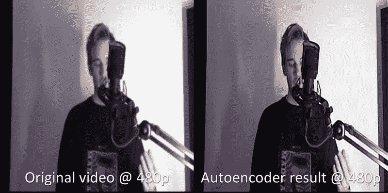
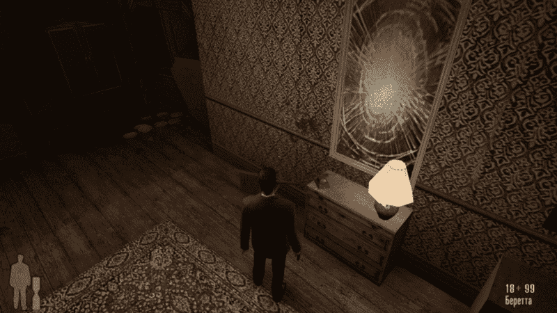
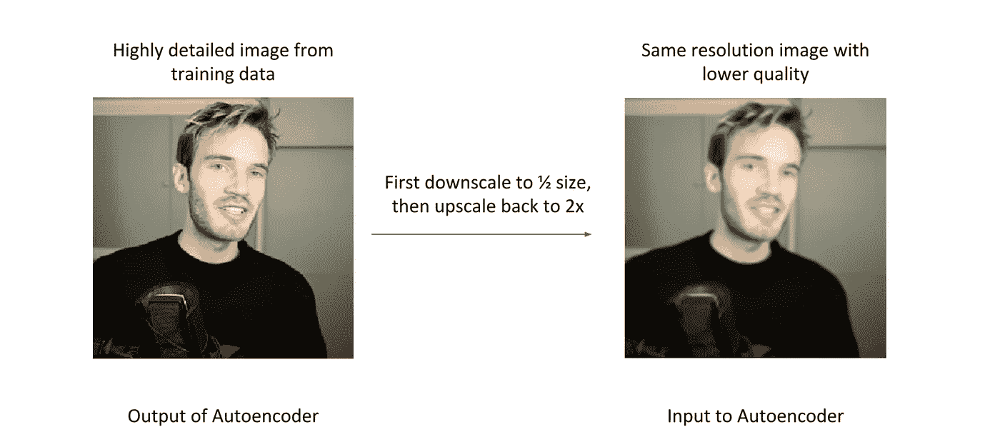
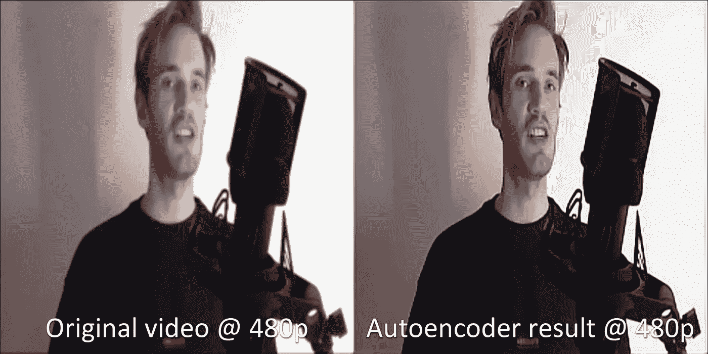
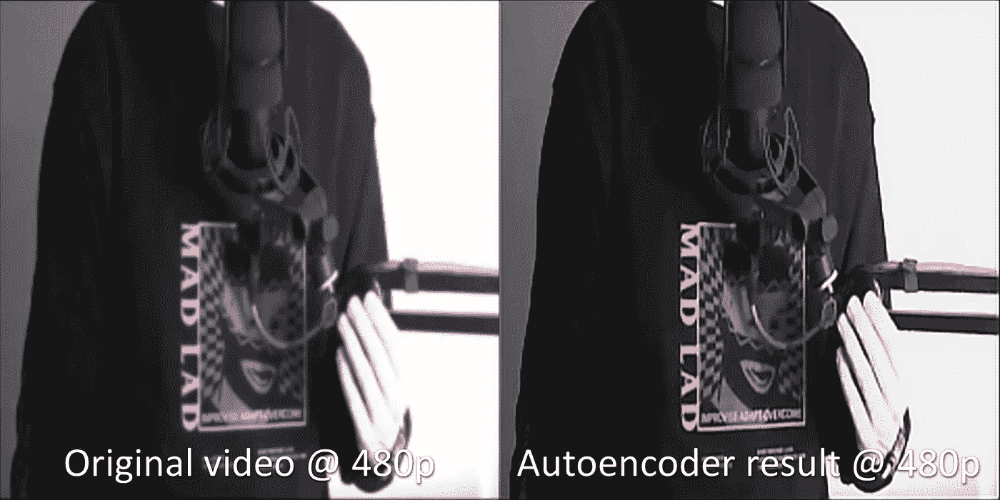

# 使用自动编码器提高 PewDiePie 的相机质量

> 原文：<https://towardsdatascience.com/improving-pewdiepies-camera-quality-with-autoencoders-583635de1cde?source=collection_archive---------23----------------------->

## 让我们来看看如何通过自动编码器将深度学习用于图像超分辨率。

Comparison of the 480p input (left) to an Autoencoder trained for the task of image super-resolution, with it’s higher quality output at the same resolution (right).

最近，我一直在阅读各种图像超分辨率技术，这些技术利用深度学习来提高图像清晰度。使用像 [GANs](https://medium.com/@jonathan_hui/gan-super-resolution-gan-srgan-b471da7270ec) 和[自动编码器](https://arxiv.org/pdf/1606.08921.pdf)这样的技术来完成这项任务，已经取得了一些令人印象深刻的成果。可以有把握地推测，如今大多数智能手机相机和其他图像处理软件都利用这种人工智能来“[增强](https://knowyourmeme.com/memes/zoom-and-enhance)图像。

在这篇文章中，我想探索和详细说明自动编码器对于这项任务的有效性，并在最近的 PewDiePie 的[视频中展示一些结果。](https://www.youtube.com/watch?v=pUFumN5UsiE&t=29s)

## 为什么是派迪派？

如果你最近一直在关注订阅量最大的 YouTuber，你就会知道他面临着很多批评和嘲笑，因为尽管他使用了昂贵的摄影器材来录制视频，但他的视频质量很低。

这让我认为，这将是玩超分辨率人工智能算法的完美用例，并看看我们可以用它们实现多少更好的视频质量。

## 什么是图像超分辨率？

低分辨率(LR)模糊图像可以被放大以输出更清晰、更详细的高分辨率(SR)图像的技术被称为单图像超分辨率。目的是恢复图像中由于相机质量差或照明条件差而丢失的对象信息。

An example of image super resolution using Neural Networks (ESRGAN). [[Source](https://www.dsogaming.com/news/max-payne-gets-an-amazing-hd-texture-pack-using-esrgan-and-is-available-for-download/)]

卷积神经网络(CNN)已被证明在这类任务中相当出色，尤其是与更传统的插值技术相比。由于能够学习常见物体的形状和纹理，CNN 在恢复信息方面非常有效，否则这些信息甚至可能不会出现在 LR 图像中。因此，让我们看看如何训练一个基于 CNN 的自动编码器来完成这项任务。

## 收集培训数据

首先，我们来看看我们的训练数据。我们将使用 Pewds 的一对低分辨率-高分辨率(LR-HR)图像来训练我们的自动编码器网络。

Generating training data

收集这种类型的数据相当容易，即使这是监督学习。我们只需要高分辨率的图像，通过对图像进行简单的缩小和放大操作，很容易生成低分辨率的图像，如上图所示。这给了我们用于网络训练的输入输出对。

## 自动编码器架构

自动编码器网络包含两个主要模块——编码器**和 T2 解码器**。下图显示了整个编码器-解码器网络设置。

LR -> Encoder -> Encoding -> Decoder -> SR

**编码器**的任务是接收 LR 图像，并找到该图像的高级表示，称为编码。为此，它使用各种卷积层。输出编码包含图像中各种对象的形状和纹理信息，并且比输入图像的尺寸小得多。然而，人类并不能真正理解这种编码，而只是这种特定网络能够理解的一种表示。

**解码器**的任务是进行编码并创建更高分辨率的图像。为此，它使用各种上采样模块，并从编码器的早期卷积层获得帮助，以恢复图像中可能在转换为编码时丢失的一些信息。这在上图中用上方的箭头表示。请将此视为解码器在平滑和锐化接收到的信息时向编码器询问原始图像的具体细节。

最后，我使用的特定网络将图像放大到与输入图像相同的分辨率，但质量更清晰，像素细节更多。如果感兴趣，你也可以尝试超越 LR 分辨率。

## 结果

我使用生成的图像和地面实况之间的基本 MSE 损失度量来训练网络。这当然不是你可以用来比较图像的最佳损失度量，所以在这方面还有很大的改进空间。

无论如何，即使使用 MSE，我也能得到相当不错的结果，这让我相信基于 CNN 的自动编码器对这项任务非常有效。以下是 LR 输入和 SR 输出之间的一些示例比较。

Left: input to autoencoder. Right: output of autoencoder. Both images are 480x480.

Left: input to autoencoder. Right: output of autoencoder. Both images are 480x480.

更多视频格式的结果，请查看我的 [YouTube 频道](http://youtube.com/c/DeepGamingAI)下面嵌入的视频。

## 结论

虽然来自自动编码器的结果相当不错，但在实践中它们并不十分先进。还有各种其他基于 GAN 的方法用于训练图像生成器，产生看起来更真实的输出。总之，与 GAN 的发生器-鉴频器设置相比，基于 MSE 的损耗，甚至我们在这里可以用于纯自动编码器的任何其它损耗，都是不利的。

在任何情况下，这肯定是非常令人印象深刻的，我们可以用人工智能实现这些天，所以它值得关注最新的研究，如果你对图像超分辨率感兴趣！

感谢您的阅读。如果你喜欢这篇文章，你可以在[媒体](https://medium.com/@chintan.t93)、 [GitHub](https://github.com/ChintanTrivedi) 上关注我的更多作品，或者订阅我的 [YouTube 频道](http://youtube.com/c/DeepGamingAI)。