# 利用语义搜索和自然语言处理改进栈溢出搜索算法

> 原文：<https://towardsdatascience.com/improving-the-stack-overflow-search-algorithm-using-semantic-search-and-nlp-a23e20091d4c?source=collection_archive---------7----------------------->

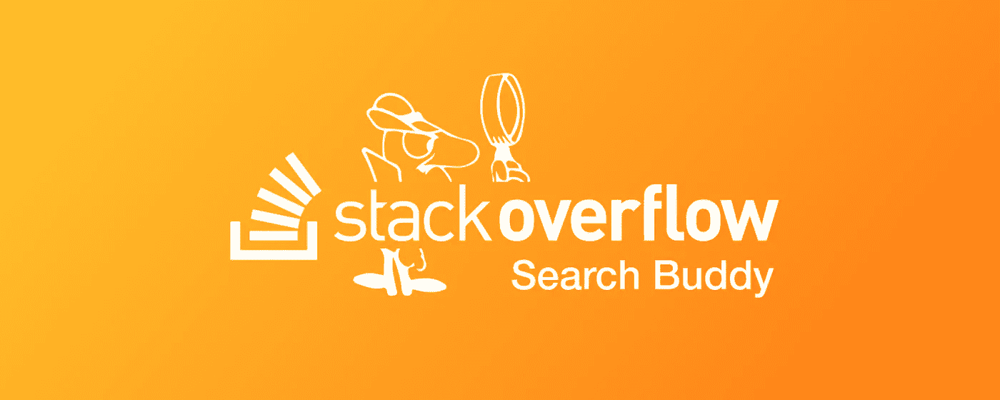

如果你是一个曾经尝试过编写一段代码的人，你肯定会遇到**栈溢出**(这很有名)。对于那些生活在岩石下的人来说，**栈溢出**为程序员提供了一个最大的 QA 平台。用户提出问题/疑问，他们的同伴试图以最有帮助的方式提供解决方案。答案越好，得到的票数就越高，这也提高了用户的声誉。

鉴于它的受欢迎程度，可以肯定地说，那里有大量的数据。然而，这种巨大的信息量也使得人们很难找到自己想要的解决方案。对于编程老手和其他有经验的专业人士来说，这并不是什么大问题，因为他们知道获得适当答案所需的正确关键字。然而，对于一个初级程序员来说，这是一个很大的问题。例如，如果他需要学习使用 Python 的*‘如何制作服务器’*，他不太可能在搜索框中使用术语*‘Django’*或*‘Flask’*。因此，这可能会威胁用户使用该平台。

因此，一个最佳的搜索引擎是必要的导航通过这个烂摊子。然而，就目前的情况来看，Stack Overflow 的搜索引擎也有一些自身的缺陷。让我举个例子来说明:

> 假设我是 NodeJS 的初学者，我想运行我的应用程序。因此，我转到 Stack Overflow 并键入以下内容:*‘Node—如何运行 Node app . js？’*。这是我得到的:

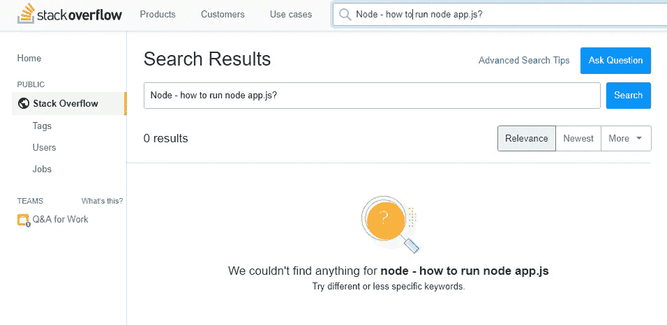

> **但是**确实存在*节点——如何运行 app.js 的结果:*

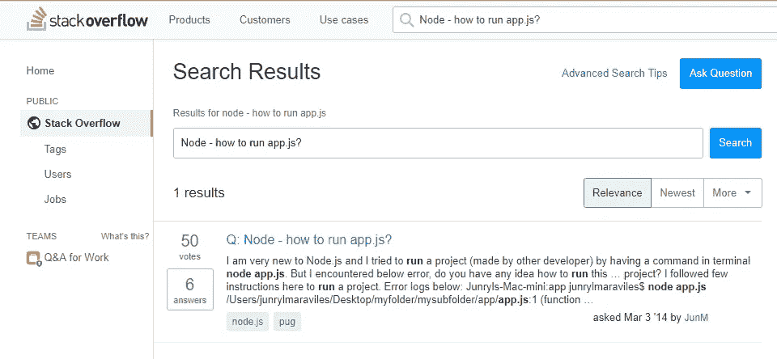

> 理想情况下，它应该返回两个查询的结果，但是没有。

休斯敦，我们有麻烦了 

***但你问，何必呢？*** 栈溢出的主要收入来源是通过**广告收入**。因此，他们的目标是最大限度地提高用户参与度，以推动更多的广告，从而赚更多的钱。由于他们的搜索引擎的次优性能，用户将很难通过他们的网站清除他的疑虑，因此将决定使用更复杂的搜索引擎，如谷歌。

当谷歌建议使用 Stackoverflow 之外的资源时，问题就出现了。对于每一个离开他们网站的用户来说，他们损失了他们本可以赚到的钱。

# 一个可能的解决方案

我们的目标是让平台真正理解用户试图搜索的内容，然后基于此返回最相似的结果。

自 20 世纪问世以来，自然语言处理(NLP)已经走过了漫长的道路。由于快速的处理器和复杂的模型架构，人工智能的这个子领域在过去几年中已经被证明工作得非常好，因此在解决各种语言理解任务方面具有巨大的潜力。

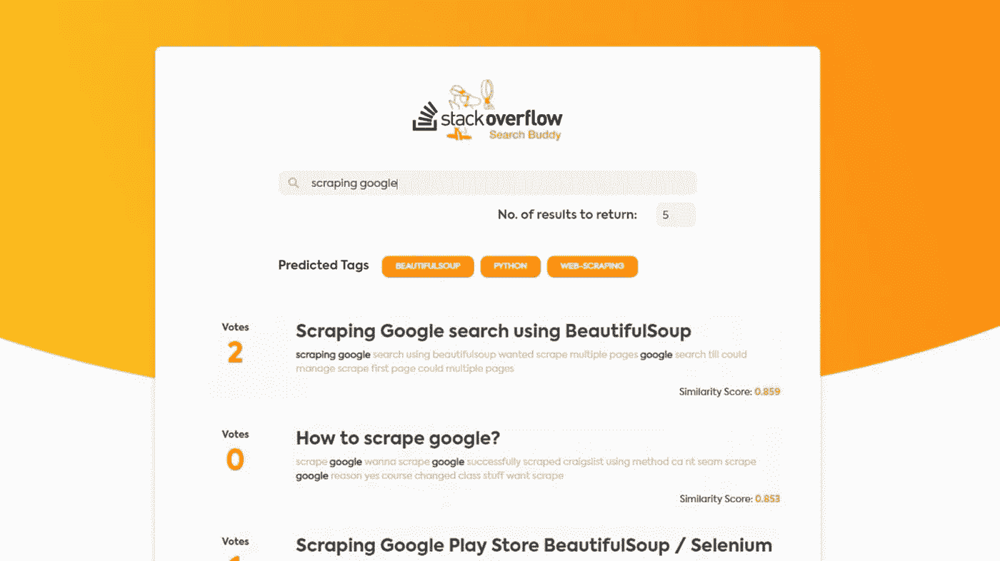

Sneak Peek into of the final result

(要观看动画版本，点击[这里](https://s3.gifyu.com/images/demo6e6ebf7bfc9642ae.gif)

该解决方案分为两个子任务:

1.  ***标签预测:*** 给定用户查询，我们希望预测给定查询最好属于哪些标签
2.  ***信息检索:*** 基于用户查询，返回与用户查询最相似的现有问题

给你一个鸟瞰图，解决方案的流程如下:

*   从 Google BigQuery 收集 Stackoverflow 问题/答案数据
*   预处理和标准化收集的数据
*   仅过滤掉最常见的标签(使用了 500 个标签)
*   使用 Word2Vec 训练单词嵌入
*   使用 LSTM 模型训练标签分类器(*提示:您不能使用二进制交叉熵损失来训练它。阅读更多了解原因*
*   使用经过训练的单词嵌入来为我们数据库中的所有问题创建句子嵌入
*   将查询与每个句子进行比较，并使用基于余弦距离的度量对语义相似的结果进行排序。
*   使用 ReactJS 和 Flask 创建 web 应用程序来部署训练好的模型

对于有流程图癖的人来说，这里有:

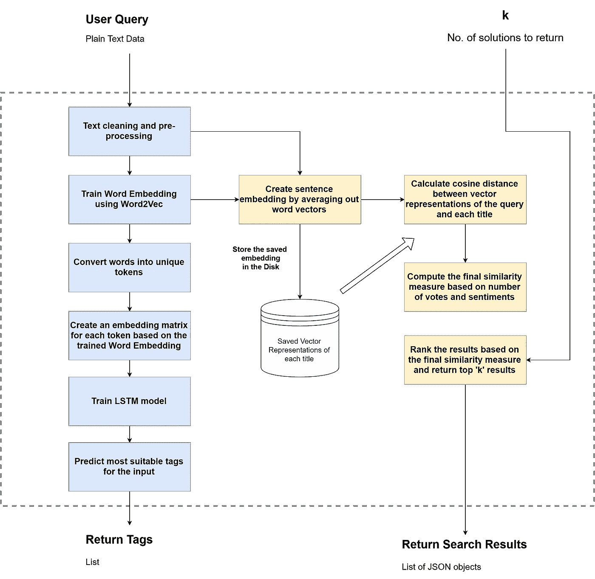

The Brain

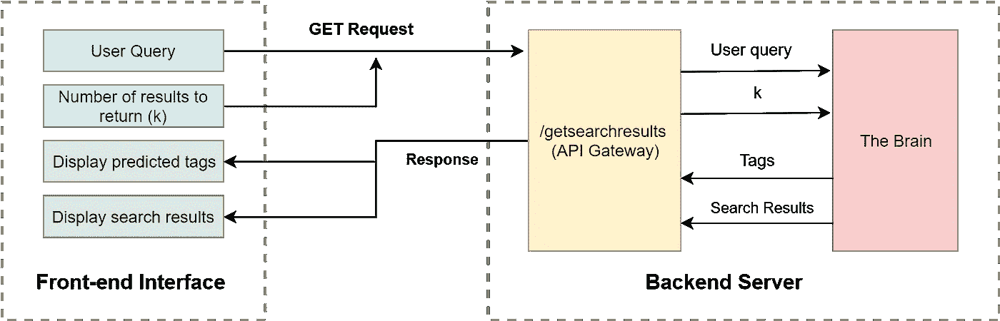

The web app architecture

不要太花哨，对吗？如果您熟悉这些概念中的每一个，请随意直接进入代码(它也有很好的文档记录*codegasm*)。

[](https://github.com/agrawal-rohit/stackoverflow-semantic-search) [## agr awal-rohit/stack overflow-语义搜索

### Team Maverick 的 IBM Hack Challenge Stack overflow 条目为……提供了最大的学习资源之一

github.com](https://github.com/agrawal-rohit/stackoverflow-semantic-search) 

宝贝程序员们，请继续阅读:)

> **小旁注:**我不会在文章中解释每一行代码(repo 中的 jupyter 笔记本已经考虑到了这一点)。相反，我会专注于关键的结果和它们背后的直觉

## 1.数据收集

为了理解数据并从中学习，我需要收集 Stack Overflow 上发布的问题和答案。因此，我需要以下内容:

*   标题
*   问题主体
*   这个问题的答案
*   为每个答案投票

> 由于关于堆栈溢出和更好的健全性检查的大量数据，我将数据限制为仅与“Python”相关的问题。然而，整个过程对于其他主题也是可重复的

**Google BigQuery** 数据集包括堆栈溢出内容的档案，包括帖子、投票、标签和徽章。该数据集被更新以反映互联网档案上的堆栈溢出内容，并且也可通过堆栈交换数据浏览器获得。关于数据集的更多信息在 [Kaggle Stackoverflow 数据集](https://www.kaggle.com/stackoverflow/stackoverflow)中给出

我们的任务所需的数据可以通过以下 SQL 查询来收集:

```
*SELECT q.id, q.title, q.body, q.tags, a.body as answers, a.score FROM 'bigquery-public-data.stackoverflow.posts_questions' AS q INNER JOIN 'bigquery-public-data.stackoverflow.posts_answers' AS a ON q.id = a.parent_id WHERE q.tags LIKE '%python%' LIMIT 500000*
```

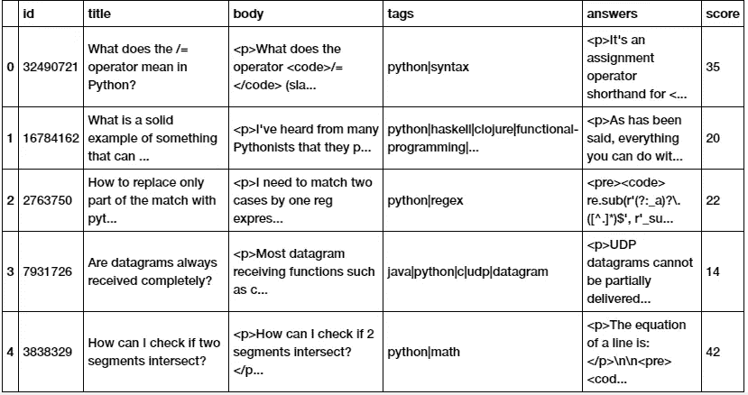

Raw Data from Google BigQuery

该查询连接两个表(*stack overflow . posts _ questions*和*stack overflow . posts _ answers*)并收集与`python`相关的 500000 个问题所需的数据。因此，每行包含一个问题和一个答案。 *(* ***注:*** *可能存在问题相同但答案唯一的行)。*

## 2.数据预处理和标准化

数据预处理 101 —检查缺失值:

```
df.isna().sum()
--------------id         0
title      0
body       0
tags       0
answers    0
score      0
dtype: int64
```

正如我之前提到的，我们的数据集可能包含具有相同问题但唯一答案的行。我们希望将所有这些不同的行合并为一行，同时汇总每个答案的投票并合并所有答案。

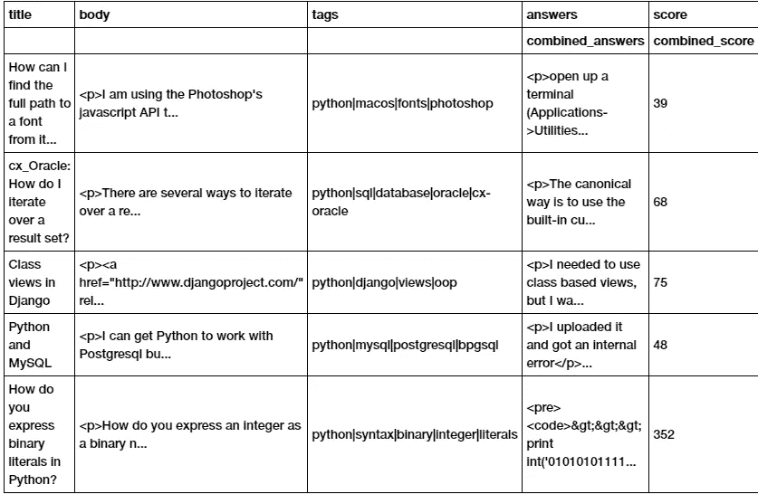

Data after combing rows with identical questions

```
Max score before:  5440 
Max score after:  9730
```

现在我们终于准备好了原始数据，我们可以继续清理和预处理这些原始文本数据了。我实现了基本的文本处理，包括以下步骤:

1.  将原始文本转换为令牌
2.  将令牌转换为小写
3.  删除标点符号
4.  删除停用词

> **注意:**我跳过了删除数字数据，因为我觉得这会删除宝贵的上下文信息。
> 
> 我还跳过了**‘词干化/词汇化’**这一步，因为我不想改变我们语料库中使用的特定领域术语，以免丢失宝贵的信息

如果您仔细观察数据集，您会发现问题和答案的原始文本是与 HTML 标记一起给出的，它最初是用 HTML 标记显示在 StackOverflow 上的。这些通常指的是`p`标签*、*、`*h1-h6*`、*、*标签和*、*、*、*标签。因为我只需要每篇文章的文本部分，所以我执行了以下步骤:

*   我通过组合标题、问题主体和所有答案(稍后将用于训练 Word2Vec 嵌入)构建了一个名为“post_corpus”的新特性列
*   我把标题加在问题正文的前面
*   我跳过了“代码”部分，因为它们没有为我们的任务提供有用的信息
*   我为每个问题构造了 URL，在问题 id 后面附加了“【https://stackoverflow.com/questions/】T2
*   我使用开源的**文本块库**为情感构建了两个特征

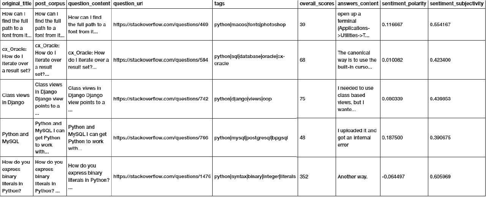

Preprocessed Data

每篇文章都有不同数量的标签。为了缩小更精确模型的选择范围，我决定用 **20 个最常见的标签。**计划仅过滤包含至少一个 most_common_tags 的数据

```
['python',  'python-3.x',  'django',  'pandas',  'python-2.7',  'numpy',  'list',  'matplotlib',  'dictionary',  'regex',  'dataframe',  'tkinter',  'string',  'csv',  'flask',  'arrays',  'tensorflow',  'json',  'beautifulsoup',  'selenium']
```

好了，最后一个快速枯燥的数据处理步骤，然后我们开始有趣的事情:)

*   我为“processed_title”创建了一个单独的列，因为我想保留原始标题，因为我想在应用程序中提供原始标题
*   我还标准化了数字“分数”

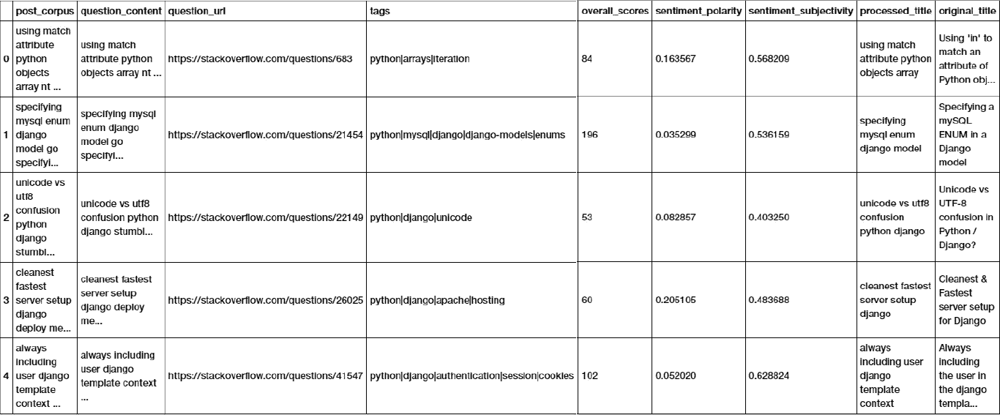

Preprocessed and Normalized Data

## 3.仅过滤掉最常见的标签

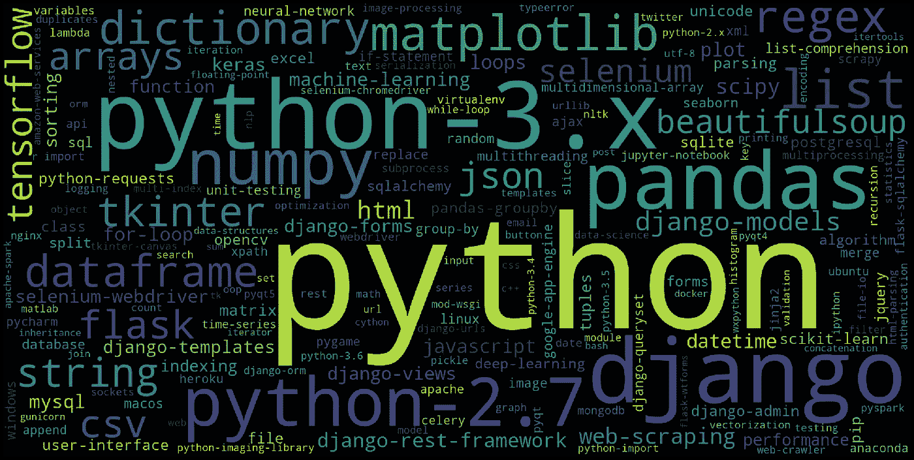

尽管我们在数据处理步骤中确实过滤掉了许多标签，但是仍然存在许多 ***【杂散】*** 标签，与其他标签成千上万次的出现相比，这些标签可能只出现一次或两次。这增加了地面真实数据的维度，这对于我们的模型是不期望的。

因此，我们根据出现的次数提取前 500 个标签。(*考虑到我们有大约 140，000 个数据点，500 个标签似乎是一个很好的实验数字*

最后，我们修改了标签数据，使其只包含这 500 个标签中的一个标签，以获得更好的模型准确性

## 4.使用 Word2Vec 训练单词嵌入

为了让我们的模型理解原始文本数据，我们需要对它进行矢量化。单词包和 TF-IDF 是非常常见的矢量化方法。然而，由于我将使用人工神经网络作为我的模型(LSTM)，BOW 和 TFIDF 的稀疏特性会造成问题。**因此，我决定选择单词嵌入**，这是密集的向量表示，因此非常适合我们的神经网络。

人们在 StackOverflow 上交谈的方式是非常技术性的，他们使用非常特定的词汇，所以使用预先训练的单词嵌入不是一个好主意(尽管谷歌有很多好的嵌入)，因为他们是在简单的英语文本(如莎士比亚)上训练的，无法理解我们词汇表中单词之间的关系。因此，我决定使用 Word2Vec 从头开始训练一个单词嵌入模型。

我们数据集中的列`post_corpus`在这里开始发光。由于 Word2Vec 是一个无监督的模型，只需要一个语料库进行训练，我们需要为它提供尽可能多的文本，以便它理解词汇表。因此，我们使用`post_corpus`来训练 Word2Vec，因为它是一篇文章的标题、问题和所有答案的组合。

训练成功后，我们得到以下结果:

```
Terms most similar to "django"
[('flask', 0.5827779173851013), ('project', 0.5168731212615967), ('mezzanine', 0.5122816562652588), ('wagtail', 0.5001770257949829), ('drf', 0.4827461242675781), ('framework', 0.48031285405158997), ('cms', 0.47275760769844055), ('admin', 0.467496395111084), ('database', 0.4659809470176697), ('app', 0.46219539642333984)]
--------------------------------------------------------------------
Terms most similar to "api"
[('apis', 0.6121899485588074), ('webservice', 0.5226354598999023), ('service', 0.49891555309295654), ('framework', 0.4883273243904114), ('postman', 0.47500693798065186), ('webhook', 0.4574393630027771), ('rpc', 0.4385871887207031), ('oauth2', 0.41829735040664673), ('twilio', 0.4138619303703308), ('application', 0.4100519120693207)]
--------------------------------------------------------------------
Terms most similar to "gunicorn"
[('uwsgi', 0.5529206991195679), ('nginx', 0.5103358030319214), ('000080', 0.4971828758716583), ('supervisord', 0.4751521050930023), ('arbiterpy', 0.4701758027076721), ('iis', 0.46567484736442566), ('apache2', 0.45948249101638794), ('web1', 0.45084959268569946), ('fastcgi', 0.43996310234069824), ('supervisor', 0.43604230880737305)]
--------------------------------------------------------------------
Terms most similar to "server"
[('webserver', 0.5781407356262207), ('servers', 0.48877859115600586), ('application', 0.488214373588562), ('app', 0.4767988622188568), ('vps', 0.4679219126701355), ('client', 0.46672070026397705), ('localhost', 0.46468669176101685), ('service', 0.457424521446228), ('apache', 0.4540043771266937), ('nginx', 0.4490607976913452)]
```

很酷，对吧？

## 5.使用 LSTM 模型训练标签分类器

这一部分处理我们的第一个子任务:

***“给定用户查询，我们希望预测给定查询最好属于哪个标签”***

准备用于训练模型的数据包括:

1.  对地面真实数据进行一次性编码
2.  分成训练集和测试集
3.  标记化和填充
4.  创建嵌入矩阵

(我将在这里包含代码，但是对于每个部分的详细解释，请参考存储库中的 [jupyter 笔记本](https://github.com/agrawal-rohit/stackoverflow-semantic-search/blob/master/Tag%20Classifier.ipynb))

为解决手头的子任务而创建的模型在嵌入层之后立即使用了 LSTM 层，因为它们在处理顺序数据和文本数据方面很熟练。随后添加密集图层，并去除正则化以构建稳健的模型

**秘方——损失函数:**由于我们在这里处理的是多标签分类问题，**我们不能使用二进制交叉熵损失**来训练模型。这是因为二进制交叉熵损失会推动你的模型预测一个或两个包含在地面真相中的标签，而不会因为遗漏了其他标签而惩罚它。

因此，我分别对每个类使用日志损失，然后根据类的数量计算其平均值。

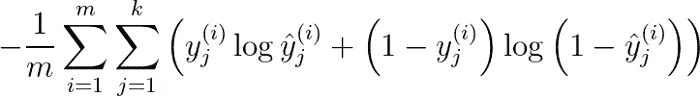

The loss function used

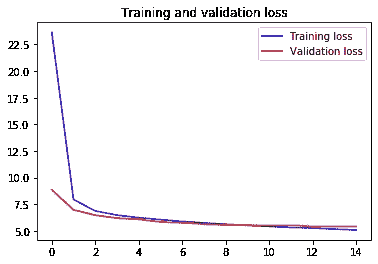

Model Performance

然后，我们可以借助下面的函数获得任何句子的标签:

```
Test Case: selecting n1d array nd array numpy
--------------------------------------------------------------------
Predicted: [('arrays', 'numpy', 'python')]
Ground Truth: [('numpy', 'python')] Test Case: taking info file
--------------------------------------------------------------------
Predicted: [('python',)]
Ground Truth: [('python', 'python-2.6', 'python-2.7')] Test Case: python find txt continue causing fault
--------------------------------------------------------------------
Predicted: [('python',)]
Ground Truth: [('python', 'python-3.x')] Test Case: fabric rsync read error connection reset peer 104
--------------------------------------------------------------------
Predicted: [('django', 'python')]
Ground Truth: [('django', 'python', 'windows')] Test Case: fllter pandas dataframe multiple columns
--------------------------------------------------------------------
Predicted: [('dataframe', 'pandas', 'python')]
Ground Truth: [('pandas', 'python')]
```

目前看来已经足够好了😃。完成这个子任务后，进入下一个任务

## 6.使用经过训练的单词嵌入来为我们数据库中的所有问题创建句子嵌入

子任务 2 要求如下:

***“基于用户查询，返回与用户查询最相似的现有问题”***

要比较两个句子有多相似，我们可以找到它们之间的‘距离’。为了能够计算这样的距离，句子必须属于相同的向量空间。这是通过**句子嵌入**完成的。我也使用过的最流行的距离度量之一是**余弦距离**。余弦距离越小，两个向量之间的相似度越高

为了计算整个句子的嵌入，我定义了以下函数，该函数对每个有效标记的嵌入进行平均，并用于计算数据库中所有问题的句子嵌入:

## 7.将查询与每个句子进行比较，并使用基于余弦距离的度量对语义相似的结果进行排序

尽管余弦距离本身就足以为我们提供这个特定任务的良好结果，但我决定定义一个自定义的相似性度量。其给出如下:


*其中* ***q*** *=用户查询和* ***t*** *=已有问题*

*   它将余弦距离视为基本度量
*   它根据帖子在 StackOverflow 上获得的用户投票来考虑帖子的受欢迎程度
*   它考虑了人们所作出的反应的总体情绪。积极的情绪意味着答案是有帮助的，因此是一篇好文章

运行以下代码片段可以向您展示运行中的算法:

对于用户查询**“组合列表列表”，**我们得到:

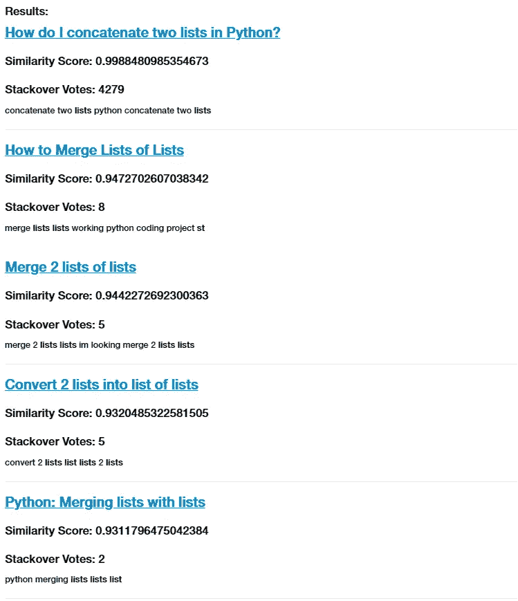

Query Results

web 应用程序只是通过用户界面翻译这些结果

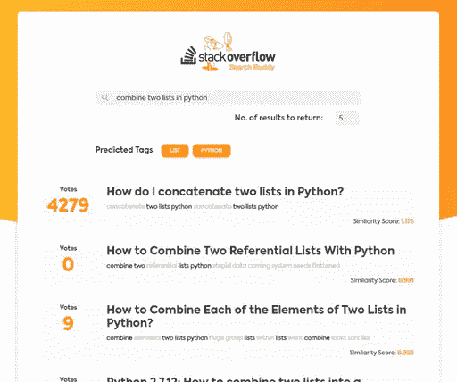

在这篇文章中，我不会讨论我是如何创建 web 应用程序的，你可以在资源库中查看代码。如果你有任何疑问或建设性的反馈(讨厌有毒的人可以去吸阿迪..)，欢迎在下方随意留下回应。我很乐意收到你的来信😄

直到那时，再见~

[](https://github.com/agrawal-rohit) [## agrawal-rohit —概述

### 在 GitHub 上注册您自己的个人资料，这是托管代码、管理项目和与 40…

github.com](https://github.com/agrawal-rohit)