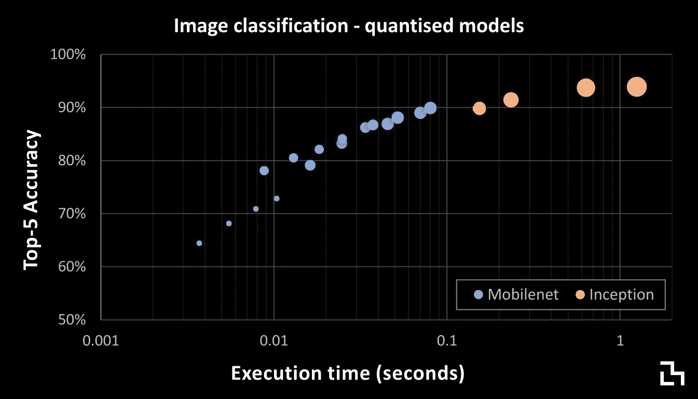

# 在移动设备上使用人工智能改善用户体验

> 原文：<https://towardsdatascience.com/improving-user-experience-with-ai-on-mobile-ede5c567f703?source=collection_archive---------20----------------------->

对于许多用户来说，他们的移动设备是他们接触网络世界的首选界面。设备智能并不是什么新鲜事——想想智能助理、预测文本——但这些系统往往涉及简单的预测模型或基于规则的系统。虽然深度神经网络是当前图像和视频分析的最先进技术，但它们复杂的结构带来了沉重的计算负担，而且许多繁重的工作通常都是在云中完成的。当任务可以在后台执行时，这很好，但实时沉浸式用户体验需要比往返于数据中心更快的响应时间。

> 即使在世界上最先进的地区，移动网络覆盖也不是无处不在。

除了延迟和传输时间之外，应用程序必须能够容忍较差的数据连接，并在不可用时从容地失败。如果支持人工智能的功能对于保持一致的性能和行为至关重要，那么除了在用户硬件上运行，可能没有其他选择，因为即使是有线连接也有停机时间。

令人欣慰的是，功能越来越强的智能手机——通常带有专用加速器——正在为设备上更大的智能打开大门。

# 多快才算够快？

当提供对用户交互的响应时，显然越快越好。尽管应尽可能减少任何延迟，但在运行复杂操作和提供响应时，我们应考虑三种不同的时间框架:

*   **在 0.1 秒内**系统感觉像是在瞬间响应，因此不需要特殊的机制来管理用户的注意力。这一类别的一个例子是在屏幕上拖动鼠标光标，或者观看视频的实时更新。
*   **在 1.0 秒内**系统感觉反应灵敏，用户能够将动作与反应联系起来，尽管他们会注意到延迟。想象一下点击一个按钮，然后等待事情发生。
*   **在 10 秒钟内**用户可以保持专注于手头的任务，但是你需要让他们参与进来——在更长的时间里，用户可能会想转换任务，做些别的事情。

一般来说，一个“不确定”的进度指示器对于几秒钟的等待时间就足够了——它显示某事正在发生，但不显示完成的时间。超过 5 秒左右，如果用户知道他们还要等待多长时间，他们会更舒服。

For delays of *2–5 seconds, an indeterminate progress indicator* (L) *is sufficient; for 5+ seconds, a determinate progress indicator (R) is a better choice*

我们如何使用这些信息来确保我们的人工智能有利于用户体验？首先，用户认知链的中断必须被最小化，这样用户界面才会有反应。必须考虑推理时间，长时间运行的操作应该作为后台任务运行，这样用户就不用等待响应了。

举个例子，把一个人脸探测器应用到一幅图像上。如果实时运行，结果可以用来检查对象在拍照前是否睁开了眼睛。在这种情况下，一切都在等待人工智能，它给系统带来了延迟，所以它必须尽可能快地运行。或者，面部探测器可以在拍照后用来帮助标记朋友——在这种情况下，它可以作为后台任务运行，一旦他们准备好，就会提供建议。这样，用户就不用等待人工智能，他们的认知链也不会中断。

上面的例子可以通过云服务来运行，例如[谷歌云视觉 API](https://cloud.google.com/vision/) 或[亚马逊认知](https://aws.amazon.com/rekognition/)——响应时间通常不到一秒。作为后台操作，这没什么问题，如果不需要经常发生，作为对用户工作流的中断，这也是可以接受的。但是如果:

*   你有大量的数据？
*   你想要一个真正的，身临其境的实时产品？
*   你想要在任何情况下都可靠？

为了提供最佳的用户体验，有必要在用户设备上运行推理:要么在应用程序内，要么作为嵌入在网页中的客户端代码(例如 [TensorFlow.js](https://www.tensorflow.org/js) )。

# 设备上计算

我们在这里真正讨论的用例是什么，在移动硬件上运行这些用例有多实际？计算机视觉应用是要求最高的，但也是最令人兴奋的。相机可以成为与世界互动的手段和获取信息的方式，例如通过图像搜索。深度神经网络已经迅速成为图像分析任务的首选工具，例如对象检测、图像分类或特征提取。

大多数常见的网络架构使用卷积层堆栈从图像中提取特征。添加层和更复杂的结构通常可以提高性能，但代价是增加计算要求和/或执行时间，以及内存和存储要求。

令人欣慰的是，一些较新的神经网络体系结构是专门为此应用而设计的。 [MobileNets](https://ai.googleblog.com/2017/06/mobilenets-open-source-models-for.html) 是一系列网络，旨在有效利用嵌入式或移动设备等受限平台上的有限资源。至关重要的是，通过控制网络的规模和复杂性，可以在精度和速度之间进行权衡，以适应应用要求:

该图显示，根据我们的优先级，我们可以选择具有广泛性能特征的神经网络模型。MobileNets 在对付像 Inception 这样的重量级模型时表现得相当好，运行速度也快得多。模型文件的大小也小了很多——如果您希望定期将更新的模型推送到用户设备上，这是非常重要的。

量化是在受限硬件上获得良好性能的技巧之一。神经网络模型可以被压缩和简化，就像图像可以被压缩成 JPEG 文件一样。当我们这样做时，不仅神经网络变得小了很多，而且它也运行得更快了。不幸的是，目前的移动 GPU 技术对量化模型的支持有限，因此它们最终只能在 CPU 上运行。不过，随着硬件的发展，这种情况可能很快就会改变。

选择具有不同执行时间和精度的模型意味着我们可以选择一个适合用户工作流的模型。但是，要注意运行你的应用程序的各种硬件，尤其是 Android。遗留设备可能需要更长的时间，所以在 UI 中找到一个合适的方法来处理任何潜在的长时间运行的操作。

这就是目前人工智能和移动设备的全部内容。在下一篇文章中，我们将关注*人在回路中*以及用户交互如何帮助保持人工智能模型的新鲜和最新。

> [Rupert Thomas](https://twitter.com/rupertthomas) 是一名技术顾问，专门研究机器学习、机器视觉和数据驱动产品。[@ Rupert 托马斯](https://twitter.com/rupertthomas)
> 
> *本文原载于*[*black lab . ai*](http://www.blacklab.ai)

# 参考

1.  [用户界面响应时间—史蒂夫·亨蒂](https://medium.com/@slhenty/ui-response-times-acec744f3157)
2.  [响应时间:3 个重要限制—雅各布·尼尔森](https://www.nngroup.com/articles/response-times-3-important-limits/)
3.  [TFLite 图像分类模型性能](https://www.tensorflow.org/lite/models)
4.  [材料设计—进度指标](https://material.io/design/components/progress-indicators.html)
5.  [比较五大计算机视觉 API](https://goberoi.com/comparing-the-top-five-computer-vision-apis-98e3e3d7c647?gi=73ec7eb3a6a7)