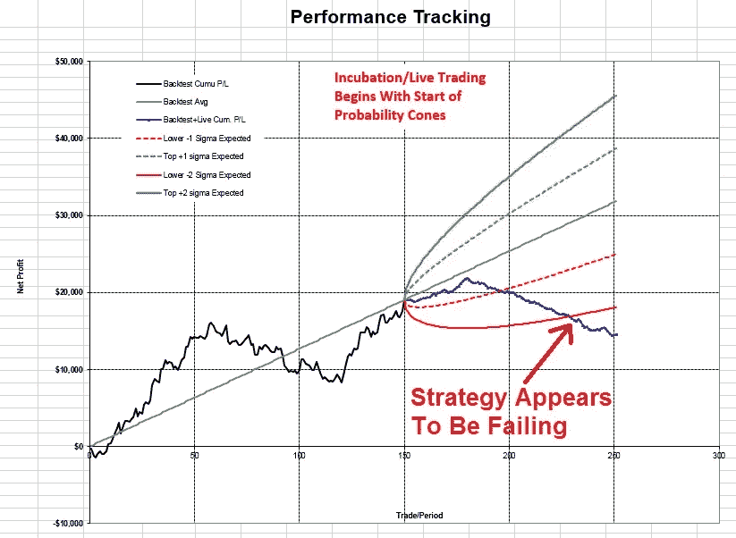

# 使用蒙特卡罗模拟和概率锥改进你的算法交易

> 原文：<https://towardsdatascience.com/improving-your-algo-trading-by-using-monte-carlo-simulation-and-probability-cones-abacde033adf?source=collection_archive---------2----------------------->

## 使用统计技术来提高你交易成功的几率

我对将统计工具应用于现实世界的介绍并不好。我在一家中型航空航天公司负责质量保证。虽然我们在工厂车间广泛使用统计过程控制(SPC ),但我们现在决定使用一些先进的统计工具，如实验设计，来纠正棘手的制造污染问题。

我把任务交给了我的博士统计学家。在回顾了这个项目之后(在进行任何实验之前)，他回来问我“现在我理解了这个项目，你想向你的老板(首席执行官)提出什么结论？无论你选择什么结论，我都可以从实验和统计的角度来证明。”

我还以为。使用统计学不是为了找到答案，而是为了支持一个“宠物”答案，任何宠物答案。这让我畏缩。不出所料，我把这个项目交给了一个希望实验推动结论的人，而不是相反。

这些天来，我喜欢用统计数据来证明一个信念，而不是引导我走上一条明智的道路。

我是一个算法交易者，统计工具对我帮助很大。在这篇文章中，我将介绍如何使用蒙特卡罗模拟和概率锥来更有效地交易。

在我开始讨论之前，先提醒几句。首先，我绝不是统计学专家。除了参加一些本科和研究生水平的统计学课程，我对统计学的许多方面一无所知。我绝对不是蒙特卡洛分析或概率锥的专家。

我擅长的是作为日常实践者使用这些工具。我可能在做一些纯粹主义者会嗤之以鼻的事情，但这对我来说没问题。最后，我知道这些工具，以及我如何使用它们，对我的交易有很大帮助。交易利润说话，他们告诉我，我做的事情是对的——也许只是理论上不对。

此外，这里显示的所有交易结果都是假设的。过去的表现不代表未来的结果，你应该只用你能承受损失的钱来交易。交易风险很大。

抛开这些免责声明，让我们来谈谈这些工具，以及我如何在我的算法交易中使用它们。

**什么是蒙特卡洛分析？**

抛一枚硬币，你知道它正面着地的几率是 50%。假设你每出现一个正面就赢 1.25 美元，每出现一个反面就输 1 美元。你有 10 美元的资金，如果跌到 6 美元，你就会退出。那是你的毁灭点。问题是，这种情况发生的几率有多大？

对于这样一个简单的例子，你可以在维基百科上找到一个近似结果的理论方程:[https://en.wikipedia.org/wiki/Risk_of_ruin](https://en.wikipedia.org/wiki/Risk_of_ruin)

但是，如果情况更复杂呢？如果有各种各样的可能结果，而不是一个双头硬币，硬币有 25 个面，所有被选中的概率都不同，会怎么样？在这种情况下，理论计算变得更加困难，甚至不可能。

进入蒙特卡洛分析。蒙特卡罗分析利用计算机模拟来解决问题、计算概率等，而无需求解理论方程。这在理论上的答案甚至不可能得到的情况下尤其有用。

蒙特卡洛分析被广泛应用于各种领域，包括一些你可能想象不到的领域。在 20 世纪 40 年代，蒙特卡罗模拟实际上被用于第一颗原子弹的研制。我在交易中使用它，这是一种更温和的方法(虽然交易账户有时会爆炸！).

当在交易中使用时，蒙特卡罗可以帮助建立许多重要性能指标的概率:

破产的风险

最大和中值下降

年回报率

回流/提取比率

有了这些信息，交易者可以在策略选择、头寸规模、资本部署和分配方面做出更明智的决策。

**如何在交易中使用蒙特卡洛**

在典型的形式中，蒙特卡罗分析采用假设回溯测试产生的所有交易，并随机选择一笔又一笔交易来产生一条权益曲线。这个想法是，通过一个适当设计的回溯测试，对未来表现的最佳估计来自于使用过去的交易(稍后，我将讨论为什么这可能不成立的许多原因)。

这方面的一个例子如图 1 所示。

*Figure 1- Hypothetical Backtest Curve, With Multiple Possible Future Paths*

深蓝色的粗曲线是假设的回溯测试，而细曲线显示了权益曲线未来可能走的一些路径。未来曲线是基于从回溯测试曲线中随机选择的交易。(**侧** **注:**在本例中，采用了一种称为“置换取样”的方法。基于随机选择过程，回溯测试中的每笔交易都可以选择多次。有些交易可能根本就不选。这导致期末权益价值的范围很广。如果使用“无替换抽样”，那么最终所有的权益曲线将收敛到一个共同的终点，因为每个回溯测试交易使用一次，而且只有一次。

当蒙特卡洛运行时，会生成成千上万条潜在的未来曲线。然后可以对这些结果进行分析，为未来的表现建立概率。

我通常是这样考虑蒙特卡洛的:当你执行历史回溯测试时，在你运行蒙特卡洛分析之前，你会得到一条发生了什么的权益曲线，如图 2 中的权益曲线。

*Figure 2- Hypothetical Backtest Curve*

毫无疑问——这就是实际发生的情况。但是，如果事情略有不同呢？举例来说，如果交易在回溯测试中以不同的顺序出现会怎样？

在这种情况下，图 3 所示的任何权益曲线(路径)都可能发生。

Figure 3- Slightly Altered History Leads To Different Possible Equity Curves

当然，许多其他未显示的路径也可能发生。因此，通过使用蒙特卡洛分析，并结合结果，我们可以得出某些事件发生的概率。

**使用蒙特卡洛的优势**

对我来说，蒙特卡洛分析的最大优势是它改变了我对 T2 算法交易的看法。当我开始思考交易中的概率时，蒙特卡洛强迫你这么做，我发现自己做出了更好的决定。例如，我不再认为“市场肯定会下跌”。相反，我想“市场可能会下跌，但如果不会，我会安全吗？”

以典型的交易者为例，在我们的交易生涯中，我们都曾有过这样或那样的经历。你在周一开始交易一个新的策略，一个历史上表现很好的策略。但是在连续 4 次实时亏损后，你就放弃了这个系统，因为在回溯测试中你只有 3 次连续亏损。然后你继续下一个策略，永无止境地追求完美。当然，在你退出后不久，你原来的方法就从 4 个失败者那里恢复了。不幸的是，你没有享受到康复的乐趣！

如果你通过蒙特卡洛模拟运行你的系统，也许它会显示 40%的机会连续 4 次失败。然后，当 4 个失败者真的发生时，你会感到沮丧，但你可能没有放弃这个策略。毕竟，你知道有 40%的可能性会出现这么多连续的输家。

这样蒙特卡洛才能真正帮助你理解自己的交易策略。虽然我在我的 algo 交易中使用它，但它可以被任何交易者使用，只要他或她有有效和稳定的交易历史。然而，要求有效的交易历史也导致该技术的一些严重缺点。

**蒙特卡洛的弊端**

使用蒙特卡罗进行 algo 交易策略分析存在相当多的危险。第一个缺点是历史结果需要稳定。我说的“稳定”不是指实际的交易结果，而是指交易方法。坚持用相同的系统或方法交易的交易者有稳定的方法。一个交易者周一尝试 algo 交易，周二随机猜测，周三订单流交易，没有稳定的方法。

如果你不断调整你的交易方法，你的历史交易将毫无意义。对于有效的蒙特卡罗分析，历史结果应该是一致的；整个回溯测试只有一种策略，或者一种方法。

一个相关的概念是如果市场发生重大变化。当市场发生“阶跃”变化时，蒙特卡洛分析不再有效。这方面的一个例子是瑞士央行 2015 年的行动。2015 年 1 月 15 日，这家瑞士银行取消了它在 2011 年确立的与瑞士法郎挂钩的所谓“挂钩”政策。这种挂钩将瑞士法郎的价值与欧元挂钩。

随着联系汇率突然取消，市场反应激烈，再也没有回到以前的状态。因此，考虑到 2015 年市场的结构性变化，对 2011 年至 2015 年的历史结果使用蒙特卡洛毫无意义。人们不能合理地预期过去 2011 年至 2015 年期间进行的交易会持续到 2015 年及以后。市场已经发生了根本性的变化。

蒙特卡罗的另一个可能的缺点是交易的序列相关性。序列相关性是交易历史的一个特征，其中当前交易结果依赖于(相关于)先前的交易结果。标准的蒙特卡罗分析假设每笔交易都独立于前一笔交易。我的经验表明，对于许多交易系统来说，这通常是正确的(或者实际上是正确的)。

所以，如果你有一个具有序列相关性的策略(不管是不是特别内置的)，蒙特卡罗结果将是错误的。一个简单的均线交叉系统就是这样的例子，信号根据之前交易的盈亏而变化。下面给出了串行相关策略的伪代码。

**非序列相关策略**

*如果收盘穿越 10 日均线，那么买入*

*如果收盘价低于 10 日均线，那么卖空*

**串行相关策略**

*如果收盘穿越 10 日均线，则*

*如果之前的交易有利可图，则卖空*

*如果之前的交易没有盈利，那么买入*

*如果收盘价低于 10 日均线，则*

*如果之前的交易有利可图，那么买入*

*如果之前的交易无利可图，则卖空*

序列相关系统将包含一个历史，其中交易[i]的结果依赖于交易[i-1]的结果。当进行传统的蒙特卡罗分析时，这种重要的依赖性将会消失。幸运的是，在这种情况下，有一些方法既可以检测序列相关性，又可以随后用改进的蒙特卡罗分析来处理它(超出了本文的范围)。

蒙特卡洛的最后一个缺点是古老的计算机编程格言“垃圾进，垃圾出”除了在这种情况下，它更像是“杰作进，杰作出。”

这是什么意思？简而言之，如果你的回溯测试看起来很棒，那可能是因为曲线拟合、过度优化、事后诸葛亮等等。在这种情况下，回溯测试杰作将产生一个很好的蒙特卡洛结果——破产的可能性很小，提款概率很小等等。

在这种情况下，蒙特卡洛模拟实际上会让你过于自信，并导致你做出一些糟糕的决定。所以，如果结果看起来好得不真实，你应该小心。在大多数情况下，他们可能是！

**从一个示例案例开始**

市场上有许多免费的和商业的蒙特卡罗模拟器，都有不同的功能和特性。一个很好的免费模拟器可以从 [TickQuest](http://www.tickquest.com/?page_id=70) 获得。这个特殊的模拟器有一些可视化结果的好方法。

另一个免费的模拟器是我为微软 Excel 创建的，可以在我网站的[计算器](https://kjtradingsystems.com/calculators.html)页面上找到。Excel 版本的好处是，如果你可以用 Excel 宏语言编程，你可以很容易地扩展模拟器的功能。这使得它非常适合想要增加头寸规模和其他功能的自己动手的交易者。

我将使用我的免费 Excel 蒙特卡洛模拟器作为下面的例子。

首先，在运行蒙特卡洛分析之前，你必须对交易进行历史回溯测试。这是由您使用的交易平台为您选择的策略和工具生成的。交易结果可在策略绩效报告中找到。如前所述，关键是交易结果不要过度优化或曲线拟合，因为这将给出过于乐观的模拟结果。

交易显示在图 4 的权益曲线中，前 10 笔交易显示在图 5 中。

Figure 4- Sample Equity Curve

Figure 5 — First 10 Trades For Sample Equity Curve (From Strategy Backtest)

这些交易代表大约一年的交易结果，有 150 笔交易，19，000 美元的利润和大约 7，000 美元的最大亏损。

有几点需要注意:首先，这里使用的交易结果不一定代表一个好的或坏的策略——它仅仅是一个例子。第二，可靠的蒙特卡罗分析通常包括 5-10 年的回溯测试结果。这个样本策略只有一年。

要运行模拟器，需要以下数字，如图 6 所示:

**A** —回溯测试的交易结果

**B** —模拟的起始权益(模拟器还将运行 10 个额外的起始权益值，从您输入的值开始递增)

**C** —退出股权点——如果在模拟过程中股权下降到低于该金额，模拟运行将停止，并被视为“破产”的情况很多时候，该值被设置为交易交易所的最低要求保证金，因为这是账户中启动新交易所需的最低金额。

**D** —一年的平均交易次数。模拟器运行了 1 年，进行了许多交易。

**E** —系统名称标识符

Figure 6- Inputs for Monte Carlo Simulation

一旦输入了所有需要的值，用户点击“计算”按钮，模拟开始。模拟器为 11 个不断增长的股票价值中的每一个运行 2500 个案例。结果显示在图 7 f 部分的表格中

Figure 7- Monte Carlo Output Results

**蒙特卡洛结果**

黄色表格包含蒙特卡洛模拟的结果:

**G** — Ruin:如果你用这个系统交易一年，一年时间内跌破退出点权益(C)的概率是多少？这就是破产的风险百分比。

**H** —中值下降:基于 2，500 次模拟运行，您有 50%的机会在第一年中获得高于所示值的最大下降。您希望这个数字尽可能低。请记住，即使有这个提款值，你仍然有 50%的机会，你的提款实际上会更高。相反，你也有 50%的机会，你的最大提款将会降低。

**I** —中间利润:基于 2500 次模拟运行，您有 50%的机会在第一年获得高于所示值的最大利润。您希望这个数字尽可能高。请记住，由于这是一个中间利润值，你的利润实际上很有可能会更低或更高。

**J** —中值回报:基于 2500 次模拟运行，你有 50%的机会在第一年获得高于所示数值的最大百分比回报。您希望这个数字尽可能高。同样，更高或更低的值都有 50%的可能性。

**K** —收益/DD 比率:收益对提取比率。与 Calmar 比率密切相关，Calmar 比率将回报和下降合并为一个指标。return/dd 值越高通常越好。不过要小心——如果 return/dd 太高，这可能意味着过度拟合。如果价值太低，你为给定回报所要承受的风险就会太高，这个策略就不值得交易。

L — Prob > 0:如果你用这种策略交易一整年，那么这一年盈利的可能性。

敏锐的读者会注意到，对于提款、利润和回报，给出了 2，500 次模拟运行的中值。这显然忽略了一些最糟糕的情况，许多交易者对此更感兴趣。电子表格是完全解锁的，因此可以修改这些值来反映任何所需的百分比。例如，第 95 百分位的提款通常很受欢迎。

假设蒙特卡洛结果是可接受的，交易者现在可以决定过渡到实时交易(模拟或用真钱)。这种现场表演可以通过使用概率锥来测量和跟踪。

**什么是概率锥？**

在制造业中，生产优质零件的最佳方式之一是在工厂车间利用统计过程控制(SPC)。SPC 帮助生产团队监控制造过程，并在不良零件生产出来之前采取措施。

在交易中，SPC 技术可以用来监控交易系统的性能。一种方法是使用控制图。图 8 显示了一个例子。

Figure 8- Statistical Process Control Chart

对于这种方法，记录每个交易结果，如果满足某些条件(例如，如果一个零件[交易]超出或低于 3 sigma 水平)，则流程(策略)被视为失控，可能需要采取措施。在交易中，这可能就像关闭策略一样简单。

不过，使用控制图来监控交易系统的表现有一些问题。一个问题是，对于“失控”的情况有许多规则，并不是所有的规则都适用于大多数交易系统中的非序列相关交易。我的经验是，控制图可能有用，但并不理想。

监控实时交易表现的一个更好的方法是使用概率锥，也称为累积图。图 9 显示了一个示例图表。

Figure 9- Sample Probability Cone Chart

在此图表中，绘制了以下值:

回溯测试权益曲线(黑线)

回测的平均性能(灰线)

在策略开发结束时，策略进入实时交易阶段:

上部概率圆锥带(绿色实线和虚线)

低概率锥形带(实线和红色虚线)

实际交易，真钱还是模拟(蓝线)

如果实时股票曲线高于或低于绿色和红色定义的波段，很多时候停止交易是明智的，直到交易系统回到正常区域-在红色和绿色虚线之间。

**如何在交易中使用概率锥**

概率锥是监控交易系统实时表现的一种相对简单的方法。如果你有很多交易系统要监控，这是很理想的，对于多样化的算法交易者来说经常是这样。

开始分析只需要 4 个数字:

**M**——回溯测试中每笔交易的平均利润

**N** —交易回溯测试结果的标准差

**O** —内带阈值，表示为平均值以上的标准差

**P** —外带阈值，表示为平均值以下的标准偏差

一旦建立了分析，当交易实时结束时，每个单独的交易被添加到 Q 列。蓝色曲线描绘了这些交易。

图 10 显示了一个例子。

Figure 10 — Inputs For Probability Cones

因为概率锥分析是蒙特卡洛分析的自然延伸，所以我在蒙特卡洛工作簿中为它提供了一个单独的工作表。

**使用概率锥的优势**

使用概率锥的最大好处是对结果没有隐瞒。如果与回溯测试相比，您的实时策略表现不佳，这一点很明显(参见图 11)。

Figure 11- When Cone Levels Are Crossed, Strategy Should Be Stopped

概率圆锥图帮助交易者做出公正的决定。例如，这可能有助于决定何时停止交易，这通常是一件情绪激动的事情(谁喜欢放弃他们用血汗和眼泪创造的策略？).

概率圆锥图的另一个优点是它实现简单，易于理解。如果股票曲线在上限和下限之间，交易系统很可能运行正常。如果权益曲线超过上限，谨慎是有保证的，因为这种良好的表现比预期好得多。诚然，这是一件好事，但市场发生变化了吗？系统会很快开始表现不佳，回到它的长周期平均水平吗？

如果权益曲线低于下限，也许系统坏了，或者市场变了。停止交易这种策略可能是合适的。

**概率锥的缺点**

即使这些圆锥是一个很好的工具，也有一些缺点。首先，对于具有非正态分布结果的策略，圆锥可能是不准确的。在这种情况下，建议使用回溯测试交易结果通过蒙特卡洛模拟生成上下曲线，而不是仅使用平均值和标准差。这种方法将提供更精确的波段。

该工具的第二个缺点是决定上下波段值。是否应该使用 1 标准差？在这种情况下，波段将更接近平均值，由于正常波动，策略可能会过早关闭。另一方面，如果使用了 3 个标准差波段，在现场交易突破其中一个波段之前，可能要交易很多次。这可能意味着一项失败的战略会损失大量资金。

概率锥的最后一个缺点是，正如蒙特卡罗分析一样，分析的效用是后验测试结果的直接函数。在后验测试结果过拟合或过优化的情况下，圆锥不会有很大帮助。一个过度优化的系统最终会跌破下限，但前提是交易者在交易一个不应该交易的系统时出现不必要的亏损。

**样本案例**

继续使用之前在蒙特卡洛分析中显示的相同交易系统，我们可以使用概率锥分析来监控我们的实时交易表现。

要进行这种分析，唯一需要的额外数字是实时交易结果(图 10 中的 Q)和内外带值(图 10 中的 O 和 P)。这些都输入到电子表格中，如图所示。

内带和外带西格玛值以标准差的数量输入，给出了基于正态曲线的概率:

1 标准偏差= 68%的实时权益曲线应落在上下内带内

2 标准差= 95%的实时权益曲线应落在上下外带内

图 11 显示了一个实时交易结果的示例。在这种特殊情况下，策略性能明显下降。许多交易者会考虑在下方的红色实线被突破时关闭策略。更保守的交易者会在虚线红线水平关闭策略。

但是，如果发生了这样的事件，仍然应该跟踪策略。如果策略表现后来有所改善，那么交易者可以考虑恢复交易策略。

**结论**

统计工具，如蒙特卡洛分析和概率锥，可以为交易者提供有用的交易系统信息。通过正确使用这些工具，交易者可以避免交易一个糟糕的策略，也可以知道什么时候停止交易一个表现不佳的系统。这些工具让交易者更容易控制(没有双关语的意思！)的交易。

虽然这些工具很有用，但请注意它们只是工具。交易者必须仍然负责，由交易者决定每次分析的结论是否恰当，是否应该遵循。盲目地遵循这一点(或任何分析)可能是危险的。我个人发现蒙特卡罗和概率锥都是有用的，但我知道它们的局限性和缺点。总的来说，我觉得这些工具让我成为更好的交易者，这是真正的终极考验。