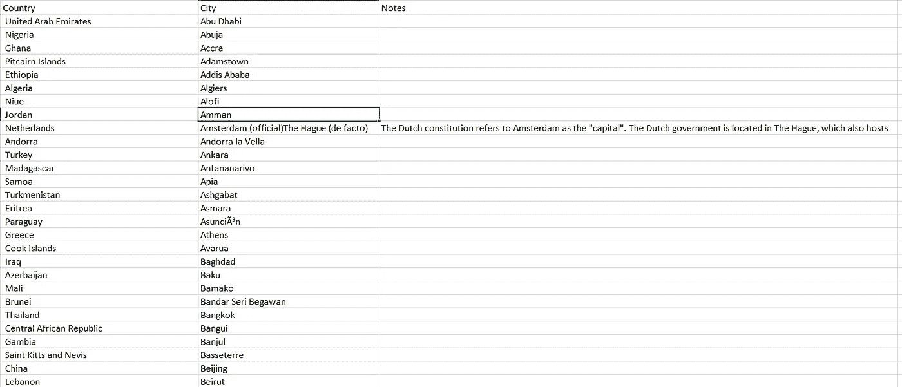

# 10 分钟内:为数据专业人员提供美味汤和硒的网络刮擦

> 原文：<https://towardsdatascience.com/in-10-minutes-web-scraping-with-beautiful-soup-and-selenium-for-data-professionals-8de169d36319?source=collection_archive---------1----------------------->

## 分析权威指南

## 使用 BS4 和 Selenium 快速从维基百科和电子商务中提取关键信息


WebScraping — Free Image

# 介绍

**网络抓取**是从网站和在线内容中提取有价值信息的过程。这是一种提取信息和接收数据集以供进一步分析的免费方法。在这个信息实际上高度相关的时代，我相信网络抓取提取替代数据的需求是巨大的，尤其是对我这个数据专业人员来说。

**本书的目标**是让你了解使用快速和肮脏的 Python 代码搜集任何公开可用信息的几种方法。只需花 10 分钟来阅读这篇文章——或者更好的是，投稿。然后你可以快速浏览一下你的第一个网络抓取工具的代码。

**在这篇文章**中，我们将学习如何从维基百科和电子商务(Lazada)中抓取数据。我们将清理、处理数据，并将数据保存到*中。csv* 文件。我们会用美汤和硒作为我们主要的网页抓取库。

# 什么是美汤和硒

## 美味的汤

Beautiful Soup 将 HTML 解析成机器可读的树格式，以便快速提取 DOM 元素。它允许提取特定段落和具有特定 HTML ID/Class/XPATH 的表格元素。


Parsing of DOM elements compared to Tree Dir Folder

每当我需要一个快速和肮脏的方法来提取网上信息。我将永远把 BS 作为我的第一步。通常我会在不到 10 分钟的时间内提取 15 行代码。

[](https://www.crummy.com/software/BeautifulSoup/bs4/doc/) [## 美丽的汤文档-美丽的汤 4.4.0 文档

### 美汤 4 是通过 PyPi 发布的，如果不能用系统打包器安装，可以安装…

www.crummy.com](https://www.crummy.com/software/BeautifulSoup/bs4/doc/) 

## 硒

Selenium 是一款旨在实现 Web 浏览器自动化的工具。质量保证(QA)工程师通常使用它来自动测试 Selenium 浏览器应用程序。

此外，由于这些自动化功能，它对 web scrape 非常有用:

1.  单击特定的表单按钮
2.  在文本字段中输入信息
3.  提取浏览器 HTML 代码的 DOM 元素

[](https://www.seleniumhq.org/) [## Selenium - Web 浏览器自动化

### Selenium 得到了一些最大的浏览器供应商的支持，这些供应商已经(或正在)采取措施使 Selenium 成为一个…

www.seleniumhq.org](https://www.seleniumhq.org/) 

# 编写你的第一个网络抓取工具

(Github 在本文末尾)

# 美味的汤

## 问题陈述

假设你是联合国大使，打算访问世界各地的城市，讨论关于气候变化的京都议定书的状况。你需要计划你的旅行，但是你不知道每个国家的首都。因此，你谷歌了一下，在维基百科上找到了这个链接。

 [## 国家首都列表-维基百科

### 这是一个国家首都的列表，包括领土和属地的首都，非主权国家包括…

en.wikipedia.org](https://en.wikipedia.org/wiki/List_of_national_capitals) 

在这个链接中，有一个表格将每个国家映射到首都。你会发现这很好，但你不会止步于此。作为一名数据科学家和联合国大使，您希望从维基百科中提取表格，并将其转储到您的数据应用程序中。你接受了挑战，用 Python 和 BeautifulSoup 编写了一些脚本。

## 步伐

我们将利用以下步骤:

1.  **Pip 安装**[**beautiful soup**](https://pypi.org/project/beautifulsoup4/)**4、Pip 安装请求**。请求将从 URL 获取 HTML 元素，这将成为 BS 解析的输入。
2.  **检查表格引用的是哪个 DOM 元素**。右击鼠标并点击*检查元件*。Chrome 浏览器的快捷键是 CTRL+I (inspect)。
3.  **点击左上角的检查按钮**突出显示您想要提取的元素。现在您知道了元素是 HTML 文档中的一个表格元素。


National Capitals Elements Wikipedia

4.**在您的请求中添加标题和 URL**。这将在维基百科链接中创建一个请求。标题对于欺骗您的请求很有用，这样它看起来就像来自合法的浏览器。

对于维基百科来说，这可能无关紧要，因为所有的信息都是开源的，可以公开获得。但对于其他一些网站，如金融交易网站(SGX)，它可能会阻止没有合法标题的请求。

```
headers = {'User-Agent': 'Mozilla/5.0 (Windows NT 6.3; Win64; x64) AppleWebKit/537.36 (KHTML, like Gecko) Chrome/54.0.2840.71 Safari/537.36'}
url = "https://en.wikipedia.org/wiki/List_of_national_capitals"
r = requests.get(url, headers=headers)
```

5.**启动 BS 和列表元素**提取表格中的所有行

```
soup = BeautifulSoup(r.content, "html.parser")
table = soup.find_all('table')[1]
rows = table.find_all('tr')
row_list = list()
```

6.**遍历表**中的所有行，遍历每个单元格，将其添加到 rows 和 row_list 中

```
for tr in rows:
    td = tr.find_all('td')
    row = [i.text for i in td]
    row_list.append(row)
```

7.**创建熊猫数据框架并将数据导出到 csv** 。

```
df_bs = pd.DataFrame(row_list,columns=['City','Country','Notes'])
df_bs.set_index('Country',inplace=True)
df_bs.to_csv('beautifulsoup.csv')
```



Result of web scraping in csv

> 恭喜你！只需 7 个步骤和 15 行代码，你就成为了一名专业的 web scraper

## 美丽的汤的局限性

到目前为止，BS 为我们成功地进行了网络搜集。但是我发现根据问题的不同有一些限制:

1.  请求过早地接受 html 响应，而不等待 Javascript 的异步调用来呈现浏览器。这意味着它不能获得 Javascript 异步调用(AJAX 等)生成的最新 DOM 元素。
2.  在线零售商，如亚马逊或 Lazada 在网站上安装了反机器人软件，可能会阻止你的爬虫。这些零售商将关闭任何来自 Beautiful Soup 的请求，因为它知道这些请求不是来自合法的浏览器。

> **注**
> 
> 如果我们在 Lazada 和 Amazon 等电子商务网站上运行 Beautiful Soup，我们会遇到这种连接错误，这是由他们的反垃圾软件阻止机器人发出 http 请求造成的。
> 
> https connection pool(host = '[www . Amazon . com '](http://www.amazon.com')，port=443):超过 url 的最大重试次数:/(由 SSLError 引起(SSLError(1，'[SSL:CERTIFICATE _ VERIFY _ FAILED]证书验证失败(_ssl.c:833)')，))

解决这个问题的一个方法是使用客户端浏览器，并自动化我们的浏览行为。我们可以通过使用硒来实现这一点。

硒万岁！！

# 硒

## 问题陈述

假设您正在创建价格波动模型来分析 Lazada 和 Amazon 等电子商务提供商。如果没有网络抓取工具，你需要雇人手动浏览大量的产品页面，并把价格一个一个地复制粘贴到 Excelsheet 中。这个过程是非常重复的，特别是如果你想每天/每小时收集数据点。这也将是一个非常耗时的过程，因为它涉及许多手动点击和浏览来复制信息。

> 如果我告诉你，你可以自动化这个过程:
> 
> 通过让 Selenium 为您进行产品探索和点击。
> 
> 通过让 Selenium 打开你的谷歌 Chrome 浏览器来模仿合法用户的浏览行为。
> 
> 让 Selenium 将所有信息抽取到列表和 csv 文件中。

你很幸运，因为你所需要做的就是写一个简单的 Selenium 脚本，然后你就可以在睡个好觉的同时运行 web 抓取程序了。


Extracting Lazada Information and Products are time consuming and repetitive

## 安装

1.  **皮普安装硒**。
2.  **安装硒浏览器**。请参考此链接确定您最喜欢的浏览器(Chrome、Firefox、IE 等)。将它放在与项目相同的目录中。如果你不确定使用哪一个，可以从下面的 Github 链接下载。
3.  **包括这些导入**

```
from selenium import webdriver
from selenium.webdriver.common.by import By
from selenium.webdriver.support.ui import WebDriverWait
from selenium.webdriver.support import expected_conditions as EC
from selenium.common.exceptions import TimeoutException
```

4.**通过插入可执行路径和 url 驱动 Selenium Chrome 浏览器**。在我的例子中，我使用相对路径来查找位于与我的脚本相同的目录中的 chromedriver.exe。

```
driver = webdriver.Chrome(executable_path='chromedriver')
driver.get('https://www.lazada.sg/#')
```


Selenium Running Chrome and Extract Lazada and Redmart Data

5.**等待页面加载并找到元素**。这就是 Selenium 与 Requests 和 BS 的不同之处。您可以指示页面等待，直到呈现出某个 DOM 元素。之后，它会继续运行它的网络抓取逻辑。

您可以停止等待，直到满足预期条件(EC)以通过 ID*“Level _ 1 _ Category _ No1”进行查找。*如果已经过了 30 秒没有找到该元素，则通过 *TimeoutException* 关闭浏览器。

```
timeout = 30
try:
    WebDriverWait(driver, timeout).until(EC.visibility_of_element_located((By.ID, "Level_1_Category_No1")))
except TimeoutException:
    driver.quit()
```

恭喜你。我们已经设置了 Selenium 来使用我们的 Chrome 浏览器。现在我们已经准备好自动化信息提取了。

## 信息提取

让我们从 Lazada 网站中识别几个属性，并提取它们的 DOM 元素。


Extracting the DOM Elements via ID, Class, and XPATH Attributes

1.  **find_element by ID** 返回相关的类别列表。

```
category_element = driver.find_element(By.ID,'Level_1_Category_No1').text;
#result -- Electronic Devices as the first category listing
```

2.**获取无序列表 xpath** (ul)并提取每个列表项的值(li)。您可以检查元素，右键单击并选择 copy > XPATH 来轻松地生成相关的 XPATH。请随意打开以下链接了解更多详情。

[](https://www.softwaretestinghelp.com/locate-elements-in-chrome-ie-selenium-tutorial-7/) [## 如何在 Chrome 和 IE 浏览器中定位元素以构建 Selenium 脚本- Selenium 教程…

### 这是我们 Selenium 在线培训系列的教程#7。如果您想查看本系列的所有 Selenium 教程…

www.softwaretestinghelp.com](https://www.softwaretestinghelp.com/locate-elements-in-chrome-ie-selenium-tutorial-7/) 

```
list_category_elements = driver.find_element(By.XPATH,'//*[@id="J_icms-5000498-1511516689962"]/div/ul')
links = list_category_elements.find_elements(By.CLASS_NAME,"lzd-site-menu-root-item")
for i in range(len(links)):
    print("element in list ",links[i].text)
#result {Electronic Devices, Electronic Accessories, etc}
```

## 点击和操作

1.  **自动行动**。假设你想从 Lazada 主页浏览 Redmart，你可以模仿点击 *ActionChains 对象。*

```
element = driver.find_elements_by_class_name('J_ChannelsLink')[1]
webdriver.ActionChains(driver).move_to_element(element).click(element).perform()
```

## 从 Redmart 提取所有产品列表

1.  **创建产品标题列表**。我们可以提取并打印它们如下

```
product_titles = driver.find_elements_by_class_name('title')
for title in product_titles:
    print(title.text)
```


Redmart Best Seller Title Extractions

2.**提取产品名称、包装尺寸、价格和等级**。我们将打开几个列表来包含每一项，并将它们转储到一个数据帧中。

```
product_containers = driver.find_elements_by_class_name('product_container')

for container in product_containers:    product_titles.append(container.find_element_by_class_name('title').text)
pack_sizes.append(container.find_element_by_class_name('pack_size').text)    product_prices.append(container.find_element_by_class_name('product_price').text)
rating_counts.append(container.find_element_by_class_name('ratings_count').text)

data = {'product_title': product_titles, 'pack_size': pack_sizes,'product_price': product_prices, 'rating_count': rating_counts}
```

3.**将信息**转储到熊猫数据帧和 csv 中

```
df_product = pd.DataFrame.from_dict(data)
df_product.to_csv('product_info.csv')
```


CSV Dump for each of the product in Best Seller Redmart

> 恭喜你。你已经有效地扩展了你的技能，提取任何网上找到的信息！

# 目的、Github 代码和您的贡献

这个概念证明(POC)的目的是作为我自己的项目的一部分创建的。这个应用程序的目标是使用 web 抓取工具来提取任何公共可用的信息，而不需要太多的成本和人力。

在这个 POC 中，我使用 Python 作为脚本语言，[*B*](https://www.mathworks.com/matlabcentral/answers/155126-how-does-the-vision-cascadeobjectdetector-detect-left-and-right-eyes-separately-it-is-constantly-de)*eautiful Soup 和 Selenium library* 提取必要的信息。

Github Python 代码位于下面。

[](https://github.com/VincentTatan/Web-Scraping) [## Vincent tatan/网页抓取

### 美汤硒网刮。为 VincentTatan/Web 抓取开发做出贡献，创建一个…

github.com](https://github.com/VincentTatan/Web-Scraping) 

您可以随意克隆这个库，并在有时间的时候贡献自己的一份力量。

# 美汤和股票投资

代替今天关于 python 和 web 抓取的主题。你也可以看看我的另一篇关于为有抱负的投资者搜集信息的文章。您应该尝试通过这个演示来指导您编写快速而肮脏的 Python 代码，以便收集、分析和可视化股票。

[](/value-investing-dashboard-with-python-beautiful-soup-and-dash-python-43002f6a97ca) [## 价值投资仪表盘，配有 Python Beautiful Soup 和 Dash Python

### 价值投资的 Web 抓取与快速 Dash 可视化概述

towardsdatascience.com](/value-investing-dashboard-with-python-beautiful-soup-and-dash-python-43002f6a97ca) 

希望从这篇相关的出版物中，您可以学习如何收集关键信息并开发有用的应用程序。如果你喜欢，请阅读并联系我。

## 最后…

咻…就是这样，关于我的想法，我把它写成了文字。我真的希望这对你们来说是一个伟大的阅读。因此，我希望我的想法可以成为你发展和创新的灵感来源。

请**在下面评论**出来建议和反馈。

快乐编码:)

# 关于作者

Vincent Tatan 是一名数据和技术爱好者，拥有在 Visa Inc .和 Lazada 实施微服务架构、数据工程和分析管道项目[的相关工作经验。](https://bit.ly/2I8jkWV.)

Vincent 是土生土长的印度尼西亚人，在解决问题方面成绩斐然，擅长全栈开发、数据分析和战略规划。

他一直积极咨询 SMU BI & Analytics Club，指导来自不同背景的有抱负的数据科学家和工程师，并为企业开发他们的产品开放他的专业知识。

请通过 [**LinkedIn**](http://www.linkedin.com/in/vincenttatan/) **，**[**Medium**](https://medium.com/@vincentkernn)**或** [**Youtube 频道**](https://www.youtube.com/user/vincelance1/videos) 联系文森特

**免责声明**

**本免责声明告知读者，文中表达的观点、想法和意见仅属于作者，不一定属于作者的雇主、组织、委员会或其他团体或个人**。**参考文献是从列表中挑选的，与其他作品的任何相似之处纯属巧合**

这篇文章纯粹是作者的个人项目，与任何其他隐藏的目的无关。