# 12 分钟:熊猫和 Scikit 的股票分析-学习

> 原文：<https://towardsdatascience.com/in-12-minutes-stocks-analysis-with-pandas-and-scikit-learn-a8d8a7b50ee7?source=collection_archive---------0----------------------->

## 使用 Python 快速分析、可视化和预测股票价格


Predicting Stocks with Data Analysis

一天，我的一个朋友告诉我，财务自由的关键是投资股票。虽然在市场繁荣时期这是非常正确的，但在今天兼职交易股票仍然是一个有吸引力的选择。鉴于网上交易平台的便捷性，有许多自我价值投资者或家庭主妇交易者。甚至有成功的故事和广告吹嘘“*快速致富计划*”，学习如何投资股票，回报率高达 40%甚至更多。如今，投资已经成为职业人士的福音。

**现在的问题是:**哪些股票？你如何分析股票？与竞争对手相比，这只股票的回报和风险如何？

本书的目的是让你了解一种使用快速而肮脏的 Python 代码来分析股票的方法。只需花 12 分钟来阅读这篇文章——或者更好的是，投稿。然后，你可以快速浏览一下，编写你的第一份财务分析。

**为了开始学习和分析股票**，我们将从快速浏览历史股票价格开始。这将通过从熊猫网络数据阅读器和雅虎财经中提取最新的股票数据来完成。然后，我们将尝试通过探索性分析来查看数据，例如关联热图、matplotlib 可视化以及使用线性分析和 K 近邻(KNN)的预测分析。

# 正在加载 YahooFinance 数据集

[Pandas web 数据阅读器](https://pandas-datareader.readthedocs.io/en/latest/)是 Pandas 库的扩展，用于与最新的金融数据进行通信。这将包括以下来源:雅虎财经、谷歌财经、英格玛等。

我们将使用以下代码提取苹果股票价格:

```
**import** **pandas** **as** **pd**
**import** **datetime**
**import** **pandas_datareader.data** **as** **web**
**from** **pandas** **import** Series, DataFrame

start = datetime.datetime(2010, 1, 1)
end = datetime.datetime(2017, 1, 11)

df = web.DataReader("AAPL", 'yahoo', start, end)
df.tail()
```

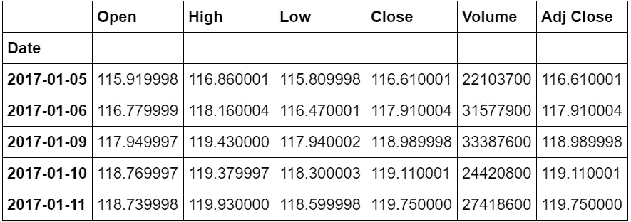

Stocks Prices from Yahoo Finance

这段代码将提取从 2010 年 1 月到 2017 年 1 月的 7 年数据。如果你认为有必要，可以随意调整开始和结束日期。在接下来的分析中，我们将使用收盘价，它表示股票在一天结束时的最终交易价格。

# 探索股票的滚动平均和收益率

在这个分析中，我们使用两个关键指标来分析股票:滚动平均值和回报率。

## 滚动平均(移动平均)——确定趋势

滚动平均/移动平均(MA)通过创建不断更新的[平均价格](https://www.investopedia.com/terms/a/averageprice.asp)来平滑价格数据。这有助于减少价格图表中的“噪音”。此外，这种移动平均线可以作为“阻力”，这意味着从股票的下跌趋势和上涨趋势中，你可以预计它将跟随趋势，不太可能偏离其阻力点。

[](https://www.investopedia.com/articles/active-trading/052014/how-use-moving-average-buy-stocks.asp) [## 如何用均线买股票

### 移动平均线(MA)是一个简单的技术分析工具，它通过创建一个持续的…

www.investopedia.com](https://www.investopedia.com/articles/active-trading/052014/how-use-moving-average-buy-stocks.asp) 

让我们开始计算滚动平均值:

```
close_px = df['Adj Close']
mavg = close_px.rolling(window=100).mean()
```

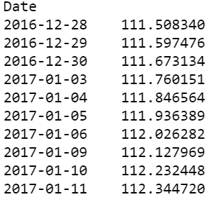

The Last 10 Moving Average

这将计算股票收盘价的最后 100 个窗口(100 天)的移动平均值，并取每个窗口移动平均值的平均值。正如你所看到的，移动平均线在窗口内稳步上升，并不跟随股价图的锯齿状线。

为了更好的理解，让我们用 Matplotlib 把它画出来。我们将移动平均线与股票价格图重叠。

```
%matplotlib inline
import matplotlib.pyplot as plt
from matplotlib import style

*# Adjusting the size of matplotlib*
import matplotlib as mpl
mpl.rc('figure', figsize=(8, 7))
mpl.__version__

*# Adjusting the style of matplotlib*
style.use('ggplot')

close_px.plot(label='AAPL')
mavg.plot(label='mavg')
plt.legend()
```

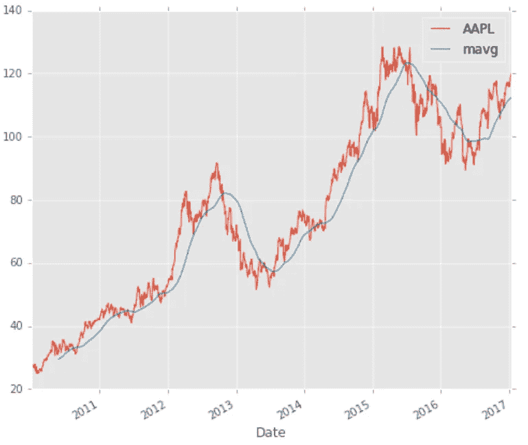

Apple Stocks Price with The Moving Average (mavg)

移动平均线使线变得平滑，显示股票价格的上升或下降趋势。

在这张图表中，移动平均线显示了股价上涨或下跌的上升趋势。从逻辑上讲，你应该在股票下跌时买入，在股票上涨时卖出。

## 回报偏差——确定风险和回报

> 预期**回报**衡量投资**回报**的概率分布的平均值或期望值。投资组合的预期**回报**的计算方法是将每项资产的权重乘以其预期**回报**，然后将每项投资的价值相加——Investopedia。

下面是你可以参考的公式:

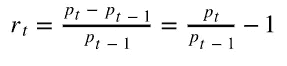

Formula for Returns

基于这个公式，我们可以将我们的回报绘制如下。

```
rets = close_px / close_px.shift(1) - 1rets.plot(label='return')
```

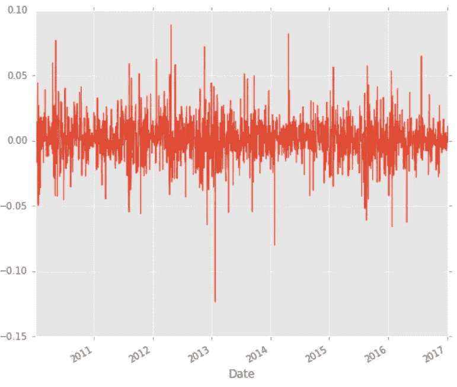

Plotting the Return Rate

从逻辑上讲，我们理想的股票回报应该尽可能的高且稳定。如果你是风险厌恶者(像我一样)，你可能会想避开这类股票，因为你看到了 2013 年 10%的跌幅。这个决定很大程度上取决于你对股票的总体看法和对竞争对手的分析。

# 分析竞争对手的股票

在这一部分，我们将分析一家公司相对于其竞争对手的表现。让我们假设我们对科技公司感兴趣，并想比较一下*大公司:*苹果、通用电气、谷歌、IBM 和微软。

```
dfcomp = web.DataReader(['AAPL', 'GE', 'GOOG', 'IBM', 'MSFT'],'yahoo',start=start,end=end)['Adj Close']
```

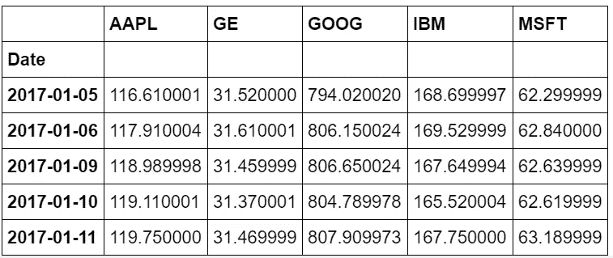

Stocks Price for Apple, General Electrics, Google, IBM, and Microsoft

这将返回一个光滑的雅虎财经股票收盘价表。整洁！！

## 相关性分析——一个竞争对手会影响其他竞争对手吗？

我们可以通过运行熊猫的百分比变化和相关函数来分析竞争。百分比变化将发现多少价格变化相比，前一天的定义回报。了解相关性将有助于我们了解回报是否受到其他股票回报的影响

```
retscomp = dfcomp.pct_change()

corr = retscomp.corr()
```

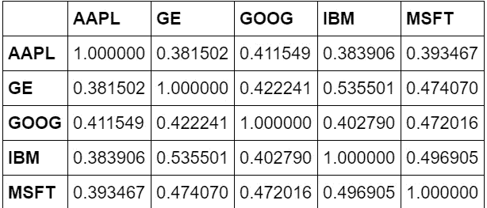

让我们用散点图把苹果和通用电气画出来，看看它们的回报分布。

```
plt.scatter(retscomp.AAPL, retscomp.GE)
plt.xlabel(‘Returns AAPL’)
plt.ylabel(‘Returns GE’)
```

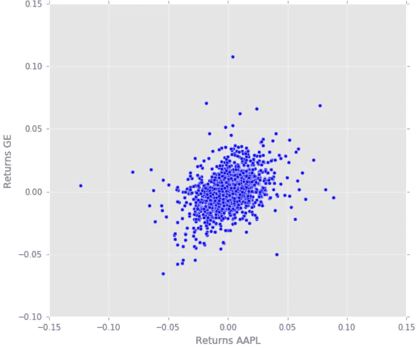

Scatter Plot of GE and AAPL

我们可以看到，通用电气的回报和苹果的回报之间存在轻微的正相关关系。似乎在大多数情况下，苹果的回报越高，通用电气的回报也越高。

让我们通过绘制 scatter_matrix 来进一步改进我们的分析，以可视化竞争股票之间可能的相关性。在对角点，我们将运行核密度估计(KDE)。KDE 是一个基本的数据平滑问题，根据有限的数据样本对总体进行推断。它有助于生成总体分布的估计值。

[](https://en.wikipedia.org/wiki/Kernel_density_estimation) [## 核密度估计-维基百科

### 在统计学中，核密度估计(KDE)是一种估计概率密度函数的非参数方法

en.wikipedia.org](https://en.wikipedia.org/wiki/Kernel_density_estimation) 

```
pd.scatter_matrix(retscomp, diagonal='kde', figsize=(10, 10));
```

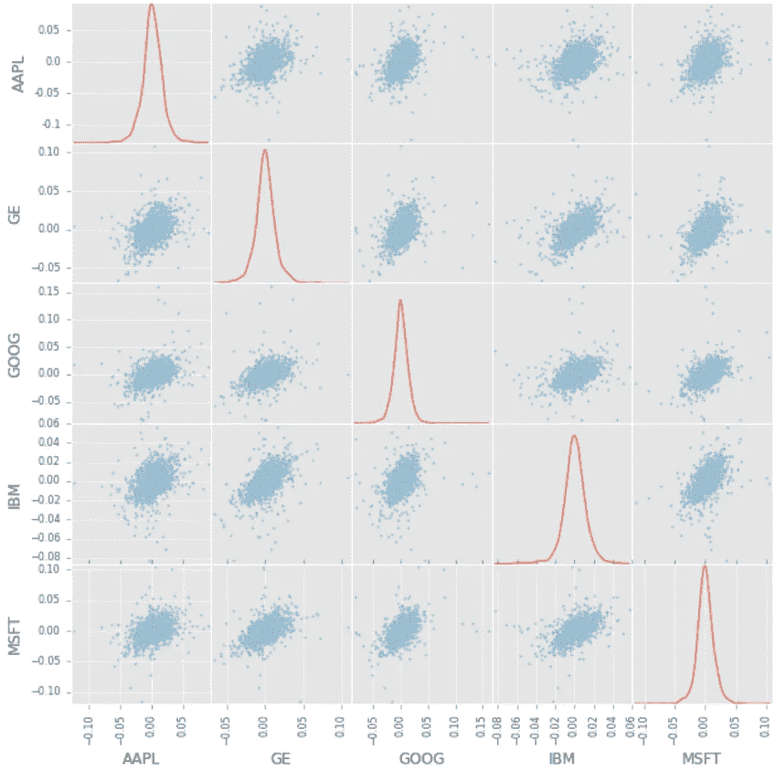

KDE Plots and Scatter Matrix

从这里我们可以看到大多数股票之间近似正相关的分布。

为了证明正相关，我们将使用热图来可视化竞争股票之间的相关范围。请注意，颜色越浅，两只股票的相关性越强。

```
plt.imshow(corr, cmap='hot', interpolation='none')
plt.colorbar()
plt.xticks(range(len(corr)), corr.columns)
plt.yticks(range(len(corr)), corr.columns);
```

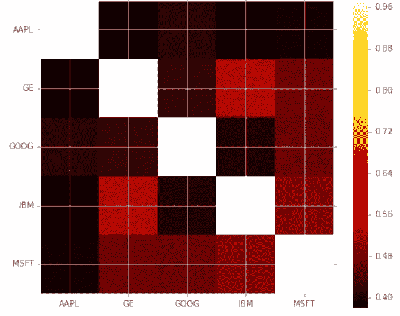

Heatmap of Correlations among competing stocks

从散点图和热图中，我们可以发现竞争股票之间有很大的相关性。然而，这可能不会显示因果关系，可能只是显示技术行业的趋势，而不是显示竞争股票如何相互影响。

## 股票回报率和风险

除了相关性，我们还分析每只股票的风险和回报。在这种情况下，我们提取回报率的平均值(回报率)和回报率的标准差(风险)。

```
plt.scatter(retscomp.mean(), retscomp.std())
plt.xlabel('Expected returns')
plt.ylabel('Risk')
**for** label, x, y **in** zip(retscomp.columns, retscomp.mean(), retscomp.std()):
    plt.annotate(
        label, 
        xy = (x, y), xytext = (20, -20),
        textcoords = 'offset points', ha = 'right', va = 'bottom',
        bbox = dict(boxstyle = 'round,pad=0.5', fc = 'yellow', alpha = 0.5),
        arrowprops = dict(arrowstyle = '->', connectionstyle = 'arc3,rad=0'))
```

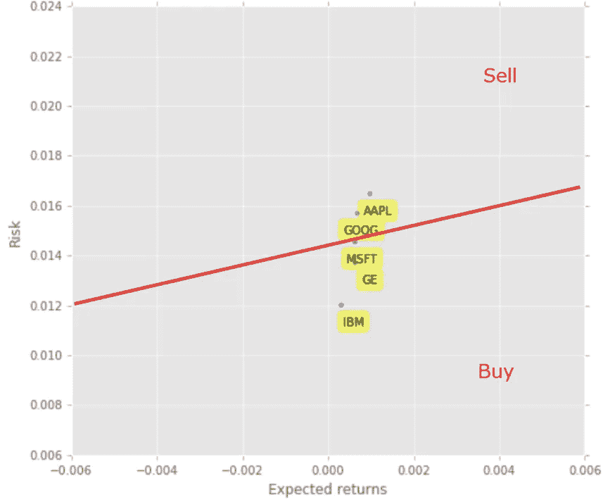

Quick Scatter Plot among Stocks Risk and Returns

现在你可以看到这张简单的竞争股票的风险和回报对比图。从逻辑上来说，你想最小化风险，最大化回报。因此，你需要为你的风险回报承受能力画一条线(红线)。然后，你可以创建规则，买入红线以下的股票(MSFT、通用电气和 IBM)，卖出红线以上的股票(AAPL 和谷歌)。这条红线展示了你的期望值阈值和你的买入/卖出决策基线。

# 预测股票价格

## 特征工程

我们将使用这三种机器学习模型来预测我们的股票:简单线性分析、二次判别分析(QDA)和 K 近邻(KNN)。但是首先，让我们设计一些特征:高/低百分比和百分比变化。

```
dfreg = df.loc[:,[‘Adj Close’,’Volume’]]
dfreg[‘HL_PCT’] = (df[‘High’] — df[‘Low’]) / df[‘Close’] * 100.0
dfreg[‘PCT_change’] = (df[‘Close’] — df[‘Open’]) / df[‘Open’] * 100.0
```

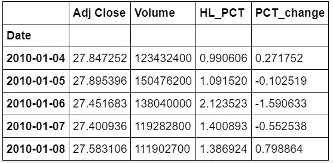

The end Data Frame Produced

## 预处理和交叉验证

在将数据放入预测模型之前，我们将使用以下步骤清理和处理数据:

1.  *丢弃缺失值*
2.  *在这里分离标签，我们要预测 AdjClose*
3.  *缩放 X，这样每个人都可以有相同的线性回归分布*
4.  *最后，我们希望找到 X 年末和 X 年初(训练)的数据序列，用于模型生成和评估*
5.  *分离标签并将其识别为 y*
6.  *通过交叉验证训练测试分割分离模型的训练和测试*

请参考下面的准备代码。

```
# Drop missing value
dfreg.fillna(value=-99999, inplace=True)# We want to separate 1 percent of the data to forecast
forecast_out = int(math.ceil(0.01 * len(dfreg)))# Separating the label here, we want to predict the AdjClose
forecast_col = 'Adj Close'
dfreg['label'] = dfreg[forecast_col].shift(-forecast_out)
X = np.array(dfreg.drop(['label'], 1))# Scale the X so that everyone can have the same distribution for linear regression
X = preprocessing.scale(X)# Finally We want to find Data Series of late X and early X (train) for model generation and evaluation
X_lately = X[-forecast_out:]
X = X[:-forecast_out]# Separate label and identify it as y
y = np.array(dfreg['label'])
y = y[:-forecast_out]
```

## 模型生成——预测乐趣的开始

但是首先，让我们为我们的 Scikit-Learn 插入以下导入:

```
**from** **sklearn.linear_model** **import** LinearRegression
**from** **sklearn.neighbors** **import** KNeighborsRegressor

**from** **sklearn.linear_model** **import** Ridge
**from** **sklearn.preprocessing** **import** PolynomialFeatures
**from** **sklearn.pipeline** **import** make_pipeline
```

## 简单线性分析和二次判别分析

简单的线性分析显示了两个或多个变量之间的线性关系。当我们在两个变量之间画这个关系时，我们得到一条直线。二次判别分析类似于简单的线性分析，只是该模型允许多项式(例如:x 的平方)并会产生曲线。

给定自变量(x)作为输入，线性回归预测因变量(y)作为输出。在绘图过程中，这将给我们一条直线，如下所示:


Simple Linear Regression

这是一个惊人的出版物，它展示了一个非常全面的线性回归审查。请参考下面的链接查看。

[](/a-beginners-guide-to-linear-regression-in-python-with-scikit-learn-83a8f7ae2b4f) [## 用 Scikit 学习 Python 线性回归的初学者指南

### 有两种类型的监督机器学习算法:回归和分类。前者预测…

towardsdatascience.com](/a-beginners-guide-to-linear-regression-in-python-with-scikit-learn-83a8f7ae2b4f) 

我们将即插即用现有的 Scikit-Learn 库，并通过选择我们的 X 和 y 训练集来训练模型。代码如下所示。

```
*# Linear regression*
clfreg = LinearRegression(n_jobs=-1)
clfreg.fit(X_train, y_train)*# Quadratic Regression 2*
clfpoly2 = make_pipeline(PolynomialFeatures(2), Ridge())
clfpoly2.fit(X_train, y_train)

*# Quadratic Regression 3*
clfpoly3 = make_pipeline(PolynomialFeatures(3), Ridge())
clfpoly3.fit(X_train, y_train)
```

## k 最近邻(KNN)

该 KNN 使用特征相似度来预测数据点的值。这确保了分配的新点与数据集中的点相似。为了找出相似性，我们将提取点来释放最小距离(例如:欧几里德距离)。

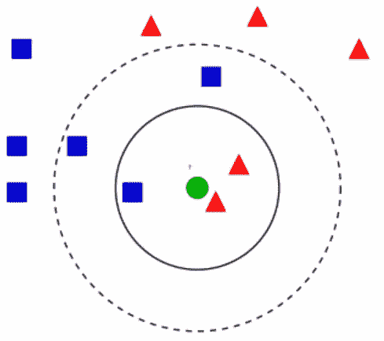

KNN Model Visualization where you would group the questioned element in k number of elements

请参考此链接，了解有关该模型的更多详细信息。这对提高你的理解能力真的很有用。

[](https://www.analyticsvidhya.com/blog/2018/03/introduction-k-neighbours-algorithm-clustering/) [## k 近邻介绍:简化(用 Python 实现)

### 注意:这篇文章最初发表于 2014 年 10 月 10 日，更新于 2018 年 3 月 27 日

www.analyticsvidhya.com](https://www.analyticsvidhya.com/blog/2018/03/introduction-k-neighbours-algorithm-clustering/) 

```
*# KNN Regression*
clfknn = KNeighborsRegressor(n_neighbors=2)
clfknn.fit(X_train, y_train)
```

## 估价

一种简单快速且肮脏的评估方法是在每个训练好的模型中使用评分方法。评分法用测试数据集的 y 值来计算 self.predict(X)的平均准确度。

```
confidencereg = clfreg.score(X_test, y_test)
confidencepoly2 = clfpoly2.score(X_test,y_test)
confidencepoly3 = clfpoly3.score(X_test,y_test)
confidenceknn = clfknn.score(X_test, y_test)# results
('The linear regression confidence is ', 0.96399641826551985)
('The quadratic regression 2 confidence is ', 0.96492624557970319)
('The quadratic regression 3 confidence is ', 0.9652082834532858)
('The knn regression confidence is ', 0.92844658034790639)
```

这显示了大多数模型的巨大准确性得分(> 0.95)。然而，这并不意味着我们可以盲目地放置我们的股票。仍然有许多问题需要考虑，特别是不同的公司，随着时间的推移有不同的价格轨迹。

为了进行健全性测试，让我们打印一些股票预测。

```
forecast_set = clf.predict(X_lately)
dfreg['Forecast'] = np.nan#result
(array([ 115.44941187,  115.20206522,  116.78688393,  116.70244946,
        116.58503739,  115.98769407,  116.54315699,  117.40012338,
        117.21473053,  116.57244657,  116.048717  ,  116.26444966,
        115.78374093,  116.50647805,  117.92064806,  118.75581186,
        118.82688731,  119.51873699]), 0.96234891774075604, 18)
```

# 绘制预测图

基于预测，我们将使用现有的历史数据来可视化绘图。这将有助于我们直观地看到模型如何预测未来的股票定价。

```
last_date = dfreg.iloc[-1].name
last_unix = last_date
next_unix = last_unix + datetime.timedelta(days=1)

**for** i **in** forecast_set:
    next_date = next_unix
    next_unix += datetime.timedelta(days=1)
    dfreg.loc[next_date] = [np.nan **for** _ **in** range(len(dfreg.columns)-1)]+[i]dfreg['Adj Close'].tail(500).plot()
dfreg['Forecast'].tail(500).plot()
plt.legend(loc=4)
plt.xlabel('Date')
plt.ylabel('Price')
plt.show()
```

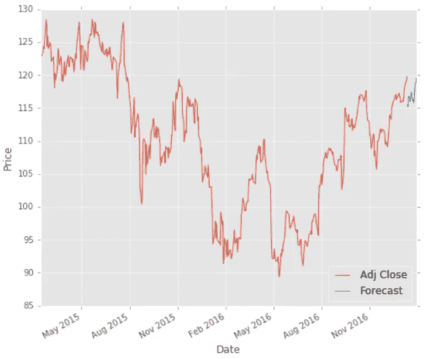

Predictions Displayed in Plot

我们可以看到蓝色展示了基于回归的股票价格预测。该预测预测，经济低迷不会持续太久，然后就会复苏。因此，我们可以在下跌时买入股票，在上涨时卖出。

# 未来的改进/挑战

为了进一步分析股票，这里有一些关于你如何做贡献的想法。这些想法将有助于对股票进行更全面的分析。如果需要更多的澄清，请随时告诉我。

*   分析经济定性因素，如新闻(新闻来源和情感分析)
*   分析某个国家的 HPI、公司来源之间的经济不平等等经济数量因素

# 目的、Github 代码和您的贡献

本概念证明(POC)是作为我目前管理的投资方项目的一部分而创建的。这个应用程序的目标是帮助您快速检索和显示关于某个公司股票价格的正确的金融见解，并预测其价值。

在 POC 中，我使用 Pandas- Web Datareader 来查找股票价格，使用 Scikit-Learn 来预测和生成机器学习模型，最后使用 Python 作为脚本语言。Github Python 笔记本代码位于下面。

[](https://github.com/VincentTatan/PythonAnalytics/blob/master/Youtube/Lesson%203%20%20Basic%20Python%20for%20Data%20Analytics%20%28Stocks%20Prediction%29.ipynb) [## Python Analytics/第 3 课用于数据分析的基本 Python(股票预测)。主机上的 ipynb

### 这是一个存放我的 Kaggle 和 iPython 笔记本的地方——python analytics/第三课基础…

github.com](https://github.com/VincentTatan/PythonAnalytics/blob/master/Youtube/Lesson%203%20%20Basic%20Python%20for%20Data%20Analytics%20%28Stocks%20Prediction%29.ipynb) 

您可以随意克隆这个库，并在有时间的时候贡献自己的一份力量。

# 价值投资

代替今天关于股票分析的话题。你也可以访问我的价值投资出版物，在那里我谈到了搜集股票金融信息，并将其显示在一个易于阅读的仪表板上，该仪表板根据[价值投资方法](https://www.investopedia.com/university/stockpicking/stockpicking3.asp)处理股票估值。请访问并投稿:)。

[](/value-investing-dashboard-with-python-beautiful-soup-and-dash-python-43002f6a97ca) [## 价值投资仪表盘，配有 Python Beautiful Soup 和 Dash Python

### 价值投资的 Web 抓取与快速 Dash 可视化概述

towardsdatascience.com](/value-investing-dashboard-with-python-beautiful-soup-and-dash-python-43002f6a97ca) 

***来自《走向数据科学》编辑的提示:*** *虽然我们允许独立作者根据我们的* [*规则和指导方针*](/questions-96667b06af5) *发表文章，但我们不认可每个作者的贡献。你不应该在没有寻求专业建议的情况下依赖一个作者的作品。详见我们的* [*读者术语*](/readers-terms-b5d780a700a4) *。*

## 感谢

我想感谢我的会计和金融朋友们，他们给了我关于这本书的建设性反馈。我真的很高兴得知你从我的出版物中获得了很多价值。

## 最后…向我伸出手

咻…就是这样，关于我的想法，我把它写成了文字。我真的希望这对你们来说是一个伟大的阅读。因此，我希望我的想法可以成为你发展和创新的灵感来源。

请通过我的 [**LinkedIn**](http://www.linkedin.com/in/vincenttatan/) 联系我，订阅我的 [**Youtube 频道**](https://www.youtube.com/user/vincelance1/videos)

如果你喜欢，请给我**掌声**。

**下面评论**出来建议和反馈。

快乐编码:)

**免责声明:本免责声明告知读者，文中表达的观点、想法和意见仅属于作者，不一定属于作者的雇主、组织、委员会或其他团体或个人**。**参考文献从列表中挑选，与其他作品的任何相似之处纯属巧合**

**本文纯粹是作者的个人项目，绝无任何其他不可告人的目的。**