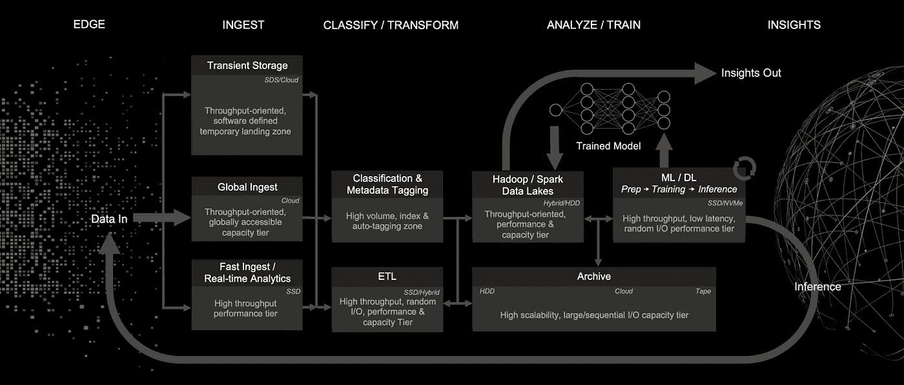

# 在人工智能中就像在生活中一样…专注于旅程

> 原文：<https://towardsdatascience.com/in-ai-as-in-life-focus-on-the-journey-dd2fe319cdaf?source=collection_archive---------28----------------------->

**让人工智能工作的架构决策**

现在的趋势是对机器学习和深度学习编程框架、课程和最流行的算法的巨大迷恋。梯度推进机器、支持向量机、卷积神经网络、递归神经网络和长短期记忆(LSTM)风靡一时。在线培训和课程多如牛毛。教育机构、企业甚至政府都在快速推出人工智能培训项目——很难跟上！

*   285 亿美元-2019 年第一季度全球分配给机器学习的资金总额。(【statista.com】T2
*   180 亿美元——未来五年人工智能助理市场的估计价值。(【teks.co.in】T4)
*   1200 亿美元——到 2025 年底，人工智能驱动的硬件的估计全球销售额。([teks.co.in](https://teks.co.in/site/blog/machine-learning-in-2019-tracing-the-artificial-intelligence-growth-path/))
*   13 万亿美元——人工智能到 2030 年可能带来的潜在全球经济。([mckinsey.com](https://www.mckinsey.com/~/media/McKinsey/Featured%20Insights/Artificial%20Intelligence/Notes%20from%20the%20frontier%20Modeling%20the%20impact%20of%20AI%20on%20the%20world%20economy/MGI-Notes-from-the-AI-frontier-Modeling-the-impact-of-AI-on-the-world-economy-September-2018.ashx))
*   14 倍——自 2000 年以来人工智能初创公司数量的增长率。([aiindex.org](http://aiindex.org/2017-report.pdf))

虽然人工智能的价值没有受到挑战——人工智能不仅仅是最热门的算法和 TensorFlow 或 Keras 中编写神经网络的几行代码——它需要一个完整的工作流程。从 ETL、预处理、特征工程、转换(以及代表实际算法的几行代码)、训练和推理——并使所有这些在生产环境中可扩展和健壮。问题不在于哪种算法或数学优化技术是最新的“时尚”问题是:如何使整个流程对组织可行？

这是人工智能工作流程的一个很好的代表:

Source: Building your AI data pipeline: The IBM IT Infrastructure Blog

这条管道的不同阶段具有不同的特征和相关的技术需求。例如:

**接收或数据收集**受益于边缘软件定义存储的灵活性，并要求高吞吐量。

**数据分类和转换**涉及聚合、规范化、分类数据以及用有用的元数据丰富数据的阶段需要极高的吞吐量，包括小型和大型 I/O。

**模型训练**需要一个性能层，能够以极高的吞吐量和低延迟支持机器学习和深度学习模型训练中涉及的高度并行的过程。

**带推理的模型再训练**不需要那么大的吞吐量，但仍然要求极低的延迟。

**归档**需要一个高度可扩展的容量层来存储冷归档和活动归档数据，该容量层以吞吐量为导向，并支持大型 I/O、流和顺序写入。根据要求，其中任何一项都可能发生在本地或私有或公共云中。

在代码方面，在每个 AI 学习者的旅程中，都有一段时间，他们对下面的 TensorFlow 实验感到高兴:

 [## sunny-ML-DL/simple _ 张量流

### 从 sklearn 导入 tensorflow 作为 tf 导入 pandas 作为 pd .预处理导入 MinMaxScaler #关闭 TensorFlow…

github.com](https://github.com/Sunny-ML-DL/simple_tensorflow/blob/master/python_game_earnings) 

一年前，我也会很开心。这是我之前看过的一个文档，叫做: [*架构决策指南*](https://developer.ibm.com/articles/data-science-architectural-decisions-guidelines/) *。*我推荐任何参与实施 AI 的人阅读这篇文档，甚至是那些立志成为实践者的人。

以下是文件中的一些问题:

**数据源:**对于关系数据库和 OLTP 系统，访问企业数据的最佳方式是什么？随着*实时数据*(例如股票市场数据)，这个问题变得更加重要。例如，您是否需要使用云对象存储？记住，股市数据会在几秒钟内失去价值！

**数据清理和转换:**这里要考虑的问题是正在使用什么样的数据源类型，需要什么样的吞吐量。当涉及到集群级数据处理和机器学习时，Apache Spark 往往是首选。

**数据仓库—** 数据的持久存储:存储成本、数据类型、备份、存储容量等问题由此产生。大多数情况下，这可以是一个 SQL 或 NoSQL 数据库。

**数据探索和可视化—** Pandas、Scikit-Learn 和 Matplotlib 是这里的热门技术。要解决的问题:需要静态还是交互式可视化(Matplotlib 是静态的)？有哪些编码技巧？像 IBM SPSS Modeller 这样的技术不需要任何编码技能。

**创造可操作的见解:**每一项数据科学工作的好坏都取决于从中获得的可操作的见解。这里的关键问题是你有什么技能，需要并行或基于 GPU 的训练和推理吗？R and R 工作室可能因为 Python 和 Anaconda 而出名。但是对于并行和基于 GPU 的工作来说，它们并不理想。然而，所有 Apache Spark 作业本质上都是并行的。

**最后，模型可能是优雅而美丽的——但是你想过你将创造的数据产品吗？**你如何让你的模型被商业用户消费？在这里，你要考虑你的目标受众和所需的定制程度。Node-RED 在这里是一个很好的选择。虽然 Node-RED 是一个无代码/低代码数据流/数据集成环境，但由于其模块化特性，它支持各种扩展，包括仪表板扩展。

**最后但同样重要的是，数据安全和治理！今天上网看看，你很可能会找到关于黑客的新闻。安全的基础设施和云服务是确保数据保护的良好开端。**

这是一次旅行，不是吗？虽然用最流行的框架学习最新的 ML/DL 算法很诱人…最好专注于掌握上述所有步骤的一项关键技术/方法。那么我们可能会更好地准备实施端到端的人工智能工作流。