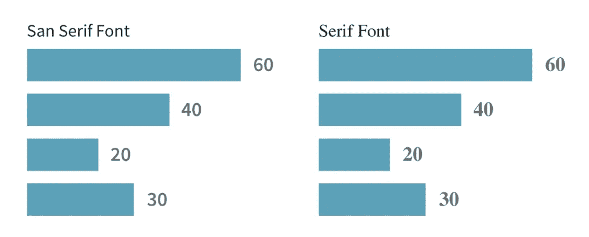
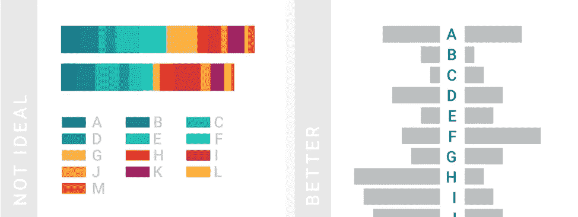

# 在数据科学中:细节很重要

> 原文：<https://towardsdatascience.com/in-data-science-details-matter-ec8b27f626fc?source=collection_archive---------11----------------------->

## 等级制度。文字。颜色。

Credit: [Graphiq](https://blog.graphiq.com/finding-the-right-color-palettes-for-data-visualizations-fcd4e707a283)

从建筑实践到数据科学领域，我一直对细节有着深刻的欣赏和兴趣。建筑必须经过深思熟虑的制作才能美丽——以熟悉、温暖和吸引人的尺寸和比例汇集材料。外部建筑系统必须细致入微，以保证热效率——冷时保持热量，反之亦然。

建筑的教训是细节很重要。然而，这个原则超越了建筑设计。史蒂夫·乔布斯曾经告诉我们:

> “细节很重要，值得等待，直到把它做好。”

数据科学专业应该听从乔布斯的建议，尤其是在解释数据发现的时候。数据科学家有无数的库可以直接从 Python 中更快更容易地可视化数据集:Matplotlib、Seaborn、Plotly、Bokeh，不胜枚举。今天，我们期待即时的满足。我只需点击“立即购买”，几小时后我的包裹就会送到我家门口。或者，我简单地在 Seaborn 中运行一两行代码，得到一个甜蜜的条形图，对吗？好吧，我问你——细节在哪里？

建筑师的手绘草图可以有效地向另一个建筑师快速解释设计思想。同样，快速绘图可能有助于数据科学家快速浏览数据，或者与办公桌前的同事讨论数据。但是像架构一样，数据可能很难向实践之外的人解释。可视化必须经过提炼、修饰和精心策划，才能讲述一个关于数据的清晰而美丽的故事。**还是那句话，细节很重要。**

但是在数据可视化中，我们应该重点关注哪些细节呢？我认为我们可以将其分为三类:

**1。层级**

**2。正文**

**3。颜色**

# 等级制度

谈到数据可视化，大多数人说最好的经验法则是尽可能简单地讲述数据的故事。使数据易于导航的一种方法是在图形中使用层次结构。

等级的意思是“去排位”。因此，通过将信息分解为“分级”元素，我们可以在数据可视化中给予某些元素或多或少的权重。层次结构为读者提供了快速浏览内容的**结构**，并找到他们感兴趣的内容。层次结构向读者展示了如何参与和浏览数据可视化，从大的发现，一直到更精细的细节。

我们可以用多种方式提供层次结构，例如，标题、小标题、注释和更小的细节。此外，文本可以通过文本**大小** (12pt 对 24pt)**粗细**(粗体对浅色)和其他**重点**(斜体对下划线)来提供层次。颜色还可以通过突出图形的某些元素来提供层次和引起注意。

## 所以教训是:

# 层级对信息进行“分级”,因此我们知道理解什么是重要的。

Credit: [Canva](https://www.canva.com/learn/design-elements-principles/)

Credit: [Alyssa Leverenz](https://coupleofcreatives.com/good-design-bad-design/)

# 文本

在我们的生活中有两种主要的字体:衬线字体和无衬线字体。

衬线应该用于文本长度较长的项目，比如书籍和文章。纵观历史，许多人声称衬线字体有助于处理长文本，因为它们有助于眼睛沿着一行平稳移动，从而使阅读更容易、更快——尤其是在文本行很长的情况下。考虑 serif 字体，如 Garamond、Georgia 或 Times New Roman。

**无衬线字体**应该用于文本长度**较短的项目。Sans serif 是标题、致谢名单、列标题、图表中的文本等的绝佳选择。无衬线字符更简单，更容易区分任何大小。当您的数据分发给有视觉障碍的读者或仍在学习英语的读者时，这可能会有所帮助。考虑无衬线字体，如 Avenir，未来，或 Helvetica。**

It takes people **longer** to understand the numbers in the serif graph on the right than it does to understand the numbers in the sans serif graph on the left. Credit: [Howard Coale](https://trinachi.github.io/data-design-builds/ch15.html)

Serif fonts can have many idiosyncrasies in their endpoints, widths, curves, and shapes that add more for the eye to take in at any given moment. In essence, serif creates more “data” for a reader to take in for each letter or number! Credit: [Howard Coale](https://trinachi.github.io/data-design-builds/ch15.html)

**对比**对于区分文字也很重要。你永远不知道你的数据结果会被如何使用。想象一下，你的情节通过视频投影仪显示在演示文稿中，投影仪洗掉了你的纯白背景上所有柔和的灰色文本，没有人能看懂任何内容！那太可惜了。为确保在任何设置下的易读性，建议**的最小比率至少为 4:1** 。

Max contrast is 21:1 — this means pure white text on a pure black background, or vice-versa. 1:1 means that the background color and your text color are the same. The recommended minimum for text contrast is **4:1**. [Source](https://medium.com/@uistephen/text-contrast-for-web-pages-d685636c0749)

## 所以教训是:

# 对较短的文本使用无衬线字体。对较长的文本使用衬线。有充足的对比。

# 颜色

选择颜色很难。听说过 RGB 颜色系统吗？它从红色、绿色和蓝色的组合中产生所有可能的颜色。告诉计算机定义每种颜色强度的数字输入范围为 0-255。所以举个例子:如果 R = 0，那么颜色中没有“红色”。如果 R = 255，G = 0，B = 0，那么颜色就是纯“红”。所以理论上，你可以把 R，G，B 组合成 256*256*256 = 16，777，216 种可能的颜色。那么，我们如何选择几种颜色，以最清晰、最容易理解的方式来可视化我们的数据呢？首先，我们必须了解颜色的基本元素。

颜色归结为三个要素:色调，价值和饱和度。

**色调**描述颜色本身。色调就是我们通常认为的描述颜色的东西:红色、蓝色、绿色等等。**值**是一个色调有多亮或者有多暗。例如，具有暗值的蓝色是“深蓝”，具有亮值的蓝色是“浅蓝”。**饱和度**是色调的强度或强度。低饱和度意味着更暗、更灰的颜色，高饱和度意味着更强烈的鲜艳颜色。例如，低饱和度的蓝色看起来像多云的天空，而高饱和度的蓝色看起来像晴朗的天空。

Hue is the color itself. Saturation is the intensity of the color. Value is the lightness/darkness of the color. [Source](https://111426studio.wordpress.com/2015/11/30/the-role-of-colour-in-character-and-scene-design/)

在某些情况下，色调、饱和度和值的组合有助于直观地显示数据中的**模式**或**趋势**。然而，如果你的数据尽可能的简单，观众会更快的理解你的数据。如果定量值在图表中很重要，最好用单色条或点来显示结果。如果有必要，您可以使用颜色在同一个图表上显示不同的类别。

The plot on the left converts all categories into a different color and merges them into a single bar. Keep it simple instead! The bar plot on the right only needs **one color**, because it breaks out each category as a separate bar. Quantities are much easier to compare in the graph on the right. Credit: [Datawrapper](https://blog.datawrapper.de/colors/)

我们可以使用色相、明度和饱和度让数据更加清晰。我们可以用颜色来表示刻度，即增加或减少数值的等级。一种想法是使用渐变调色板，在较宽的值和饱和度范围内融合相反的色调(紫色和黄色，红色和绿色，或橙色和蓝色)。特别是，更大范围的值使得调色板即使对于色盲的人也是可访问的。

对于连续数据，您使用颜色**渐变**，对于分类数据，您使用**不同的颜色。**

梯度意味着:

> "我是一个可能高于或低于我周围另一种颜色的量."

鲜明的颜色意味着:

> "我和我周围的其他颜色毫无关系。"

In the graph on the left, the all-blue gradient color scheme may imply that “Ivan” is more important in the data than the other three people, when really, he is not. The graph on the right uses different hues, to give equal weight to all people being compared. The graph on the right also uses light and dark values to allow the categories to be distinguished even by those who are colorblind. Credit: [Datawrapper](https://blog.datawrapper.de/colors/)

**当数据讲述一个关于**“低到高”**趋势的故事时，可以使用渐变**。当使用渐变显示数据时，渐变应该尽可能以相同的步长从亮到暗逐渐变暗。无论是彩色的还是黑白的，渐变都应该看得很清楚。

Intuitively, people understand light colors for low values and dark colors for high values. If using a gradient, limit the number of hues to one or two colors at a maximum. (Ex: light grey to dark blue, or light yellow to dark blue.) Credit: [Datawrapper](https://blog.datawrapper.de/colors/)

**直观上，人们理解浅色代表低值，深色代表高值。**如果使用渐变，最多限制一到两种颜色。例如，浅灰色到深蓝色，或浅黄色到深蓝色。

如果比较的数据可能高于或低于平均值或基线量，那么**发散**调色板是一个不错的选择。使用这个调色板的好例子可能是显示各县的平均工资，或各州的平均气温。建议在渐变的中心使用浅灰色，在渐变的两边使用深色和互补的色调(紫色和黄色，红色和绿色，或者橙色和蓝色)。

A diverging palette should use two complementary hues, that are dark in value, with a light, desaturated color in the middle. The right graph is the better choice. Credit: [Datawrapper](https://blog.datawrapper.de/colors/)

Complementary color pairs are recommended in a diverging color palette. Complementary colors are always on the **opposite** side of each other on the color wheel. Credit: [Lacie Lynnae](https://www.flickr.com/photos/124222186@N02/14113625110/in/photolist-nvb22Y-5TYjmd-a1Xx84-2QynR3-2Xy9wS-56uWX1-9rrAVf-EfB6H-7euy5N-dTnw2m-oAY74K-b2EBU2-nvdAck-ewTd2-boTdwR-9Kzgjs-iYAs8A-d7R82m-HmJwa-oRpEmf-8Gnvui-dADRxu-nvaHc8-93ThBQ-9JoMcp-vEYN2-eXG5n2-iXtAzz-e9wjjA-6XqgC8-67LFrR-9eSdwB-3fh4H-yz9ig-qdp8xb-iYyTzR-e2wWuD-dS6mx5-qqyKu4-6Wu4Qz-nyWvDm-qdpfBw-593nN8-d16tkG-5gxrRS-94uYNN-iXwkZQ-bzfH3R-aamnff-7vGv7m)

你的绘图颜色越中性，就越容易使用颜色来突出显示数据。灰色是背景数据、注释的绝佳选择，或者只是为了让情节尽可能简约。为了让情节更生动，灰色可以是暖色的微妙阴影，如红色、橙色或黄色。

Too many colors can make the plot too noisy — making it hard to extract key insights. If you want to call attention to one particular element on your plot, use grey throughout and use one color to highlight. Credit: [Datawrapper](https://blog.datawrapper.de/colors/)

为您的数据使用直观的颜色！比如我们都知道红色代表“热”，蓝色代表“冷”。在自然界中，我们都把绿色和树联系在一起，把蓝色和水体联系在一起。在美国，我们都知道共和党通常显示为红色，民主党显示为蓝色。当谈到交通、行为或表现时，从小我们就被教导红色意味着“停止”或“不好”，而绿色意味着“行”或“好”。

Use intuitive colors for people to understand the data faster. Avoid using other colors just to be different — and avoid using colors associated with something else (for example, using blue and red for male and female, because blue and red are so heavily associated with politics). Credit: [Datawrapper](https://blog.datawrapper.de/colors/)

## 所以教训是:

# 为了强调，尽量少用颜色。对连续数据使用单色或双色渐变。分类数据使用不同的色调。使用直观的颜色。

记住——在一天结束时，我们数据科学家必须向世界展示的一件有形的东西，就是我们的**图。**把所有的精力都放在只有你能看到的 Jupyter 笔记本上，而花很少的时间在与人分享的情节输出上，这似乎是一种耻辱。因此，将**层次、文本、** **和** **颜色**的原则置于您的支配之下，使您的数据可视化易于阅读且美观。抓住它！