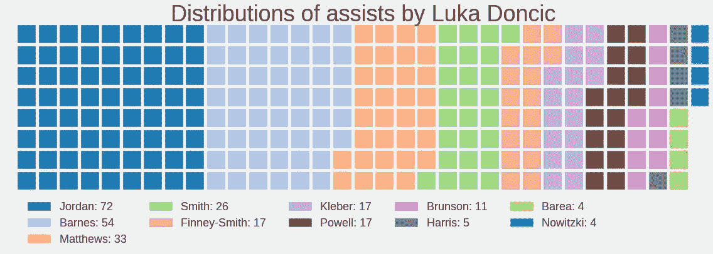

# 深入看看卢卡·东契奇的表现

> 原文：<https://towardsdatascience.com/in-depth-look-at-luka-doncics-performance-b69ff60004ba?source=collection_archive---------18----------------------->

卢卡·东契奇可以说是 2018-19 赛季迄今为止的年度最佳新秀，
他的表现让达拉斯小牛队有现实的可能性
进入今年的季后赛，目前在第八名中仅获得 5.5 场比赛。
他创造了惊人的数据，可以与一些历史上最伟大和目前最活跃的球员相媲美。
我稍后会详细介绍这一点，因为现在我想探索一下他游戏中的一些特定领域。

# 离合器时间是卢卡时间

每当我继续观看卢卡的精彩表演时(我住在欧洲的克罗地亚，所以不幸的是
没有赶上很多比赛，因为他们开始得晚，尤其是那些来自西部联盟的比赛)，我总是注意到
卢卡是在比赛后期处理小牛进攻中所有棍子的家伙。

这让我在关键时刻看到了他的数据，这些数据令人印象深刻。在下图中:

Total clutch points for players in 2018–19 season — Image by Author

你可以在关键时刻查看前 60 名得分手。x 轴表示总得分，y 轴表示真实投篮命中率。除了东契奇，其他一些突出的球员还有奥拉迪波(他比东契奇高得多)和总得分前 3 名的球员(肯巴、哈登和垂怜经)。但考虑到东契奇只是一名 19 岁的新秀，这些数字简直令人吃惊。这让我想知道过去几年新秀在关键时刻表现如何。我收集了 2003-04 赛季(勒布朗的第一个赛季)以来的关键得分，得到了这张图表:

Total clutch points for rookies since 2018–19 — Image by Author

从图表中可以看出，卢卡是该范围内最好的新秀之一。得分比他高的运动员依次是布兰顿·詹宁斯、凯文·杜兰特、泰瑞克·埃文斯和德里克·罗斯。同样值得注意的是，他们的统计数据达到了全明星赛的水平，所以在接下来的几周内，东契奇可能会提高这些数据。总积分排名前十的其他公司是利拉德、马克卡宁、米切尔、威斯布鲁克和克里斯·保罗，这是一家非常好的公司。

# 东契奇的拍摄图表和播放/拍摄类型选择

拍摄图表是我在分析过程中最喜欢创建的东西。对于初学者，我们有定期拍摄图表。

Luka Dončić’s shot chart — Image by Author

这张图表并不真的令人难以置信，但我们通常可以看到卢卡在几乎所有领域都高于平均水平。而且他投了很多三分球，也没有满足于很多中距离跳投(尽管他远非真正的*莫雷球*投篮图)。

为了补充之前的短暂关键时刻分析，这里是迄今为止卢卡在关键时刻的所有投篮的投篮图。

Image by Author

他在中距离投篮非常有效，尽管大多数投篮来自三分球区和篮下。

NBA 的跟踪有几个类别的比赛，他们分为球员的每一个镜头。我试图想象出 don ici 更喜欢哪些行动，以及他在这些行动中效率如何。这里有一个图表显示。

FGM/FGA for Dončić based on play — Image by Author

这里要注意的是，这些并不都是 Donč ić制造/尝试的射门，而只是那些有某种分类的射门，如果我必须假设这些类型的比赛是什么，它们可能代表类似于接球射门和类似类型的比赛。所以即使我们说所有其他的比赛都是接球投篮，那也意味着他总共有 208 次接球投篮。这仍然会给我们留下更多他自己创造的镜头(无论是开车，后退镜头还是正常的引体向上镜头)。这消除了选秀前的疑虑，专家们质疑，鉴于他的一般运动能力，东契奇是否能为自己创造投篮机会。

## 卢卡和(退后一步)跳投

在那之后，我开始想象卢卡跳投的类型。

Jump shots taken by Luka Dončić — Image by Author

被称为跳投的投篮类型代表了我之前提到的接球投篮类型。从这张图表中我们可以看到，卢卡已经在开发一个标志性的动作，后退跳投。这肯定是相当复杂的动作。我想检查所有其他球员后退跳投的效率，但不幸的是，很难获得所有数据(由于从 nba api 获取数据的问题)，所以我只是看了看一些应该是优秀射手和后退射手的球员。

因此，我用今年的一些最佳射手(至少是那些不是主要从内线/近距离进球的人)和卢卡·东契奇做了一个图表。

Step Back jump shots for some of the best scorers this year — Image by Author

他实际上离垂怜经并不远，场均只有 3 分。这真的很有趣，尽管他是新秀，但他与所有这些球员的效率相当接近，甚至比他们所有人都要多，除了哈登，他只是采取了荒谬的后退次数。对于东契奇来说，19 岁就拥有如此强大的工具将是一个巨大的优势。

为了完成这一简短的后退投篮和卢卡，我绘制了一张投篮图，其中包含了卢卡本赛季尝试的所有后退跳投。

Luka Dončić’s shot chart for step back jump shots — Image by Author

# 助攻

除了出色的得分能力，卢卡还擅长拥有出色的球场视野和寻找艰难的传球路线。他场均 5.4 次助攻，在新秀中排名第二，仅次于特雷·杨。他的 AST%(由该球员助攻的队友投篮百分比，因此 33%意味着球员 x 助攻了其他队友投篮的 33%)也很高，几乎达到了 Trae Young 的水平(27.5%比 36.5%)，但鉴于 JJ Barea 在几场比赛前受伤，他的 AST%为 45%，是联盟最高的，所以 Donč的数字可能会在整个赛季进一步上升。在没有巴里亚的情况下，东契奇场均 8.8 次助攻(然而只有 6 场比赛)。

话虽如此，我很想知道谁是他在队中最喜欢的目标。

Field goals made on assist by Luka Dončić — Image by Author

迪安卓是他最喜欢的目标，几乎大部分的助攻都以扣篮结束。巴恩斯是第二受欢迎的目标，他在东契奇助攻下的射门更加分散。我也想象到了。

Shot Distance on field goals made by Dončić’s assist — Image by Author

我省略了三个助攻得分最少的球员，这样图表看起来不那么拥挤。在东契奇的所有助攻中，只有 14 个是中距离跳投。

# 结论

卢卡·东契奇正在经历一个惊人的赛季。我只涉及了他比赛的几个方面，并试图探索一些不常被提及的东西(比如后退跳投)。我甚至没有给出基本的统计数据，如 PTS/G，REB/G，AST/G，但他在今年所有球员以及过去几年的新秀中排名相当高。

有一点我真的没提那么多，就是他的 TS%很高。这应该值得一提，因为在三分时代(1979/80 至今)，他是 3PA 所有新秀中第二位的，场均 6.7 分，他现在是 35.5%。

我没有成功形象化的是 Luka 的 BPM(Box Plus-Minus)。他目前的得分是 3.7，这让他在三分时代的新秀中排名第 11。老实说，这些先进的统计数据有点可疑，我没有去研究它们的细节，但总的来说，我会说 BPM 是预测谁将发展成为全明星级别的球员甚至更多的很好的指标。

生成所有这些图表的完整代码可以在我的 jupyter 笔记本中找到。我的 [github 库](https://github.com/danchyy/Basketball_Analytics)上有更多关于篮球分析的东西。

数据来自 stats.nba.com[和](https://stats.nba.com/)[篮球参考](https://www.basketball-reference.com/)。