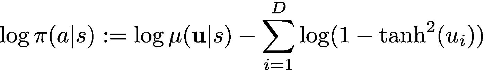

# 软演员评论家深度评论

> 原文：<https://towardsdatascience.com/in-depth-review-of-soft-actor-critic-91448aba63d4?source=collection_archive---------5----------------------->

## 了解最先进的强化学习算法

# 介绍

在本帖中，我们回顾了 Soft Actor-Critic (Haarnoja 等人，2018 & 2019)，这是一种非常成功的强化学习算法，在连续控制任务(如机器人移动和操纵)中实现了最先进的性能。软演员评论家使用最大熵学习的概念，这带来了一些简洁的概念和实际的优势，我们将在本文中讨论。

以下是这篇文章的结构:

首先，我们将简要回顾一般策略迭代(我将假设读者熟悉马尔可夫决策过程)，这是理解任何强化学习算法的基本概念。然后，我们将讨论软演员-评论家背后的直觉，以及它带来的概念上的好处。接下来，我们将讨论软政策迭代，软行动者-批评家(SAC)近似的理论框架，然后继续讨论 SAC。我还将在整篇文章中提供解释算法的代码片段。

# SAC 是如何实现顶级性能的？

本质上，SAC 寻求的是在政策中最大化“熵”,以及从环境中获得的预期回报。政策中的熵可以解释为政策中的*随机性*。

Left: high(orange) and high (blue) entropy in categorical probability distributions | Right: high (orange) and low (blue) entropy in Gaussian distributions. Inspired by([https://medium.com/@awjuliani/maximum-entropy-policies-in-reinforcement-learning-everyday-life-f5a1cc18d32d](https://medium.com/@awjuliani/maximum-entropy-policies-in-reinforcement-learning-everyday-life-f5a1cc18d32d))

从上图中，我们看到低熵的概率分布倾向于“贪婪地”采样某些值，因为概率质量分布相对不均匀。也就是说，奖励高熵的政策带来了几个概念上的优势:首先，它明确地鼓励探索状态空间，改善了收集的转换数据；第二，它允许策略捕获多种模式的好策略，防止过早收敛到坏的局部最优。

这种动机和提法在软演员-评论家论文中得到了实证验证；在许多 MuJoCo 控制任务中，软演员-评论家优于其他最先进的算法:

Performance of SAC (2018) and SAC (2019) against other algorithms on MuJoCo tasks. Taken from Haarnoja et al. (2019) paper

# 背景:一般策略迭代

在经典的 MDP 理论中，寻找最大化每个州的预期累积折扣奖励的最优政策的标准方法是*政策迭代*。策略迭代是在策略评估和策略改进之间交替的两步迭代方案。

在策略评估步骤中，我们希望找到当前策略的准确值函数。为此，我们反复应用如下定义的贝尔曼算子:

Bellman operator

策略改进步骤通过重复应用贝尔曼最优算子来执行:

Bellman optimality operator

其在给定初始值函数`V`的情况下，保证收敛到真实(最佳)值函数`V*`。特别地，Bellman 算子和最优性算子的收敛性质是由于它们都是压缩映射。再者，理论上，最优策略`pi*`可以从最优值函数中构造出来；给定一个初始策略`pi`，我们最小化当前策略和派生的更新策略之间的一些度量。

因此，通过交替策略评估和策略改进，我们可以在表格情况下(即，有限状态-动作空间和无函数近似)找到马尔可夫决策过程的精确解。

# 软策略迭代

在论文中，Haarnoja 引入了软策略迭代，它是一般策略迭代的一种扩展，将策略的熵作为一个附加的奖励项。特别是，代理人寻求最大化环境的预期回报和政策的熵。

为此，原始的贝尔曼算子增加了一个熵正则项:

Soft Bellman operator

如同在非正则化的情况下，熵正则化的 Bellman 算子对任何初始 Q 函数的重复应用保证收敛到最优的“软”Q 函数。

对于策略改进步骤，我们将策略分布更新为当前 Q 函数的 softmax 分布(要了解为什么会这样，请查看[哈尔诺贾等人的论文，(2017)](https://arxiv.org/pdf/1702.08165.pdf) )。特别是，我们希望最小化两个分布之间的距离(“散度”)。这是通过最小化两种分布之间的 Kullback-Leibler (KL)散度来实现的:

如 Haarnoja 等人(2018)所证明的，这种更新方案保证了在表格情况下(即当状态和动作空间是有限的并且没有使用函数近似时)策略的单调改进。*后来，艾斯特等人(2019)将这些性质推广到正则化子的任何公式。*

# 软演员-评论家(警告:密集！)

对于具有高维和/或连续状态-动作空间的复杂学习域，找到 MDP 的精确解几乎是不可能的。因此，我们必须利用函数逼近(即神经网络)来找到软策略迭代的实际逼近。

为此，Haarnoja 等人将软 Q 函数建模为表达性神经网络，将策略建模为动作空间上的高斯分布，将当前状态作为输入，将平均值和协方差作为神经网络输出。下面是这些代码在实现过程中的样子:

Models

此外，软行动者-批评家是一种非策略学习算法，这意味着我们可以用从不同于当前策略的策略中收集的经验数据来更新 Q 网络和策略参数；对于每个演员的推出，我们将所有的过渡数据保存在重放缓冲区中(在下面的等式中表示为 *D* )。

通过使用预测动作值和目标动作值`q_t`之间的均方损失的梯度，可以在每个更新步骤优化 Q 函数参数:

这里，`alpha`项代表“熵温度”，即我们对政策的“随机性”与环境回报的权重。

在代码中，我们可以这样实现:

Soft Q-network update in code

现在进入策略改进步骤:在实践中，软行动者-批评家使用软策略迭代的一些修改。利用 Q 参数可微的事实，Haarnoja 等人对策略输出使用“重新参数化技巧”来获得低方差估计量；特别地，我们将动作表示为应用于 z 值的双曲正切(tanh ),该 z 值是从策略神经网络输出的平均值和协方差中采样的。

neural network transformation on Gaussian policy to obtain action

此外，为了解决我们的无界高斯分布的动作界限，我们必须将`log(pi)`计算修改为:

log(pi) computation

这里，`log(mu)`表示根据来自策略神经网络的均值和协方差计算的累积分布函数(CDF)。也许这在代码中更清楚:

log(pi) computation

然后，可以通过最小化来自软策略迭代的简化形式的 KL 发散来直接优化策略参数；我们取目标函数的随机梯度:

Policy objective for which we will compute the gradients

这种简化形式来自于忽略 Q 的 softmax 分布的分母，因为它对目标函数的梯度没有贡献。

在代码中，我们可以这样实现:

Policy update in code

## 可选:自动调节我们的熵温度`alpha`

在 SAC (2018)的第一个版本中使用了固定的熵温度`alpha`。尽管原始 SAC 的性能令人印象深刻，但`alpha`却是一个非常敏感的超参数。为了补救这一点，SAC (2019)的第二个版本将`alpha`转换为可更新的参数。特别地，我们通过取下面的目标函数的梯度来更新:

Objective function for dynamically adjustable entropy temperature

其中 H_bar 表示所需的最小熵，通常设置为零向量。建议将 SAC (2019)与此可调`alpha`一起使用，因为它提高了算法的性能和稳定性。

在代码中:

alpha initialization and update

这就结束了软演员-评论家算法的审查！

# 全面实施

为了使我的帖子尽可能简洁，我只包含了相关的、特定的实现片段；要查看完整的实现，请查看我的 GitHub 库:

 [## cy oon 1729/策略-梯度-方法

### 策略梯度系列中算法的实现。目前包括:A2C，A3C，DDPG，TD3，SAC …

github.com](https://github.com/cyoon1729/Policy-Gradient-Methods) 

# 参考资料:

1.  软行动者-批评家:带有随机行动者的非策略最大熵深度强化学习。哈尔诺贾等人(2018)
2.  [软演员-评论家算法和应用。哈尔诺贾等人(2019 年)](https://arxiv.org/abs/1812.05905)
3.  [正则化马尔可夫决策过程理论。艾斯特等人(2019)](https://arxiv.org/abs/1901.11275)