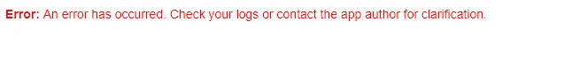
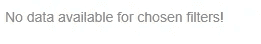

# 在 R Shiny 中，什么时候一个错误才是真正的错误？

> 原文：<https://towardsdatascience.com/in-r-shiny-when-is-an-error-really-an-error-702205ebb5d5?source=collection_archive---------18----------------------->

## 如何测试你的服务器端输出并阻止不必要的红色死亡错误信息出现在你的用户界面上

对于 R 用户和整个世界来说，R Shiny 是一个真正的超级礼物。本质上，它允许你以一种用户友好的方式向他人公开你的代码，这意味着非 R-coder 可以利用你开发的功能。

但是当 R 的红色死亡错误消息从服务器端流过并出现在不必要的用户界面时，它看起来会有点不专业和“不整洁”。例如，这对最终用户来说非常糟糕:



有两种方法可以轻松改善最终用户体验，并避免用户向您反映并非真正错误的错误，而只是用户输入选择的结果。

假设您创建了一个应用程序，该应用程序根据某些用户输入过滤一个数据集，然后对过滤后的数据进行一些统计。

假设在服务器端创建了一个用于计算统计数据的反应式过滤数据帧，我们称之为`filtered_df()`。一种常见的可能性是用户选择了太多的过滤器，以至于在`filtered_df()`中没有留下任何数据，事实上它是一个没有任何行的数据帧。

## **选项 1 —编写特定的错误信息**

如何处理这个问题的一个选择是使用`stop()`函数为这个事件写一个特定的错误消息。例如，您可以这样做:

```
checked_filtered_df <- shiny::reactive({

  if (nrow(filtered_df()) == 0) {
    stop("No data available for chosen filters!")
  } else {  
    filtered_df()
  }})
```

在用户过滤掉所有数据的情况下，这将返回一个红色的错误消息，就像上面的一样，除了它将包含特定的语言“错误:没有可用于所选过滤器的数据！”。这稍微好了一点，但在我看来，对最终用户来说还是很糟糕。另外，这真的是一个错误吗？我不这么认为——你的代码实际上没有任何问题。我不是这样使用`stop()`的粉丝。

## 选项 2——使用 Shiny 强大的验证功能

闪亮的`validate()`功能非常适合这种情况。它可以对您的服务器输出执行测试，您可以告诉它在测试失败时显示什么。它用不那么可怕的灰色文本显示，重要的是，它不称之为错误。

在`validate()`中，您可以使用`need()`功能设置测试标准，并编写一条消息，在测试失败时显示。重写上面的代码以使用`validate()`而不是`stop()`看起来像这样:

```
checked_filtered_df <- shiny::reactive({ shiny::validate(
    shiny::need(nrow(filtered_df()) != 0, 
         "No data available for chosen filters!")
  ) filtered_df()})
```

现在，当用户向下筛选到一个空数据集时，UI 中将出现以下内容:



这就不那么令人担忧了，而且对于最终用户来说，他们已经将数据集过滤得一无所有，这一点也更清楚了。

如果你以前没有在 Shiny 中做过类似的事情，那么这是值得进一步研究的。随着每个新版本的发布，Shiny 包含了越来越多的方法来平滑用户界面和控制预期的问题。这里有更多关于`validate()` [的技术细节](https://shiny.rstudio.com/articles/validation.html)。

最初我是一名纯粹的数学家，后来我成为了一名心理计量学家和数据科学家。我热衷于将所有这些学科的严谨性应用到复杂的人的问题上。我也是一个编码极客和日本 RPG 的超级粉丝。在 [*LinkedIn*](https://www.linkedin.com/in/keith-mcnulty/) *或*[*Twitter*](https://twitter.com/dr_keithmcnulty)*上找我。*

