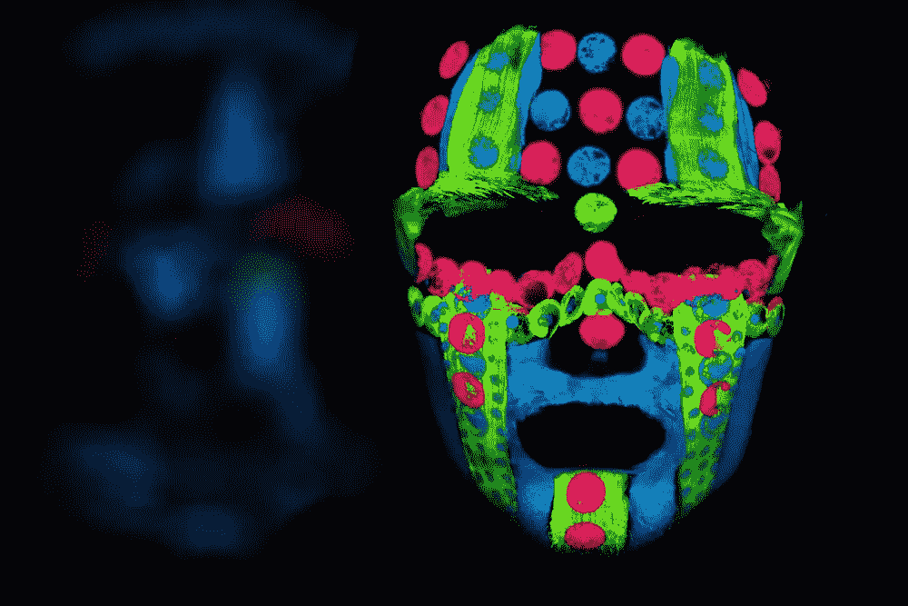

# 在未来，你可能会被一个算法解雇

> 原文：<https://towardsdatascience.com/in-the-future-you-may-be-fired-by-an-algorithm-35aefd00481f?source=collection_archive---------18----------------------->

Photo by [Adam Fossier](https://unsplash.com/photos/r7e2Ughh_GQ?utm_source=unsplash&utm_medium=referral&utm_content=creditCopyText) on [Unsplash](https://unsplash.com/?utm_source=unsplash&utm_medium=referral&utm_content=creditCopyText)

算法决定我们在 Tinder 上遇到的人，识别你的脸来打开无钥匙的门，或者在你的生产力下降时解雇你。机器被用来做出关于健康、就业、教育、重要的金融和刑事判决的决定。算法被用来决定，谁获得工作面试，谁获得捐赠器官，或者自动驾驶汽车在危险情况下如何反应。

**算法反映并强化了人类的偏见**
人们普遍错误地认为算法是客观的，因为它们依赖于数据，而数据不会说谎。人类认为数学模型是可信的，因为它们代表了事实。我们经常忘记算法是由人类创造的，人类选择了数据并训练了算法。源自人类的偏见不可避免地蔓延到人工智能模型中，因此，算法强化了人类的偏见。例如，谷歌图片搜索“首席执行官”产生了 11%的女性，尽管 27%的美国首席执行官是女性。

**了解基于人类的偏见**
虽然人工智能(AI)偏见应该始终得到重视，但指控本身不应该是故事的结尾。只要人们在开发人工智能技术，对人工智能偏见的调查就会存在。这意味着迭代开发、测试和学习，人工智能的进步可能会超出我们之前认为的可能——甚至可能会去人类以前没有去过的地方。然而，有偏见的人工智能是不能掉以轻心的，因为它可能对个人产生严重的改变生活的后果。了解偏差何时以及以何种形式影响数据和算法变得至关重要。最明显和最常见的问题之一是样本偏差，即数据收集的方式使得目标人群中的一些成员比其他人更不可能被包括在内。考虑一个法官用来做量刑决定的模型。显然，将种族因素考虑在内是不合适的，因为历史原因，非裔美国人受到的判决不成比例，这导致了统计数据中的种族偏见。但是健康保险呢？在这种情况下，判断男性不同于女性是完全正常的，但对于人工智能算法来说，这种禁止可能不是那么明显。我们，人类，对道德有一个复杂的观点，有时考虑性别等属性是好的，有时是违反法律的。

人工智能伦理的问题
数据集并不完美，它们天生就是肮脏的，现在，我们开始清理人类偏见。无论如何，关键的问题不是偏见的存在，深层的问题是缺乏对道德的共同理解，因为它实际上没有定义没有偏见应该是什么样子。这不仅仅是在计算机科学领域，而是对人类的挑战。在自动驾驶汽车背景下，关于人工智能伦理的最大在线实验之一是“电车困境”，它收集了 233 个国家的 4000 万个道德决定。不出所料，研究人员发现各国的偏好差异很大:人类对道德有不同的定义。电车问题只是理解数据科学中道德的深度和复杂性的一种简单方法，不用说，它超越了自动驾驶汽车，这导致了一个问题，即机器如何通过承认个体和跨文化的道德差异来做出“公平”的决定？我们能指望一个被人类训练出来的算法比社会更好吗？

寓意[困境](http://moralmachine.mit.edu/)无人驾驶汽车必须做出决定的地方

**令人毛骨悚然的事情人工智能开始自己做**
承认，我们距离科幻小说的场景还有几十年，在科幻小说中，人工智能变得有自我意识并接管世界。截至今天，算法不再是静态的，它们会随着时间的推移自动修改自己的行为，这种修改会引入所谓的人工智能诱导的偏差。一种远远超越人类最初定义的进化。在某些时候，我们可能需要(或不需要)通过信任机器来接受结果？！

**前进之路:为公平而设计**
展望未来，我们对人工智能的依赖将会加深，不可避免地导致许多伦理问题的出现，因为人类将决策交给机器，将健康、正义和商业交给具有深远影响的算法——影响每个人。对于人工智能的未来，我们需要回答棘手的伦理问题，这需要多学科的方法，领导层的意识，而不仅仅是由技术专家来处理。数据科学知识需要发展成为未来劳动力的标准技能。与火灾类似，机器学习既强大又危险，重要的是我们要弄清楚如何促进利益和最小化伤害。由于它不仅限于与人有关的偏见，它还涉及到提供决策的透明度，澄清问责制以及维护人工智能的核心道德价值观，如平等，多样性和无歧视。在未来几年，植入道德意识和法规的能力将成为一个关键挑战，只有通过政府、学术界和企业的密切合作才能解决。不管挑战有多复杂，这是一个激动人心的时代，它将继续存在并深化人工智能革命，这有可能改善全球数十亿人的生活。

**撰稿**
[Cyrano Chen](https://www.linkedin.com/in/cyrano-chen-5b10888a/) —高级数据科学家
[Joanne Chen](https://www.linkedin.com/in/joanne-chen-28468263/)—沟通负责人
[Michael Renz](https://www.linkedin.com/in/michael-renz/) —创新总监