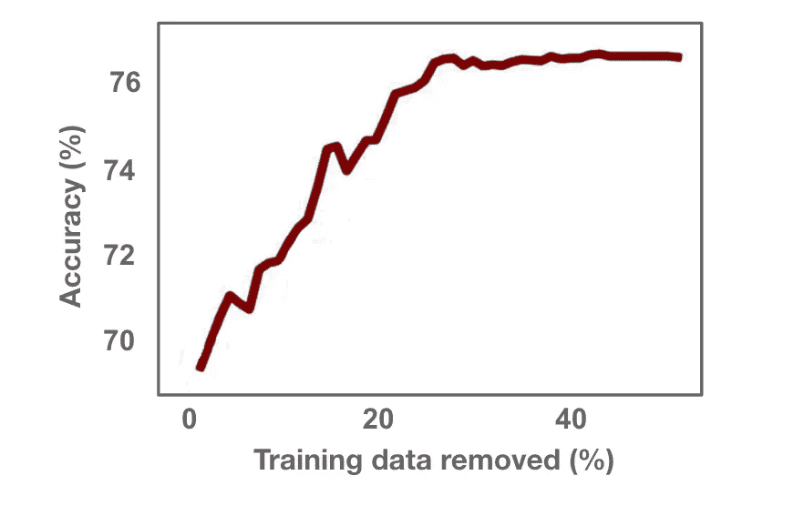
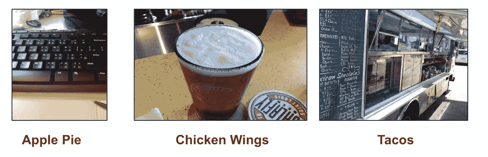
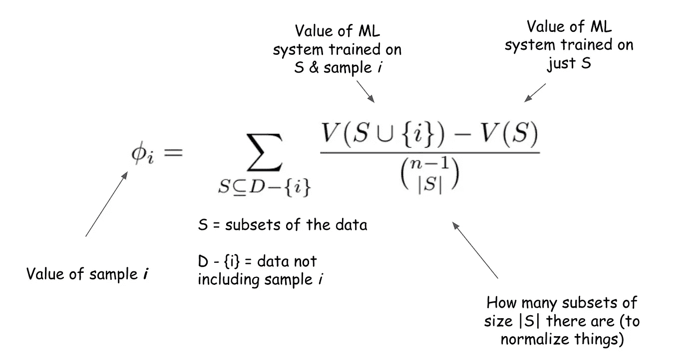
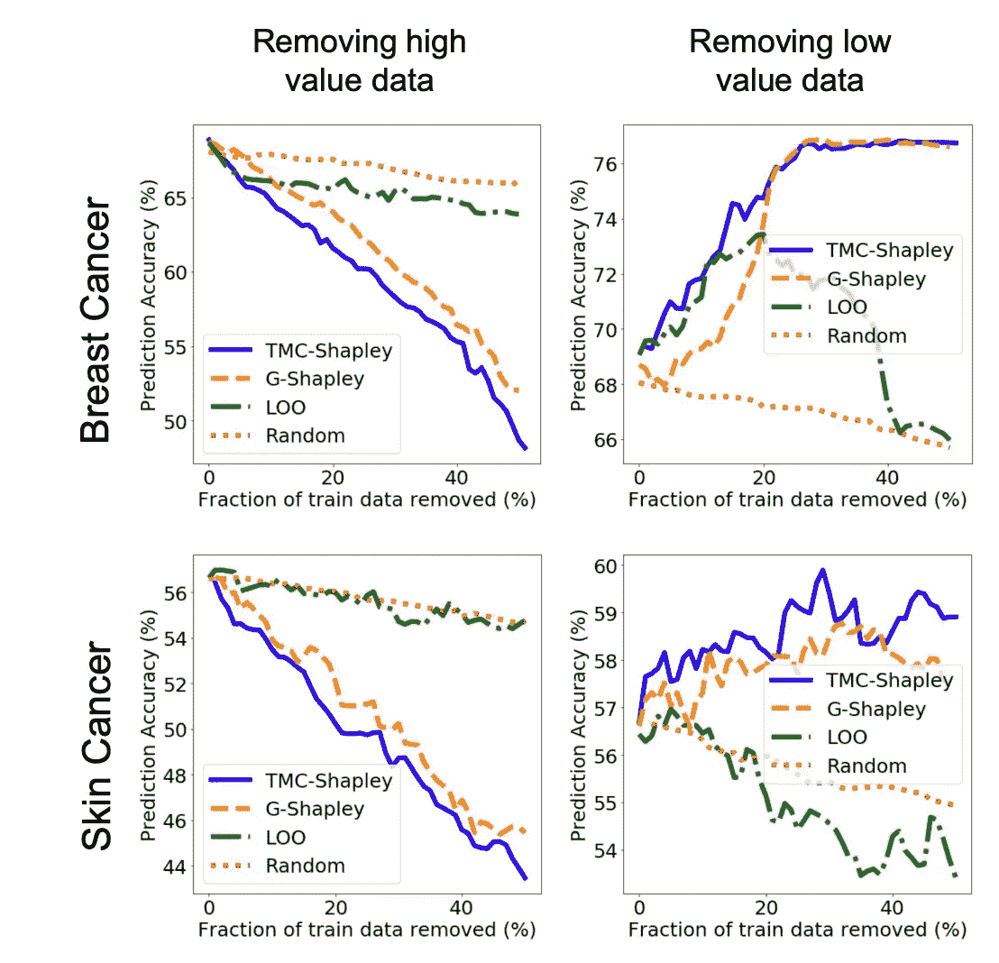

# 通过…删除数据来提高模型性能？

> 原文：<https://towardsdatascience.com/increase-model-performance-by-removing-data-a87d05183d7c?source=collection_archive---------14----------------------->

## 数据越少对机器学习越好吗？

The effect of removing low value data on predictor performance in a breast cancer dataset. Image adapted from Data Shapley: Equitable Valuation of Data for Machine Learning [arXiv:1904.02868v2](https://arxiv.org/abs/1904.02868v2) [Ghorbani and Zhou].

# 并非所有数据都是平等的

在任何给定的数据集中，不是每个样本都对训练机器学习模型有同等的贡献。当你大声说出来的时候，这是显而易见的。一些数据可以教会一个模型很多东西。但有些会是**不相干的**，或者**多余的**，根本不会真的动针。有些甚至可能**损害**你的表现——比如**贴错标签的**数据——这将教会模型与它试图学习的相反的东西。下面是 [Food-101 数据集](https://www.vision.ee.ethz.ch/datasets_extra/food-101/) [1]中错误标注数据的一个例子，这是一个流行的公共数据集，包含 101 个食物类别的 101，000 张图片。

The images shown here are from the [Food-101 dataset](https://www.vision.ee.ethz.ch/datasets_extra/food-101/). Images in the dataset are supposed to be of the food item itself, but the first image is of a keyboard, the second is of a beer, and the third is of a food truck.

但机器学习的常见工作流程仍然是获取尽可能多的数据，对所有数据进行标记，并将所有内容输入到您的模型中。或多或少是盲目的行动。每个人都关心数据的质量，但是没有(简单的)方法以编程方式评估数据的相关性或冗余性，尤其是以模型驱动的方式。*还是有？*

如果有，为什么认为删除数据实际上会提高性能会令人惊讶呢？

因为确实如此。您只需**移除最低值数据**。要做到这一点，你需要一种评估数据价值的方法。

# 数据评估

有一些关于数据评估的有趣研究。其思想是查看数据集，并根据数据点相对于特定模型或预测任务的值对其进行排序。

## 数据沙普利

由 Ghorbani 和周撰写的《机器学习数据的公平评估》于今年早些时候出版。作者从博弈论【3】(这让劳埃德·沙普利获得了 2012 年诺贝尔经济学奖)中提取了[沙普利值，并将其应用于机器学习中的数据。他们建议，公平的估价方法应满足以下条件:](https://en.wikipedia.org/wiki/Shapley_value)

1.  当添加到*训练数据的任何*子集时，它应该给一个不改变您的 ML 系统的性能的数据点一个值**零**。
2.  当添加到训练数据的任何子集的*时，它应该通过对称给具有完全相等贡献的数据点赋予**相同的值**。*
3.  如果一个机器学习系统的价值可以分解为子系统的总和，那么数据的价值应该是那些子系统中的**加法**。

唯一能满足这个的物业？沙普利值。

若要计算给定数据点的 Shapley 值，您需要用包含该数据点的每个数据子集来训练模型，然后再用不包含该数据点的子集来训练模型。取性能差异，Shapley 值就是所有子集的加权平均值。

但是相对于训练数据源的数量，计算这个值需要指数级的大量计算。这就是为什么本文提出了以下估计，这些估计都是为了节省时间和计算:

1.  蒙特卡罗估计；

我们可以只通过**查看*数据***的一些子集来估计样本 i 的*值。这些子集是随机抽样的，可以证明是其余数据的近似值。*

2.截断:

**如果 ML 模型的边缘值没有增加，则提前结束多次迭代的训练**(对大型数据集有帮助)。有了以上，这就是 TMC-Shapley。

3.梯度沙普利:

将 ML 系统的价值视为通过**一个时期的训练**而不是通过模型的完整训练获得的性能。这是 G-沙普利。

4.沙普利集团:

**组级评估**是对一批数据一起进行评估，而不是对样本级别的数据进行评估。您可能希望按值对数据源进行排序，在这种情况下，您不需要关心样本级别的粒度。

这些有用吗？

以下是论文的结果，显示了移除训练数据对预测准确性的影响。

数据以四种方式评估，最高值的数据在左边被删除，最低值的数据在右边。

LOO 是 Leave-One-Out:一种更简单的估值方法，它训练整个数据集，然后训练除单个数据点之外的所有数据，并根据排除它的影响对该点进行估值。除了计算量太大之外，这种方法也不能真正处理不同数据点之间的关系。

随机将数据随机作为基线值。

正如您所看到的，删除高值和低值数据的效果远远大于随机数据。 ***以乳腺癌为例，删除了 40%以上的数据，预测准确率提高了 16%以上！***

## 但是过度拟合怎么办？

如果我正在删除数据并变得更好，这是否意味着我正在删除我表现更差的数据，这难道不好吗？

不，这个想法是你只从你的训练集中删除数据。性能是在一个保留测试集上测量的，这个测试集(希望)代表了您的数据分布。这是 ML 的标准做法。

***估值不会惩罚离群者，它会奖励他们。*** 如果你对你的测试数据集的质量和覆盖范围有信心，这种类型的评估会对出现在训练集和测试集中的任何稀有样本排名更高。通过删除冗余、不相关或错误标记的数据，不会有过度拟合的风险。

# 我该怎么试？

将数据工作流转变为更加模型驱动意味着通过按值对数据源、注释器和增强函数进行排序，来获取、标记和生成您所需要的数据。

我们围绕着数据评估的这一确切想法开始了[**Gradio**](http://gradio.app)——因为我们认为它将触及数据管道的每一个部分。我们正在开发一系列适用于不同环境的估值方法。如果您正在部署任何容量的机器学习，我们很乐意[与您](https://gradio.app/#lets-chat)交谈。

[1] L. Bossard，M. Guillaumin 和 L. Van Gool，Food-101-用随机森林挖掘歧视性成分(2014)，欧洲计算机视觉会议

[2] A. Ghorbani 和 J. Zhou，Data Shapley:机器学习数据的公平估值(2019)

[3] L. S. Shapley，N 人游戏的价值(1953)，对理论游戏的贡献 2，307–317