# 增加 Kaggle 收入:分析用户数据以推荐最佳新产品

> 原文：<https://towardsdatascience.com/increasing-kaggle-revenue-analyzing-user-data-to-recommend-the-best-new-product-f93fddbb4e0f?source=collection_archive---------13----------------------->

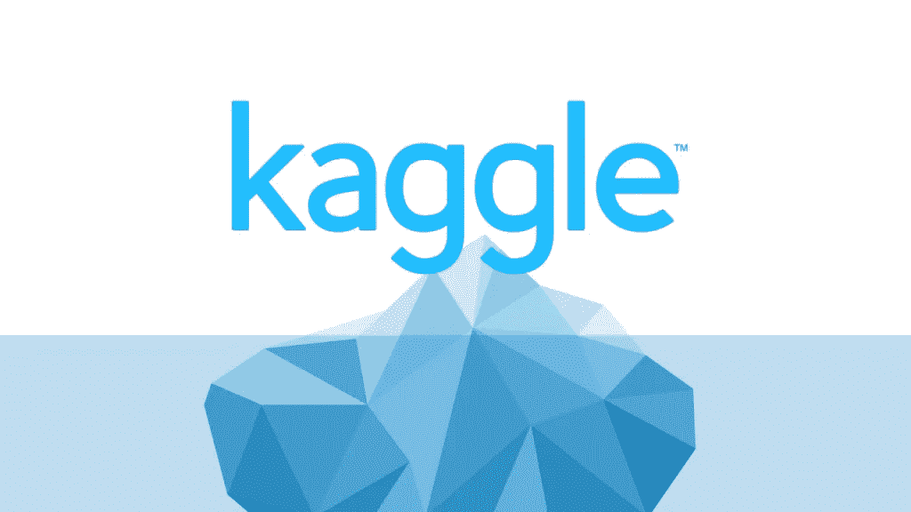

在这个项目中，我们将为 Kaggle(一个面向数据科学专业人士的在线社区)提供增加收入的建议。我们将分析 Kaggle 客户调查，试图了解是否有任何公司潜在收入增长的指标。为了提出我们的建议，我们将努力了解:

*   “免费增值”内核产品有市场潜力吗？
*   咨询市场有市场潜力吗？
*   基于目前的用户数据，哪个更有可能盈利？

## **观察总结**

*   超过 60%的 Kaggle 用户年收入低于 5 万美元，并且不太可能将可自由支配的收入用于更高级别的订阅。此外，超过 58%的用户在员工少于 1，000 人的公司工作。愿意投资昂贵的企业解决方案的公司似乎只是 Kaggle 当前用户群中的一小部分。
*   尽管订阅服务可以通过创造增加用户群的“战略价值”来推动长期收入，但 Kaggle 似乎不太可能通过提供免费增值产品来获得大量新用户。
*   Kaggle 目前产品的用户受教育程度高，大多在美国以外，并且倾向于较低的薪酬水平。所有这些因素都可能使 Kaggle 用户成为数据科学项目高质量远程合同工作的非常有前途的候选人。

## **建议概要**

Kaggle 的用户调查结果显示， **Kaggle 更有可能从货币化的顾问市场中获得可观的未来收入，而不是免费的核心产品。**开发一款免费的核心产品很难收回大笔投资，而且 Kaggle 目前的用户群不太可能从 GitHub 和其他现有产品中夺走大量市场份额。相比之下，鉴于他们有能力和地理上多样化的用户群，一个强大的数据科学承包商市场应该会带来更显著的收入增长。

有关本报告方法的更多详细信息和全面描述，请参见下文。

# **方法论**

这个项目的数据来自公开发布的 [Kaggle 竞赛](https://www.kaggle.com/c/kaggle-survey-2019)。该调查于 2019 年 10 月 8 日至 28 日展开，反馈主要来自 Kaggle 相关渠道(电子邮件列表、社交媒体和论坛)。该调查收到了 19，717 个可用的回复，并过滤掉了所有自动标记为“垃圾邮件”的回复

所有的清理和可视化都将通过 pandas 和 NumPy 库使用 Python 编码来完成。

# **感兴趣区域**

Kaggle 未来潜在收入来源的概要可以在 Kaggle 的创始人 Anthony Goldbloom 在 Quora.com 上发表的一篇文章中找到。在这篇文章中，Anthony Goldbloom 展示了 Kaggle 目前的几个收入来源:

*   特色比赛
*   招聘竞赛
*   研究竞赛

此外，Goldbloom 列出了 Kaggle 计划增加的几项服务，以增加收入:

*   让 [Kaggle kernels](http://www.kaggle.com/kernels) 成为一项免费增值服务，公司将作为一个团队协作空间进行订阅。
*   “咨询帮助的数据科学市场”

截至撰写本报告时(2019 年 11 月 25 日)，这两个选项都没有在 Kaggle 网站上明显列出，因此都是潜在的收入来源。

# **假设**

“团队协作”领域目前由 GitHub 主导，GitHub 也使用免费增值服务通过企业订阅赚钱。GitHub 最近被微软以 75 亿美元收购，收购价格很大程度上是由 GitHub 的合作网络中提供的机会推动的。根据《哈佛商业评论》的报道:

> …微软支付 75 亿美元购买 GitHub 并不是为了它的赚钱能力(它的财务价值)。它为每天使用 GitHub 代码库产品的大量开发人员的访问付费(该公司的战略价值)——因此他们可以被引导到微软开发人员环境中，在那里真正赚钱。

考虑到这一点，Kaggle 的潜在收入不仅仅是基于潜在的订阅费用，而是基于 Kaggle 在该领域可以从 GitHub 获得的市场份额(如果有的话)。因此，一个合理的假设是**考虑到 Kaggle 当前的客户群，Kernels 免费增值服务将比数据科学咨询市场提供更大的未来收入潜力。**

# **所需数据**

为了检验这一假设，我们需要探索:

*   当前客户的人口统计和专业知识信息
*   关于客户数据科学团队规模的信息(最有可能利用基于内核的系统)
*   关于大型预算公司(最有可能购买企业系统)雇用的用户百分比的信息
*   关于具有丰富教育和数据科学经验的用户百分比的信息(最有可能在咨询市场产生高额收入)

此外，我们将探索数据集中提供的其他人口统计数据，看看是否有任何其他潜在的假设出现。

# **假设**

重要的是要注意这个分析中的几个关键假设。

1.  调查数据代表了 Kaggle 的整体客户群。根据现有数据，不可能知道这项调查是否能代表 Kaggle 客户的总体情况。选择偏差可能以某种形式存在。然而，鉴于调查中的大量回复，它可能是本分析的可靠来源。
2.  一个新的免费增值内核产品的结构将与该领域的其他产品非常相似，有一个付费订阅层和一个更大的团队企业级层。这是这个领域的领导者 GitHub 和大多数其他免费增值服务所使用的策略。
3.  为了让 Kaggle 从免费的核心产品中获得可观的收入，他们需要一个有财力订阅的现有客户群。这需要一个庞大的群体，要么是有可自由支配收入的用户，要么是有预算和企业订阅需求的大公司员工。

# 数据清理

首先，我们导入并清理 Kaggle 提供的数据集。提供了四个数据集，我们将把它们作为单独的文件读入。“survey_schema”文件显示，并非所有问题都发给了所有参与者，这有助于理解较大数据集中的空值。

只有包含所有选择题答案的“mc_responses.csv”文件与此分析相关。

从这个数据集中，我们执行一些清理操作来为分析准备数据:

*   重新分配标题并删除第一行
*   删除重复项和“文本”响应列
*   将多项选择答案聚合到单个列中
*   重命名列标题
*   用“np”替换空值。南

经过初步探索、清理和整合，数据似乎完全由“str”对象组成，而不是数值。几个类别已经被分解成大的类别箱，这将有助于快速分析。在给定调查模式的情况下，预计后面类别中的空值数量。然而，这些类别中的大部分可能与本分析无关。

对于一些感兴趣的类别，仍然有大量的空值:` ' comp_size ' `、` ' ds_teamsize ' `、` ' use_ml ' `、` ' compensation '和`' dollars_mlorcloud ` '。然而，即使在减去空值之后，这些类别中的每一个都有超过 12，000 个数据点，这对于有意义的分析来说应该绰绰有余。

# 探索性数据分析

我们首先分析与我们的分析最相关的分类变量。首先，我们使用 matplotlib 库为每个变量创建一个频率表和条形图:

```
# Creating Age Frequency Table
age_freq = mc[‘age’].value_counts(normalize=True)
age_freq = age_freq.sort_index(axis=0)
age_freq = age_freq.reset_index()
age_freq = pd.DataFrame(age_freq)# Setting style for bar graphs
import matplotlib.pyplot as plt
%matplotlib inline# set font
plt.rcParams['font.family'] = 'sans-serif'
plt.rcParams['font.sans-serif'] = 'Helvetica'# set the style of the axes and the text color
plt.rcParams['axes.edgecolor']='#333F4B'
plt.rcParams['axes.linewidth']=0.8
plt.rcParams['xtick.color']='#333F4B'
plt.rcParams['ytick.color']='#333F4B'
plt.rcParams['text.color']='#333F4B'# numeric placeholder for the y axis
my_range=list(range(1,len(age_freq.index)+1))fig, ax = plt.subplots(figsize=(8,5))# create for each bin a vertical line that starts at y = 0 with the length 
# represented by the specific percentage.
plt.vlines(x=my_range, ymin=0, ymax=age_freq['age'], color='#007ACC', alpha=0.5, linewidth=30)# create for each bin a dot at the level of the expense percentage value
# plt.plot(my_range, age_freq['age'], "o", markersize=10, color='#007ACC', alpha=0.6)# set labels
ax.set_xlabel('Age', fontsize=15, fontweight='black', color = '#333F4B')
ax.set_ylabel('% of Respondents', fontsize=15, fontweight='black', color = '#333F4B')# set axis
ax.tick_params(axis='both', which='major', labelsize=12)
plt.xticks(my_range, age_freq['index'])# add an horizonal label for the y axis 
# fig.text(-0.15, 0.5, '% of Respondants', fontsize=15, fontweight='black', color = '#333F4B')# change the style of the axis spines
ax.spines['top'].set_color('none')
ax.spines['right'].set_color('none')
ax.spines['left'].set_smart_bounds(True)
ax.spines['bottom'].set_smart_bounds(True)# set the spines position
ax.spines['bottom'].set_position(('axes', -0.04))
ax.spines['left'].set_position(('axes', 0.015))# set background color
ax.set_facecolor('white')# add margin to y-axis
ax.margins(0.1, 0)# add title
fig.suptitle('Age of Survey Respondents', fontsize=18, fontweight='black')plt.savefig('age_freq.png', dpi=300, bbox_inches='tight')
```

# EDA 可视化

在为每个变量创建频率表和图表后，我们可以对 Kaggle 数据进行一些有趣的观察。

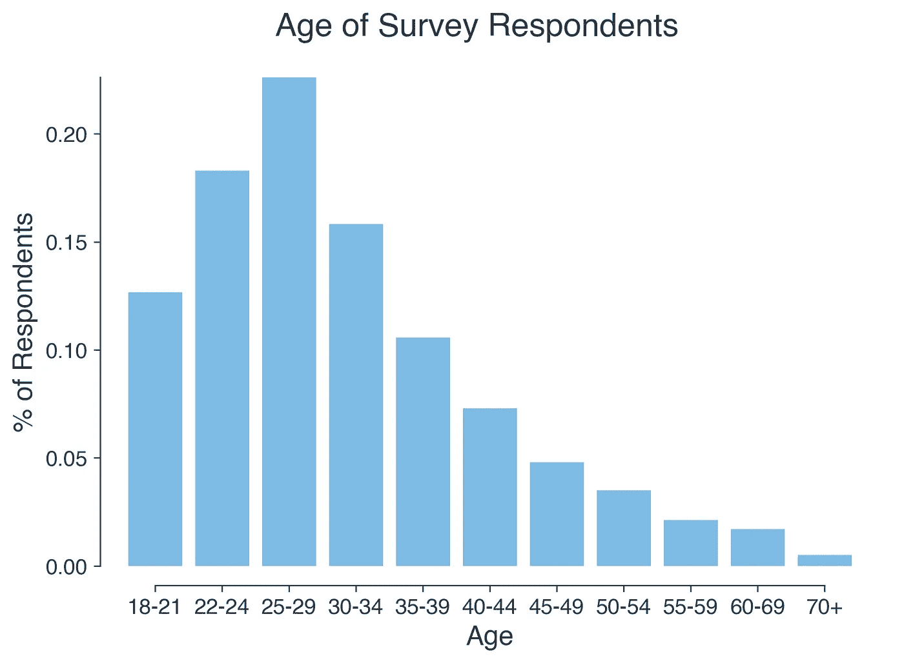

调查答复的分布似乎有些正常，在 22-34 岁之间的比例很高。

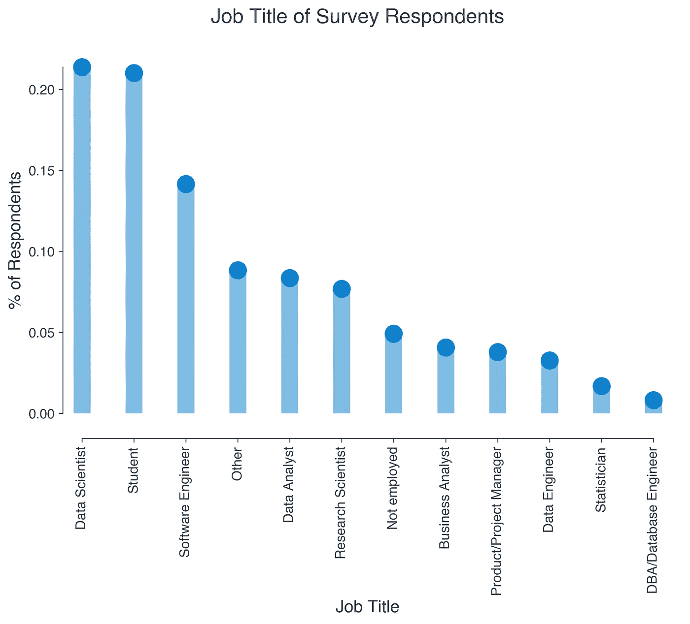

大部分调查样本要么是数据科学家，要么是学生。这可能解释了回答者年龄分布的年轻化。由于学生不太可能在任何以咨询为基础的市场中吸引高度的价值，这将是一个有趣的领域，可以在我们的分析中用作过滤器。

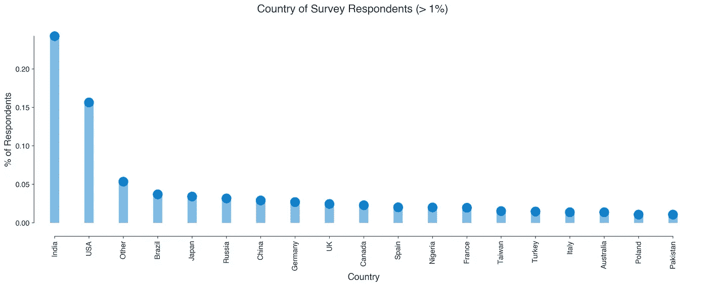

受访者最有可能生活在印度或美国，其他国家的人口占总人口的比例都不超过 5%。

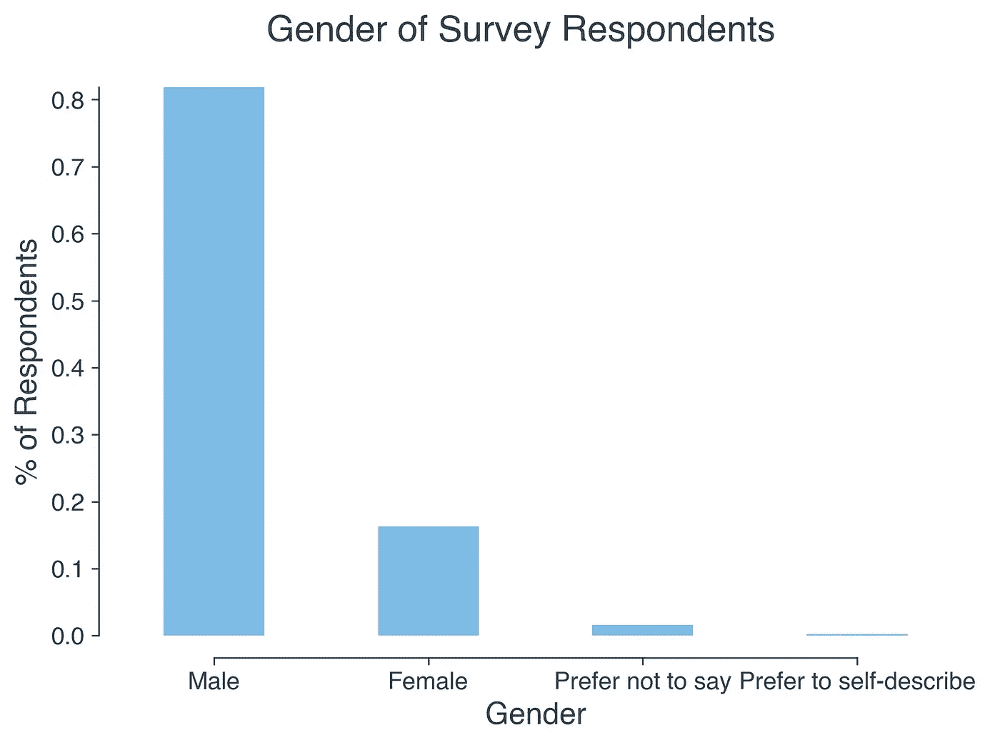

调查样本非常男性主导，女性受访者不到 20%。

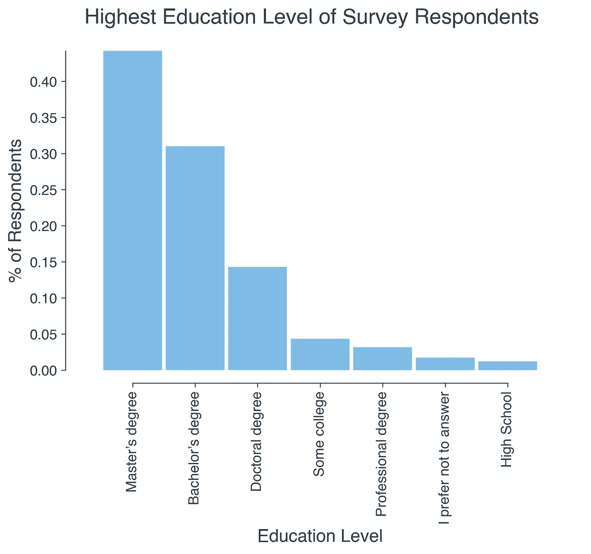

调查样本受教育程度较高，绝大多数人至少获得了学士学位。

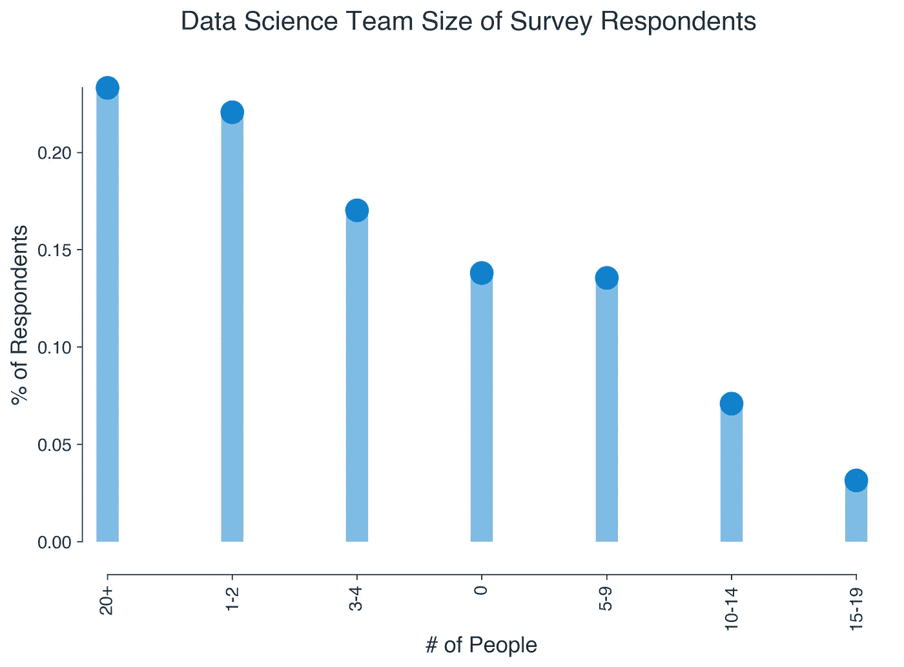

15%的调查受访者回答说，他们从事的数据科学工作少于 3 人。所有其他受访者都是更大的数据科学团队的一部分。最受欢迎的回应是给出的最大选项，20 人或更多成员的团队。这与我们关于基于免费增值企业的内核服务的问题非常相关。

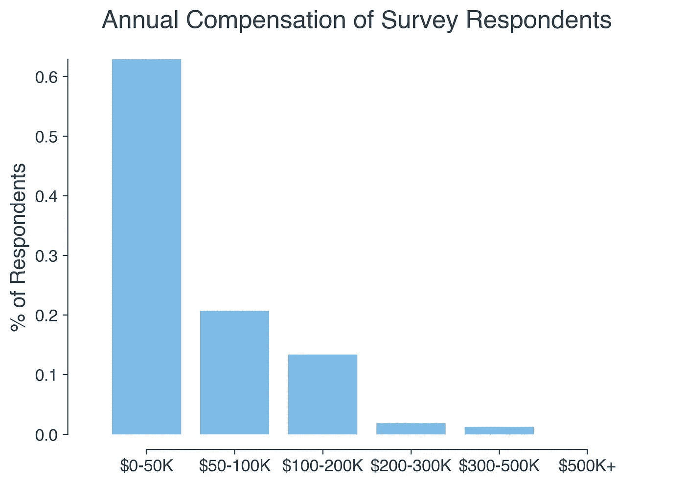

Kaggle 用户的年薪主要由年收入低于 5 万英镑的员工决定。这是我们的“免费增值”服务提案中的一个相关事实，因为许多人个人不太可能为付费服务提供可观的利润。

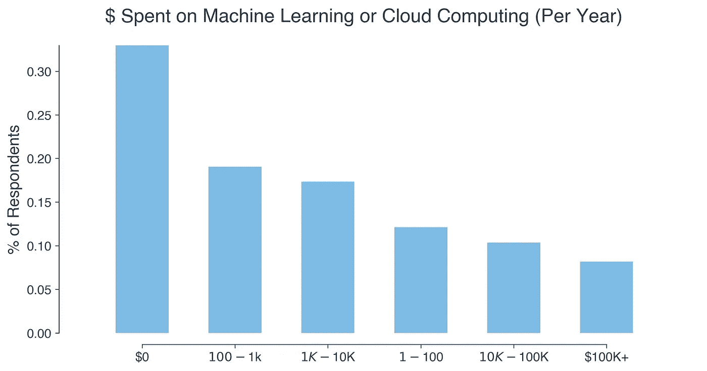

超过 60%的调查受访者在过去一年中没有在机器学习或云计算上投入任何资金的公司工作。因此，他们不太可能具备使用这些技术的专业知识。

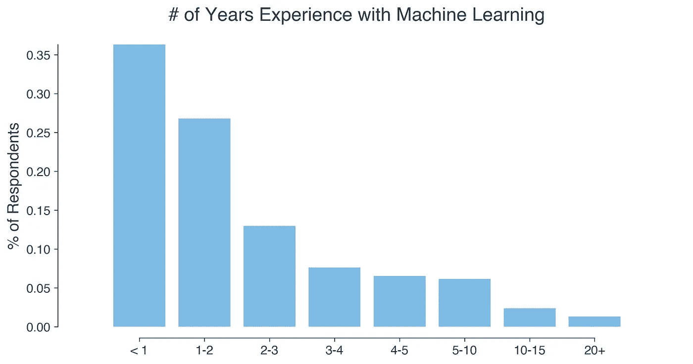

与上图类似，超过 60%的受访者拥有 2 年以上使用机器学习的经验。因此，他们在这一领域的专业知识有限。

# EDA 结果

在回顾了分类变量之后，有几个重要的见解脱颖而出:

*   超过 20%的受访者是学生，因此不太可能有助于推动免费增值核心产品或咨询市场的收入。应该删除他们的信息，以进一步评估 Kaggle 这些产品的目标市场。
*   近 25%的受访者目前居住在印度，绝大多数人居住在美国以外，这使得用户更有可能参与远程咨询市场产品。
*   超过 65%的受访者目前在由 3 人或更多人组成的数据科学团队中工作，超过 20%的受访者在由 1-2 人组成的团队中工作。因此，Kaggle 的绝大多数客户已经在合作开发数据科学相关产品。
*   超过 60%的受访者年收入不到 5 万英镑。因此，他们不太可能为付费数据科学协作服务获得大量可自由支配的收入。
*   超过 60%的受访者就职的公司没有在机器学习或云计算方面投入任何资金，并且个人使用机器学习产品的时间不到 2 年。

# 进一步清洁

为了继续我们的分析，我们将只关注那些目前在数据科学/分析领域工作的受访者。这些受访者最有可能使用任何 Kaggle 产品，并为增加收入做出贡献。为此，我们将从数据集中删除“学生”值。

```
# Get names of indexes for which title is student.
indexNames = mc[mc[‘title’] == ‘Student’ ].index

# Delete these row indexes from dataFrame
mcclean = mc.drop(indexNames)
print(len(mc)-len(mcclean))
4014
```

我们现在已经删除了 4000 多个与我们的分析无关的回复。有了这个新的数据集，我们可以专注于探索我们的假设，即内核免费增值服务将比咨询市场提供更多的潜在收入。

# 分析:免费增值服务的潜力

首先，我们将探讨调整后的薪酬百分比，从样本中剔除学生(更有可能失业或未充分就业)。


在这个较小的样本中，薪酬数字仍然在很大程度上向低端倾斜。超过 60%的非学生 Kaggle 用户年收入不到 5 万英镑。这意味着他们可能不太可能为付费订阅服务获得可自由支配的收入。

接下来，我们将使用这个缩减的样本量来查看有多少受访者是大型数据科学团队的一部分，这需要在数据科学项目上进行协作。


从调查数据中剔除学生后，超过 53%的受访者属于 3 人或以上的数据科学团队，超过 23%的受访者属于 20 人以上的团队。此外，22%的人属于 1-2 人团队，这意味着在这一领域有更多的合作机会。

考虑到这个数字，似乎对合作免费增值服务感兴趣的人的总数是值得注意的。

然而，从上面的探索性分析来看，似乎大多数受访者来自在机器学习和云计算等产品上花费很少甚至没有钱的公司。为了进一步探索，我们将分析调查对象所代表的公司的规模。

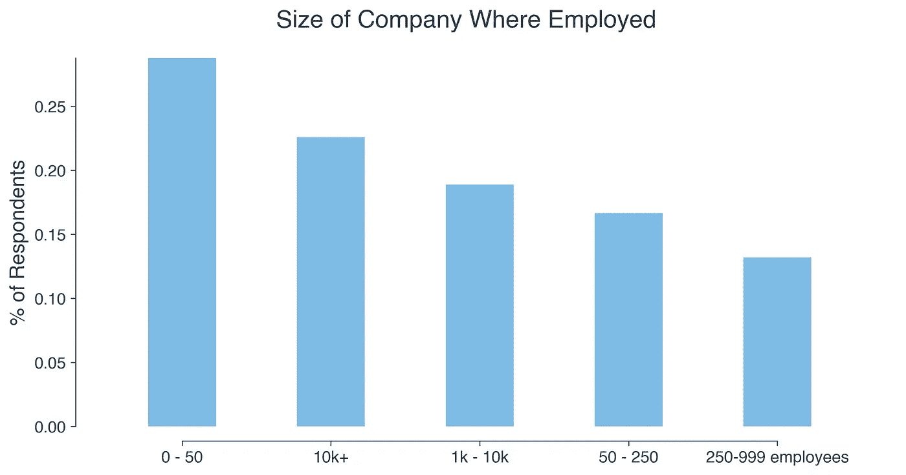

根据该信息，超过 58%的调查受访者在员工少于 1，000 人的公司工作。这些公司很可能无力为员工支付企业级免费增值订阅。如上所述，由于相对较低的年薪，样本中的大多数个人也不太可能购买订阅。

这意味着 Kaggle 将依赖“中端”价格的订阅，其用户的公司规模足以支持数据科学团队，但不足以证明企业解决方案的合理性。

# 分析结果

鉴于 Kaggle 用户相对较低的补偿率，个人客户不太可能大量注册付费模式。由于 Kaggle 的大部分用户来自员工不到 1000 人的公司，大规模的企业订阅不太可能成为重要的收入来源。

即使考虑到免费增值内核产品通过增加整体曝光和访问可能提供的潜在价值增长，增加免费增值产品也不太可能增加 Kaggle 的整体用户群。GitHub 似乎是这个细分市场的主导者，创建和营销一个独特的免费增值服务的成本可能会高得令人望而却步。

根据对当前 Kaggle 客户群的分析，内核订阅服务不太可能为公司带来可观的新收入。

# 咨询市场的潜力

在考虑提供咨询市场的潜在价值时，有几个因素需要考虑:

*   品牌意识吸引了那些需要外部人才的公司。
*   有才能的用户提供有意义的解决方案。

**吸引合同雇主:**提供的数据集包括一些与这两个因素相关的有趣信息。

尽管小公司规模是推动企业订阅的负面因素，但小公司更有可能需要外部帮助来满足数据科学需求。58%的 Kaggle 用户在 1000 人以下的公司工作，52%的用户在不到 5 人的数据科学团队工作。对于这样的公司来说，一个声誉良好的基于合同的市场会非常有帮助。

此外，Kaggle 目前的收入来源主要来自公司驱动的竞争，其中一部分专门专注于为公司问题寻找创造性的众包解决方案。吸引需要外部顾问型人才的公司的潜力唾手可得。

**吸引有才华的承包商:**此外，调查数据显示，Kaggle 已经与大量潜在的合同制员工建立了联系。如上所述，超过 60%的受访者年收入不到 5 万美元，这可能是一个有用的指标，表明用户希望从基于合同的数据科学工作中获利。Kaggle 竞赛的受欢迎程度，获奖者获得现金奖励，是一个明显的指标，表明 Kaggle 很容易与潜在的数据科学承包商建立联系。

此外，Kaggle 用户中有一个高素质的子集，他们可能会要求高额合同，从而增加公司的收入潜力。

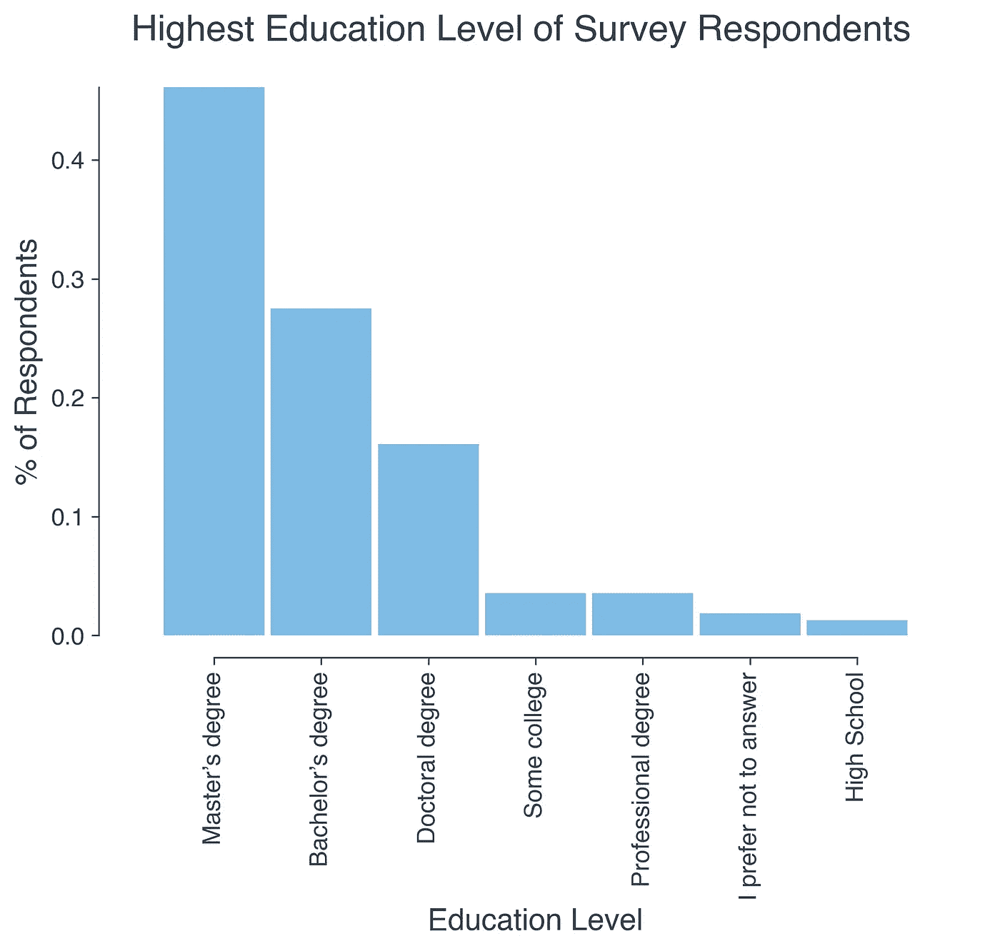

除去“学生”受访者，超过 62%的 Kaggle 用户至少拥有硕士学位，其中 16%拥有博士学位。

此外，近 25%的 Kaggle 受访者来自印度，超过 80%的受访者生活在美国以外，而且绝大多数用户可能对远程咨询机会感兴趣。

# 最终结论

在研究了 Kaggle 用户调查的结果后，我们最初的假设被证明是错误的。由于 GitHub 等免费协作环境的激增，以及个人或企业订阅的不太可能的客户群，免费增值服务似乎只能略微增加收入。相比之下，由于 Kaggle 与需要外部帮助的积极雇主有现成的联系，以及高技能潜在承包商的大量用户群，承包商市场可以为实施成本带来更多收入。

作为这一分析的结果，我们可以确定 Kaggle 更有可能从一个货币化的顾问市场中获得可观的未来收入，而不是一个免费的核心产品。

# GitHub / Jupyter 笔记本

关于这个项目代码的完整 Jupyter 笔记本，请访问我的 [GitHub 库](https://github.com/e-kirkland/datascience/tree/master/Kaggle%20Survey)。