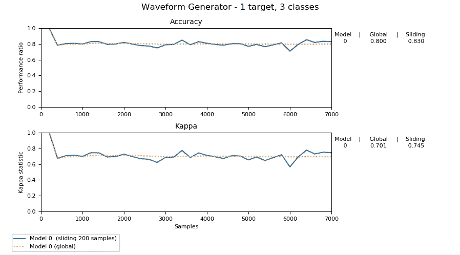
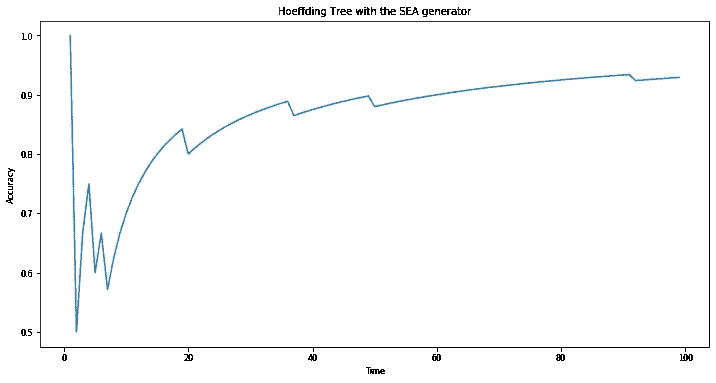

# 使用 Scikit-Multiflow 进行增量(在线)学习

> 原文：<https://towardsdatascience.com/incremental-online-learning-with-scikit-multiflow-6b846913a50b?source=collection_archive---------3----------------------->

## 使用 scikit-multiflow 在 Python 中进行增量学习的实用介绍



Source: [https://scikit-multiflow.github.io](https://scikit-multiflow.github.io)

# 介绍

数据就在我们身边。无论是个人资料图片、推文、传感器应用、信用卡交易、电子邮件还是新闻源，数据都在这里…并且以令人难以置信的速度生成。对于这些看似无限的数据流，一个关键的挑战是创建轻量级模型，这些模型总是能够预测和适应数据分布的变化。传统机器学习方法在这种情况下的局限性导致了在线学习(也称为增量学习)方法的发展。

在这篇文章中，我们将通过一个简单的在线分类器的实际实现，用 scikit-multiflow，一个用于数据流学习的 Python 框架，温和地介绍增量学习。

# 什么是增量学习？

> *在每次迭代中，模型预测一个类别标签，揭示真正的标签，然后更新*

增量学习指的是一系列可扩展的算法，这些算法学习从无限的数据流中顺序更新模型。在“传统”机器学习中，我们得到了一个由(输入，输出)对组成的完整数据集，而在增量学习中，我们在创建模型时没有所有可用的数据。相反，数据点一次到达一个，我们必须建立一个“活的”模型，一个随着数据的到来而学习和适应的模型。增量模型具有以下特征:

*   它可以随时**预测**
*   它能够**适应*概念漂移****——即*数据 distribution⁴.的变化举一个具体的例子，如果我们有兴趣建立一个模型来预测银行应该贷款多少钱，金融危机可能会改变金额或需要考虑的因素。在这种情况下，模型需要重新学习很多信息。
*   它能够用有限的资源(时间和内存)处理无限的数据流**。这意味着它不能像典型的机器学习方法那样存储所有的训练数据。**

# 在 Python 中使用数据流

既然我们已经讨论了什么是增量学习，那么让我们在 Scikit-Multiflow 中解决一个简单的例子，这是一个用于数据流学习的免费 Python 框架。

我们要做的第一件事是安装 scikit-multiflow。

```
pip install -U scikit-multiflow
```

导入数据生成器很容易，可以通过以下命令完成:

```
from skmultiflow.data import SEAGenerator
```

这里，我们将使用 SEA generator，但是还有许多其他可用的选项(详细信息请参见文档:[https://scikit-multiflow.github.io/scikit-multiflow/](https://scikit-multiflow.github.io/scikit-multiflow/))。SEA 生成器允许你生成一个有 6 个输入和 2 个输出的无限数据流。这个特定的数据流包含频繁的、突然的概念漂移。

使用发电机很容易。我们需要做的第一件事是如下初始化它:

```
stream = SEAGenerator()      # create a stream
stream.prepare_for_use()     # prepare the stream for use
```

然后，如果我们希望获得一个数据样本，我们需要做的就是

```
X,Y = stream.next_sample()
```

其中，输入 X 是 6 维 np.array，输出 Y 是 2 维 np.array。

# 简单在线分类器

现在，让我们为 SEA 数据流创建一个简单的分类器。scikit-multiflow 提供了许多增量模型，其中最受欢迎的是 Hoeffding 树。

## 胡夫丁树

赫夫丁树是使用非常快速的决策树学习器(VFDT)构建的，这是一个随时系统，它使用每个示例的恒定内存和恒定时间来构建决策树。它是由 Pedro Domingos 和 Geoff Hulten 在 2000 年引入的，它利用了一个众所周知的统计结果，Hoeffding 界限，以保证其输出与传统学习者的输出渐近相同。

在 scikit-multiflow 中，创建 Hoeffding 树的过程如下

```
from skmultiflow.trees import HoeffdingTreetree = HoeffdingTree()
```

## 训练用于分类的赫夫丁树

如果我们想在海洋数据流上训练树，我们可以循环通过我们想要的任意多个数据点。

```
correctness_dist = []for i in range(nb_iters):
   X, Y = stream.next_sample()        # get the next sample
   prediction = tree.predict(X)       # predict Y using the tree        if Y == prediction:                # check the prediction
     correctness_dist.append(1)
   else:
     correctness_dist.append(0)   

   tree.partial_fit(X, Y)             # update the tree
```

使用“correctness _ dist”，一个由 1 和 0 组成的数组，取决于学习者是否准确地对输入的样本进行了分类，我们可以绘制出一段时间内的准确性

```
import matplotlib.pyplot as plttime = [i for i in range(1, nb_iters)]
accuracy = [sum(correctness_dist[:i])/len(correctness_dist[:i]) for i in range(1, nb_iters)]plt.plot(time, accuracy)
```



Accuracy over time for a Hoeffding tree modeling the SEA generator

## Scikit-Multiflow 的替代方法

在 scikit-multiflow 中，有一种内置的方法可以用更少的代码做完全相同的事情。我们可以做的是导入 EvaluatePrequential 类:

然后，我们可以如下设置“评估器”

```
evaluator=EvaluatePrequential(show_plot=True,max_samples=nb_iters)
```

设置 show_plot=True 选项将允许弹出窗口显示分类精度的实时图。

现在赋值器已经设置好了，我们可以使用它在 SEA 数据流上递增地训练我们的 Hoeffding 树，方法和以前一样:

```
evaluator.evaluate(stream=stream, model=tree)
```

# 结论

希望这篇教程已经帮助你理解了增量学习的基础。此外，我希望您现在已经掌握了如何使用 scikit-multiflow 完成基本的数据流学习任务。

# 参考

[1] Doyen Sahoo 等人，“在线深度学习:动态学习深度神经网络”(2017)， [1711.03705](http://arxiv.org/abs/1711.03705)

[2] Jesse Read 等人，“动态和演进数据中的批量增量与实例增量学习”(2012 年)，[978–3–642–34156–4 _ 29](http://dx.doi.org/10.1007/978-3-642-34156-4_29)

[3] Pedro Domingos 和 Geoff Hulten，“挖掘高速数据流”(2000 年)，[. 3447107](http://doi.acm.org/10.1145/347090.347107)

[4] Maayan Harel 等人，“通过重采样进行概念漂移检测”(2014)， [citation.cfm](http://dl.acm.org/citation.cfm?id=3044805.3045005)