# Python 中的独立分量分析(ICA)

> 原文：<https://towardsdatascience.com/independent-component-analysis-ica-in-python-a0ef0db0955e?source=collection_archive---------2----------------------->

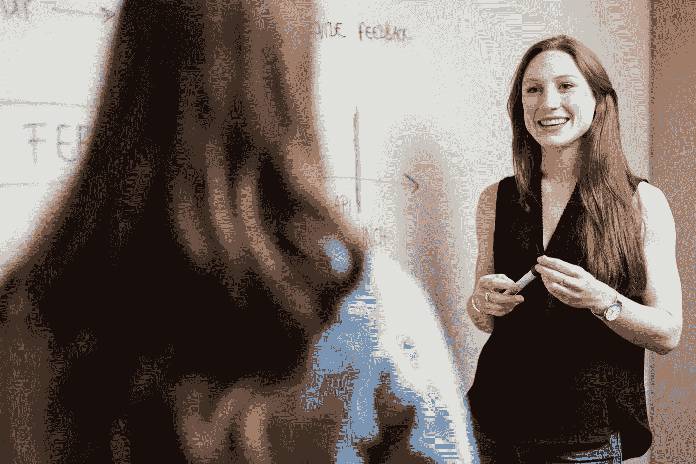

Photo by [ThisisEngineering RAEng](https://unsplash.com/@thisisengineering?utm_source=medium&utm_medium=referral) on [Unsplash](https://unsplash.com?utm_source=medium&utm_medium=referral)

假设你在一个家庭聚会上和一个可爱的女孩聊天。当你听的时候，你的耳朵会被屋子里不同人群之间的对话和背景音乐的声音所包围。然而，这并不妨碍你专注于女孩在说什么，因为人类拥有区分声音的天赋。

然而，如果这是电影场景的一部分，我们用来记录对话的麦克风将缺乏必要的能力来区分房间里的所有声音。这就是**独立成分分析**，或简称 **ICA** 发挥作用的地方。ICA 是一种用于将多变量信号分离成其基本分量的计算方法。使用 ICA，我们可以从多个信号的融合中提取出想要的成分(即你和女孩之间的对话)。

# 独立分量分析(ICA)算法

在高层次上，ICA 可以分为以下几个步骤。

1.  通过减去平均值使 **x** 居中
2.  变白 **x**
3.  为去混合矩阵 **w** 选择一个随机初始值
4.  计算 **w** 的新值
5.  正常化 **w**
6.  检查算法是否收敛，如果没有，返回步骤 4
7.  取 **w** 和 **x** 的点积，得到独立的源信号

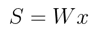

## **美白**

在应用 ICA 算法之前，我们必须首先"*白化"*我们的信号。*“白化”一个给定的信号意味着我们以这样一种方式对其进行变换，即消除其分量之间的潜在相关性(协方差等于 0)，并且每个分量的方差等于 1。另一种看待它的方式是白化信号的协方差矩阵将等于单位矩阵。*

*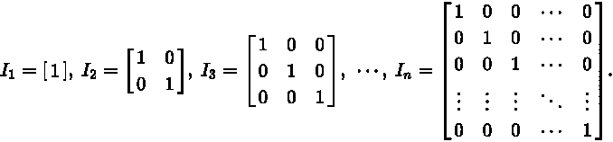*

*Identity Matrix*

*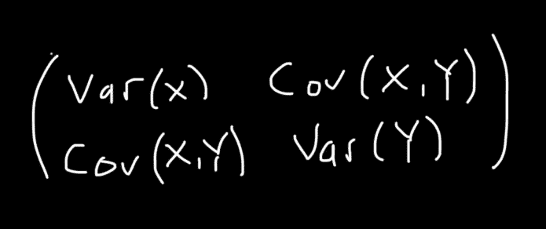*

*Covariance Matrix*

*我们着手白化信号的实际方法包括协方差矩阵的**特征值分解。相应的数学方程可以描述如下。***

*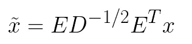*

*其中 **D** 是特征值的对角矩阵(每个λ是协方差矩阵的特征值)*

*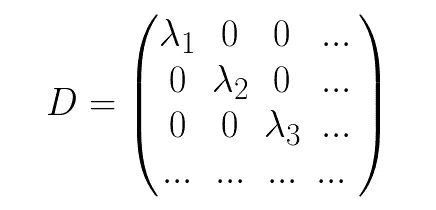**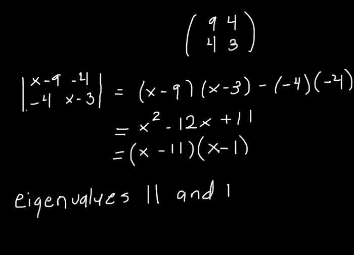*

*并且 **E** 是特征向量的正交矩阵*

*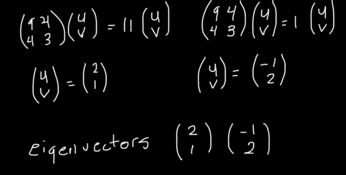*

*一旦我们完成了对信号的预处理，对于每个分量，我们更新去混合矩阵 **w** 的值，直到算法收敛或者达到最大迭代次数。当 **w** 与其转置的点积大致等于 1 时，认为达到了收敛。*

*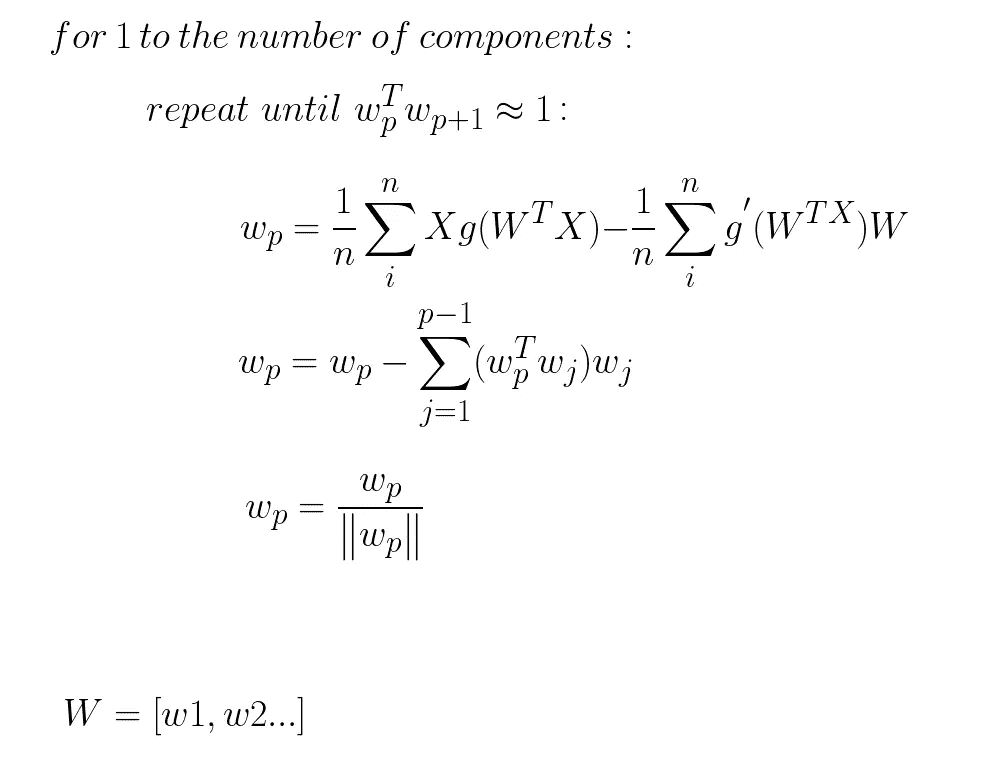*

*在哪里*

*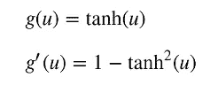*

# *Python 代码*

*让我们看看如何使用 Numpy 在 Python 中从头开始实现 ICA。首先，我们导入以下库。*

```
*import numpy as np
np.random.seed(0)
from scipy import signal
from scipy.io import wavfile
from matplotlib import pyplot as plt
import seaborn as sns
sns.set(rc={'figure.figsize':(11.7,8.27)})*
```

*接下来，我们定义`g`和`g’`，我们将使用它们来确定 w 的新值。*

```
*def g(x):
    return np.tanh(x)def g_der(x):
    return 1 - g(x) * g(x)*
```

*我们创建一个函数，通过减去平均值来确定信号的中心。*

```
*def center(X):
    X = np.array(X)

    mean = X.mean(axis=1, keepdims=True)

    return X- mean*
```

*我们使用上述方法定义一个函数来白化信号。*

```
*def whitening(X):
    cov = np.cov(X) d, E = np.linalg.eigh(cov) D = np.diag(d) D_inv = np.sqrt(np.linalg.inv(D)) X_whiten = np.dot(E, np.dot(D_inv, np.dot(E.T, X))) return X_whiten*
```

*我们定义一个函数来更新去混合矩阵 **w** 。*

```
*def calculate_new_w(w, X):
    w_new = (X * g(np.dot(w.T, X))).mean(axis=1) - g_der(np.dot(w.T, X)).mean() * w w_new /= np.sqrt((w_new ** 2).sum()) return w_new*
```

*最后，我们定义调用预处理函数的 main 方法，将 **w** 初始化为某个随机的值集，并迭代更新 **w** 。同样，收敛可以通过理想的 **w** 将是正交的这一事实来判断，因此 **w** 乘以其转置将近似等于 1。在计算出每个分量的最佳值 **w** 之后，我们将得到的矩阵与信号 **x** 进行点积，从而得到信号源。*

```
*def ica(X, iterations, tolerance=1e-5):
    X = center(X)

    X = whitening(X)

    components_nr = X.shape[0]W = np.zeros((components_nr, components_nr), dtype=X.dtype)for i in range(components_nr):

        w = np.random.rand(components_nr)

        for j in range(iterations):

            w_new = calculate_new_w(w, X)

            if i >= 1:
                w_new -= np.dot(np.dot(w_new, W[:i].T), W[:i])

            distance = np.abs(np.abs((w * w_new).sum()) - 1)

            w = w_new

            if distance < tolerance:
                break

        W[i, :] = w

    S = np.dot(W, X)

    return S*
```

*我们定义一个函数来绘制和比较原始信号、混合信号和预测信号。*

```
*def plot_mixture_sources_predictions(X, original_sources, S):
    fig = plt.figure() plt.subplot(3, 1, 1)
    for x in X:
        plt.plot(x)
    plt.title("mixtures") plt.subplot(3, 1, 2)
    for s in original_sources:
        plt.plot(s)
    plt.title("real sources") plt.subplot(3,1,3)
    for s in S:
        plt.plot(s)
    plt.title("predicted sources")

    fig.tight_layout()
    plt.show()*
```

*为了前面的例子，我们创建了一个人工混合不同源信号的方法。*

```
*def mix_sources(mixtures, apply_noise=False):
    for i in range(len(mixtures)):

        max_val = np.max(mixtures[i])

        if max_val > 1 or np.min(mixtures[i]) < 1:

            mixtures[i] = mixtures[i] / (max_val / 2) - 0.5

    X = np.c_[[mix for mix in mixtures]]

    if apply_noise:

        X += 0.02 * np.random.normal(size=X.shape)

    return X*
```

*然后，我们创建 3 个信号，每个信号都有自己独特的模式。*

```
*n_samples = 2000
time = np.linspace(0, 8, n_samples)
s1 = np.sin(2 * time)  # sinusoidal
s2 = np.sign(np.sin(3 * time))  # square signal
s3 = signal.sawtooth(2 * np.pi * time)  # saw tooth signal*
```

*在前面的例子中，我们计算矩阵 **A** 和信号的点积，以获得所有三者的组合。然后，我们使用独立分量分析将混合信号分离为原始源信号。*

```
*X = np.c_[s1, s2, s3]
A = np.array(([[1, 1, 1], [0.5, 2, 1.0], [1.5, 1.0, 2.0]]))
X = np.dot(X, A.T)
X = X.T
S = ica(X, iterations=1000)
plot_mixture_sources_predictions(X, [s1, s2, s3], S)*
```

*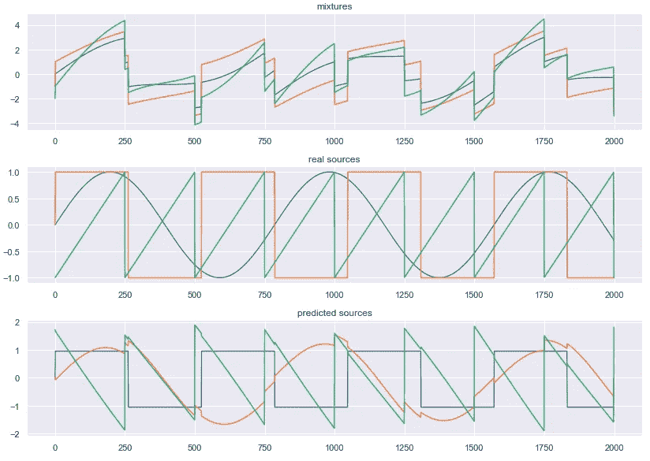*

*接下来，我们使用 ICA 分解实际音轨的混合，并绘制结果。如果你想亲自尝试，你可以在这里获得音频样本[。我鼓励你实际尝试听不同的音轨。](https://github.com/corymaklin/ida)*

```
*sampling_rate, mix1 = wavfile.read('mix1.wav')
sampling_rate, mix2 = wavfile.read('mix2.wav')
sampling_rate, source1 = wavfile.read('source1.wav')
sampling_rate, source2 = wavfile.read('source2.wav')
X = mix_sources([mix1, mix2])
S = ica(X, iterations=1000)plot_mixture_sources_predictions(X, [source1, source2], S)wavfile.write('out1.wav', sampling_rate, S[0])
wavfile.write('out2.wav', sampling_rate, S[1])*
```

*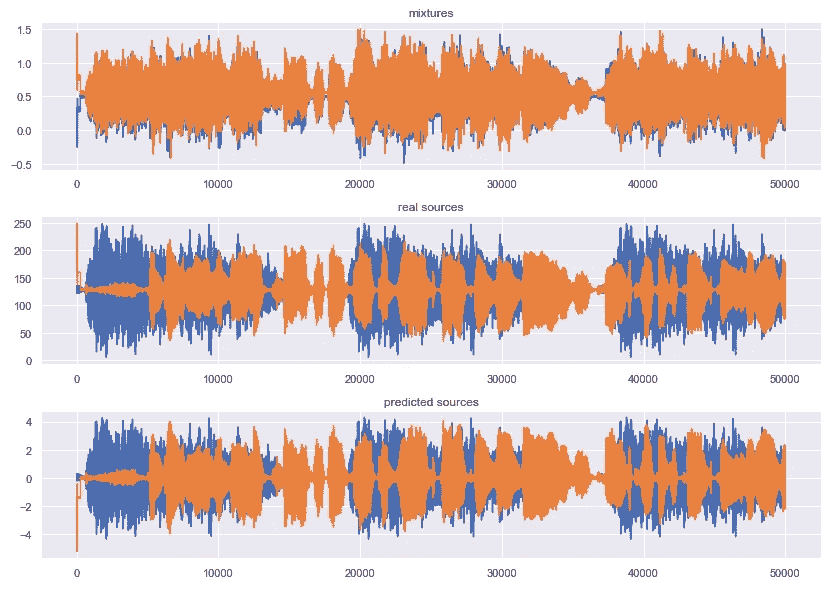*

# *Sklearn*

*最后，我们看看如何使用 ICA 的`scikit-learn`实现来达到同样的结果。*

```
*from sklearn.decomposition import FastICAnp.random.seed(0)
n_samples = 2000
time = np.linspace(0, 8, n_samples)s1 = np.sin(2 * time)
s2 = np.sign(np.sin(3 * time))
s3 = signal.sawtooth(2 * np.pi * time)S = np.c_[s1, s2, s3]
S += 0.2 * np.random.normal(size=S.shape)
S /= S.std(axis=0)
A = np.array([[1, 1, 1], [0.5, 2, 1.0], [1.5, 1.0, 2.0]])
X = np.dot(S, A.T)ica = FastICA(n_components=3)
S_ = ica.fit_transform(X)fig = plt.figure()models = [X, S, S_]names = ['mixtures', 'real sources', 'predicted sources']colors = ['red', 'blue', 'orange']for i, (name, model) in enumerate(zip(names, models)):
    plt.subplot(4, 1, i+1)
    plt.title(name)
    for sig, color in zip (model.T, colors):
        plt.plot(sig, color=color)

fig.tight_layout()        
plt.show()*
```

*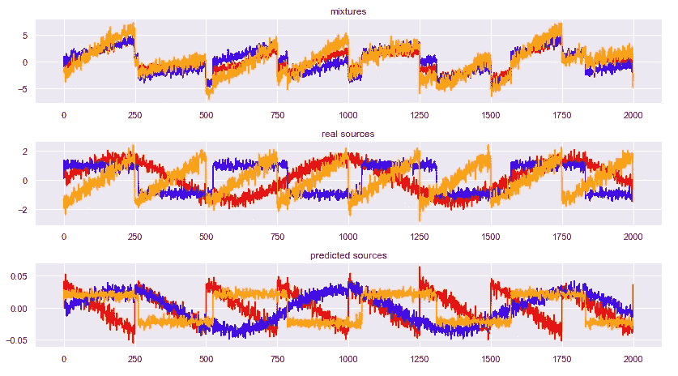*

*附带的 Jupyter 笔记本可以在[这里](https://github.com/corymaklin/ida)找到。*