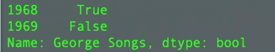

# 熊猫系列最佳实践索引

> 原文：<https://towardsdatascience.com/indexing-best-practices-in-pandas-series-e455c7d2417?source=collection_archive---------22----------------------->

## 何时以及如何执行有效的索引

Video Version of the story | By author

> 声明:这篇文章不会让你成为`***Pandas.Series***`方面的专家。这本身就是一篇文章要涵盖的非常广泛的主题。为此，我会推荐你阅读一本书或`***Pandas***` 文档。但是，我可以告诉你的是，这篇文章将让你在学习机器的[旅程中离开地面。](/journey-into-data-mining-3b5ccfa5343)

在这篇文章中，我们将讨论一些在`[Pandas.series](/pandas-series-a-part-of-the-backbone-for-machine-learning-in-python-c6a5003836c7)`中执行索引的最佳方法。众所周知，`Pandas.series`中的索引不必是整数。在以下示例中，我们使用字符串作为索引:

```
import pandas as pd
george = pd.Series([10, 7],
    index=['1968', '1969'],
    name='George Songs')george
```

> **输出**


这里，变量`george`的索引类型是对象(熊猫表示字符串索引条目是对象)

```
george.index
```

> **输出**


**→**`**.is_unique**`**——**这是判断一个指标是否有重复的功能。

```
dupe = pd.Series([10, 2, 7], 
    index=['1968', '1968', '1969'], 
    name='George Songs')dupe.index.is_uniquegeorge.index.is_unique
```

> **输出**

```
False
True
```

S 类似于`NumPy`数组，一个`Series`对象可以沿着轴被索引和切片。

```
george[0]
```

> **输出**

```
10
```

索引规则有些复杂。它们的行为更像一个字典，但是在使用字符串索引标签(而不是基于整数的索引)的情况下，行为退回到 Python 列表索引。

```
george['1968']
```

> **输出**

```
10
```

这个系列也可以通过位置(使用整数)进行索引，即使它有字符串索引条目！第一项位于 0 键，最后一项位于-1 键:

```
george[0]
george[-1]
```

> **输出**

```
10
7
```

注意:如果索引已经使用整数标签，那么回退到基于位置的索引不起作用！：

```
george_i = pd.Series([10, 7],
    index=[1968, 1969],
    name='George Songs')george_i[-1]
```

> **输出**


**→** `**.loc**` 和`**.iloc**` **—** 通过索引关闭`.loc`和`.iloc`属性来访问优化的数据访问方法。这两个属性分别允许基于标签和基于位置的索引。

当我们对`.iloc`属性执行索引操作时，它会基于*索引*位置进行查找(在这种情况下，pandas 的行为类似于 Python 列表)。如果该位置没有索引，pandas 将引发一个索引错误:

```
george.iloc[0]
george.iloc[-1]
george.iloc[4]
george.iloc['1968']
```

> **输出**

```
10
7
```


除了提取单个项目之外，我们可以像在普通 Python 中一样进行切片，并且您还可以将索引位置列表传递给索引操作:

```
george.iloc[0:3]
george.iloc[[0,1]]# both statements above will give the same output
```

> **输出**


`.loc`应该基于索引标签而不是位置。因此，它类似于基于 Python 字典的索引。虽然它有一些额外的功能，因为它可以接受布尔数组、切片和标签列表(这些都不适用于 Python 字典):

```
george.loc['1968']
george.loc['1970']
george.loc[0]
george.loc[['1968', '1970']]
george.loc['1968':]
```

> **输出**

```
10
```


如果你被 `.loc`和弄糊涂了。记住这一点。iloc 基于索引(从 I 开始)位置。。loc 基于标签(以 l 开头)。

**→** `**.at**` 和**`**.iat**`**—**`.at`和`.iat`索引访问器类似于`.loc`和`.iloc`。不同的是，当拉出一个重复值时，它们将返回一个`numpy.ndarray`，而`.loc`和`.iloc`返回一个序列。**

```
george_dupe = pd.Series([10, 7, 1, 22], 
    index=['1968', '1969', '1970', '1970'], 
    name='George Songs')george_dupe.at['1970']
george_dupe.loc['1970']
```

> **输出**

```
array([ 1, 22])
```


**→**`**.ix**`**——**它类似于`[]`分度。因为它试图支持基于位置和基于标签的索引。

```
george_dupe.ix[0]
george_dupe.ix['1970']
```

> **输出**

```
10
```


## 限幅

S 可以对指标属性`.iloc`和`.loc`进行 licing。切片试图提取一系列索引位置，结果是一个序列，而不是单个索引位置的标量项。

切片采用`[start]:[end][:stride]`的形式，其中 start、end 和 stride 是整数，方括号表示可选值。下表解释了`.iloc`的切片可能性:

```
**Slice, Result** 0:1, First item
:1, First item(since default start is 0 & last index non-inclusive)
:-2, From start until second to last item
::2, From start to end every second item
```

以下示例返回从索引位置 0 到(但不包括)索引位置 2 的值:

```
george.iloc[0:2]
```

> **输出**


## 布尔数组

使用布尔运算结果的切片被称为*布尔数组*。它返回一个经过筛选的序列，对该序列进行布尔运算。

```
mask = george > 7
mask
```

> **输出**



当掩码与索引操作结合使用时，它返回一个序列，其中只返回与 True 位置相同的项目。

```
george[mask]
```

> **输出**


多个布尔运算可以与这些运算相结合。

```
**Operation, Example** And, x[a & b]
Or, x[a | b]
Not, x[~a]
```

**使用布尔运算符时，注意运算符优先级，以避免在()中包含运算。**

```
mask2 = george <= 2
george[mask | mask2]
```

> **输出**


我们看了指数。通过索引操作，我们可以从序列中提取值。因为可以通过位置和标签提取值，所以索引可能有点复杂。使用`.loc`和`.iloc`可以让你对索引操作更加清晰。我们也可以使用*切片*来提取值。此外，我们还可以使用*布尔数组*来过滤数据。

我将免费赠送一本关于一致性的电子书。在这里获得你的免费电子书。

这个关于索引的帖子在`**Pandas.series**`到此结束。我希望你喜欢这篇文章。

如果你喜欢阅读这样的故事，那么你应该 [**在你的收件箱**](https://tarun-gupta.medium.com/subscribe) 中获得我的帖子，如果你想支持我成为一名作家，考虑[注册成为一名媒体成员](https://tarun-gupta.medium.com/membership)。每月 5 美元，你可以无限制地阅读媒体上的故事。如果你注册使用我的链接，我会赚一小笔佣金，不需要你额外付费。

[](https://tarun-gupta.medium.com/membership) [## 加入我的推荐链接-塔伦古普塔

### 作为一个媒体会员，你的会员费的一部分会给你阅读的作家，你可以完全接触到每一个故事…

tarun-gupta.medium.com](https://tarun-gupta.medium.com/membership) 

感谢阅读。要阅读更多文章，请访问此处:

 [## 标记故事列表的快速链接—感谢您的访问

### 我也有一份以快节奏出版为目标的出版物。读书成为作家。

tarun-gupta.medium.com](https://tarun-gupta.medium.com/thank-you-for-visiting-my-profile-9f708062c75e)