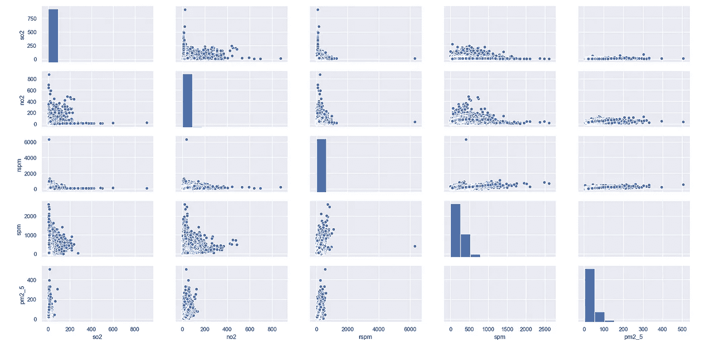
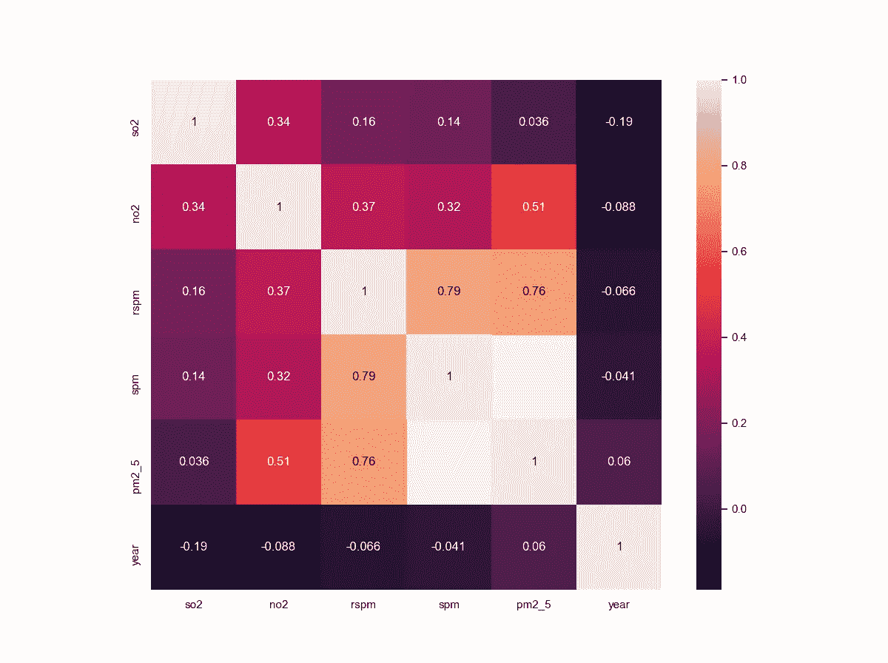
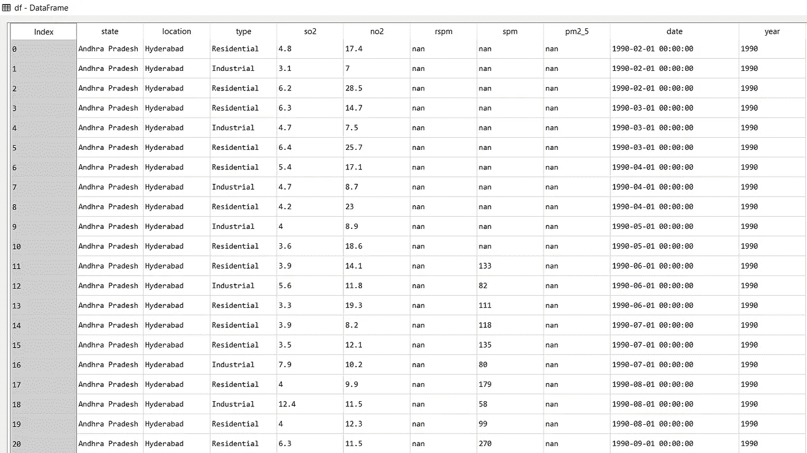
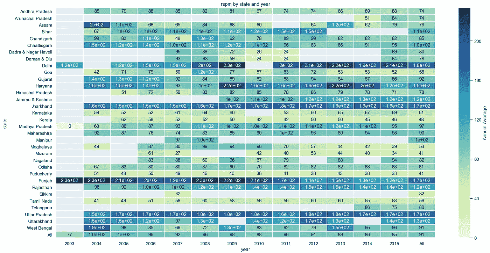

# 印度空气质量数据分析

> 原文：<https://towardsdatascience.com/india-air-pollution-data-analysis-bd7dbfe93841?source=collection_archive---------3----------------------->

## 健康影响研究所(Health Effects Institute)关于印度空气污染的报告(2018)称，2015 年，空气污染导致印度 110 万人死亡。

**空气污染**是指**污染物**释放到**空气**中，对人类健康和整个地球都有害。

今天，空气污染已经成为任何国家都要解决的重大问题之一。在南亚，它被列为第六大最危险的杀手。如果一个人一开始没有经历过某个问题，他/她就不会意识到它的有害影响。
以德里为例，排灯节后，我们都经历过在持续约一周的“致命”烟雾中吸入空气的感觉。市民被告知不要离开他们的家，并被要求外出时戴上口罩。看着窗外，让我觉得自己好像生活在一个*毒气室*。能见度低，死亡人数多等。是污染的影响。

作为一名数据分析和数据科学爱好者，我决定分析我自己国家的空气质量数据，以找到一些潜在的原则或模式，这些原则或模式可能会让我深入了解问题有多严重，我必须说这些结果值得分享。所以，我写这篇文章来分享我的方法和我对数据的分析，同时也让人们意识到我们国家面临的巨大问题。

# 方法

以下数据分析用 python 进行，代码可从 Github 库下载:[空气质量分析](https://github.com/ShubhankarRawat/India---Air-Quality-Analysis)

## 数据

该数据是印度环境和森林部以及中央污染控制委员会根据国家数据共享和可访问性政策(NDSAP)发布的历史每日环境空气质量数据的更干净版本。

数据集包含以下特征:

1.  **车站代码**:车站代码。每个记录数据的站点都有一个代码。
2.  **采样日期**:记录数据的日期。
3.  **状态**:表示测量空气质量数据的状态。
4.  **位置**:代表测量空气质量数据的城市。
5.  **机构**:测量数据的机构名称。
6.  **类型**:进行测量的区域类型。
7.  **so2** :测得的二氧化硫的量。
8.  **no2** :测得的二氧化氮量
9.  **rspm** :测得的可吸入悬浮颗粒物。
10.  **spm** :测量悬浮颗粒物。
11.  **location _ monitoring _ station**:表示监控区域的位置。
12.  **pm2_5** :表示颗粒物的测量值。
13.  **日期**:表示记录的日期(是‘采样 _ 日期’功能的更简洁版本)

## 为什么有这些功能？

SO₂:二氧化硫是一种气体。它是空气中的主要污染物之一。它是无色的，并且有一种令人讨厌的、刺鼻的气味。
它毫不费力地与其他化学物质结合，形成有害物质，如*硫酸、*等。
二氧化硫被吸入后影响人体健康。它会刺激鼻子、喉咙和气道，导致咳嗽、喘息、呼吸急促或胸部紧绷感。如果接触二氧化硫，最有可能出现问题的是患有哮喘或类似疾病的人。此外，大气中二氧化硫的浓度会影响植物群落和动物的栖息地适宜性。
吸入二氧化硫会导致呼吸道症状和疾病增加、**呼吸困难**和**过早死亡**。
还会造成**酸雨**。

**NO₂** :二氧化氮是一种*红棕色气体*，带有*刺鼻、辛辣的气味*。
它会导致**支气管收缩、炎症、免疫反应减弱**，并可能对心脏产生影响。直接接触皮肤会导致刺激和**灼伤**。
下面大致介绍一下二氧化氮对健康的影响:
10-20 ppm 会引起对**鼻子**和**喉咙**的轻度刺激
25-50 ppm 会引起水肿导致**支气管炎**或**肺炎**
浓度超过 100 ppm 会导致**死亡**由于*窒息*体内的液体高浓度的 NO₂会损害植物，包括叶子受损和生长减缓。会使植被更容易受到**病害**和**冻害**。
长时间暴露于高浓度的 NO₂可能会导致哮喘**的发生**，并可能增加呼吸道感染的易感性。

**颗粒物:**这些也被称为*大气气溶胶粒子、大气颗粒物、颗粒物(PM)* 或*悬浮颗粒物(SPM)。* 这些是悬浮在大气中的微观固体或液体物质。
**微粒是最致命的空气污染**，因为它们能够未经过滤就深入肺部和血流，导致永久性 **DNA 突变**、**心脏病发作**和**过早死亡**。
2016 年，全球暴露于 PM 2.5 导致了 410 万人死于心脏病和中风、肺癌、慢性肺病和呼吸道感染。总体而言，环境颗粒物是全球过早死亡的第六大风险因素。

互联网上充斥着上述污染物的有害影响，因此当讨论空气污染时，它们成为分析和考虑的重要因素。

回到分析上来。

**数据探索** 让我们获得一些关于数据的见解——每一列中条目的数量、每一列中条目的类型等等。

从上图中，我们看到我们的数据集中有 435742 个条目。我们还看到我们只有两种数据类型:float 和 object。pm2_5 的数值很少。

现在，让我们检查空值。

Null values in the dataset

似乎我们在一些列中有很多空值。查看该图，我们看到 pm2_5 具有非常少的非空值，并且它可能无法贡献太多。stn_code、agency、spm 也用空值填充。

让我们停下来看看这些特性有多大帮助。如果我必须分析印度的空气污染数据，那么我需要考虑为我提供数据的机构的名称吗？不，因为这个机构的名字与这个州的污染程度无关。同样， *stn_code* 也是不必要的。
数据描述中给出了*日期*是*采样 _ 日期*属性的更清晰的表示，因此我们将通过移除后者来消除冗余。
*location _ monitoring _ station*属性也是不必要的，因为它包含了监测站的位置，我们在分析时不需要考虑它。

因此，总的来说，我们将从数据集中删除以下要素:
*机构、stn_code、sampling_date* 和*location _ monitoring _ station。*

让我们看看还剩下什么

Dataset after removing the unnecessary columns

现在让我们考虑一下*型*的特征。
表示记录数据的区域类型，如工业区、住宅区等。
让我们看看考虑了多少种类型的区域:

Different categories in the type attribute

似乎我们有多余的类型。请看上图，可以说一个给定的区域可以分为三类:工业区、住宅区、其他区。
所以，我们必须去掉这个冗余，让类更干净。
我已经简化了*类型*属性，使其只包含上述三个类别中的一个。
*输入*属性后改变类别:

现在看起来好多了，也干净多了。我们可以使用 cat 图来可视化*类型*属性。

the plot of Number of entries vs Categories in the type column

看上面的图，我们可以说数据是在居民区附近记录的，因为它有最多的条目。这是显而易见的，因为人们更关心人们居住的地方。

现在让我们考虑空值。
我们在*类型、*和 *so2* 中有几个空值，因此我们将删除这三个属性中每一个都有空值的行。

现在让我们看看我们的数据是什么样的:

Dataset after deleting the rows which had null values in so2, location

我们可以看到剩下 396157 个值，所以我们没有删除非常多的值。
删除三列中的空值而不是输入，这只是我个人的偏好。人们可以估算这些空值；然而，估算像 pm2_5 这样具有大量空值的列是一种不好的做法。

# 数据可视化

让我们用柱状图按降序画出不同状态下的 so2 浓度。

barplot of so2 vs states

从上图中，我们看到北阿坎德邦的二氧化硫水平最高，昌迪加尔邦最低。
北阿坎德邦、锡金邦、贾坎德邦、古吉拉特邦、马哈拉施特拉邦、查提斯加尔邦——政府应采取措施应对这些邦不断增长的二氧化硫浓度。
让我们通过绘制 so2 浓度的位置(城市)来更深入地了解:

barplot of so2 vs location for 50 sites with highest so2 concentrations

上图显示了 50 个二氧化硫含量最高的地方，按降序排列。
我们可以看到，Dharudhera 的 so2 浓度最高，位于哈里亚纳邦，其次是贾坎德邦的 Jamshedpur。
另一方面，Amlai(中央邦)和 Sindri(恰尔肯德邦)的二氧化硫浓度在前 50 个地区中最低。

现在让我们画出 so2 浓度最低的 50 个地点:

barplot of so2 vs location for 50 places with least so2 concentrations

我们可以看到，位于喀拉拉邦的 Kottayam 的二氧化硫水平最低，正如我们从二氧化硫与邦的柱状图中看到的那样，喀拉拉邦是二氧化硫浓度最低的邦之一。事实上，Malappuram(喀拉拉邦)、Konark(奥里萨邦)、dawki(梅加拉亚邦)……Nala garh(喜马偕尔邦)、Naharlagun(阿鲁纳恰尔邦)和 Kalyani(西孟加拉邦)的二氧化硫浓度几乎相同。

现在让我们看看 no2 的浓度:

barplot of no2 vs state

从图中可以清楚地看出，西孟加拉邦的 no2 含量最高，而那加兰邦的 NO2 含量最低。德里(首都)排名第二，其次是贾坎德邦。
过去几年里，德里因空气污染，尤其是二氧化氮浓度问题多次成为头条新闻，这并不奇怪。
让我们更深入地看看哪些地方受影响最大:

barplot of no2 vs location for 50 sites with highest no2 concentrations

上图显示了 50 个二氧化氮水平最高的地方。
我们可以看到，豪拉(西孟加拉邦)的 no2 浓度最高，其次是巴德拉布尔(马哈拉施特拉邦)和杜尔加布尔(西孟加拉邦)。
很明显，就二氧化氮而言，污染最严重的城市(豪拉)属于污染最严重的邦(西孟加拉邦)。
现在让我们看看 no2 浓度最低的 50 个位置:

barplot of no2 vs location for 50 sites with the least no2 concentrations

从上图中我们可以看出，Rudrapur(北阿坎德邦)是 no2 污染最少的城市，其次是 Alappuzha(喀拉拉邦)和 Kohima(那加兰邦)。

现在让我们看看 *rspm :*

barplot of rspm vs state

从上面的图中，我们看到德里的可吸入颗粒物浓度最高，这一点也不奇怪，因为在过去几年中，任何与印度污染相关的新闻报道中都可以看到这一点。谈到空气污染，德里一直是一个重要的目标。德里污染物的显著增加使人们遭受了很多痛苦，并导致了数千人的死亡。
从上面的图中，我们还看到，就 rspm 而言，北方邦(UP)离德里也不远。作为美国人口最多的州，UP 的空气呼吸起来并不“安全”。应对可吸入颗粒物水平的上升变得非常必要，尤其是在 UP，因为它是 20 多亿人的家园。还有，UP 和德里是邻州(有意思)。
接下来，我们来看看旁遮普。谈到空气污染，旁遮普总是成为头条新闻，主要是因为农民。这是一个如此重要的问题，以至于政府已经发布了许多政策和计划来阻止稻农通过焚烧水稻收获后留下的残茬来清理他们的田地。

另一方面，锡金的可吸入颗粒物浓度最低，其次是米佐拉姆和普杜切里。

让我们更深入地研究，看看不同位置的可吸入颗粒物浓度:

barplot of rspm vs location for 50 locations which have the highest levels of rspm

从上面的图中可以看出，Kashipur(北阿坎德邦)的 rspm 水平最高，其次是 Ghaziabad(上)和 Allahabad(上)。大多数顶级位置属于 UP，这说明 UP 在可吸入颗粒物方面是污染第二严重的州。

现在让我们看看可吸入悬浮粒子浓度最低的地点:

barplot of rspm vs location for few sites which have the least levels of rspm

从上面的图中我们可以看出，可吸入颗粒物水平最低的是巴塔那姆希塔(喀拉拉邦)，其次是农斯托因(梅加拉亚邦)和占姆海(米佐拉姆邦)。我们可以看到，这些位置所属的状态位于 rspm 与状态的条形图的下方。

现在让我们考虑 spm:

barplot of spm vs states

我们看到北方邦和德里再次名列榜首。UP 和德里的 spm 和 rspm 浓度相当。一则新闻报道称:

> 1997 年，北方邦首府勒克瑙的一个空气质量监测站记录的悬浮颗粒物质(spm)最高水平为每立方米 2339 微克，超过住宅区允许限值的 11 倍，工业区限值的 4 倍。这与德里记录的最高值一样高:1992 年为 2，340 克/立方米。

如果我们更仔细地观察这个图，我们会发现德里及其以上地区的 spm 水平远远高于其他任何一个邦。拉贾斯坦邦 3 号的浓度明显低于 UP 或德里。
另一方面，果阿的悬浮颗粒物浓度最低，其次是喀拉拉邦和梅加拉亚邦。
*请注意，阿鲁纳恰尔邦和特伦甘纳邦的值为空，并且这些邦的 spm 浓度不为零。*

让我们更深入地了解一下 spm 最集中的位置:

barplot of spm vs location for sites with the highest level of spm

从上面的柱状图我们可以看出，密鲁特(上图)是悬浮颗粒物污染最严重的城市，其次是胡尔贾(上图)和加济阿巴德(上图)。
事实上，排名前 7 位的城市，即密拉特、胡尔贾、加济阿巴德、坎普尔、菲罗扎巴德、诺伊达和阿拉哈巴德，都位于上城区。这是一个令人担忧的情况，因为当谈到 spm 或 rspm 时，这个国家人口最多的州污染最严重。

现在让我们考虑最后但并非最不重要的特征，即 pm2_5:测量/记录的颗粒物值:

bar plot of pm2_5 vs state

我们可以看到，大多数状态都有空值，如上所述，很明显 pm2_5 有最多的空值(97.86%的空值)。从我们掌握的信息来看，我们看到德里再次位居榜首，其次是西孟加拉邦和中央邦。由于 pm2_5 有大量的空值，所以没有太多可以讨论的。

让我们绘制 pm2_5 和所有非空值的位置之间的柱状图:

barplot of pm2_5 vs location for all non-null values

我们看到德里仍在榜首，紧随其后的是塔尔彻(奥里萨邦)和瓜廖尔(中央邦)。

# 统计分析

现在，让我们对数据集进行一些统计分析，并检查这些特征是否有一些关系。

我们将从绘制每个特征的散点图开始:

scatter plot for each column

首先，我不会评论 *pm2_5* 和任何其他特性之间的关系，因为 *pm2_5* 有大量的空值。因此，其统计意义非常低，甚至可以忽略不计。

*so2* 和 *no2* 值高度集中在原点附近，这意味着在大多数观测中，这两个值都很低。
我们可以看到 *no2* 和 *so2* 的模式与其他特征有些相似。

可以说 *spm* 和 *rspm* 有一定的线性关系，其余所有特征并不完全相关。

为了进行更深入的分析，让我们来看看相关矩阵:

Correlation matrix for the dataset

从相关矩阵中可以清楚地看出， *spm* 和 *rspm、*之间存在一定的相关性，这支持了我们的散点图分析*。* 其他特征之间关联不大。

## 日期特征

现在让我们使用我们还没有接触过的日期特性。
*日期*特征表示记录数据的日期。
让我们提高效率，从*日期*特征设计一个新的特征(年份)。这是因为我们对空气污染的年度影响感兴趣。

制作年份列后，数据如下所示:

dataset after devising year column from date feature

现在我们已经创建了一个 year 列，这样我们就可以每年分析数据。

## 使用热图进行 so2 分析

让我们绘制 so2 热图，其中
行:*州*属性
列:*年*属性
值: *so2* 属性

heatmap for so2 with state and year attributes

从热图中可以明显看出，从 1987 年到 1999 年，比哈尔邦的二氧化硫浓度逐渐增加。同样，1995 年前后，古吉拉特邦的二氧化硫浓度也很高。在哈里亚纳邦，我们也可以看到 1987 年左右的二氧化硫水平很高，并且一直高到 2003 年。从 1987 年到 2000 年，卡纳塔克邦的二氧化硫浓度也逐渐增加。大约在 1996 年，Puducherry 也见证了 so2 浓度的高值。
拉贾斯坦邦在 1987 年左右也经历了高浓度的二氧化硫。
从 2004 年至今，北阿坎德邦的二氧化硫浓度一直很高。在西孟加拉邦，so2 浓度从 1987 年到 2000 年一直很高。

上述分析表明，从 1980 年到 2000 年，一些国家的污染物二氧化硫含量很高，但在新世纪(从 2000 年起)有所下降。

我找到了下面这篇支持我们的结论和热图分析的新闻文章。

> 美国宇航局 Aura 卫星发布的数据质疑中央污染控制委员会(CPCB)在 2012 年声称的准确性，即 2010 年印度的二氧化硫(SO2)平均排放量与 2001 年相比有所下降。

一些邦，如北阿坎德邦、恰尔肯德邦、锡金邦等。仍然经历相当高水平的 so2 浓度。
请注意，这些是二氧化硫与状态的柱状图顶部的状态。

热图显示，关注二氧化硫浓度的危险水平，采取了正确的措施来降低它。例如，**空气(污染防治)法案**于 **1981** 出台，并于 **1987** 修订。
实施见成效，二氧化硫水平下降。

## 使用热图进行 No2 分析:

在下面的热图中，我们有
行:*州*属性
列:*年*属性
值: *no2* 属性

heatmap for no2 with state and year attributes

我们可以看到，拉贾斯坦邦、比哈尔邦、德里、哈里亚纳邦、恰尔肯德邦、普杜切里邦、西孟加拉邦等邦都经历了严重的 no2 浓度水平。

在一些邦，如拉贾斯坦邦，二氧化氮浓度逐年下降，而在比哈尔邦、德里等邦。它增加了。在西孟加拉邦、恰尔肯德邦等其他邦，no2 浓度一直居高不下。
如果我们仔细观察热图，我们会发现从 2000 年开始，整个国家的 no2 浓度都在增加。
我找到了以下支持上述结论的新闻文章:

> 美国宇航局的卫星地图显示，在 2005 年至 2014 年期间，包括印度在内的南亚地区，二氧化氮污染物的排放量显著增加，严重影响了空气质量。

## 使用热图的 rspm 分析

在下面的热图中，我们有
行:*州*属性
列:*年*属性
值: *rspm* 属性

heatmap for rspm with state and year attributes

热图是一种非常重要的数据分析工具，它让一切都变得非常容易分析。人们可以很容易地看到变化，各州各年的可吸入颗粒物水平等。

这里我们看到，像德里、旁遮普、北方邦、哈里亚纳邦和恰尔肯德邦都遭受了高水平的可吸入颗粒物。

## 使用热图进行 spm 分析

在下面的热图中，我们有
行:*状态*属性
列:*年份*属性
值: *spm* 属性

heatmap for spm with state and year attributes

这里我们看到，像德里、哈里亚纳邦、旁遮普邦、北方邦等邦是 spm 高度集中的主要受害者。

# 结论

从上面的分析中，我们看到印度受空气污染影响最大的邦属于北部地区。德里、旁遮普邦、北方邦、哈里亚纳邦等邦污染严重，需要立即采取行动。
我们还发现，即使一个州的污染物水平很高，也有一些地区没有受到污染。

我们还从统计分析散点图中看到，具有高 rspm 浓度的州也具有高 spm 浓度。

根据热图，我们得出结论，一些州在早期(1980 年至 2000 年)污染严重，但后来得到了治理。下降的原因可能是公民意识和政府政策。
例如，1981 年**空气(防止和控制污染)法案**是和**法案**，规定了**防止**、**控制**和**减少空气污染。另外，我发现了一篇新闻文章，内容如下:**

> 车辆排放控制的故事始于印度，当时大规模排放标准于 1991 年首次对汽油车实施，并于 1992 年对柴油车实施。1996 年，随着汽油车催化转换器的强制安装，排放标准进一步收紧。巴拉特阶段排放标准(相当于四轮车的欧洲标准)于 2000 年首次引入。这些规范规定了一氧化碳(CO)、碳氢化合物(HC)、氮氧化物(NOx)和颗粒物(PM)的最大允许排放限值。

上述新闻文章明确指出，政府采取了必要的措施，以对付日益严重的空气污染(我们看到的)，从 1990 年至 2000 年。这可能是我们在热图中看到一些州的污染物浓度从 2000 年开始下降的原因之一。

下文陈述的另一篇新闻文章支持上述结论。

> 环境和森林部发起的 1997 年白皮书已经提出了各种措施来减少交通造成的污染，包括通过停车条例来改善交通流量，通过强制限制驾驶来减少交通流量。城市当局声称在降低空气污染方面取得了一些成功；例如，在 2014 年亚运会的申办过程中，该城市的组织委员会声称，“随着地铁的到来以及所有公共交通车辆强制使用压缩天然气，德里的污染水平大幅下降”。

# 结束注释

从上述数据分析方法，我们得出结论，数据分析是一个更好的未来至关重要的方面。

这种方法是纯数据驱动的，但是有现实生活中的实例(新闻文章)支持。

有趣的是，我们可以看到数据分析和日常实例是如何联系在一起的，以及数据分析是如何用于处理重大问题的。

我建议通过 GitHub repository 链接(在本文开头提供)找到上述方法的代码，以便更深入地了解如何用 python 实现数据分析。

这就是我对我的国家的分析，这个国家正在慢慢变成毒气室。不仅印度，其他国家也遭受空气污染。我们必须找到解决这个重大问题的方法，因为它正在慢慢地扼杀我们的国家。

如果你有任何建议或任何改进建议，请写在评论区。我将不胜感激。