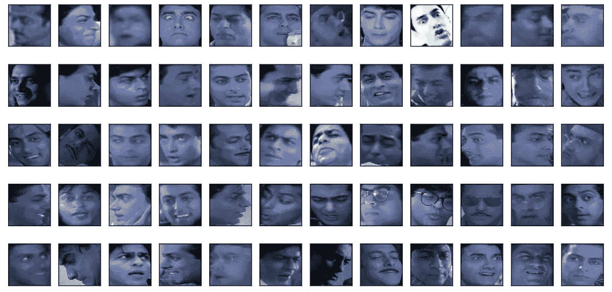
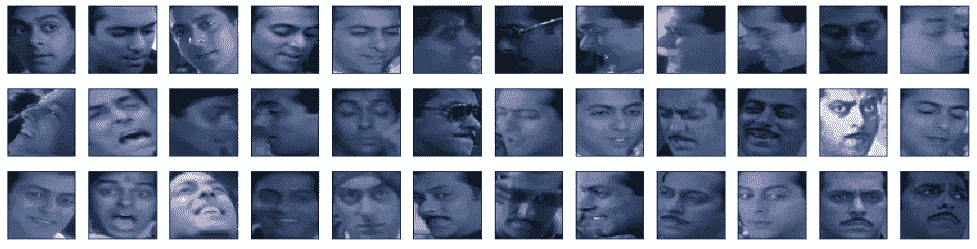
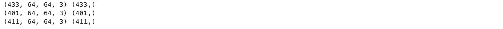
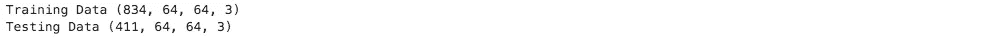
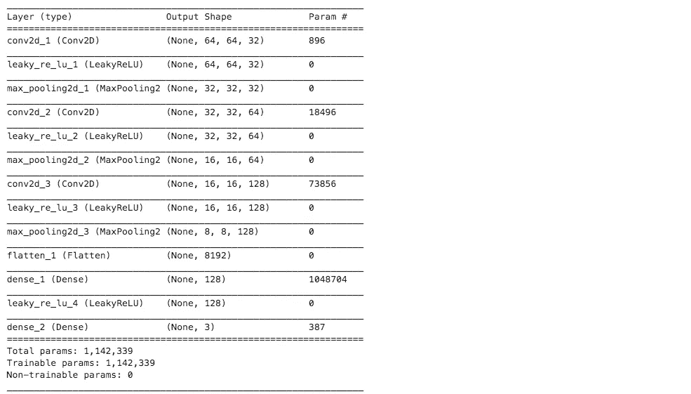
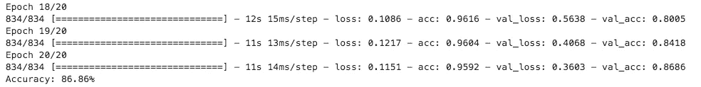
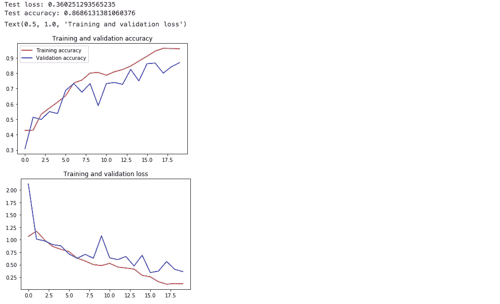
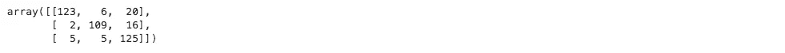
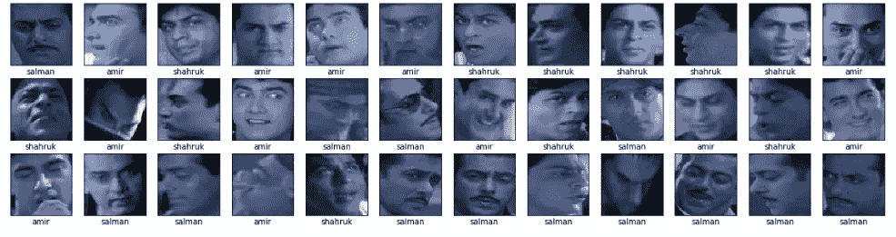

# 使用深度神经网络的印度演员分类

> 原文：<https://towardsdatascience.com/indian-actors-classification-using-deep-neural-networks-8552573f39aa?source=collection_archive---------22----------------------->



如果你需要使用深度网络对你最喜欢的演员进行分类，该怎么办？

在这篇文章中，我想演示使用神经网络的多类分类。

对于数据集，我已经收集了印度演员的图像样本[萨尔曼·可汗(401 张图像)、沙鲁克·汗(411 张图像)和阿米尔·可汗(433 张图像)]到单独的文件夹中。]

我们的问题陈述包括使用深度神经网络将印度演员的样本图像分类到正确的标签中，并在测试数据集上训练模型和计算准确度。

让我们开始练习吧

1.首先导入要使用的必要库。对于神经网络，我使用了 Keras 以及 numpy、pandas、matplotlib、cv2 和 seaborn。

```
import numpy as np
import pandas as pd
import seaborn as sns
import matplotlib.pyplot as plt
from keras.models import Sequential 
from keras.layers import Dense
from keras.utils import to_categorical
from keras.layers import Flatten,MaxPooling2D,Conv2D,LeakyReLU
from keras import optimizers
```

2.数据集包括对应于每个印度演员的图像的命名文件夹。将文件夹中的图像加载到 numpy 数组中。此外，转换所有的图像大小为常数大小，即(64*64)或(128*128)和可视化的一类。

```
import cv2
import os
def load_images_from_folder(folder):
    images = []
    for filename in os.listdir(folder):
        img = cv2.imread(os.path.join(folder,filename))
        if img is not None:
            img1=cv2.resize(img,(64,64))
            images.append(img1)
    return images**#Load the images** 
amir=load_images_from_folder('./AamirKhan/')
salman=load_images_from_folder('./SalmanKhan/')
shahruk=load_images_from_folder('./ShahrukhKhan/')train_amir = np.array(amir)
train_salman = np.array(salman)
train_shahruk= np.array(shahruk)**#Visualize the images** 
fig = plt.figure(figsize=(20,5))
for i in range(36):
    ax = fig.add_subplot(3, 12, i + 1, xticks=[], yticks=[])
    ax.imshow(np.squeeze(salman[i]))
```



3.下一步是为图像创建标签，因为每个印度演员都有对应的文件夹。我创建了一个 numpy 数组，其长度与特定的类[阿米尔·可汗]相同，并给定标签为零。类似地，萨尔曼·可汗为 1，沙鲁克·汗为 2。

```
train_amir_label=np.zeros(len(train_amir))
train_salman_label=np.ones(len(train_salman))
train_shahruk_label=np.full(len(train_shahruk),2)

print(train_amir.shape,train_amir_label.shape)
print(train_salman.shape,train_salman_label.shape)
print(train_shahruk.shape,train_shahruk_label.shape)
```



4.将所有图像连接成 X，将所有相应的标签连接成 y。使用 keras.utils 的 to _ categorical 方法将 y 标签转换成一个热编码。使用训练测试拆分方法，将数据集拆分为 X_train、y_train、X_test 和 y_test，并对数据进行归一化处理。

```
**#Concatenate** 
X=np.concatenate((train_amir,train_salman,train_shahruk))
y=np.concatenate((train_amir_label,train_salman_label,train_shahruk_label))
y_label =to_categorical(y)**#Train -Test Split**
from sklearn.model_selection import train_test_split
X_train, X_test, y_train, y_test = train_test_split(X, y_label, test_size=0.33, random_state=42,shuffle=True)**#Normalize the data**
X_train=X_train.astype('float32')
X_test=X_test.astype('float32')
X_train=X_train/255
X_test=X_test/255
print("Training Data",X_train.shape)
print("Testing Data",X_test.shape)
```



5.现在我定义多层神经网络。框图包括以下内容。基本架构是 Conv2d 层[3*3]，然后是 leaky Relu 激活，然后在其上应用 Max Pooling[2 * 2]层。有 3 个这样的分层网络[Conv2d->Leaky Relu->Max Pool]将尝试使网络更深，并将从这些层中提取特征地图。在后面的层中，我将 Conv2d 层的输出展平为 1 维，并应用了两个密集层，中间有 Leaky Relu，然后是 Softmax，以将最终输出转换为 3 类概率。使用的一些超参数如下

epochs =20，alpha =0.1，batch size =64，padding = same[这是为了保留与输入图像相同的大小]，optimizer = Adam，loss function = cross 熵。

```
**#HyperParameters**
batch_size = 64
epochs = 20
num_classes = 3
input_shape=(64,64,3)
**#Model Define** model = Sequential()
model.add(Conv2D(32, kernel_size=(3,3),activation='linear',input_shape=input_shape,padding='same'))
model.add(LeakyReLU(alpha=0.1))
model.add(MaxPooling2D((2, 2),padding='same'))
model.add(Conv2D(64, (3, 3), activation='linear',padding='same'))
model.add(LeakyReLU(alpha=0.1))
model.add(MaxPooling2D(pool_size=(2, 2),padding='same'))
model.add(Conv2D(128, (3, 3), activation='linear',padding='same'))
model.add(LeakyReLU(alpha=0.1))                  
model.add(MaxPooling2D(pool_size=(2, 2),padding='same'))
model.add(Flatten())
model.add(Dense(128, activation='linear'))
model.add(LeakyReLU(alpha=0.1))                  
model.add(Dense(3, activation='softmax'))
model.compile(loss='categorical_crossentropy', optimizer='Adam',metrics=['accuracy'])
model.summary()
```



6.在定义了模型之后，我传递了 X_train，y_train 数据以及验证数据(X_test，y_test ),并计算了精确度。对数据集的 834 个样本进行了训练，对数据集的 411 个样本进行了验证。准确率为- **86.86%**

```
np.random.seed(42)
model_1=model.fit(X_train, y_train, validation_data=(X_test, y_test), epochs=epochs, batch_size=64,shuffle=True)
scores = model.evaluate(X_test, y_test, verbose=0)
print("Accuracy: %.2f%%" % (scores[1]*100))
```



7.我绘制了验证和训练曲线，并检查模型是否过拟合或欠拟合，或者它只是很好。这个模型既没有过拟合也没有过拟合。

```
test_eval = model.evaluate(X_test, y_test, verbose=0)
print('Test loss:', test_eval[0])
print('Test accuracy:', test_eval[1])accuracy = model_1.history['acc']
val_accuracy = model_1.history['val_acc']
loss = model_1.history['loss']
val_loss = model_1.history['val_loss']
epochs = range(len(accuracy))
plt.plot(epochs, accuracy, 'r', label='Training accuracy')
plt.plot(epochs, val_accuracy, 'b', label='Validation accuracy')
plt.title('Training and validation accuracy')
plt.legend()
plt.figure()
plt.plot(epochs, loss, 'r', label='Training loss')
plt.plot(epochs, val_loss, 'b', label='Validation loss')
plt.title('Training and validation loss')
```



8.我还想知道有多少样本被错误分类。为此，我计算了混淆矩阵，发现 149 个样本中有 123 个样本正确地将阿米尔·可汗归类为阿米尔·可汗。26 个样本被错误归类，109 个样本正确地将萨尔曼·可汗归类为萨尔曼汗，125 个样本将沙鲁克汗归类为沙鲁克汗。

```
from sklearn.metrics import confusion_matrix
y_test_pred=model.predict(X_test)
cnf_matrix = confusion_matrix(y_test.argmax(axis=1), y_test_pred.argmax(axis=1))
cnf_matrix
```



9.最后，我在看不见的数据上测试了模型，并可视化了样本。几乎所有的随机样本都给了我正确的预测。

```
testdata= load_images_from_folder('../Q1_TestData/')
testimages=np.array(testdata)
predicted_classes = model.predict(testimages)
predicted_classes1 = np.argmax(np.round(predicted_classes),axis=1)
**#Visualize the test data**
fig = plt.figure(figsize=(20,5))
for i in range(36):
    ax = fig.add_subplot(3, 12, i+1,xticks=[], yticks=[])
    plt.imshow(testimages[i])
    if (predicted_classes1[i]==0):
        plt.xlabel('amir')
    if (predicted_classes1[i]==1):
        plt.xlabel('salman')
    if (predicted_classes1[i]==2):
        plt.xlabel('shahruk')    
plt.show()
```



瞧啊。请点赞并分享..谢谢..你可以帮我联系@[https://www.linkedin.com/in/ashishbansal1/](https://www.linkedin.com/in/ashishbansal1/)

