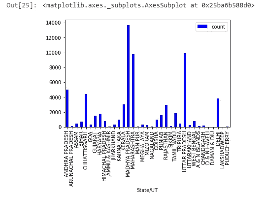

# 印度犯罪数据分析

> 原文：<https://towardsdatascience.com/indian-crime-data-analysis-85d3afdc0ceb?source=collection_archive---------16----------------------->


rawpixels

对所犯罪行的详细分析和可视化。

犯罪率不断上升，科技也是如此。我想把它们结合起来产生有意义的见解。不过，关于伦敦和芝加哥犯罪分析的工作很多，但关于印度的记录却很少。因此，我从 [data.world](https://data.world/bhavnachawla/crime-rate-against-children-india-2001-2012) 中找到了一个数据集用于这项研究。这个项目的目标是找出哪个州的犯罪率最高，哪个州发生了犯罪。事不宜迟，我们开始吧。

该数据集包含因对儿童犯罪而被逮捕的州和中央直辖区人员的数据。从柱状图中可以看到 2001 年至 2012 年的犯罪数量。


我们将导入[熊猫](https://pandas.pydata.org/)库来访问数据集。之后，我们将 CSV 文件读入数据帧(df)。显示了数据框的片段。

```
**import** **pandas** **as** **pd** df = pd.read_csv('data.csv')
df.head()
```


## 数据争论

数据争论是清理复杂数据集以进行操作和分析的过程。
由于这些值是以年度格式表示的，我们将对它们进行组合运算。为此，我们将使用以下代码

```
df['total']=df.iloc[:,-12:].sum(axis=1)
df.head()
```


We can see that a new column, total is added which contains the sum of all the values from 2001–2012

现在，我们已经添加了一个新列，我们不需要所有其他列，因此为了简化我们的数据框，我们将删除它们。

```
df.drop(df.columns[[2,3,4,5,6,7,8,9,10,11,12,13]], axis = 1, inplace = **True**)
df.head()
```


为了获得数据框的简明摘要，我们将使用 info()函数。它有助于获得数据集的快速概览。

```
df.info()
```


正如我们在输出中看到的，摘要包括所有列及其数据类型的列表，以及每列中非空值的数量。因为我们的值不为空，所以我们不必填充缺失的值。

我们只想访问国家和联盟领土的犯罪数据。因此，为了更好地可视化，我们将删除包含所有值的行。

```
d=df[:-38] *#to drop total crime rows*
```

删除包含总值的最后 38 行。

## 数据可视化

> 他们说一张照片胜过千言万语。

的确是！！数据的可视化有助于理解数据中的趋势、异常值和模式。

我们将绘制一个条形图来了解哪种犯罪在印度最为普遍。为此，我们将导入' [matplotlib](https://matplotlib.org/) '库，只用 3 行代码来绘制图表。

```
**import** **matplotlib.pyplot** **as** **plt**
plt.xticks(rotation='vertical')  #for labeling the values vertically
plt.bar(x="CRIME HEAD", height="total", width=0.8, bottom=**None**, align='center', data=d)
```


从图表中，我们可以看到“其他犯罪”类别的数量最高，其次是“绑架”和“强奸”儿童。因此，我们将重点关注这些类型，因为它们更普遍。

**剖析具体犯罪**

我们将逐一分析具体的犯罪，以获得更好的见解。首先是绑架。

```
*#Analyzing a specific crime-kidnapping*
kidnap = d[d.crime_list.str.contains('KIDNAPPING and ABDUCTION OF CHILDREN')]
kidnap.shape
k=kidnap.drop(kidnap.index[[-1,-2,-10]])
k.plot(kind='bar',x='State/UT',y='count',color='blue')
```


通过图表我们可以看出，北方邦的绑架案数量最多，共有 30，625 起，占所有邦的 38%。对于一个国家来说，这是一个令人震惊的数字，那里已经混乱不堪。因为如此高的比率，人们正在散布诱拐和绑架儿童的虚假谣言。由于这种情况，该州宣布:“如果将来有此类案件被报道，将根据《国家安全法》(NSA)对被告提出指控。”

现在，我们将想象第二高的犯罪，即强奸儿童。

> 在印度，2001 年至 2011 年期间，"**亚洲人权中心**"共报告了 **48，338 起强奸未成年人**案件，增长了 336%:从 2001 年的 2，113 起增加到 2011 年的 7，112 起。
> 
> 2017 年，世卫组织估计，多达**10 亿 2 至 17 岁的未成年人遭受过暴力**身体、情感或性暴力。根据联合国儿童基金会 2014 年的一些估计，性虐待(从猥亵到强奸)影响了超过 1 . 2 亿儿童，这是受害者人数最多的一次。

```
*#Analyzing a specific crime-rape*
rape = d[d.crime_list.str.contains('RAPE OF CHILDREN')]
r=rape.drop(rape.index[[-1,-2,-10]])
r.plot(kind='bar',x='State/UT',y='count',color='blue')
```



> 图表显示，中央邦发生的强奸案最多。为了解决这个问题，该州通过了法律，对那些被判犯有强奸未成年人罪的人判处死刑，这在一个记录了最高数量的儿童强奸案的州是一个里程碑式的决定。


A tableau visualization of states and the total number of crimes. It shows that Uttar Pradesh has the highest number of crimes.

我们得到了北方邦目标的结果，绑架是最常发生的犯罪。

请随时分享您的反馈，以便我可以纠正错误。我开这个博客是为了分享我的工作和学习新事物。

你可以在我的 [Github](https://github.com/shivanidandir/Machine-Learning-/blob/master/crime_analysis.ipynb) 个人资料中找到相同的代码。

谢谢大家！:)

参考资料:-

1.  [https://www.unicef.org/protection/57929_58006.html](https://www.unicef.org/protection/57929_58006.html)
2.  [https://www . PBC 2019 . org/protection-of-minors/child-虐待罪全球层面](https://www.pbc2019.org/protection-of-minors/child-abuse-on-the-global-level)
3.  [https://www . hindustantimes . com/India-news/man-lynched-诱拐-谣言-stir-panic-in-up/story-iefmqcfmtrd 5 uy 6 zbxfkuj . html](https://www.hindustantimes.com/india-news/man-lynched-abduction-rumours-stir-panic-in-up/story-ieFMqCFMtrd5uY6zBXfKUJ.html)
4.  [https://qz . com/India/1333614/莫迪政府改善了印度妇女的生活吗/](https://qz.com/india/1333614/has-the-modi-government-improved-the-lives-of-indian-women/)