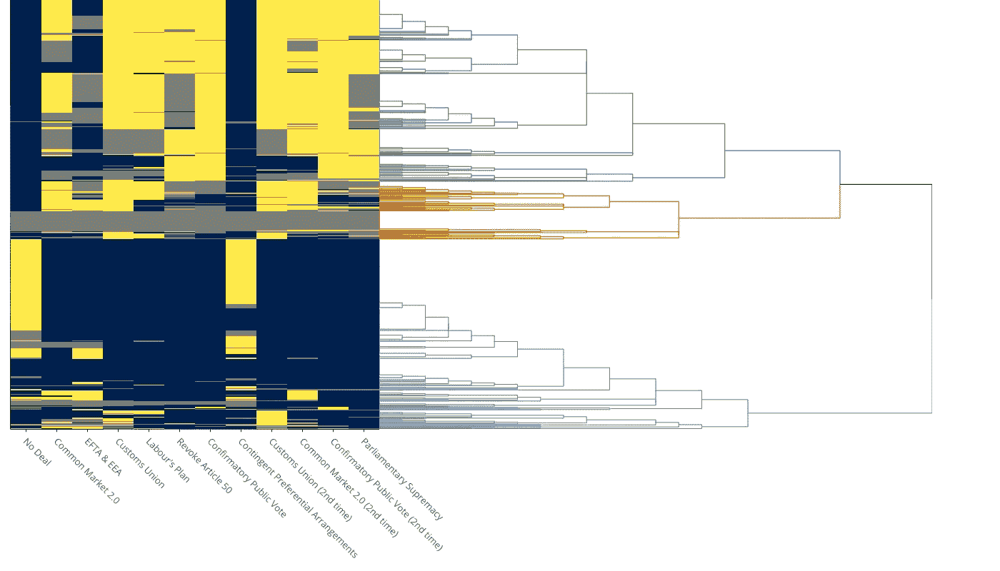
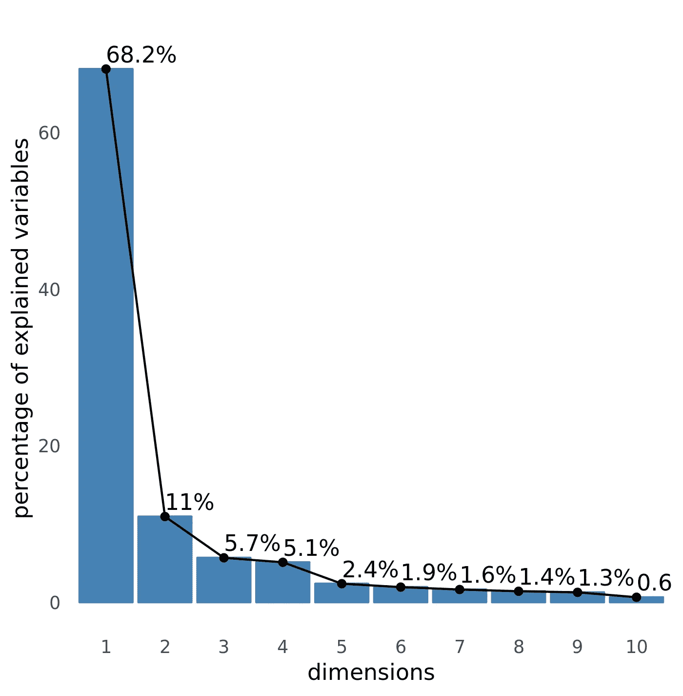
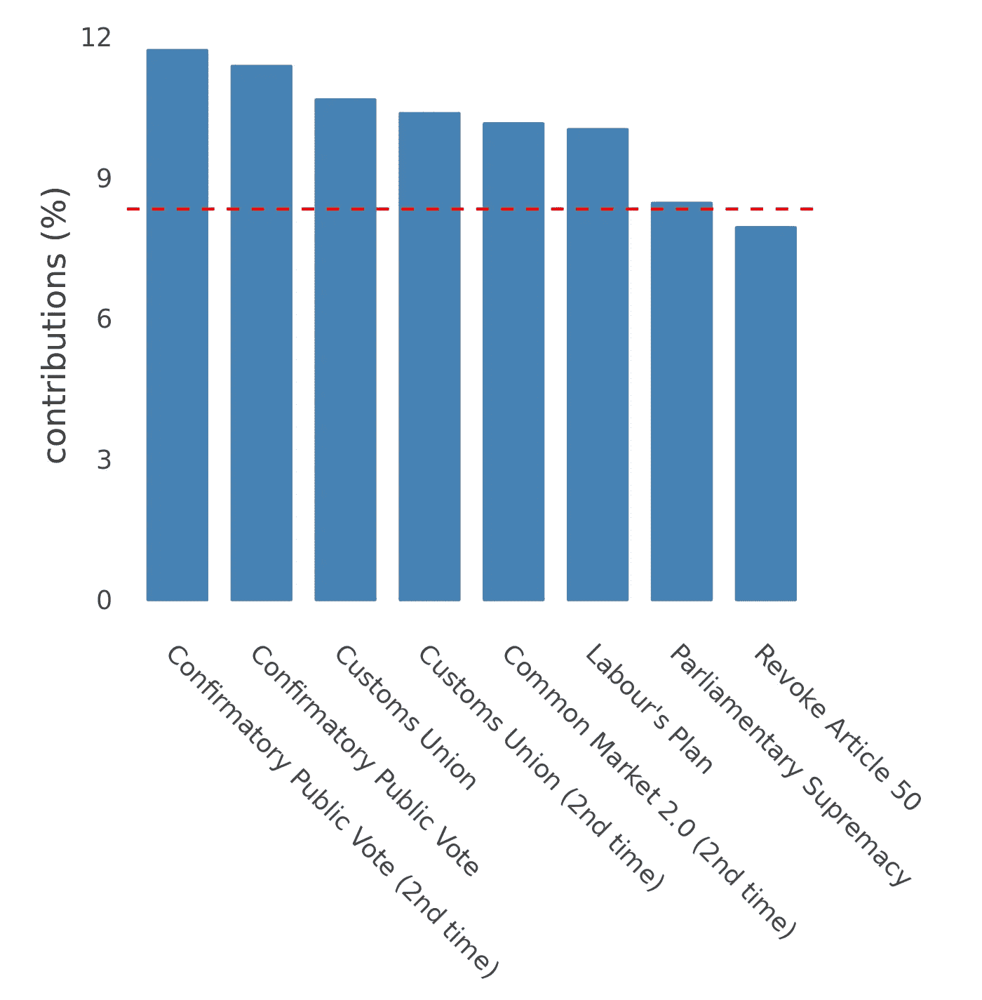
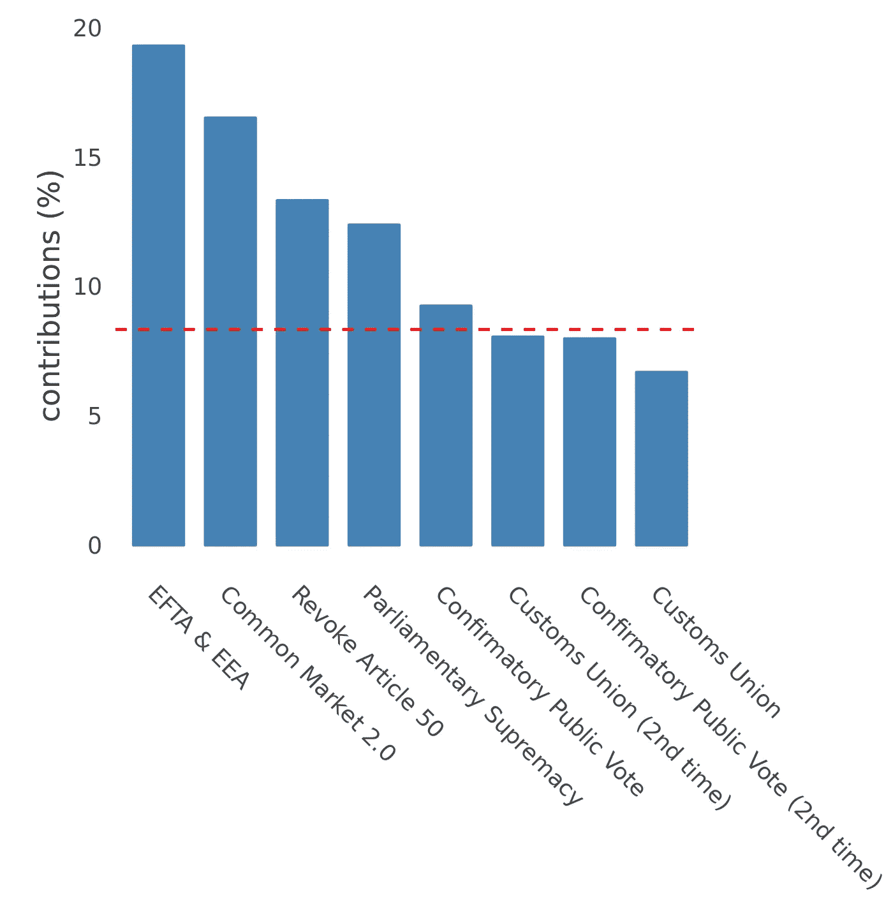

# 象征性投票——痛苦的英国退出欧盟聚类分析

> 原文：<https://towardsdatascience.com/indicative-votes-a0a60b2a5a94?source=collection_archive---------23----------------------->

你可能听说过英国退出欧盟。无论你的政治背景如何，人们普遍认为，它正以镇静的獾的果断和蹒跚的蜜糖的紧迫感前进。

最近有两轮[象征性投票](https://www.bbc.co.uk/news/uk-politics-47671056)，允许议员们表达他们的观点，因此议会可以自信而文明地就最佳前进方式达成一致。

如果不是因为十二张指示性投票中没有一张*通过，那就太好了。*

那么，这到底是怎么回事？有没有任何关于议员、议会情绪或议员群体之间关系的信息，可以让我们从这令人恐惧的犹豫不决中梳理出来？

#sendhelp

## 发生了什么事？！！

议会投票数据很容易从 CommonsVotes 网站下载。我使用 [R](https://www.r-project.org) 下载、绘制并大体上分解数据，看看会产生什么——你可以在这个 [github 库](https://github.com/jakeybob/indicative-clusters)中找到所有代码。

我们拥有的数据仅限于以下内容:对于每一次投票，我们都有每个议员的决定— *赞成*、*反对*或*无投票记录*。就是这样。这不是很多，但需求必须…

如果我们将三种投票可能性形成为每张选票的*情感得分* (aye = **+1** ，no = **-1** ，no vote = **0** )，并组合所有 12 张选票的数据，我们可以将每个议员放置在 ***12 维情感空间*** 中的某处。如果两个议员每次都以完全相同的方式投票，他们将在这个空间的同一点上，如果他们每次都投反对票，他们将截然相反。

然后，我们可以使用分区[层次聚类](https://en.wikipedia.org/wiki/Hierarchical_clustering)来构建 MP 的层次结构，根据它们在这个情感空间中的接近程度。这允许我们绘制一个[树状图](https://en.wikipedia.org/wiki/Dendrogram)。把这想象成一个生命树类型的东西，从最大的物种(*所有议员*)开始，分成所有不同的*亚种*和*亚种*，一直到议员个人。

我认为给三个最大的集群上色会很有用。严格地说，这些是任意的，但可以合理地认为是 ***保留？*** (那些大多在 Remainer 阵营的)， ***离开？*** (光谱中大多站在脱欧一边的那些)，还有 ***？？？*** 为流动选民。

[click/tap the plot to see the interactive version…]

左边的[热图](https://en.wikipedia.org/wiki/Heat_map)显示了每位议员在每次投票中的投票方式——黄色代表*赞成*，蓝色代表*反对*，灰色代表*没有投票记录。*那*还在吗？*组在最上面:很容易看出，除了*无交易*(没有真正的惊喜)和*或有优惠安排外，他们对*赞成*投了大多数票。有趣的是，相当一部分人离开了？*阵营投票反对*无交易* …

## 为什么是 HAPENNING？

树状图显示了复杂的关系层次，热图显示了所有议员如何投票。好极了:但是为了真正直观地了解议员之间的距离，以及是什么*问题*实际上将他们分开，我们需要将维度数量从 **12** (有点笨拙)减少到更易于管理的程度。我们可以用[主成分分析](https://en.wikipedia.org/wiki/Principal_component_analysis)非常直接地做到这一点，它将数据分解成复合维度——其中每个维度都由所有 12 个原始维度的加权贡献组成。然后可以根据重要性(每个对总体方差的贡献)对这些进行排序，并且将前两个用于绘制二维图像(而不是 12 个！)

理论上，这应该把一个集群放在左边，另一个放在右边，第三个集群放在中间。让我想想…

**Cluster Plot**

所以，这里有几点需要注意。首先，看起来我们的三个集群确实被很好地分开了。三角形(▲)代表*离开？*和都在右边；圆圈(●)代表*依然存在？*在左边。

有趣的是，*？？？*集群(■)似乎更接近*保持？*比*离开？。所以，也许他们更容易被留下来的人说服？*阵营？

蓝色轮廓强调了空间中议员的密度。*离开？* (▲)具有相当密集和局部化的结构。值得注意的是，*依然存在？*这个群体有两个截然不同的分支——所以这个群体有两个明显的派别。

这是什么意思？展示由两个元维度组成的平面上的分离是非常迷人的，但是这两个维度到底代表什么？

## 现在这是什么意思？

从下图中我们可以看到，我们的两个复合维度解释了 MPs 之间大约 80%的差异。这很好——即使我们已经折叠了 12 个原始维度中的 10 个，我们仍然捕获了 80%的信息。

**contribution of each PCA dimension to overall variance**

**尺寸 1**

那么什么*是*我们最重要的维度(即聚类图的左右轴)？

**Dimension 1’s ingredients**

上面的图显示了每个投票对这个维度的贡献。红线代表贡献均匀时的预期值(即 100/12 = 8.33%)；任何高于这条线的贡献都可以被认为是相当重要的。

这里的贡献大致相当分散。然而，有几票是等价的:这个维度的大约 40%是由 C *确定性公众投票*和 C *习惯工会*意见组成的。

让议员们沿着这条轴线走到一起，统一剩下的人？和*离开？集群最需要在这两个问题上找到共同点。*

**尺寸 2**

该维度表示聚类图中的垂直散点图。这个维度上的分离较少，但仍然存在明显的分裂*？*一分为二…

**Dimension 2’s ingredients**

从这个图中我们可以看到定义这个维度的最重要的问题是*欧洲自由贸易区&欧洲经济区*和*共同市场 2.0。*如果*还在？*就是要统一自己，这些才是要集中精力的事情。

## 现在怎么回事？

当我开始看这个的时候，这个国家正一头栽向悬崖边缘。现在，冲击的截止日期已经推到了[万圣节](https://www.bbc.co.uk/news/uk-politics-47889404) 2019。

在那之前会发生什么？没人知道。我不确定是否还有人想让 T1 知道。如果有更多的指示性投票就好了，我们可以看到所有的集群都汇聚到一个辉煌的、最终的、有凝聚力的地方，每个人都很高兴。但是，说实话，我并不乐观。

**这很复杂。简直是地狱。这是政治。**

尽管如此，振作起来，嗯？你必须对这些事情有幽默感…

## [注释等]

*   在计算情感空间的距离时，[曼哈顿](https://en.wiktionary.org/wiki/Manhattan_distance)距离是最合适的度量吗？
*   与此相关的是，总体上情绪谱的概念可以说是不一致的，在内部(从*赞成*到*反对*的距离是否总是与从*反对*到*反对的距离相同？)*对外(一票赞成*与另一票赞成*是否相同？).**
*   **请注意，聚类图上的点已经过*抖动*，以确保它们可见，并且不重叠。等高线图更接近地表示了所有点组的位置。**
*   **有相当多的议员(特别是内阁部长)在所有的指示性投票中没有*记录*的投票。**
*   **来自 [Pixabay](https://pixabay.com/?utm_source=link-attribution&amp;utm_medium=referral&amp;utm_campaign=image&amp;utm_content=3109992) 的 [Alexas_Fotos](https://pixabay.com/users/Alexas_Fotos-686414/?utm_source=link-attribution&amp;utm_medium=referral&amp;utm_campaign=image&amp;utm_content=3109992) 精选图片；gif 从[这里](https://giphy.com/gifs/WgPa5aB8bwAX3CTUQX)和[这里](https://giphy.com/gifs/reaction-series-alifunny-E8Lf5wK6eBb9K)。**
*   **维布尔。**