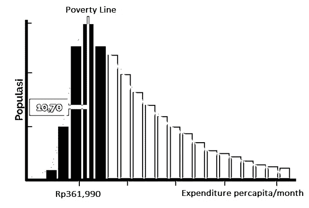

# 印度尼西亚的贫困状况

> 原文：<https://towardsdatascience.com/indonesias-poverty-profile-6f53b14def0f?source=collection_archive---------16----------------------->

## 探索 2013-2018 年印度尼西亚县级贫困数据


[For Interactive](https://public.tableau.com/profile/redi.sunarta#!/vizhome/poverty-stat-indonesia/CountyLevelofPovertyData) (Tableau)

贫困问题一直是各种经济和社会论坛讨论的主要议题之一。贫困被认为是一个严重的问题，必须解决，因为它有很高的社会成本。贫困本身通常被定义为个人无法满足食物和清洁水等商品形式的基本需求以及教育和卫生等服务形式的基本需求。

从形式上看，满足这些基本需求的能力是以支出或个人收入来衡量的。在印度尼西亚，中央统计局(Badan Pusat Statistik)使用平均支出变量作为基准，分为基本粮食和非粮食需求。如果一个人的支出低于贫困线，他就被归类为穷人。

印度尼西亚的贫困线是根据人均每天相当于 2100 千卡的最低食物需求和最低住房、衣服、教育和健康需求的支出值之和计算的。2019 年 3 月，印度尼西亚的贫困线记录为人均 425，250 印尼盾/月(约人均 1 美元/天)，食物构成为 73.66%。


[For Interactive](https://public.tableau.com/profile/redi.sunarta#!/vizhome/IndonesiaPoverty/IndonesiaPovertyTrend) (Tableau)

根据这一名义贫困线，印度尼西亚的贫困人口比例为 9.41%，约为 2，514 万人，贫困人口主要集中在农村地区，尽管贫困率基准为 12.85%，而城市为 6.89%。总体而言，这些结果显示与上一年相比下降了 0.41 个百分点。

贫困人口数量和贫困率下降的趋势确实也发生在地球的其他地方。这一现象始于第二次世界大战结束和殖民实践。这一和平与独立时期为处于世界贫困地区的前殖民地国家提供了在本国进行变革的机会。然后，它导致更具包容性的经济增长，并最终减少贫困。

在印度尼西亚的背景下，值得注意的是，每个政府总是有一个专门针对减贫的主要方案，尽管它有不同的名称，如 Takesra、Kukesra、PKH、BPNT、BLSM、Raskin 等。然而，它通常以补贴或现金援助的形式提供。补贴或现金转移的接受者是根据当地政府的数据选择的，以确定接受者的资格。即便如此，仍有许多关于提供的计划目标不准确的报告。因此，贫穷数据的分类过程相当重要，因为它不仅着眼于持续下降的贫穷率的发展。


[For interactive chart (Tableau)](https://public.tableau.com/profile/redi.sunarta#!/vizhome/poverty-stat-indonesia/CountyLevelofPovertyData)

# **分解到县一级**

我将分解到县一级，因为只有县一级的数据可用。只有几个省有更具体的数据。即便如此，印尼中央统计局发布的数据通常也会滞后一年。上面的主图是 2013 年与 2018 年相比，2018 年 3 月所有县的贫困人口数量变化分布(两点年度数据)的初步说明。显然，爪哇几乎所有的县都成功地减少了贫困人口的数量。之所以会出现这种情况，是因为 Java 的贫困人口数量最多，所以在每一个扶贫项目中作为重中之重是合理的。此外，爪哇也是印尼的经济和政治中心

与此同时，如果我对这一时期贫困人口数量减少最多的县进行排名，Buton Regency 是这一类别中最好的县(在 494 个县中)。布顿县的地方政府应该为他们的辛勤工作获得奖励。干杯。


[Github Gist](https://gist.github.com/XZ120/7bcea90c17c0abf1d5d783e4233de04a)

但是如果我把这些变化和人口增长做更详细的比较。Buton Regency 的成就不如以前辉煌，因为贫困人口数量大幅减少，随之而来的人口数量也大幅下降，分别为-65%和-62%。这也可以从[人口指数](http://sk.sagepub.com/reference/worldpoverty/n313.xml)的变化中得到证明，该指数仅变化了 1.58%，这意味着如果布顿县的人口全年保持不变，贫困人口只会减少 4113 人。所以基本上，在过去的五年里，布顿县的贫困人口数量只减少了 10%。因此，如果我只看到贫困人口数量的减少，我认为这是不够的。

如果把人口增长作为奖励的额外要求，我假定贫困人口对县人口增长有显著影响。结果，333 个县满足了这些额外要求，可悲的是，上图中前十五名中只有三个属于这一额外类别。因此，前三个县在这两个变量上的比率或 delta 不同，分别是 Tolikara 县、Tanatidung 县和 Gunung Sitoli 市。因为，尽管人口每年都在增长，他们还是设法减少了贫困人口的数量，这确实需要努力。



[source: ekon.go.id](https://ekon.go.id/ekliping/download/3360/2391/bambang-widianto-tnp2k.pdf)

好了，现在我们来谈谈贫困线。我之前告诉过你，印尼名义上的贫困线大约是每人每天 1 美元。那么，供你参考，印度尼西亚的支出分布是正偏态的。因此，如果我将贫困线提高到 1.5 倍，印度尼西亚的贫困率将增加到 40%。换句话说，许多印尼中等收入阶层处于贫困易发状态。事实上，在这五年期间，有 143 个县的贫困人口数量增加，贫困线逐年提高。虽然平均来说全县人均收入有所增加。因此，县域经济增长并没有向贫困人口倾斜。

```
seaborn.boxplot(showfliers=False, …)
```


Three Main Poverty Index Graph ([Github Gist)](https://gist.github.com/XZ120/ef40ab57e5db82c2e112e560e049de77)

# **年同比比较**

人口指数只衡量贫困人口占总人口的比例。如果你想只关注贫困群体的消费分配，那么 P1 和 P2 是常用的。P1 用于计算贫困人口与贫困线的平均消费距离。与此同时，P2 计算了贫困人口的消费差异。这两个指数的值越高，越是不好的迹象。

上图以“x”为算术平均值，显示了所有观察县的三项指标情况。图表显示贫困率下降了，但是 P1 和 P2 相对停滞不前。直观上，这可以解释贫困项目很难帮助处于最低百分位数的穷人。另一方面，如果贫困计划被证明能够将接近贫困线的穷人推出贫困区，那么到目前为止，贫困计划可以说触及了几乎所有的穷人，因为平均而言，穷人的支出增加了。不过，我没有资料显示开支的增加是否只是名义上的，换言之，只是作为对通胀上升的补偿。我还找不到令人信服的答案。

2015 年和 2016 年的 P1 和 P2 指数引起了我的注意。很明显，当贫困人口比例下降时，P1 和 P2 指数实际上是上升的。那一年是佐科·维多多内阁政府的开始，并对目前的国家预算结构进行了重大改革。佐科·维多多政府削减了前政府用于基础设施项目的大量补贴。补贴的削减确实打击了穷人。虽然随后预算有所调整，尤其是临近 2019 年选举年。

# 结论

然而，在这十年中贫困人口数量下降的成就应该得到赞赏。这至少表明了政府在努力克服这一贫困问题方面的认真态度。然而，分配不平等的问题——无论是在社区经济阶层内部还是在县与县之间——仍然是一个大问题，几乎一半的印度尼西亚人口非常容易变穷。

为什么我总是在这个贫困问题上提到政府。因为政府是唯一有能力分享经济增长蛋糕的一方。穷人没有足够的资本和权力在社会中成长。谢谢你到目前为止阅读我的故事。我希望你们都能更多地了解印度尼西亚的贫困状况。在这个故事中，我只探讨了贫困数据集，没有过多涉及贫困与其他相关变量的关系。甚至我根本没有用花式模特。也许下次，我会试着写讨论。最诚挚的问候。