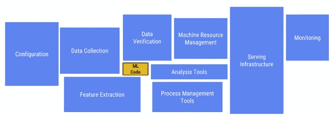
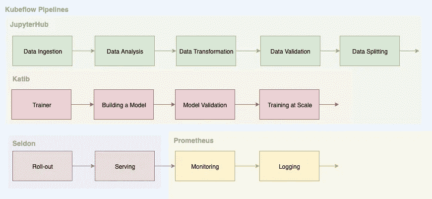
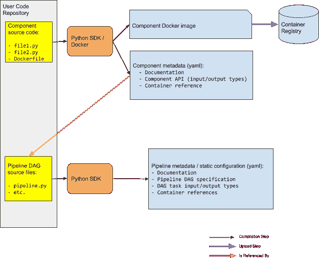
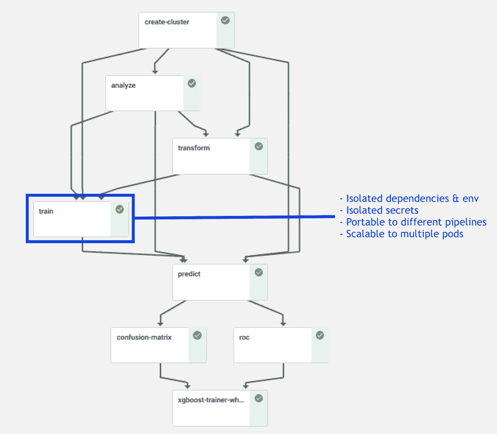
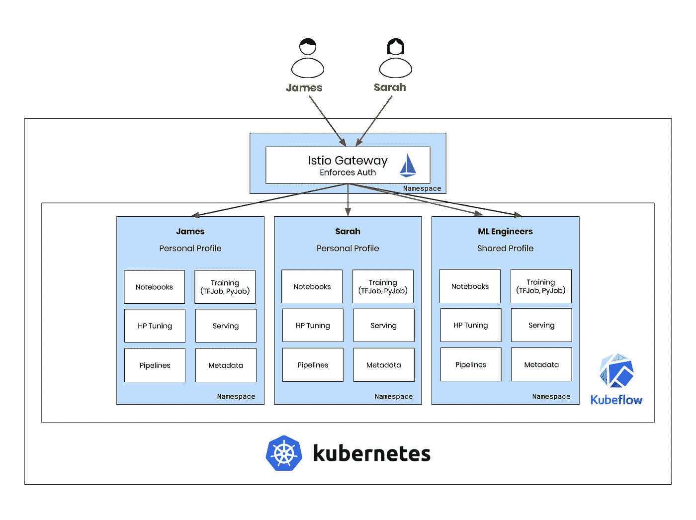
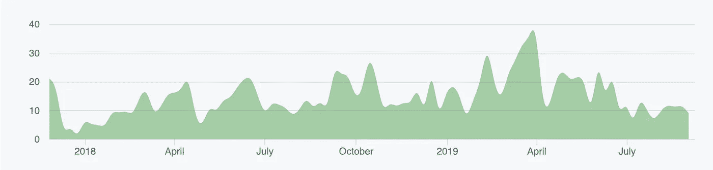

# 利用 Kubeflow 实现人工智能和机器学习应用的产业化

> 原文：<https://towardsdatascience.com/industrializing-ai-machine-learning-applications-with-kubeflow-5687bf56153f?source=collection_archive---------19----------------------->

## 全栈数据科学

## 使数据科学家能够制造可扩展和生产的 ML 产品

By [Unsplash](https://unsplash.com/)

# 背景

人工智能和人工智能应用的产业化主题近年来获得了极大的关注，例如著名的 [Netflix 奖](https://www.wired.com/2012/04/netflix-prize-costs/) 以及在现实世界场景中实现获胜的 Kaggle 解决方案所面临的困难。这突出了 AI 和 ML 开发的两个主要方面之间的根本脱节:

> 构建 AI / ML 模型不同于缩放和维护它。一个是典型的数据科学问题，一个是典型的工程问题。

by [gfycat](https://gfycat.com/whitediligentbobcat)

当谈到生产 AI & ML 算法时，需要从产品和人的角度来解决差距。

*   **从产品角度来看**，隐藏的技术债务可能来自不清楚或未分类的工程工作。值得注意的是，AI/ML 产品不仅包括 AI & ML 建模，还包括大量的开发工作和工程工作。

By [Hidden Technical Debt in Machine Learning System](https://papers.nips.cc/paper/5656-hidden-technical-debt-in-machine-learning-systems.pdf)

*   **从人员的角度来看**，数据科学团队缺乏开发人员和工程技能会带来挑战。在与数据科学家朋友的交谈中，很明显许多人不熟悉 CI/CD(持续集成&持续部署)、微服务、容器化、Kubernetes 等概念，有时甚至不熟悉 Git。

# 为了缩小差距

为了应对这些挑战，行业引入了新的角色，如 ML 工程师或 ML DevOps，旨在填补数据科学团队的知识缺口，或从他们那里接管生产任务。

此外，企业正在开发统一的 AI 和 ML 平台，以自动化许多工程任务，并最大限度地减少数据科学家的工作量，如 H2O、DataRobot 和 SageMaker。

Kubeflow 在这个领域是一个相对较新的参与者，最近几个月已经获得了极大的关注。在本文中，我们将研究 Kubeflow 如何帮助解决人工智能和人工智能产业化中的一些核心挑战。

# 什么是库伯流？

> 我们的目标是尽可能简单地扩展机器学习(ML)模型并将其部署到生产中。

以上来自 [Kubeflow 网站](https://www.kubeflow.org/docs/about/kubeflow/)不言自明。它的主要目标是利用 Kubernetes (K8s)的力量使 ML 更具可伸缩性，并以微服务的方式运行。

为了支持数据科学工作流程的不同阶段，Kubeflow 集成了几个开源组件和工具，包括:

*   Kubeflow Notebooks，为数据科学家提供 Python Jupyter 笔记本。
*   Kubeflow 管道，它允许 ML 管道的编排。
*   整流罩，它简化了模型构建、训练和部署的过程。
*   Katib，它在 Kubernetes 上提供超参数调优。
*   谢顿，负责模特上菜。

通过将这些工具结合到一个统一的平台中，并提供一个解决方案来解决**可扩展性**、**部署和维护**以及**开发经验**，Kubeflow 有潜力成为生产中 AI 和 ML 的领先平台。

# 可量测性

AI 和 ML 的进步导致了对处理大量数据的需求，这需要在数据科学过程的不同阶段进行大量的"**测试&学习**周期。这突出了平台可扩展性和构建可扩展 AI & ML 产品的效率之间的重要关系。

以前，数据科学家会访问内部服务器上具有数百 GB RAM 的虚拟机。虽然这提供了一个基本的解决方案，但它在每个虚拟机中可用 RAM 和内核的硬性上限方面有所限制。

后来，Hadoop YARN 和 Spark 的引入解决了可扩展性问题，并允许快速数据处理。然而，这些平台对于数据科学家来说不是用户友好的，并且缺乏对 ML 的支持。

最近，Kubernetes (K8s)的流行，这是一个基于容器的编排引擎，用于自动化容器化应用程序的部署、伸缩和管理，这导致了对其托管 ML 应用程序的适用性的探索。

Kubeflow 是一款基于 Tensorflow 和 Kubernetes 的 ML 解决方案，它在 K8s 上运行 ML 应用程序方面具有业内公认的优势，例如:

1.  使用 [CDR](https://kubernetes.io/docs/concepts/extend-kubernetes/api-extension/custom-resources/) 和 [TBJob](https://github.com/kubeflow/tf-operator) 通过自动扩展和更简单的部署实现更好的弹性。
2.  此外，Kubeflow 支持 python 工具，与以 java 为中心的 Hadoop 相比，数据科学家更容易使用它。

总之，与传统的 VMs 和 YARN 相比，Kubeflow 不仅提供了可扩展性，还为数据科学家提供了一个更加熟悉和可访问的环境。

# 部署和维护

我以前曾将生产中的模型视为一个黑盒，这是对 AI & ML 算法的普遍看法。为了将模型部署到生产环境中，它必须由 CICD 管道进行测试、自包含、版本控制和管理。这些任务对数据科学家来说可能不是最愉快的，也不是最有效地利用他们的技能。

然而，Kubeflow 认识到支持数据科学家的重要性。它为其管道提供了软件开发工具包(SDK ),使数据科学家能够基于 Python 中定义的管道创建预编译的 zip 文件，其中包含必要的 Dockerfile 和 YAML 文件。然后，可以将这个预编译的文件直接提交给 CICD 管道公司进行审查、测试，并最终部署到生产环境中。这大大减少了数据科学家的工作量，因为他们不再需要手动创建 YAML 文件，从而简化了整个 ML 部署流程。

如下图所示，数据科学家只需专注于黄色任务，而 Kubeflow Pipelines SDK 则负责从源代码库到容器注册表的其余流程。

By Kubeflow Community

通过将 [Argo](https://argoproj.github.io/argo/) 集成为其管道工具，Kubeflow 简化了基于容器的 ML 管道的部署，使得以微服务方式测试、扩展和维护这些管道变得简单。

这不仅简化了 ML 工作流程，还为数据科学家提供了轻松版本化和测试模型的能力，从而增强了他们的体验:

*   容器化的 ML 模型的部署确保了每个模型或组件都是自包含的，并且包含了所有必要的依赖，使得它们**可移植和可测试**。
*   **平台的健壮性**得到了提高，因为任何团队成员都可以轻松识别和解决部署模型的问题，而不需要深入了解平台的架构。
*   在**生命周期管理**方面，数据科学家能够通过部署新版本来更新现有模型，使用新发布的容器进行 A/B 测试，或者根据需要淘汰容器。
*   ML 模型和服务生命周期的清晰性增强了**数据治理**和风险管理，因为可以在容器级别管理机密，以确保对数据资产和资源的安全访问。

下图是一个端到端 XBoost 模型的 Kubeflow 管道示例，其中每个盒子代表一个由 Python SDK 生成的容器。

# 多用户隔离

多用户隔离是一个至关重要的方面，尤其是在拥有多个团队和产品流的组织中。这有助于避免不同团队的数据科学家之间的干扰，并改善他们的开发体验。为了解决这个需求，Kubeflow 利用 Kubernetes [资源配额](https://kubernetes.io/docs/concepts/policy/resource-quotas/)，允许基于名称空间管理资源。这确保了每个团队都可以访问必要的资源，并消除了意外冲突的风险。

> 在当前版本(v0.6)中，这仅适用于笔记本电脑。

By Kubeflow Community

# 监视

Kubeflow 通过使用 Prometheus 提供监控功能，能够监控每个 pod/worker 的 GPU、CPU、网络和 RAM 使用情况。这一特性不仅满足了 DevOps 的需求，还为数据科学家提供了宝贵的见解。

通过监控生产中的资源利用率，数据科学家可以优化管道计划和依赖关系，识别模型中的瓶颈，并在平衡模型培训成本和性能方面做出明智的决策。这有助于数据科学家更有效地工作，并关注成本效益。

# 开放源码

最后但同样重要的是，Kubeflow 的开源特性是其关键优势之一。虽然特定于供应商的解决方案和开源解决方案都有其优势，但我认为敏捷性和灵活性是要考虑的主要因素。对于任何规模的组织，无论是大型多云实体还是中小型创业公司，开源解决方案都提供了必要的适应性，可以随着时间的推移调整和发展他们的 AI & ML 基础设施。

> 无论你在哪里运行 Kubernetes，你都应该能够运行 Kubeflow。

此外，Kubeflow 社区非常活跃，致力于不断发布新功能，定期举行产品设计会议，并根据反馈迭代其[路线图](https://github.com/kubeflow/kubeflow/blob/master/ROADMAP.md)。

Commits over time — by [Kubeflow Github](https://github.com/kubeflow/kubeflow)

# 全部的

Kubeflow 已经成为人工智能和人工智能产业化领域的一个有前途的解决方案，提供了一系列好处来帮助组织在其数据科学项目中取得成功。

然而，值得注意的是，Kubeflow 目前正在进行重大开发，并且**尚未考虑企业就绪**。

1.  社区在最近的版本中做了一些重大的改变，比如从 Ambassador 到 Istio 作为服务网格，从 ksonnet 到 kustomize 作为部署模板。这些更改可能会影响与旧版本 Kubeflow 的兼容性。
2.  此外，在预计于 2020 年 1 月发布 1.0 版之前，多租户和用户隔离等关键功能已经不再重要。对于组织来说，在实现 Kubeflow 时，仔细评估他们的需求并牢记这些考虑因素是很重要的。

# 下一步是什么

在这篇文章中，重点主要是从运营和团队的角度来看 Kubeflow 在 AI & ML 产品产业化方面的优势。

展望未来，探索 Kubeflow 为个体数据科学家提供的优势将会非常有趣。这包括使他们能够使用 JupyterHub、Katib 和 Seldon 等工具开发端到端的 AI & ML 模型。