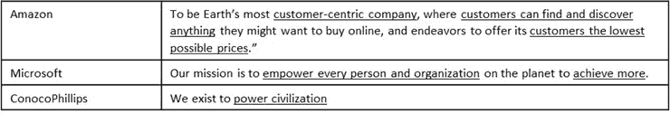
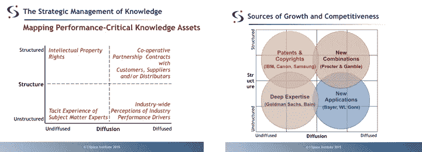
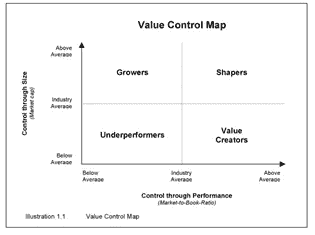
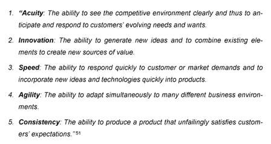
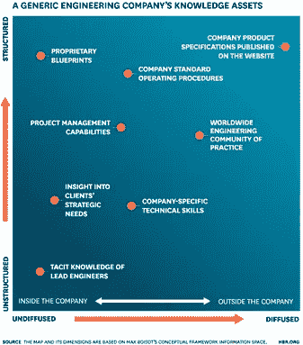
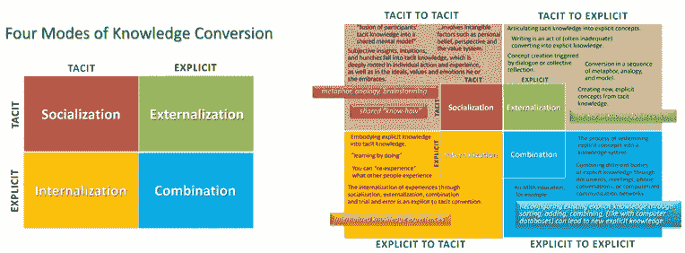
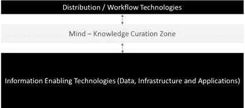

# 工业 4.0:向知识型企业演进

> 原文：<https://towardsdatascience.com/industry-4-0-evolution-to-knowledge-based-enterprises-a0bda1b9a5f6?source=collection_archive---------19----------------------->

Photo by [Franck V.](https://unsplash.com/@franckinjapan?utm_source=medium&utm_medium=referral) on [Unsplash](https://unsplash.com?utm_source=medium&utm_medium=referral)

自柏拉图和亚里士多德时代以来，认识论即“知识论”一直是一个哲学话题。正是这种对知识的理论、认知和实践，在过去的 2000 年里极大地促进了人类的进化。

在许多方面，哲学也延伸到组织知识或企业认识论。信息爆炸、技术成本下降、人工智能兴起、人才全球化、快速创新周期和资本市场经济正在重塑金融和知识资本在企业中的作用。资本主义时代早期的经营业绩显著依赖于资本效率(结合其他因素)；然而，现在可以说，在(所谓的)工业 4.0 中，赢家和输家将受到“知识效率”(也就是使用中的知识)的驱动。事实上，越来越多的证据表明，2017 年美国最受赞赏的知识企业(MAKE)的获奖者的平均收入回报率(RoR)是财富 500 强 RoR 公司中位数的 2.85 倍，资产回报率(RoA)是财富 500 强 RoA 公司中位数的 2.7 倍。

那么，这对未来的任何企业意味着什么呢？—企业需要将自己视为知识的系统***，为利益相关者有效地开发、培育、转化和使用知识。成功转型为知识型企业的企业将最有能力在人工智能时代取得成功，并对社会产生积极影响。虽然这不是一个新概念(1994 年的一篇 [HBR](https://hbr.org/1994/09/the-coming-of-knowledge-based-business) 文章谈到了知识型企业及其特征)，但许多企业并没有清楚地解释这一点，而是专注于数字化、人工智能& ML、自动化，而不是*全面知识转化*(本质上，更关注如何与为什么)。***

***对于*总体知识转化*，企业在最概念性的层面上需要关注三个领域:***

***定义知识的目的***

***创造符合目的的知识***

***通过知识管理为员工赋权***

*****重点领域 I:为企业定义知识的目的*****

****挑战:信息越多，理解越少****

****可能的解决方案:任务绩效价值知识评估****

***今天，我们生活在一个信息高度密集的环境中。然而，对于企业来说，并不是所有形式的信息和知识都是相关的。在最高层，知识的目的应该来源于(或理解于)公司/部门的核心理念/使命。例如，MAKE awards 的获奖者(以及领先的知识公司)有以下使命陈述(图 1):***

******

***Image 1: Mission Statement of 3 MAKE Award Winners***

***虽然这些使命陈述可能故意说得很宽泛，但它们确实提供了公司计划如何利用知识的洞察力。***

***这个“任务目的”可以映射到关键绩效知识资产。I-Space 研究所的知识地图就是这样一个绘图框架。地图的主要概念包含两个维度:知识结构(非结构化到结构化)和扩散(非扩散到扩散，即知识的传播程度)。这一框架使公司能够相对于市场绩效驱动因素来评估他们的知识资产。***

******

***最后一步是将知识资产映射到价值创造。价值创造是一个复杂的话题，涉及到复杂的变量，但是，如果一个企业明白了在经济和社会中所扮演的角色，他们就可以定义知识的价值。Tom Trost 在他的书《基于价值的知识策略》中，通过价值控制图提供了一个非常简单的观点。***

******

***他解释说，在绩效上竞争的企业(价值创造者和塑造者)成功地利用知识专注于五个能力领域:***

******

*****重点领域二——创造符合目的的知识*****

****挑战:信息多，信任少&行动****

****解决方案:实现知识创造和测量实践****

***知识创造和管理需要着重强调 1)了解你现有的隐性和显性知识资产 2)将知识从一种形式转换为另一种形式，以扩大知识总量。***

***信息空间研究所的知识地图也可用于绘制隐性和显性功能知识资产。***

******

***功能知识能力的映射提供了一个关于如何进一步培养它们的行动计划(您应该进一步构建某个知识能力还是进一步传播它们，以及它如何帮助企业)。***

***为了将知识转化为扩大总知识的更广泛目标，野中郁次郎关于知识创造公司的理论(21 世纪初)可能是最相关的。在他的 [HBR 文章](https://memberfiles.freewebs.com/84/90/65819084/documents/The%20Knowledge-Creating%20Company.pdf)中，他解释说，在不断变化的市场环境中，*成功的企业是那些不断创造新知识，在整个组织中广泛传播，并迅速体现在新技术和新产品中的企业*。这些活动定义了“创造知识”的公司，其唯一的业务是持续创新。他开发了一个简单的知识转换框架，叫做 *SECI 螺旋*:***

******

***该框架强调，知识是通过显性和隐性知识的社会互动创造和扩展的。随着编码、通信、设计和技术模式的飞速发展，这可能是当今企业面临的最大机遇。***

*****为员工提供知识管理*****

****挑战:信息太多，时间太少&创意****

****解决方案:使信息民主化，利用知识****

***在过去的几十年里，知识监管已经从低技术的监管发展到现在的高技术的监管。据估计，全球有 2.3 亿知识型员工(如果你扩大知识型企业中策展人的定义，这个数字会翻很多倍)。在工业 4.0 中，知识的管理将在许多层面上得到释放，并由云和人工智能提供动力。那么，每个知识工作者如何在这种新环境中策划呢？在一个简单的框架中，知识监管区将被夹在两个技术层之间(使能信息技术和分发/工作流技术)。这在今天已经是事实，在某种程度上也是如此，但是还没有完全实现。***

******

***由人工智能和分析技术支持的更加互联、更具凝聚力的企业信息系统将把重点从生产任务转移到创造任务，并实现整个组织的无缝传播。当然，只有组织中的每个人都很好地理解了知识目的和创造原则，策展区才会成功。***

***向知识型企业的发展始于 20 多年前。然而，现在看来，随着企业认识到它的潜在价值，它的发展势头和可伸缩性将会大大提高！***