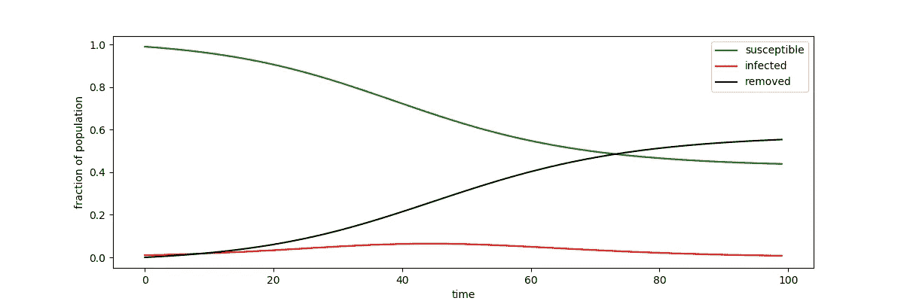
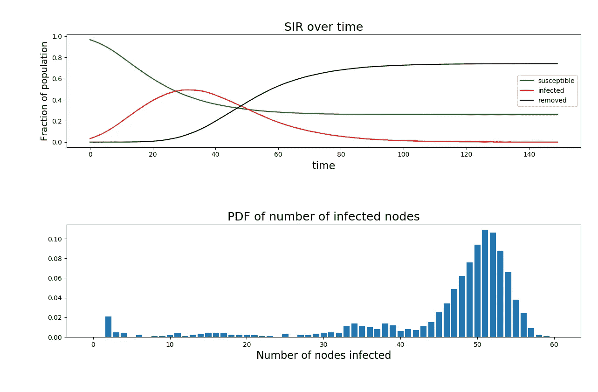

# 感染建模—第 1 部分

> 原文：<https://towardsdatascience.com/infection-modeling-part-1-87e74645568a?source=collection_archive---------9----------------------->

## 通过蒙特卡罗模拟估计病原体的影响

一句警告:本系列中提出的一些观点可能不道德。关于隐私、个人自主、平等、[‘更大的利益’、](https://www.youtube.com/watch?v=yUpbOliTHJY)和医源性的争论肯定会出现。但是，忽略所有这些会成为系统建模和优化的一个有趣例子。因此，为了我们自己的娱乐，我们将回避道德对话(因为这些概念可以很容易地应用于其他缺乏这种道德灰色地带的领域)。

社交网络通常被认为是在线社交媒体的同义词，但它们也存在于现实世界中:我们的朋友群体、同事、家人、杂货店购物者等。分析这些真实世界的社交网络对于选举策略、[零售客户细分](/amazon-customer-analysis-57eabb66e2ed)，或者我们将在这里看到的流行病学，都是有价值的。

在这项工作中，我们将着眼于一个经常使用的，简化的，流行病模型，并显示它如何可以应用到一个特定的社会网络与蒙特卡罗模拟相结合，以估计病原体的影响。后面的部分将讨论最优化、系统动力学，以及(重要的是)对所有过度简化、笼统概括和不能全信的事物的回顾。

## SIR 流行病模型

流行病的定量模型有几种形式，尽管它们都处理属于这些群体的部分人口:易感(S)-无免疫能力并能够感染病原体，暴露(E)-与病原体接触过，感染(I)-当前感染病原体，以及脱离(R)-对病原体免疫(通过疫苗或暴露后)或死亡。在这项工作中，我们将重点放在 SIR 模型，其中的人口成员要么是易感，感染，或删除。

SIR 模型由(1)中的微分方程控制。β是病原体的感染率，γ是恢复率。这两个值一起给出了基本繁殖数 *R0:* 由被感染宿主引起的二次感染的平均数量。

Equation 1: SIR model differential equations. x(t) is the fraction of the population infected, s(t) is the fraction of the population susceptible, r(t) is the fraction of the population removed (recovered and/or immune, or worse, dead). Beta is the infection rate, and gamma is the recovery rate.

如果 *R0* 值大于 1，则感染率大于恢复率，因此感染将在整个群体中增长(如图 1 所示)。如果 R0 小于 1，传染病会很快消失，因为人们愈合的速度比传播的速度快。

Figure 1: Typical SIR model applied to populations. gamma=0.17, beta=0.23, initial infected fraction=0.01

## SIR 模型的网络方法

上述 SIR 模型是一个强有力的工具，但它针对的是抽象的“群体”。如果你有更多关于社区互动的信息呢？手机和可穿戴技术的普及使得追踪运动和互动变得更加可行。有可能建立一个当地人口的社会网络，并根据这一网络对过程进行建模。在高度关注流行病的情况下，公共卫生官员可以通过网络模拟感染的传播，以更好地了解预期的结果并做好准备。这里介绍的方法与刘*等人*在 [2018 论文](https://www.pnas.org/content/pnas/115/50/12680.full.pdf)中的方法类似。

感染模拟从初始化为受感染的 *n* 个节点开始，以将病原体引入网络。在每个时间步，受感染的节点有百分之 *p* 的机会感染它们的邻居，随着每个时间步 *p* 衰减，以说明个体在意识到他们生病时变得更加小心。在 *r* 时间步之后，一个被感染的节点被从网络中移除，这意味着恢复和感染后免疫，或者死亡，这取决于被建模的病原体和/或建模者的乐观程度。

与基于人口的 SIR 模型不同，这是一个通过蒙特卡罗模拟进行建模的随机过程:使用不同的输入参数进行重复模拟，以生成可能结果的分布，而不是生成单一的确定性结果。也就是说， *p* 和 *r* 是从每个节点的概率分布中产生的，导致每次模拟的不同结果。

## 构建感染模拟

作为一个例子，我们将使用一个 62 节点的社交网络，它是由一群海豚的互动构成的。让我们以一种感染为例，其平均恢复时间 *r* 为 30 天(标准偏差为 8 天)，平均传播概率 *p* 为 6%(标准偏差为 1%)，在一个节点的感染中每天衰减 10%。让我们进一步假设随机选择的两个节点( *n* =2)是网络中的感染源。

按照上述建模过程，重复 1000 次，得到平均 SIR 响应，如图 2 的上图所示。疫情期间感染节点总数的概率密度函数如下图所示。

Figure 2: (above) averaged predictions of fraction of the population susceptible, infected, and removed. (below) PDF of the total number of nodes infected during the outbreak. The time span of the simulation is 150 days.

蒙特卡洛模拟的平均 SIR 反应相当惊人，有近 80%的人口在某一时刻被感染。最终“删除”数字的 PDF 显示了它在 1000 个模拟中的分布情况。从图 3 中可以看出，它大致符合偏态正态分布，感染节点的平均总数为 50(标准偏差为 3.5)。

Figure 3: PDF of total infected nodes roughly fits to a skewed normal distribution

最坏的情况是 62 个节点中有 59 个被感染。但就尾部事件而言，在模拟结果中，影响较小的异常值似乎比影响较大的异常值更普遍。

求解(1)中β和γ的 SIR 微分方程得到下面(2)中所示的方程。随着 *t* 的增加，β和γ收敛到各自的值。

Equation 2: Solving SIR equations from (1) for beta and gamma

利用蒙特卡罗模拟结果计算出的β和γ，我们可以计算每个模拟的 *R0* 值，以了解这种病原体在当地人群中的感染情况。模拟计算的 *R0* 值的 PDF 如下图 4 所示。

Figure 4: Probability distribution of R0 calculated from Monte Carlo simulations

蒙特卡洛模拟显示，网络中这种病原体的 R0 值最有可能在 2 到 3 之间，与 1918 年 H1N1 流感的值相当。虽然在一些模拟中观察到更接近 5 的 *R0* 值，但是在左尾的 *R0* 值更普遍，这表明如果公共卫生官员在创建响应计划时假定“最有可能” *R0* 值，他们更有可能(尽管不能保证)准备过度而不是准备不足。

[在下一篇文章](/infection-modeling-part-2-5d3f394355f)中，我们将探讨如何使用这种建模方法来解释疫苗接种的影响。此外，我们将尝试优化疫苗接种策略，以尽量减少病原体在这个网络中的影响。