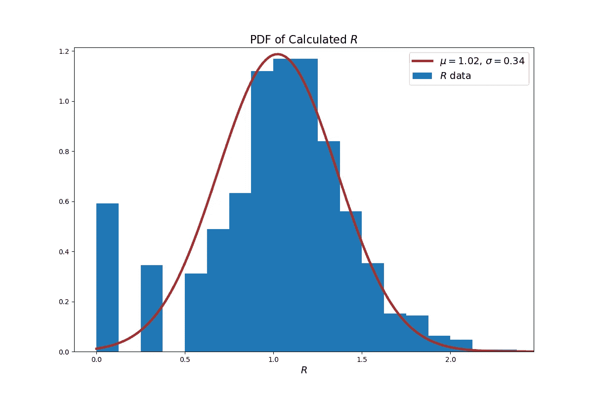

# 感染建模—第 2 部分

> 原文：<https://towardsdatascience.com/infection-modeling-part-2-5d3f394355f?source=collection_archive---------27----------------------->

## 用遗传算法优化疫苗接种策略

在第一部分中，我们模拟了传染性病原体通过社交网络的传播。蒙特卡洛模拟允许计算基本再生数 *R0* 的概率分布。在实践中，公共卫生官员将试图制定一项计划，通过接种疫苗或隔离来降低影响。根据定义， [*R0* 是疾病爆发的内在属性，一旦计算出来](https://wwwnc.cdc.gov/eid/article/25/1/17-1901_article)就不会改变，因为它是在假设完全易感人群的情况下计算的。*有效*繁殖数， *R* ，代表可能包含免疫成员的群体中继发感染的平均数量。这是希望通过疫苗接种运动最小化的度量。

Figure 1\. PDF of calculated R0 value from the Monte Carlo simulations of the epidemic from part 1.

[第 1 部分](/infection-modeling-part-1-87e74645568a)显示，对于我们的示例网络和病原体， *R0* 预计在 2 和 3 之间，如图 1 中蒙特卡洛模拟结果的分布所示。在本文和下一篇文章中，我们将对网络中的疫苗接种效果进行建模。具体来说，我们将研究疫苗供应短缺的情况，并试图回答一个问题:**鉴于只有 25%的成员可以接种疫苗，我们如何才能最好地保护人口？**

在 62 个节点的网络中，只有 15 个将在用与第一部分相同的方法模拟病原体传播之前接种疫苗(从而从网络中移除)。然后将计算得到的(平均) *R* 值，以确定该疫苗接种策略的有效性。目标是将 R 降低到 1 以下，这表明病原体的传播速度可能比感染者的恢复速度慢。

## 遗传算法优化

确定接种疫苗的最佳节点可以通过强力组合搜索来完成，尽管这将需要相当长的时间(在这种情况下，需要检查 93 x 10 个组合)。遗传算法是一种受生物启发的搜索算法，它通过模仿自然选择来缩小搜索空间。许多候选解(也称为染色体)以与它们在目标函数上的表现成比例的概率加入交配池。交配池产生的后代具有特定的突变机会，然后根据目标函数进行评估，重新开始进化过程。

在这种情况下，GA 被编程为使用 20 个候选解的群体来最小化网络中病原体的 *R* 值。图 2 显示了候选解在 20 次迭代中的演变。

Figure 2\. Evolution of *R* for the GA population. The mating pool is formed with the tournament method. Instead of assigning a fixed probability of mutation, mutation occurs when crossover results in duplication.

在 GA 例程完成之后，通过对节点 0、7、8、9、10、13、17、19、21、25、29、30、38、43 和 49 进行接种，最佳策略导致平均大约 0.98 的 *R* 。实施该策略的蒙特卡罗模拟结果如下图 3 所示。

Figure 3\. Monte Carlo simulation results for the optimal policy found via GA. Averaged SIR response (upper). Distribution of total infected nodes (lower).

受感染节点的平均数量约为总人口的 27%(13 个节点)，尽管该数量大致均匀分布在 3-15 个节点之间，此时可能性开始下降。

*R* 的概率分布如下图 4 所示，大致符合正态分布。用这种疫苗接种策略获得的 *R* 的值最有可能在 0.68 和 1.36 之间。

Figure 4\. PDF of calculated R values fit to normal distribution.

## 结论

实施 GA 来减少病原体对网络的影响是成功的。20 次反复后，最佳疫苗接种政策导致预期传染性下降 32%至 77%。然而，预期的 *R* 的上限仍然高于 1，考虑到我们的目标是将 *R* 移动到尽可能低于 1，这是不期望的。

此外，对蒙特卡罗模拟执行遗传算法优化是昂贵的。使用 20 条染色体、20 次 GA 迭代以及每次蒙特卡罗模拟 1000 次模拟，总共计算了 400，000 次模拟。我的机器花了 48 个多小时才完成。记住，这个例子使用了一个 62 节点的小型社交网络。在更大范围内，需要一个规模适当的集群，以便及时取得成果。

第 3 部分将说明网络科学工具如何比 GA 优化更快(更好)地执行这种优化。