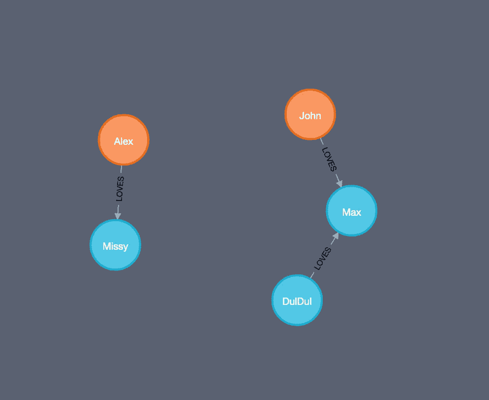
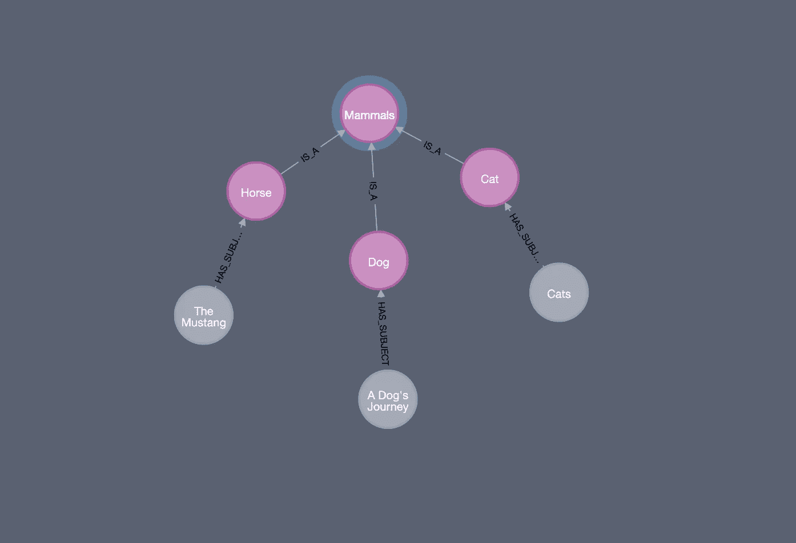

# 图形数据库中的推理

> 原文：<https://towardsdatascience.com/inference-in-graph-database-7203938932a0?source=collection_archive---------12----------------------->

在这篇博文中，我将尝试解释语义网上的推理是什么，并展示如何在本地图数据库中应用推理。我的博客的大纲如下:

1.  什么是推论？
2.  是用来做什么的？
3.  程序的类型
4.  图形数据库和本体
5.  数据库推理
6.  结论

# 什么是推论？

如 W3 标准所述，推理是基于给定的本体在图中简单地发现新的边。在语义网上，数据被建模为三元组，即两个资源和它们之间的一个关系。推断是**根据数据和一些附加信息推断**新的三元组，这些信息可能是词汇表(本体)和规则集(逻辑)的形式。例如，假设我们有两个来源:*约翰*人类和*马克斯*狗，并且我们有信息表明*约翰* **拥有** *马克斯*和*马克斯* **是** *狗。*此外，如果我们有一个额外的词汇，其中包括信息；*狗* **是** *哺乳动物*。我们可以**推断**得出 *Max* **是** *哺乳动物*而 *John* **有** *哺乳动物*。

# 是用来做什么的？

语义网上的推理用于提高网上数据集成的质量。它自动提供数据中的新链接并分析内容。同样，它也检查网络上数据的一致性。例如，假设我们有包含信息*朵拉* **是** *奶牛*和*朵拉* **是** *食肉动物的数据。*如果我们检查动物的本体论，这与牛是素食者是不一致的。

# **程序的类型**

如上所述，新链接的自动发现是通过使用词汇表或规则集来完成的。在语义网上，词汇或本体可以用 OWL、SKOS 和 RDF 描述，而规则集用 RIF 描述。这些技术是 W3C 基金会推荐的。此外，本体基于类和子类关系，然而，规则集描述一般规则以基于现有关系生成新关系。

# **图形数据库和本体**

由于数据库领域新的便捷技术，我们能够将数据存储为图表。尤其是图形数据库。有这样一个强大的工具是非常好的。更好的是，我们可以通过包含通用词汇、本体🚀

在我之前的博文中，我描述了如何通过使用名为 [NSMNTX — Neo4j RDF &语义工具包](https://neo4j.com/labs/nsmtx-rdf/)的插件将本体导入 Neo4j 数据库。请在继续之前先阅读博客文章。

[](https://medium.com/@atakanguney94/a-comparison-of-label-property-graph-and-the-rdf-cd94d2943d53) [## 标签属性图与 RDF 的比较

### 在这篇博客中，我将简单解释一下什么是标签属性图，有什么区别和相似之处…

medium.com](https://medium.com/@atakanguney94/a-comparison-of-label-property-graph-and-the-rdf-cd94d2943d53) 

# **数据库上的推理**

除了导入数据库之外，现在我们还要对其进行推理。您可能还记得上一篇文章，我们可以从外部在线商店导入本体。但是为了简单起见，在这篇博文中，我们将自己创建我们的*动物世界*本体。让我们开始吧😅

```
CREATE (a: AnimalType{authoritativeLabel: "Mammals", dbLabel: "Mammals"})
CREATE (b: AnimalType{authoritativeLabel: "Dog", dbLabel: "Dog"})
CREATE (c: AnimalType{authoritativeLabel: "Cat", dbLabel: "Cat"})
CREATE (d: AnimalType{authoritativeLabel: "Horse", dbLabel: "Horse"})
CREATE (a)<-[:IS_A]-(b)
CREATE (a)<-[:IS_A]-(c)
CREATE (a)<-[:IS_A]-(d)
```

这将产生一些 AnimalType 类型的节点，它们之间有关系。让我们看看。


这个动物模型告诉我们动物之间的关系。所以，现在创建一些被认为是宠物的动物实例。

```
CREATE (:Pet:Dog{name: "Max"})
CREATE (:Pet:Cat{name: "Missy"})
CREATE (:Pet:Horse{name: "DulDul"})
```

这将会产生


我们的第一个推论是所有的哺乳动物。因此，如您所见，我们的数据只包含三个不同的节点。

```
CALL semantics.inference.nodesLabelled('Mammals',  { catNameProp: "dbLabel", catLabel: "AnimalType", subCatRel: "IS_A" }) YIELD node
RETURN node.name as name, labels(node) as categories
```

这将会回来


因此，在我们的数据库中没有任何关系的情况下，我们通过使用我们的词汇来推断公共标签关系。

现在，让我们添加一些关系。

```
MATCH (c:Cat{name: "Missy"})
MATCH (d:Dog{name: "Max"})
MATCH (h:Horse{name: "DulDul"})
CREATE(jn: Person{name: "John"})
CREATE(al: Person{name: "Alex"})
CREATE (jn)-[:LOVES]->(d)
CREATE (h)-[:LOVES]->(d)
CREATE (al)-[:LOVES]->(c)
```

这将导致



作为第二种推论，让我们试着让所有的动物爱好者❤️

```
MATCH (p)-[:LOVES]->(pt)
WHERE semantics.inference.hasLabel(pt,'Mammals', { catNameProp: "dbLabel", catLabel: "AnimalType", subCatRel: "IS_A" })
RETURN p.name as name
```

结果来了…


现在，让我们对词汇本身进行推理。在此之前，让我们稍微扩展一下

```
MATCH (h:AnimalType{authoritativeLabel: "Horse"})
MATCH (d:AnimalType{authoritativeLabel: "Dog"})
MATCH (c:AnimalType{authoritativeLabel: "Cat"})CREATE (:Film {title: "A Dog's Journey"})-[:HAS_SUBJECT]->(d)
CREATE (:Film {title: "Cats"})-[:HAS_SUBJECT]->(c)
CREATE (:Film {title: "The Mustang"})-[:HAS_SUBJECT]->(h)
```

想象一下



我们添加了一些以动物为主题的电影。我们的下一个推理类型是类别推理类型中的节点。让我们试着得到所有以哺乳动物为主题的电影

```
MATCH (cat:AnimalType { authoritativeLabel: "Mammals"})
CALL semantics.inference.nodesInCategory(cat, { inCatRel: "HAS_SUBJECT", subCatRel: "IS_A"}) yield node
return node.title as film
```

还有…


我们得到了我们想要的😈

现在，让我们看看最后一种推理类型。我们的数据再次发生。但在此之前，让我们定义一下不同于哺乳动物的其他动物类型:鱼和鲨鱼。同样，我们再加一个 IS_A 关系。

```
CREATE (f:AnimalType{authoritativeLabel: "Fish", dbLabel: "Fish"})
CREATE (sh:AnimalType{authoritativeLabel: "Shark", dbLabel: "Shark"})CREATE (f)<-[:IS_A]-(sh)
```

创作一部关于鲨鱼的电影

```
MATCH (s: AnimalType{authoritativeLabel: "Shark"})CREATE (:Film {title: "Frenzen"})-[:HAS_SUBJECT]->(s)
```

我们最终的词汇表将如下所示


现在将新信息添加到我们的数据中

```
MERGE (p:Person { name : "John"}) with p
MATCH (film1:Film { title : "Cats" })
MATCH (film2:Film { title : "Frenzen" })
WITH p, film1, film2
CREATE (film1)<-[:LIKES]-(p)-[:LIKES]->(film2)
```

在我们的图形数据库中查看相应的数据


所以，我们的人约翰既喜欢猫也喜欢法语。让我们问一下约翰喜欢的电影中哪一部有关于鱼的主题。

```
MATCH (fish:AnimalType { authoritativeLabel: "Fish"})
MATCH (:Person { name : "John"})-[:LIKES]->(b:Film)
WHERE semantics.inference.inCategory(b,fish,{ inCatRel: "HAS_SUBJECT", subCatRel: "IS_A"})
RETURN b.title as title
```


是的，我们有结果了💪

# **结论**

最近，NoSQL 数据库而不是关系数据库吸引了人们的注意力。在各种各样的 NoSQL 数据库中，基于图的数据库越来越受到人们的关注。依我拙见，将外部信息包含到图形数据库中，并对其进行管理、分析和校对，将是很有价值的。导入本体是一种很好的简洁的方法。我希望你喜欢这个博客。更多有趣的工具，敬请关注🚀

# **参考文献**

*   [https://www.w3.org/standards/semanticweb/inference](https://www.w3.org/standards/semanticweb/inference)
*   [https://neo4j.com/docs/labs/nsmntx/current/inference/](https://neo4j.com/docs/labs/nsmntx/current/inference/)