# 边缘推理

> 原文：<https://towardsdatascience.com/inference-on-the-edge-21234ea7633?source=collection_archive---------11----------------------->

## 用 Tensorflow 为树莓 Pi 构建深度神经网络

# 从云计算到雾计算

虽然机器学习推理模型已经在改变我们所知的计算，但严峻的事实是，使用多个庞大的数据集来训练它们仍然需要大量的处理能力。使用一个训练好的模型来预测一个事件需要少得多，但仍然比我们目前的口袋设备所能处理的要多。用深度神经网络处理图像意味着数十亿次运算——对多维度的巨大矩阵进行乘法、求逆、整形和傅立叶变换。

鉴于 ML 的潜力，包括英特尔、英伟达和谷歌在内的 60 多家公司正在设计能够以更快的速度执行这些操作的芯片也就不足为奇了。利用这项技术，即使是一个树莓 Pi 也只需要几毫秒就可以通过深度神经网络并产生一个推断(本质上是一个预测)。这些芯片的机会是多方面的，它们越来越多地被部署在许多设备中，如相机和无人机。举例来说，你可以在你的 [DJI](https://www.siliconrepublic.com/machines/movidius-dji-drone) 无人驾驶飞机上找到无数来自英特尔 Movidius 的芯片，或者，很快，在欧洲航天局的卫星上就可以进行[在轨图像处理](http://www.esa.int/Our_Activities/Space_Engineering_Technology/ESA_team_blasts_Intel_s_new_AI_chip_with_radiation_at_CERN)

像你们许多人一样，我对机器学习充满热情，并渴望测试推动第四次工业革命的技术。所以当谷歌公开发布两款加速推理的新产品时，我就跳上了马车。我特别渴望了解使用这些设备运行深度神经网络需要什么。

在接下来的内容中，我将向您展示我在 Tensorflow 中创建深度神经网络的尝试，将该模型移植到 Raspberry Pi 上，并使用外部设备进行推理以提高性能。我用英特尔和谷歌这两家领先公司的芯片做了这个实验。

我的目标只是评估这两种环境，并了解使用这些设备所需的知识深度。目标不是找出模型、损失、指标和架构方面的最佳性能。人们可以很容易地想象改进我所做的许多方面。

项目的所有代码片段都可以在我的 [github 库](https://github.com/NicMaq/edge-ml)中找到。

让我们开始吧！

# 设置和目标

计划是用 Tensorflow 设计一个新鲜的[卷积神经网络](https://en.wikipedia.org/wiki/Convolutional_neural_network)。由于这些芯片处理整数或半精度浮点运算速度更快，我们将构建一个运行在低精度数据类型上的模型。为此，我们将为我们的模型运行一个[量化感知训练](https://github.com/tensorflow/tensorflow/tree/r1.13/tensorflow/contrib/quantize#quantization-aware-training)。然后，我们将冻结图形，将其编译成两个加速器支持的不同表示形式。最后，我们将在边缘上尝试我们的模型。

你可能会问:既然已经存在大量优秀的预训练模型，为什么还要建立一个新模型？

好问题。有许多可用的模型在巨大的数据集上进行了预训练，其中一些甚至是为我们想要使用的设备编译的。使用 MobileNetV2 SSD 进行对象检测，几个小时后您就可以获得惊人的结果。

然而，我们的目标不是驾驶赛车，而是了解制造赛车所面临的挑战。理解“边缘推理”的本质是什么意思。

对于这个特别的项目，我使用了英特尔和谷歌的芯片。在我面前，从左到右，我们有英特尔神经计算棒 2，谷歌珊瑚加速器和谷歌珊瑚板。

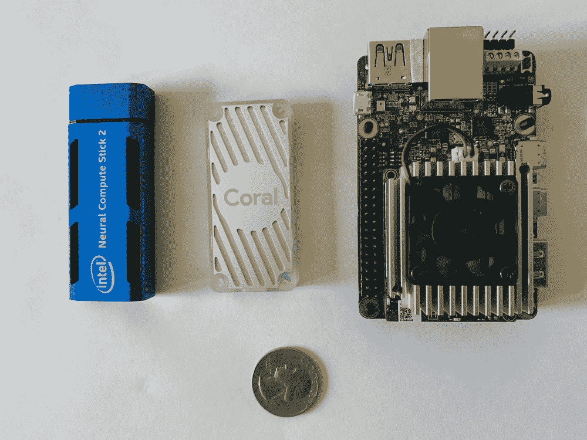

Coral 加速器和英特尔神经计算棒 2 将连接到树莓 Pi3b。两个 Raspberries 都运行在新部署的 Raspbian(Raspbian GNU/Linux 9 stretch)上。Coral Dev 开发板开箱即用 Mendel (Mendel GNU/Linux 2 烧杯)。我将在本文中包含的代码也可以在 Coral Dev 板上运行，但是这里我将重点放在 USB keys 上。

# 用 CIFAR10 建立并量化张量流模型

CIFAR10 是一个公共数据集，可以在[这里](https://www.cs.toronto.edu/~kriz/cifar.html)下载。是一组 6 万张图片(32*32 像素)。每张图片属于以下 10 个类别之一:飞机、汽车、鸟、猫、鹿、狗、青蛙、马、船或卡车。

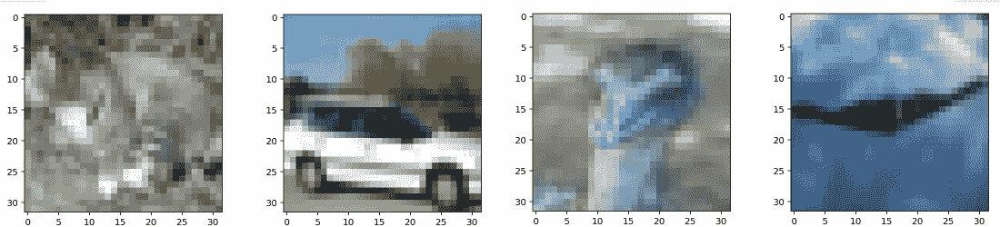

目的是建立一个深度神经网络，可以预测照片中的内容。从上面的例子可以看出，做到这一点并不容易。

有不同的方法可以用来在 Tensorflow 中构建深度神经网络。最快的当然是使用 Keras 模型，或者构建自己的模型。我两样都做了。首先，我实例化了一个 [MobileNetV2 网络](https://github.com/NicMaq/edge-ml/blob/master/CIFAR10_Keras_MobileNetV2.ipynb)。然后，我用 3 个模块构建了一个 [convnet](https://github.com/NicMaq/edge-ml/blob/master/CIFAR10_Keras_Convnet.ipynb) 。我用[后量化](https://www.tensorflow.org/lite/performance/post_training_quantization)来量化这两个表现都很好的模型。不幸的是，谷歌边缘 tpu 目前不支持后量化。值得一提的是，我在英特尔 NCS2 上成功运行了 convnet。

这一初步侦察显示了这些设备对它们正在处理的数据类型有多敏感。这当然是玩家在未来几年将会大量投资的领域。无论如何，由于边缘 tpu 不支持后量化，我们需要建立一个量化的深度学习网络。由于 Keras 不支持这一点，我们有两个选择。我们可以使用低级 Tensorflow API 或者构建一个[估算器](https://storage.googleapis.com/pub-tools-public-publication-data/pdf/18d86099a350df93f2bd88587c0ec6d118cc98e7.pdf)。让我们试着用 Tensorflow 构建一个估计器来节省一些时间，并进行[量化感知训练](https://github.com/tensorflow/tensorflow/tree/r1.13/tensorflow/contrib/quantize#quantization-aware-training)。

我们的第一层将由两个 convnet 模块组成。然后，我们将在 10 个单位的密集层中处理张量，以涵盖我们的 10 个类别。评估者有不同的训练、评估和预测方法。训练和评估方法建立它们自己的图表。如果你在[笔记本](https://github.com/NicMaq/edge-ml/blob/master/CIFAR10_Estimator_Conv.ipynb)中一步一步走，你会注意到 **cnn_model_fn** 的功能。这是我们添加层和做管道的地方。

这是我们构建的张量板图形表示。如您所见，与预先训练的模型相比，该网络非常小。我们甚至可以把它印在纸上！

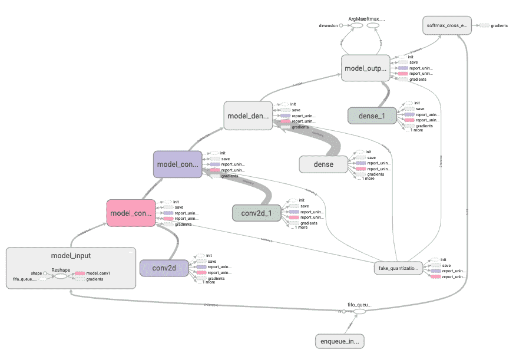

在 **cnn_model_fn** 函数中，增加了两行用于量化。两个调用 TF . contrib . quantize . create _ training _ graph()和 TF . contrib . quantize . create _ eval _ grap()分别创建量化感知训练图和评估图(我们想要的那个)。这两个函数向我们的图中添加了许多节点，以伪造数据类型的变化，并帮助生成量化图。

定义模型函数后，我们使用 AdamOptimizer 和 softmax 交叉熵在 CIFAR 数据集上训练我们的估计器。有趣的是，创建训练图的 contrib 函数为您提供了以高精度数据类型开始训练和以低精度数据类型结束训练的选项。

这是一个你应该在 Tensorboard 上看到的损失的例子。

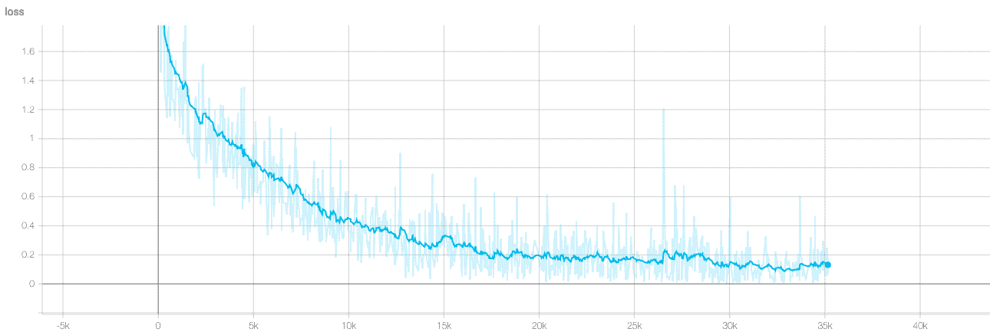

一旦模型被训练，我们将开始对我们保留的 5000 个特征进行评估，以验证我们的模型。然后，我们将要求模型预测随机样本，以粗略评估其预测准确性。

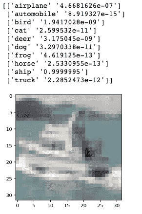

我们需要导出的图表是在评估阶段创建的。估计器使得创建 saved_model 变得容易。classifier . experimental _ export _ all 方法值得花一些时间，因为您可以选择想要导出的标记图。

一旦导出了 saved_model，就必须通过将最新检查点的变量转换为常量(比如网络的权重)来冻结它。检查这个 [jupyter 笔记本](https://github.com/NicMaq/edge-ml/blob/master/Load_saved_model_and_freeze.ipynb)来加载、检查和冻结你保存的模型。

# 测试 1:使用谷歌加速器进行推理

谷歌[于 2019 年 3 月 26 日宣布](https://developers.googleblog.com/2019/03/introducing-coral-our-platform-for.html)Coral 加速器和 Dev Board。目前，这方面的资源相对有限，但谷歌每天都在忙于增加更多的资源。

为 Google Accelerator 部署环境很简单。只需遵循谷歌的[入门](https://coral.withgoogle.com/docs/accelerator/get-started/)教程。十分钟后，你就可以走了。我强烈建议使用虚拟环境。一旦所有东西都安装好了，你就可以使用检测和分类模型了。

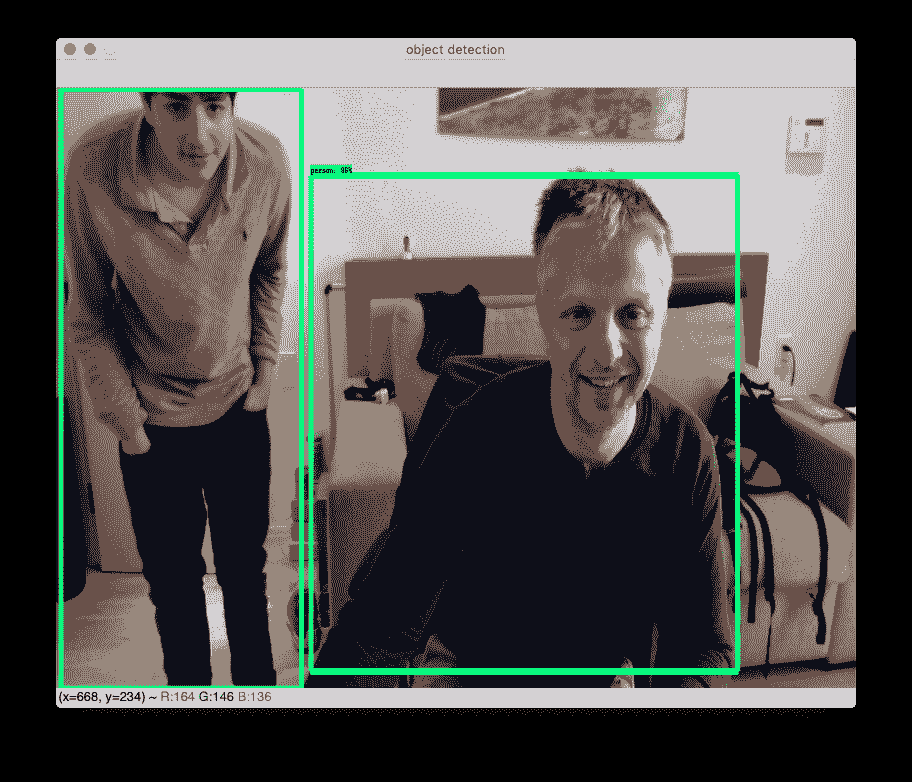

现在我们有了我们的环境，让我们的模型做一个推论。首先，我们需要将 saved_model 编译成一个 tflite 模型。要做到这一点，我们必须使用谷歌的转换器 TOCO。

如果你按照笔记本上的步骤一直到最后，你只需要跑:

toco-graph _ def _ file = freezed . Pb-output _ file = TF lite _ model . TF lite-input _ format = tensor flow _ graph def-output _ format = TF lite-inference _ type = QUANTIZED _ uint 8-input _ shape = " 1，32，32，3 "-input _ array = model _ input/input-output _ array = soft max _ tensor-STD _ dev _ values = 127-mean _ value = 127-default _ ranges _ min = 0-default _ ranges _ max = 6

除了输入张量的名称和输出张量的名称之外，您可以看到指定偏差、平均值以及 Relu 的默认范围也很重要。这就是我们决定使用 Relu6 的原因。

在将资产转移到 Raspberry 之前还有一个步骤:将 tflite 模型转换为 edgetpu.tflite 模型。有一个在线工具可以解决这个问题。您应该会看到类似这样的内容:

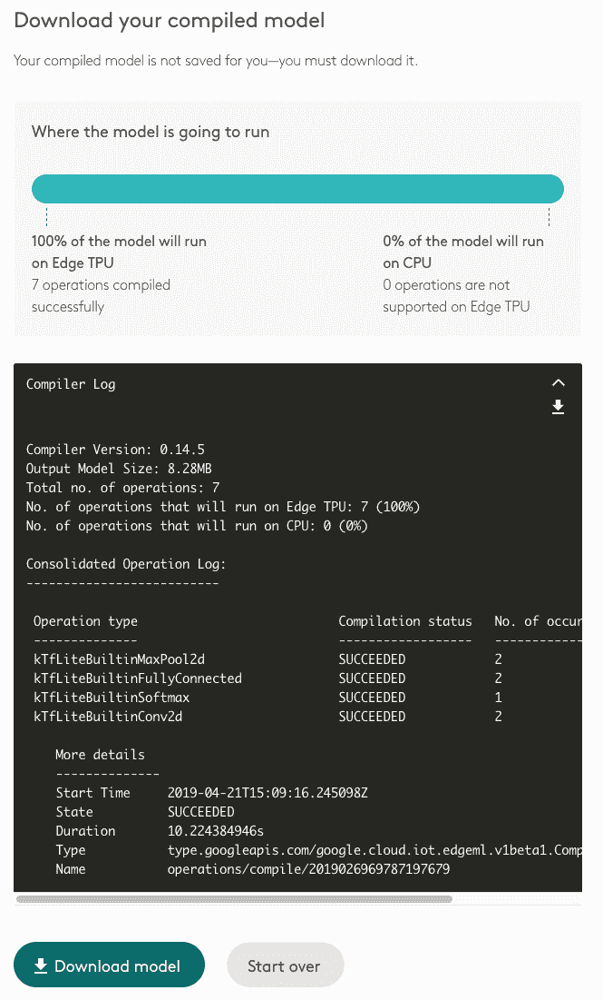

如果你没有，很可能意味着你没有遵守[要求](https://coral.withgoogle.com/docs/edgetpu/models-intro/)。

现在让我们编写代码来进行推断。这个 [edge-tpu API](https://coral.withgoogle.com/docs/edgetpu/api-intro/) 使用起来非常简单。你必须使用[分类引擎](https://coral.withgoogle.com/docs/reference/edgetpu.classification.engine/#edgetpu.classification.engine.ClassificationEngine)或者[检测引擎](https://coral.withgoogle.com/docs/reference/edgetpu.detection.engine/#edgetpu.detection.engine.DetectionEngine)。两个引擎都扩展了[基础引擎](https://coral.withgoogle.com/docs/reference/edgetpu.basic.basic_engine/#edgetpu.basic.basic_engine.BasicEngine)，并提供了加载模型和运行推理的简单方法。我用来运行我们模型的 python 文件可以在[这里](https://github.com/NicMaq/edge-ml/blob/master/CIFAR10_Inference_EdgeTPU.py)找到。

一旦上传了 python 文件和资源(即 edge _ TPU _ 模型和至少一张来自 CIFAR10 的图片),您就可以运行该模型并验证它是否有效。您应该会看到这样的内容:

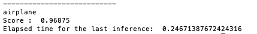

恭喜你！您已经使用 Google 加速器在 Raspberry Pi 上成功构建并运行了我们的量化模型。

值得注意的是，谷歌边缘-tpu API 允许在带有加速器的设备上进行训练。例如，如果你想进行在线学习，这是一个很棒的功能。

# 测试# 2:NCS 的推理

Movidius [早在 2017 年 7 月就宣布了神经计算棒](https://www.movidius.com/news/intel-democratizes-deep-learning-application-development-with-launch-of-mov)，目前领先谷歌几圈。这项技术支持更多的环境，并且有不同的 API 可以使用。

我开始玩英特尔 Movidius [NCSDK](https://movidius.github.io/ncsdk/install.html) 。NCSDK 包括一套用于编译、分析和验证深度神经网络的软件工具，还包括用于 C/C++或 Python 应用开发的英特尔 Movidius NCAPI。不幸的是，NCSDK V2 仅适用于 NCS V1。它不支持 NCS V2。(是的，这是令人困惑的。)

对于 NCS V2，你必须使用 OpenVino。OpenVino 是最近的一项开发，旨在统一 CPU、GPU、VPUs (Movidius)和 FPGA(Altera)的不同英特尔平台。我真的很喜欢 OpenVino 架构，它让你根据你的目标使用不同的 OpenVino 插件。

我唯一的遗憾是 NCSDK 非常强大，提供了大量的定制功能；很遗憾我不能在这里玩它。另一方面，我喜欢 OpenVino 与 OpenCV 的结合。这对以后肯定有帮助。最后但同样重要的是，令人惊讶的消息是 [NCSDK](https://github.com/movidius/ncsdk/) 和 [OpenVino](https://github.com/opencv/dldt) 都是在 Apache License 2.0 下获得开源许可的。

关于为你的覆盆子寻找合适的 OpenVino 软件包，我建议访问[英特尔下载中心](https://download.01.org/opencv/2019/openvinotoolkit/)。我使用的是 l _ openvino _ toolkit _ raspbi _ p _ 2019 . 1 . 094 . tgz。请记住，您还需要在桌面上安装 open vino，因为在这里您将使用所有工具来编译、分析和验证您的 dnn。

要进行部署，请遵循英特尔针对 Raspberry 的[安装文档](https://docs.openvinotoolkit.org/latest/_docs_install_guides_installing_openvino_raspbian.html)。这是一个比谷歌环境更复杂的过程。(这是有道理的，因为选项越多，设置就越复杂。)

一旦你安装了 OpenVino 环境，你就可以使用一个非常酷的演示来链接三个模型。在下图中，你可以看到它们是如何工作的。第一个模型检测汽车。然后第二个模型检测牌照。第三个模型读取车牌。

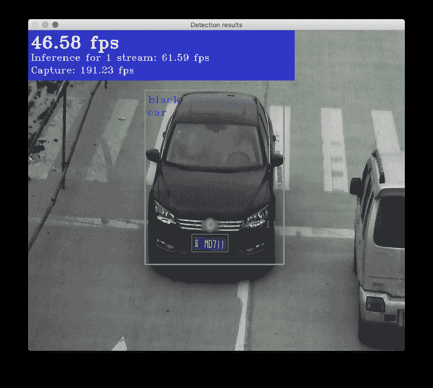

为了在 Raspberry 上移植我们的冷冻模型，我们必须使用[模型优化器](https://docs.openvinotoolkit.org/latest/_docs_MO_DG_Deep_Learning_Model_Optimizer_DevGuide.html)。模型优化器不在树莓上，这就是为什么你的桌面上需要 OpenVino。

模型优化器是一个非常强大的转换器，提供了许多不同的选项。对于不同的 ML 框架，有通用的参数，也有特定的参数。

你会在这个笔记本的末尾找到我用的参数。一旦有了这两个文件(。xml 和。bin ),你把它们移到树莓上的工作区。你还需要至少一张 CIFAR10 图片和 [python 文件](https://github.com/NicMaq/edge-ml/blob/master/CIFAR10_Inference_OpenVino.py)来做出推断。您应该会看到类似这样的内容:

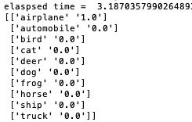

我花了一些时间玩 OpenVino API。我试图理解如何连接一对相机和使用深度模块。我还尝试使用 net.forwardAsync()来提高性能。我没有成功。OpenVino API 是最近才出现的，在功能方面似乎落后于 Movidius API。不幸的是，我认为我们必须再等一两个版本才能接触到这些高级特性。

# 相对表现:谷歌与英特尔

这两款 SOC 都具有令人印象深刻的规格和强大的处理能力。

Myriad X 是第三代英特尔 Movidius VPU(视觉处理单元)。该 SoC 设计用于在 30Hz 和 60Hz 下处理 8 个 RGB 传感器和 4k 处理。它每秒处理 7 亿像素。该芯片使用 20 多个硬件加速器来执行光流和立体深度。除此之外，16 个可编程 128 位矢量处理器使您能够运行多个并行视觉应用流水线。

不幸的是，谷歌给出的关于边缘 tpu 的信息少得多。他们确实分享了边缘 tpu 的图形处理单元有 4 个着色器，每秒处理惊人的 1.6 千兆像素。此外，谷歌声称视频处理单元能够处理 H.265 中的 4kp60 和 mpeg 2 中的 1080p60。

理论上，英特尔 SoC 似乎比 edge-tpu 更强大。

两款设备的性能功耗比似乎都非常好。下面两张图片显示了这两款设备在静止状态下的功耗。看起来 NCS V2 需要更多的兆瓦，但这需要在压力下得到证实。谷歌善意地通知我们，在安装期间，加速器可能会变得非常热。在任一款 Raspberry Pi 上运行对象检测时，我都没有注意到任何明显的温度变化。很可能 Pi Cam 规范和 USB-2 限制使得很难将设备置于足够的压力下。

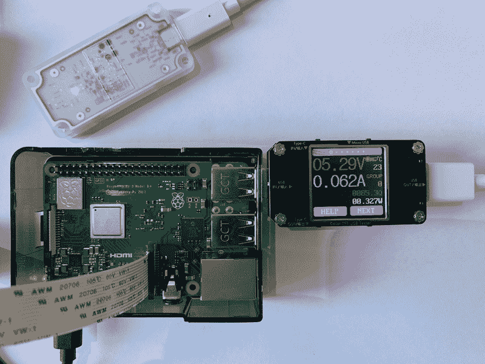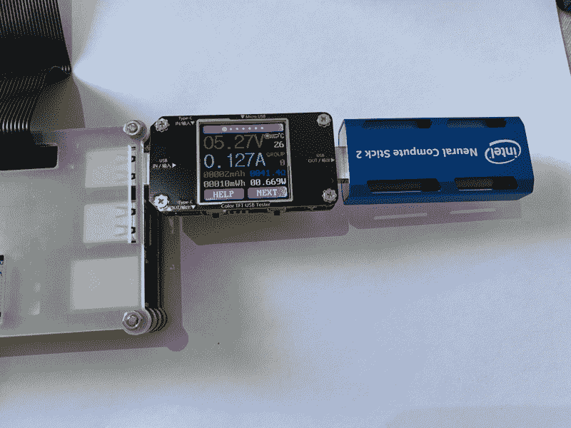

为了加载设备，我做了一个非常短的 python 程序，其中一个循环总是使用相同的图像进行推理。这个想法是为了降低 usb2 总线的发生率，但 wireshark 的一个快速会话显示，每次我们做出推断时，图像都会移动。

我在 mobilenet v1 上为 Myriad 测得的每次推理为 70 毫秒，在 mobilenet v2 上为 edge-tpu 测得的每次推理为 60 毫秒，在 Raspberry 上为 550 毫秒。mobilenet v2(347 万 MAC)及其瓶颈层比 v1(424 万 MAC)需要更少的计算。人们普遍认为 mobilenet v2 比它快 15%到 30%。因此，在 Raspberry Pi 上，这两款设备将处于同一领域，以微弱优势领先于 Myriad。

记住 python 不是性能的最佳选择也很重要。这两款设备都有可用的 C++ API，这是我获得最佳性能的选择。有趣的是，您可以堆叠英特尔 Movidius NCS，这是一个非常好的功能。

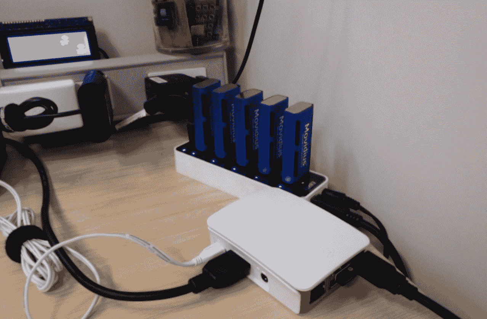

考虑到这两款设备的规格，性价比最终非常相似。谷歌加速器售价 74.99 美元，英特尔 NCS V2 售价 99 美元。你可以随时买到 V1 的 Movidius，价格是 74 美元。

设计因素也非常相似，使得在任何项目中集成 usb 密钥都很容易。谷歌加速器比 NCS V2 更薄，但必须用 USB-C-to-USB-2 电缆连接。英特尔解决了一个关于 V1 的抱怨:在树莓上，V1 的设计覆盖了不止一个 USB 端口。V2 只覆盖了一个。

# 结论

两款设备的处理能力允许开发人员处理广泛的用例。

许多预先编译的网络很容易得到快速和良好的结果。然而，完全量化你自己的网络仍然是一项高级任务。转换需要对您的网络和操作方式有深入的了解。此外，从 FP_32 到 FP_16 以及从 FP_16 到 UINT，精度损失也很大。有趣的是，当谷歌加速器只处理 8 位定点时，Myriad 处理半浮点。这意味着 Myriad 将产生更多的准确性。

英特尔和谷歌显然采取了两种截然不同的方法。谷歌的优势在于，从谷歌云平台到边缘 tpu，人们可以很容易地构建和营销一个集成的工作流程。我真的很喜欢所有组件的组合方式。另一方面，英特尔提供了英特尔中介表示和 Openvino 插件，开发人员可以使用这些插件来优化他们的网络，以便在各种硬件上运行。OpenVINO 目前支持英特尔 CPU、GPU、FPGAs 和 VPUs。英特尔面临的挑战是，统一战略总是难以利用每个组件的高级功能。

这两个系统都提供了大量的高级功能。谷歌加速器能够在线训练你的网络，这对迁移学习至关重要。显然，谷歌认为他们预先训练的网络和迁移学习提供了一个非常有效的组合。英特尔 NCS 有三对内置的立体深度硬件，这对许多用例来说是无价的，如物体回避。

我非常喜欢成为英特尔社区的一员。成员们非常乐于助人。我没有得到谷歌的帮助，但这肯定是因为它的产品线非常年轻。英特尔的文档非常丰富，尽管有时令人困惑。在我进行这个实验的时候，Google 的文档几乎不存在。从那时起，我注意到这种情况正在迅速改善，我希望很快看到一个非常好的学习平台(colab ),拥有大量的资源。

边缘的推论绝对是爆炸式的，可以看到惊人的市场预测。根据 ABI 的研究，2018 年边缘人工智能处理的出货量收入为 13 亿美元。到 2023 年，这一数字预计将增长到 230 亿美元。

显然，一种解决方案不会适合所有人，因为企业家正在寻找部署机器学习的新方法。看看这两家公司最终会获得多少市场份额将是一件有趣的事情。我敢打赌，谷歌云平台将推动许多转移学习应用程序在边缘发光，而英特尔将与许多合作伙伴一起管理各种硬件上的非常多样化的项目。

无论是哪种情况，有一点是肯定的，那就是我们现在拥有在边缘创新和加速第四次工业革命的工具。

我希望这份报告能帮助你实现你的目标，或者至少在你的项目上节省一点时间。我欢迎这方面的任何反馈，并随时欢迎新的机会。