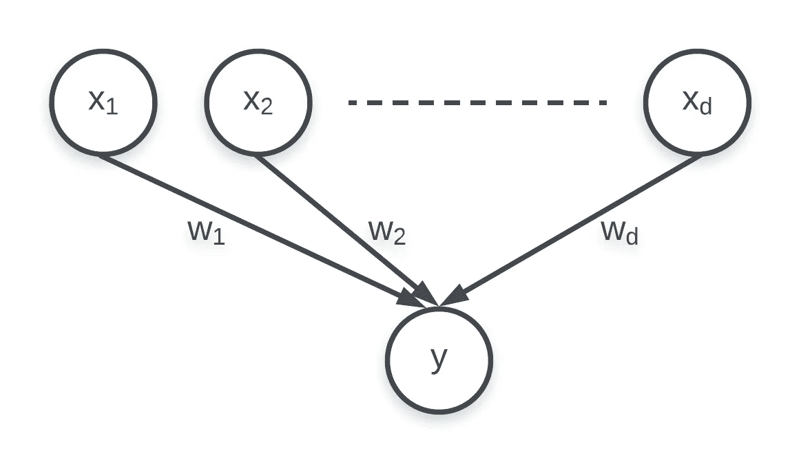

# 使用 EM 算法的推理

> 原文：<https://towardsdatascience.com/inference-using-em-algorithm-d71cccb647bc?source=collection_archive---------10----------------------->

## 深入了解 EM 算法的魔力，并开始训练您自己的图形模型

# 介绍

这篇文章的目标是解释统计分析中一个强大的算法:期望最大化(EM)算法。它之所以强大，是因为它有能力处理缺失数据和未观察到的特性，这些用例在许多现实应用程序中经常出现。

> 完成这篇文章后，你将能够理解许多使用概率图形模型解决有趣问题的研究论文，并且获得自己开发和训练这种模型的能力。

## 先决条件

*   耐心(因为这篇文章很详细，并且深入数学概念)。
*   基本概率概念。
*   逻辑回归。
*   迭代优化技术，如梯度上升。

# 观察特征的情况

在深入研究复杂用例之前，先了解简单用例中的参数是如何估计的会有所帮助。因此，我们首先考虑我们的数据不包含任何缺失值并且我们的模型没有任何潜在特征的情况。为此，我们将借助逻辑回归模型。

假设我们有一个数据集，每个数据点由一个 ***d*** 维特征向量 ***X*** 和一个相关联的目标变量***Y****∈{ 0，1}组成。该模型的图示如下:*

**

*众所周知，逻辑回归中目标变量的预测概率由如下 sigmoid 函数给出:*

**

***equation 1***

*其中 ***w*** 为待估计的权重向量。一旦我们估计了参数***【w】***、，我们就可以根据***【Y】***= 0 或 ***Y*** =1 是否根据`equation 1`获得更大的概率来产生未观测数据点的输出。然而，这里的核心问题是:我们怎样才能逼近 ***w*** 从而产生准确的预测？为此，我们将使用最大似然法。*

> *最大似然法的前提很简单:找到使观测数据的似然性(或概率)最大化的参数 **w** 。*

*为了[数学上的便利](https://math.stackexchange.com/questions/892832/why-we-consider-log-likelihood-instead-of-likelihood-in-gaussian-distribution)，我们将考虑最大化可能性的 ***对数*** 。由 ***w*** 参数化，对数似然可以写成:*

**

*equation 2*

*这里，在数据样本独立同分布的假设下(所谓的 [*i.i.d .假设*](https://en.wikipedia.org/wiki/Independent_and_identically_distributed_random_variables) )，观察数据的似然性被表示为各个数据点的似然性的乘积。我们还利用了这样一个性质:一个 ***对数*** 表达式中各项的乘积相当于单个项的 ***对数*** 的总和。将`equation 2`中的`equation 1`替换为:*

**

*equation 3*

*这里我们用到了这样的知识:当 ***y_i*** =1，else***σ*(*w . X _ I*)w . X _ I***

> *在这一点上，我们应该注意到 log-likelihood，**L*(*w*)****，* 可以方便地分解为每个实例的形式，并且不同参数之间没有耦合，这大大简化了优化。我们将在后面看到，这在许多现实场景中可能无法实现。*

*由于***L*(*w*)**是 ***w*** 的一个函数，所以我们对`equation 3`没有任何封闭形式的解。因此，我们将不得不使用*迭代优化方法*像梯度上升找到 ***w*** 。梯度上升法的更新如下所示:*

**

*equation 4*

*其中 ***η*** 为学习率。我们重复`equation 4`中的过程，直到收敛，最后得到的*称为*最大似然估计*。**

# **潜在特征的情况**

**现在我们准备深入更复杂和更现实的用例。在大多数现实场景中，数据集中通常会有缺失值，或者选择具有与数据中观察到的特征相关的潜在(未观察到的)特征的复杂模型。**

> **一个使用潜在特征的模型是[隐马尔可夫模型](https://en.wikipedia.org/wiki/Hidden_Markov_model)。它被广泛使用，并具有一系列真实世界的应用，如语音识别、手写识别、手势识别、词性标注、乐谱跟踪、时间序列分析等。**

**然而，问题是:*具有潜在特征对参数的估计有影响吗*？原来，*是的*。如果涉及潜在特征(或缺失数据)，估计模型参数确实有点棘手。我们来看看为什么。**

## **问题**

**设 ***V*** 为观察变量集合， ***Z*** 为潜在变量集合， ***θ*** 为模型参数集合。如果我们考虑参数估计的最大似然法，我们的目标 1 函数将是:**

****

**equation 5**

> **比较`equation 5`和`equation 2`，我们可以看到，在后一种情况下，由于**测井**内的求和，参数是耦合的。这使得使用梯度上升的优化(或一般的任何迭代优化技术)变得难以处理。这意味着许多现实场景需要更强大的技术来推断参数。**

# **EM 算法拯救世界**

**谢天谢地，研究人员已经想出了这样一个强大的技术，它被称为**期望最大化** **(EM)算法**。它利用了这样一个事实，即当我们知道***【Z】***的值时，优化完整数据对数似然 ***P* ( *V，Z | θ* )*** 要容易得多(因此，从 ***log*** 内部移除求和)。**

> ********* 向前看，为了标记简单起见，我们将 **Y** 视为 **V** 的一部分。**

**然而，由于知道 ***Z*** 的值的唯一方法是通过后验 ***P* ( *Z | V，θ* )** ，我们转而考虑潜变量后验分布下的完全数据对数似然的期望值。这个寻找期望值的步骤被称为**电子步骤**。在随后的 **M 步**中，我们最大化这个期望来优化 ***θ*** 。**

**形式上，EM 算法可以写成:**

```
**1\. Choose initial setting for the parameters ***θ^old***2\. **E Step** Evaluate ***P(Z | V, θ^old)***3\. **M step** Evaluate ***θ^new*** given by**
```

****

```
**4\. Check for convergence of log likelihood or parameter values. If not converged, then ***θ^old***=***θ^new*** and return to the E step.**
```

# **深入新兴市场**

**在深入研究之前，首先，我们将推导一个在解释 E 和 M 步骤时会派上用场的属性。**

**让我们考虑潜在变量的分布***q*(*Z*)**。独立于***q*(*Z*)**的选择，我们可以按以下方式分解观察数据的可能性:**

****

**equation 6**

> ***第一步，我们分别应用概率边际化概念和贝叶斯定理。**
> 
> ***第二步，我们将**日志**中的**q*(*Z*)***相乘，并分别应用“乘以**日志**中的项相当于项的**日志**的和”属性。**

**`equation 6`中的第二项是两个分布之间众所周知的距离度量，称为 [Kullback-Leibler 散度](https://rishabhmisra.github.io/Machine-Learning-Glossary/#KLD)。**

**此时，我们应该仔细研究一下`equation 6`的形式。第一项包含在 ***V*** 和 ***Z*** 上的联合分布，而第二项包含给定 ***V*** 的 ***Z*** 的条件分布。KL 散度的一个性质是它总是非负的。利用`equation 6`中的这个性质，我们可以推导出 ***L* ( *q，θ*)***≤***ln p*(*V |θ*)**。***

> **这意味着 **L *(* q，θ *)*** 作为观察数据的对数似然的下界。**

**这个观察，很快，将有助于证明 EM 算法确实最大化了对数似然。**

## **电子步骤**

**假设参数向量 ***θ*** 的初始值为`***θ^old***`***——(步骤 1)*** 。记住由`equation 6`给出的关系，E 步试图最大化下限***L*(***`***θ^old***`**)**相对于 ***q*** ，同时保持`***θ^old***`固定。注意到***ln p*(*V |θ*)**的值不依赖于***q*(*Z*)**，因此 ***L* ( *q，*** `***θ^old***` **)** 的最大值将在 KL 背离消失时出现 或者换句话说当***q*(*Z*)**等于后验分布 ***p(Z | V，***`***θ^old***`***)***(因为 ***ln*** 1 求值为 0)。***

**因此，E-step 涉及评估 ***p(Z | V，***`***θ^old***`***)——(Step 2)*****

****

**Illustration of E-step. [1]**

## **m 步**

**在该步骤中，分配***q*(*Z*)**保持固定。如果我们把 E-step 中的***q*(*Z*)**=***p(Z | V，***`***θ^old***`***)***代入表达式中的 ***L* ( *q，θ* )** ( `equation 6`，我们看到，下界**

****

**equation 7**

**其中该常数仅仅是 ***q*** 分布的负熵，因此与 ***θ*** 无关。**

**所以，在 M 步中，我们最大化下界 ***L* ( *q，θ* )** 相对于 ***θ*** 给出一些新值`***θ^new***` ***。*** 这将引起下界 ***L* ( *q，θ* )** 增大，必然引起相应的对数似然函数增大。***——***(第三步)**

****

**Illustration of M-step. [1]**

**由于分布 ***q*** 在 M 步期间保持固定，所以它将不等于新的后验分布 ***p(Z | V，***`***θ^new***`***)***)，因此将存在非零 KL 散度。因此，我们再次重复 E 和 M 步骤，直到收敛。***——***(第四步)**

## **把所有的放在一起**

**我知道一下子很难消化。因此，我将尝试在下图的帮助下总结讨论，这应该有助于将这些点联系起来。**

****

**How E and M step maximize the likelihood. [1]**

****红色**曲线描绘的是不完全数据对数似然性，***ln p*(*V |θ*)**，我们希望最大化。在第一个 E 步骤中，我们从一些初始参数值`***θ^old.***`开始，我们评估潜在变量的后验分布，***【p(Z | V，***`***θ^old***`***)***，这产生了一个下界***L*(***`***θ^old***`【T71)，其值等于在 M 步中，界限被最大化，给出值`***θ^new***`，这给出了比`***θ^old***`更大的对数似然值。随后的 E 步骤构建一个在`***θ^new***`相切的边界，如绿色**曲线**所示。***

> **在每一步中，我们看到所获得的参数增加了对数似然，并且该过程一直持续到收敛。**

# **结束语**

**这结束了一篇关于 EM 算法的相当激烈的数学文章。然而，深入理解这个算法是一个很好的时间投资，如果您想开发自己的图形模型来解决具有挑战性的问题，它确实证明是有帮助的。如果你正在寻找一个示例问题和代码，你可以参考我的这个 [GitHub repo](https://github.com/rishabhmisra/T-JMARS) ,在那里我们解决了将方面、评级和情绪与评级预测任务的时间动态联合建模的挑战。**

## **参考**

**[1]纳斯拉巴迪 NM。**模式识别和机器学习**。电子成像杂志。2007 年十月；16(4):049901.**

**原贴@[https://rishabhmisra . github . io/Maximum-Likelihood-Estimates-Motivation-For-EM-Algorithm/](https://rishabhmisra.github.io/Maximum-Likelihood-Estimates-Motivation-For-EM-Algorithm/)**

## ****引文****

**如果您在研究中使用了此处介绍的作品，请使用以下格式之一引用它:**

****文本格式:****

**米斯拉里沙卜。"使用 EM 算法进行推理."*中*，*向数据科学* (2019)。**

****BibTex 格式:****

**@misc{misrainference2019，
author={Misra，Rishabh}，
title = {推理使用 EM 算法}，
URL = { https://Medium . com/forward-Data-Science/推理使用-em-algorithm-d71cccb647bc}，
journal={Medium}，
publisher = { forward Data Science }，
year={2019}，
month={Feb}
}**