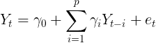

# 推断时间序列数据中的因果关系

> 原文：<https://towardsdatascience.com/inferring-causality-in-time-series-data-b8b75fe52c46?source=collection_archive---------3----------------------->

## 对主要方法的简要回顾。

什么事件引起了另一个事件，或者什么导致了一个现象的某种变化，这是一个常见的问题。例子包括药物是否导致某些医疗状况的改善(相对于安慰剂效应，额外的医院就诊，等等。)，跟踪装配线故障的原因或确定网站流量激增的原因。

虽然对这个问题的天真解释可能会提出一些简单的方法，如将因果关系等同于高度相关性，或者从作为 *y* 预测者的 *x* 的良好程度来推断 *x* 导致 *y* 的程度，但事实证明这个问题要复杂得多。结果，在几个科学领域中发展了处理这个问题的严格方法。

因果推理的任务分为两大类:

1.  代表不同事件的随机变量的因果推理。最常见的例子是两个变量，每个变量代表 A/B 测试的一个选择，每个变量都有一组与之相关的样本/观察值。
2.  时间序列数据上的因果推断(以及随机过程)。例如，确定每日股票总价格是否(以及在何种程度上)驱动每日交易量，或者太平洋沙丁鱼渔获量、北方凤尾鱼渔获量和海面温度之间的因果关系。

这篇文章只讨论第二类问题。

## 范围

这篇文章旨在对学术文献和在线资源中发现的用于推断时间序列数据因果关系的主要方法、从这些方法得出的方法及其代码形式的实现进行简明的技术综述。

它旨在触及(1)经典的*统计*方法，主要创建于*计量经济学*研究领域，包括现代发展(2)和来自各种其他研究团体的改编和原创方法，如处理动态系统或信息理论的方法。

因果推理的一般主题既太大又不能直接适用于本文。对于一般的因果推理(在许多情况下，这是在一般的概率分布或其样本上进行的，而不是在时间序列数据上)和机器学习之间的交集来说，也是如此。尽管如此，我还是在 [*其他著名文献*部分](#7116)中收录了一些我在这些主题上遇到的著名资源。

## 组织和符号

概述有时以引用格式在正文中给出，而可选注释以可点击的[脚注](#7369)给出(每个脚注都有一个链接，让你回到它的起源)。还提供了一个[可点击的目录](#2c77)来帮助导航。我已经添加了[📖](#2c77)链接到每一节的页眉；点击它可以快速返回目录。最后，[文章附有所用文献的完整参考文献](#be26)。

## 必需的背景

这篇文章是用技术语言写的，虽然我显然不能像这篇文章中引用的学术论文那样深入，但我不会回避包括方程、符号和需要技术背景才能理解的文本。 [⁹](#f6dd)

因此，我们假设你至少有一门完整的概率统计本科理论课程的背景，或者相当于这门课程，包括所需的数学背景。如果你不熟悉随机过程理论，[你可以在我关于时间序列数据平稳性的文章](/stationarity-in-time-series-analysis-90c94f27322)中找到它的简明评论。进一步阅读需要熟悉这个理论，因为它是时间序列中因果关系的统计概念建立的框架。

## 目录

1.  [背景:时间序列数据中因果关系的概念](#99db)
    - [格兰杰因果关系](#b1c3)
    - [西姆斯因果关系](#027c)
    - [结构因果关系](#703c)
    - [干预因果关系](#cc60)
2.  [时间序列数据因果关系推断的经典方法](#1c91)
    - [非定向滞后相互作用](#8467)
    - [格兰杰因果关系的参数 VAR 检验](#1920)
3.  [时间序列数据的替代参数格兰杰因果测度](#bd73)
    - [条件格兰杰因果指数【CGCI】
    -](#4dd7)[基于 MLP 的格兰杰因果 F 检验](#92d1)
    - [格兰杰因果 RBF 模型](#bdef)
    - [部分格兰杰因果指数(PGCI)](#bc61)
    - [定向一致性测度](#b0cf)
4.  [时间序列数据的替代非参数因果性度量](#c456)
    -[Bouezmarni-Taamouti 检验](#41c1)
5.  [时间序列数据因果推断的混沌与动态系统理论方法](#40e5)
    -[Hiemstra-Jones 检验](#d04b)
    -[Diks-Panchenko 检验](#757c)
    - [扩展的格兰杰因果指数(EGCI)](#00b2)
    - [收敛交叉映射(CCM)](#e22c)
6.  [时间序列数据因果关系推断的信息论方法](#9666)
    - [粗粒度传递信息率(CTIR)](#be63)
    - [基于传递熵的度量](#660a)
    - [混合嵌入互信息(MIME)](#f554)
7.  [时序数据因果推理的图形化方法](#8e8a)
    - [因果图搜索算法(SGS、PC 和 FCI](#30ae))
    -[PCMCI](#586a)
    -[Lasso-Granger](#c413)-[Copula-Granger](#4946)
    -[正反向 Lasso Granger (FBLG)](#c254)
8.  [选择使用哪种方法](#5771)
9.  [人员跟随](#6ac5)
10.  [其他值得注意的文献](#afd4)
11.  [参考文献](#be26)
    - [学术文献:因果关系及因果推断](#711d)
    - [学术文献:时间序列数据中的因果推断](#4da2)
    - [学术文献:其他](#77f4)
    - [其他网上来源](#c239)
12.  [脚注](#7369)

# 背景:时间序列数据中因果关系的概念

多年来，统计和经济学学者提出了许多不同的因果关系概念。我在这里给出了主要的概述。这部分内容部分基于[Eichler，2011 年]和[ [Runge，2014 年](https://edoc.hu-berlin.de/handle/18452/17669) ]。[📖](#2c77)

## 格兰杰因果关系 [⁸](#0176)

格兰杰[1969，1980]在[维纳，1956]的基础上提出了时间序列数据因果关系的最早概念。它是基于对比使用*宇宙中的所有信息*预测随机过程 *Y* 的能力，用 *U* 表示，以及使用 *U* 中的所有信息预测随机过程 *X* 的能力；这用 *U\X* 表示。核心思想是，如果丢弃 X 降低了关于 Y 的预测能力，那么 X 包含一些关于 Y 的独特信息，因此我们说 *X 是 Y* 的格兰杰原因。

更正式地说:

*   设 *X* 和 *Y* 为平稳随机过程。
*   用𝒰ᵢ *=(U* ᵢ₋₁ *，…，U* ᵢ₋∞ *)* 表示宇宙中直到时间 *i、*的所有信息，用𝒳ᵢ *=(X* ᵢ₋₁ *，…，X* ᵢ₋∞ *)* 表示直到时间 *i、*的所有信息。
*   用 *σ表示(Y* ᵢ *|* 𝒰ᵢ *)* 在时间 *i* 用𝒰ᵢ 预测 *Y* ᵢ的残差的方差。
*   用 *σ表示(y*ᵢ*|*𝒰ᵢ*\*𝒳ᵢ*)*预测残差的方差 *Y* ᵢ使用𝒰ᵢ 中所有信息在时间 *i* 除𝒳ᵢ.

**定义 1:** 如果*σ(y*ᵢ*|*𝒰ᵢ*)<σ(y*ᵢ*|*𝒰ᵢ*\*𝒳ᵢ*)*那么我们说 *X Granger-causes Y，*写*x y*。

**定义 2:** 如果*x y*和*y x*我们说*反馈*正在发生，写 *X* ⇔ *Y* 。

正如格兰杰自己指出的那样，获得宇宙中所有信息的要求是极其不现实的。实际上 *U* 被一组有限的观测时间序列*代替，其中*X∈****X***，上述定义为 *X 格兰杰原因 Y 相对于* ***X*** 。*

*最后，该定义没有指定用于 *σ* 的预测方法，因此允许线性和非线性模型，但是使用方差来量化预测的接近程度将这种因果关系的概念限制为平均因果关系。*

*这个概念通常被称为*强格兰杰因果关系*；其他相关的因果关系概念有*均值格兰杰因果关系*【格兰杰 1980，1988】和*线性格兰杰因果关系*【ho soya 1977，Florens 和 Mouchart 1985】。*

***瞬时因果关系:**一种相关的因果关系，稍微修饰一下格兰杰因果关系，就是*瞬时因果关系*【普莱斯，1979】。如果在时间 *i* 时，将 *Xᵢ* 添加到信息集中有助于提高 *Yᵢ* 的预测值，我们说 x 和 y 之间具有*瞬时因果关系*。*

*更正式地说:*

*   *设 *X* 和 *Y* 为平稳随机过程。*
*   *用𝒰ᵢ *=(U* ᵢ₋₁ *，…，U* ᵢ₋∞ *)* 表示宇宙中直到时间 *i、*的所有信息，用𝒳ᵢ *=(X* ᵢ₋₁ *，…，X* ᵢ₋∞ *)* 表示直到时间*I、*的所有信息(在两者中*

***定义三:**如果*σ(y*ᵢ*|*𝒰ᵢ*∪{xᵢ})<σ(y*ᵢ*|*𝒰ᵢ*)*那么我们说 *X* 和 *Y* 之间存在*瞬时因果关系。**

*请注意，这种类型的因果关系不是定向的，而是对称的，可以证明，如果上述定义成立，那么对称陈述——即*σ(xᵢ|𝒰ᵢ∪{yᵢ})<σ(xᵢ|𝒰ᵢ)*——也成立(见[Lütkepohl，2007]的证明)。因此，我们并不是说 *X* 瞬间导致 *Y* ，而是说 *X* 和 *Y* 之间存在瞬间因果关系。*

***多步因果关系:**在一个双变量系统中，如果一个变量的 1 步提前预测不能通过使用另一个变量中的信息来改善，则对于任何 *h=1，2，…* 的所有 *h* 步预测都是如此，因此 1 步提前标准足以定义格兰杰因果关系。如果信息集包含额外的变量，这个结果不再成立。[吕特科波尔和米勒，1994 年]*

*因此，在一个多变量系统中，我们说变量 *Xᵢ* 是另一个变量 *Yᵢ* 的 *h* ，如果 *Xᵢ* 中的信息有助于提高对某些 *j=1，2，…，h* 的*j*-步长预测。*

## *西姆斯因果关系*

*在一篇有影响力的论文中，[Sims，1972]表明——在[协方差平稳过程](https://en.wikipedia.org/wiki/Stationary_process#Weak_or_wide-sense_stationarity)的背景下，并限于线性预测器——在二元情况下，格兰杰因果关系的定义相当于过程 x[t]，y[t]的移动平均或分布[滞后](https://en.wikipedia.org/wiki/Lag_operator)表示的参数限制。当系统是协方差稳定时，它可以表示为:*

**

*Equation 8: The Sims representation for covariant stationary processes*

*其中 *aⱼ* 、 *bⱼ* 、 *cⱼ* 和 *dⱼ* 为常数，*u【t】*和*v【t】*为互不相关的[白噪声过程](https://en.wikipedia.org/wiki/White_noise#White_noise_vector)。西姆斯表明，条件 *x[t]不是格兰杰原因 y[t+1]* 等价于 *cⱼ* 或ⱼ对于所有 *j* 被选择为相同的零。*

*格兰杰的定义认为时间优先是从过去到现在的一种联系，与之相反，西姆斯的概念认为时间优先是从现在到未来的一种联系。因此，所考虑的潜在因果关系是从因变量到回归变量的未来值或“线索”。*

*当它在[Sims，1972]中被引入时，它是作为格兰杰定义的一个等价定义提出的，但此后它与格兰杰定义形成对比，并被证明当所使用的时间序列的非相关性度量是独立性时，它是不等价的[Florens 和 Mouchart，1982]；相反，它表明格兰杰因果关系是一个更强的条件，而格兰杰因果关系意味着西姆斯因果关系，反之则不成立。*

*尽管存在这种不等价性，大多数时间序列数据因果推断的统计检验都集中在格兰杰的定义上。然而，至少在使用[向量自回归(VAR)](https://en.wikipedia.org/wiki/Vector_autoregression) 模型的情况下，可以修改这些测试来测试西姆斯的因果关系(参见这里的[示例，该示例强调了线性情况](https://www.economicsnetwork.ac.uk/showcase/cook_causality)的测试之间的差异)。*

## *结构因果关系*

*由 [White 和 Lu (2010)](https://pdfs.semanticscholar.org/6503/b0aefe6a04566cc81c264d19f95eb7391f53.pdf) 提出的结构因果关系假设数据生成过程具有一个递归的动态结构，在这个结构中，前趋者在结构上决定后趋者。具体来说，对于两个过程 X——潜在原因——和 *Y* —响应，我们假设它们是由*

**

*Equation 9: The structural causality DGP*

*对于所有的 *t∈Z* 。这里，过程 *Z* 包括所有相关的观测变量，而 *U=(Uₓ，Uᵧ)* 的实现被假设为不可观测的，函数 *q[x，t]* 和 *q[y，t]* 被假设为未知的。*

*观察到这种动态结构是通用的，因为结构关系在它们的论证中可能是非线性和非单调的，并且在可观察和不可观察之间是不可分的。不可观察的事物在数量上可能是无限的。最后，该系统可以产生平稳过程、非平稳过程或两者。*

*然后可以定义因果关系的结构概念:*

**

*作者接着分析了格兰杰因果关系和结构因果关系之间的关系。此外，基于格兰杰因果关系的经典概念，他们引入了两个扩展:*弱格兰杰因果关系*和*追溯弱格兰杰因果关系*。*

*最后，作者对他们的两个格兰杰因果关系概念进行了实际检验。具体来说，*弱格兰杰因果关系*可以通过测试响应的条件独立性 *Y* 和潜在原因 *X* 来检测，给出响应的历史和过程的可观察协变量的近期历史。*

## *干预因果关系*

*朱迪亚·珀尔(Judea Pearl)倡导将干预作为因果推断统计理论的基础，这至少可以追溯到 90 年代早期[珀尔和维尔马，1991 年][珀尔，1993 年]。然而，它对时间序列数据的应用直到最近才开始得到严格的处理[【怀特，2006】](https://pdfs.semanticscholar.org/c3ce/5f5b8a240a043111db449cd4949c9c75e78d.pdf)[艾希勒和迪德勒兹，2007】](https://people.maths.bris.ac.uk/~maxvd/uai_time_07.pdf)。这种因果关系的方法与经济学中的[脉冲响应分析](https://en.wikipedia.org/wiki/Impulse_response)密切相关。*

*Eichler 和 Didelez 定义了一组可能的干预机制，对应于具有 *d* 分量的多变量平稳时间序列 *X* 中不同的可能干预类型。干预由干预指示符 *σ* 表示，其在 *{∅、s∈ 𝓢}* 中取值；我用 *Xₐ* 表示 *X* 中的一个组件，用 X *ᶸ* 表示 *X* 中组件的子集，其中 a *∈V* 和 *U⊂V* 表示 *V={1，…d}* 。我还使用 *σₐ* 来表示对组件 *Xₐ* 的干预。*

*干预类型包括:*

1.  **空闲状态*:当 *σ* ₐ *(t) = ∅时，X* ₐ *(t)* 自然产生，无需干预。又名*观测体制*。*
2.  **原子干预*:此处 *𝓢=X* ， *xₐ* ，*t49】， *σₐ(t) = x* ⦁表示强制 *Xₐ(t)* 取值 x⦁.的干预**
3.  **条件干预*:这里 *𝓢* 由函数
    *g(xᶸ(t-1))∈X、U⊂V* 组成，这样 *σₐ(t)=g* 的意思是 *Xₐ(t)* 被迫取一个值，这个值取决于 *Xᶸ(t=1)* 的过去观察值。*
4.  **随机干预:*这里的 *𝓢* 由分布
    组成，意思是 *Xₐ(t)* 被迫从这样的分布中产生。*

*然后，在确保干预是系统的孤立外生变化的一些假设下，根据策略 *s* 的*干预在 *X* 中对响应变量*y【t `】*的平均因果效应* (ACE)定义为(假设 w.l.o.g .认为 *𝔼[Y[t`]]=0* ):*

**

*Equation 10: The *average causal effect* (ACE) of interventions according to strategy *s**

*因此，*ACE【s】*可以视为不干预和干预策略 *s* 之间的平均差。此外，可以通过考虑*ace【s*₁*—ace【s*₂*，或者干预后分布*ℙ[s](y[t`】*的其他泛函来比较不同的策略。**

**现在，先验地，没有理由为什么不是在感兴趣的干预制度下收集的数据应该允许估计 *ACE* 。然而，作者随后继续展示了使用他们所谓的*后门标准*用观测体系下已知或可估计的量来表达 *ACE* 的可能性。**

**我发现这是时间序列数据中因果关系与非常有影响力的基于干预的一般因果关系概念的非常优雅的调和。**

**此外，[Samartsidis 等人最近的一篇论文](https://arxiv.org/abs/1804.07683)提供了对其他方法的全面审查，这些方法用于评估针对*二元干预*【Samartsidis 等人，2018】具体案例的综合时序观察数据中的干预因果效应。**

> ****注:**干预因果关系的概念与这里提出的其他三个概念根本不同；虽然格兰杰因果关系，西姆斯因果关系和结构因果关系都假设一个观察框架，干预因果关系作出了更强有力的假设，干预可以在研究过程中进行。因此，它在许多现实生活场景中明显不太适用。**

# **时间序列数据中因果关系推断的经典方法[📖](#2c77)**

**本节涵盖了基于经典统计方法的两种最基本的因果关系推断方法。**

## **非定向滞后相互作用**

**推断两个时间序列 *X* 和 *Y* 之间因果关系的最基本方法可能是使用潜在原因时间序列[滞后](https://en.wikipedia.org/wiki/Lag_operator)(后移)版本 *X* 与(非滞后)潜在原因时间序列 *Y* 之间对应关系的非定向测量。**

**如果在 *X* 的*k*-滞后和(非滞后) *Y* 之间发现高度对应，那么可以推断出*X*-导致- *Y* 的非常微弱的概念；因此，从以下事实推断出方向:滞后 *X* 与 *Y* 高度对应。可以使用各种对应措施；其中有皮尔逊相关(如[Tsonis 和 Roebber，2004])，互信息(如[Donges at al .2009])和相位同步(例如[Pikovsky 等人 2003])。**

**当选择的对应测量是皮尔逊相关时，这相当于查看两个时间序列的[互相关函数](https://en.wikipedia.org/wiki/Cross-correlation)的不同正负滞后，并将其在所选范围内达到的最大值作为因果联系的强度，滞后的符号指示因果方向。天真地说，如果函数在正负时滞上都达到正值，那么就可以推断出双向因果关系。在任何情况下，为了得到有效的解释，必须考虑两个系列的自相关性。**

**这种方法主要用于气候研究[Yamasaki 等人，2008 年] [Malik 等人，2012 年] [Radebach 等人，2013 年]。如 SIFT 在线手册第[章第 4.5 节所述，以及](https://sccn.ucsd.edu/wiki/Chapter_4.5._(Cross-)_correlation_does_not_imply_(Granger-)_causation) [Runge，2014](https://edoc.hu-berlin.de/handle/18452/17669) 第 5.2.1 节所述，它被证明存在可能产生误导性结论的重大问题。**

## **格兰杰因果关系的参数 VAR 检验**

**格兰杰因果关系的经典参数检验的简明分类见[Greene，2002]。这些年来，大量的测试被用来检验格兰杰因果关系。因此，我简单介绍一下我遇到的测试，集中在我能找到的用通用数据处理编程语言(如 Python 和 r)实现的测试上。**

**一般来说，这些测试的第一阶段是确保所有被检查的序列都是[平稳的](https://en.wikipedia.org/wiki/Stationary_process)——如果不是，通常通过趋势移除和/或[差分](https://people.duke.edu/~rnau/411diff.htm)使它们平稳。**

**然后，在成对测试中，对于每一对时间序列和每一个特定的因果方向*X Y*，生成一个(通常手动)数量的潜在原因序列的负(过去)滞后 *X* (包括零滞后，即 *X* 本身)。要采用的最大滞后长度是一个[模型选择](https://en.wikipedia.org/wiki/Model_selection)考虑因素，因此应该基于一些信息标准(例如 [Akaike 信息标准](https://en.wikipedia.org/wiki/Akaike_information_criterion)、[贝叶斯信息标准](https://en.wikipedia.org/wiki/Bayesian_information_criterion)等)进行选择。).**

> ****注:**如果检查大量配对，您还需要考虑如何处理[多重假设检验](https://en.wikipedia.org/wiki/Multiple_comparisons_problem)产生的问题。**

**以下所有情况中使用的模型是内生(潜在原因)时间序列 *Y* 作为随机过程的向量自回归模型；陈述了两个这样的模型。**

**第一个模型——称为限制模型——假设 *Y* 仅线性依赖于其自身的过去值，具有线性系数γ *ᵢ* 和时间相关噪声项*e【t】*:**

****

**Equation 11: The restricted model in a VAR-based Granger causality test**

**相反，第二种模型——称为无限制模型——假设 y 线性依赖于 x 和 y 的过去值，由系数 *αᵢ* 、*t27】β*ᵢ*和时间相关噪声项 u*【t】*确定:***

**

*Equation 12: The unrestricted model in a VAR-based Granger causality test*

*未格式化的零假设是当与第一个模型比较时，第二个模型不添加信息，或者提供更好的 Y 模型。这需要形式化为一个可测试的零假设；一种常见的方法是陈述零假设 *H₀* 是∀i*，βᵢ=0* 。*

*最后，以下测试程序之一适用于所有此类滞后 *X* 和无滞后 *Y* 对。为了检查两个方向上的因果关系，将 *Y* 的滞后添加到被检查系列的集合中。*

> ***注:**格兰杰因果检验对滞后长度的选择和处理时间序列非平稳性的方法非常敏感。*

***基于 SSR 的格兰杰因果关系 f 检验:**对限制和非限制模型的参数进行估计(通常使用[普通最小二乘法](https://en.wikipedia.org/wiki/Ordinary_least_squares))。然后使用两个序列的 [RSS](https://en.wikipedia.org/wiki/Residual_sum_of_squares) 计算 F 统计量[T5，由下式给出:](#6fd2)*

**

*Equation 13: RSS-based F statistic for Granger causality*

*其中 *T* 是时间序列长度，而 *p* 是滞后的数量。*

*此处和[处](https://www.statisticshowto.datasciencecentral.com/granger-causality/)给出了该测试[的双变量情况的一个很好的概述。在](https://support.sas.com/rnd/app/ets/examples/granger/index.htm)[*stats models*Python 包【Python】](https://www.statsmodels.org/stable/generated/statsmodels.tsa.stattools.grangercausalitytests.html#statsmodels.tsa.stattools.grangercausalitytests)，在[MSBVAR 包【R】](https://www.rdocumentation.org/packages/MSBVAR/versions/0.9-2/topics/granger.test)，[lmtest 包【R】](http://math.furman.edu/~dcs/courses/math47/R/library/lmtest/html/grangertest.html)，[NlinTS 包【R】](https://www.rdocumentation.org/packages/NlinTS/versions/1.3.5/topics/causality.test)和[vars 包【R】](https://www.rdocumentation.org/packages/vars/versions/1.5-3/topics/causality)中实现了一个二元版本。*

***Pearson 因果关系的卡方检验:**首先，利用 OLS 估计模型参数。使用两个系列的 [SSR](https://en.wikipedia.org/wiki/Residual_sum_of_squares) 计算卡方统计[T3，并执行](#c340)[皮斯龙卡方测试程序](https://en.wikipedia.org/wiki/Pearson%27s_chi-squared_test)。在[的 *statsmodels* 包【Python】](https://www.statsmodels.org/stable/generated/statsmodels.tsa.stattools.grangercausalitytests.html#statsmodels.tsa.stattools.grangercausalitytests)中实现了一个二元版本。*

***格兰杰因果关系的似然比卡方检验(亦称** [**G 检验**](https://en.wikipedia.org/wiki/G-test)**)**卡方统计  使用两个数列的似然比计算，并遵循[标准检验程序](https://en.wikipedia.org/wiki/G-test)。一个双变量版本在[stats models 包【Python】](https://www.statsmodels.org/stable/generated/statsmodels.tsa.stattools.grangercausalitytests.html#statsmodels.tsa.stattools.grangercausalitytests)中实现。*

***格兰杰因果关系的异方差稳健 F 检验:**在【Hafner 和 Herwartz，2009】中介绍，该过程使用 bootstrapping 进行参数估计，对[异方差](https://en.wikipedia.org/wiki/Heteroscedasticity)稳健(例如，在这种情况下，产生比 OLS 更[有效的估计量](https://en.wikipedia.org/wiki/Efficient_estimator))，以及自定义 Wald 检验统计量。一个双变量版本在[vars 包【R】](https://www.rdocumentation.org/packages/vars/versions/1.5-3/topics/causality)中实现(参见*因果关系*方法中实现的第二个测试)。*

*Toda 和 Yamamoto 程序:在[ [Toda 和 Yamamoto，1995](https://www.sciencedirect.com/science/article/pii/0304407694016168) ]中引入，该程序旨在处理检验序列是任意阶的整合或协整合(或两者兼有)情况下的格兰杰因果关系的检验。在这些情况下，上述检验中的检验统计量不遵循它们通常的零意义下的渐近分布；该程序旨在解决这一问题。作者给出了一个详细的测试程序，它使用一个标准的 Wald 测试作为一个组成部分，以这样一种方式，一个适当分布(在零假设下)的测试统计量被实现。[戴夫·贾尔斯](https://davegiles.blogspot.com/)有一篇关于这个过程的[优秀博客文章](https://davegiles.blogspot.com/2011/04/testing-for-granger-causality.html)。*

> *我没有找到这个过程的代码实现，但是因为它的重要性，我把它包括在内了。它可以通过使用组成它的所有过程的现有实现来实现。*

***线性格兰杰因果关系的其他检验:**线性格兰杰因果关系检验在许多方向得到了发展，例如【Hurlin and Venet，2001】提出了一个用面板数据进行因果关系检验的程序，而【Ghysels et al. 2016】引入了一个用混合频率数据进行格兰杰因果关系检验的程序。*

*上述线性方法适用于检验格兰杰因果关系。然而，他们不能检测格兰杰因果关系在更高的时刻，例如，在方差。为了应对这一挑战，以及格兰杰因果关系的经典模型中的其他缺陷，提出了大量的方法；这些方法包括非线性参数方法和各种非参数方法。*

*接下来的章节旨在简明扼要地涵盖在时间序列数据中推断因果关系的众多替代方法，这些方法受到自然科学各个领域的启发。*

# *时间序列数据的替代参数格兰杰因果测量[📖](#2c77)*

*[Papana 等人，2013 年]概述并比较了以下大多数因果关系测量。*

## *条件格兰杰因果指数(CGCI)*

*在[Geweke，1984]中介绍，这是第一次尝试建议测量多个时间序列之间的线性相关性和反馈的程度。作者把 X 和 Y 之间的线性因果关系分解为 X 到 Y 的线性因果关系、Y 到 X 的线性因果关系以及两个序列之间的瞬时线性反馈之和。此外，所介绍的措施可以(在某些条件下)按频率相加分解。*

*使用相同的 VAR 模型作为原始的线性 Granger 因果关系度量，CGCI 被类似地定义为限制模型和非限制模型的残差方差之比的自然对数。因此，区别仅在于受限和非受限模型中除了 *X₁* 和 *X₂* 之外还包括了额外的时间序列；因此，如果 *X₂* 只是调节一些其他时间序列 *Z* 对 *X₁* 的影响，我们可以再次期望无限制模型的残差与限制模型的残差相似，在这种情况下，指数将接近于零。*

**

*Equation 14: The Conditional Granger Causality Index*

*CGCI 使用的风险值模型的限制性变体被提出来处理更高维度的数据、更少量的样本或非线性因果关系。[Siggiridou 和 Kugiumtzis，2016 年]概述了几个此类变体(并介绍了另一个)。*

## ***格兰杰因果关系的 MLPf 检验***

*这种方法非常类似于前面提到的基于 VAR 的方法，但是感知器代替了 VAR 作为解释模型。训练两个多层感知器(MLP)神经网络模型——一个仅用于内生时间序列，一个用于两者——并执行 f 检验以检验外生时间序列不提高内生时间序列的可预测性的零假设。在[NlinTS 包【R】](https://www.rdocumentation.org/packages/NlinTS/versions/1.3.5/topics/causality.test)中实现。*

## ***格兰杰因果关系的 RBF 模型***

*[Ancona et al. 2004]提出了一个格兰杰因果关系的非线性参数模型，用更丰富的径向基函数(RBF)族代替了 VAR 模型，该模型被证明能够在期望的程度上逼近任何真实函数。*

*最近，[Ancona 和 Stramaglia，2006 年]表明，并非所有非线性预测方案都适合评估两个时间序列之间的因果关系，因为如果将统计独立变量添加到输入变量集，它们应该是不变的。在这一发现的推动下，[ [Marinazzo et al. 2006](https://arxiv.org/abs/cond-mat/0602183) ]旨在找到适合评估因果关系的最大类 RBF 模型。*

## *偏格兰杰因果指数(PGCI)*

*CGCI(及其扩展)仍然假设包含所有相关变量。[郭等，2008]引入作为一个因果关系指数，可以处理受检系统中外源输入和潜在(即不可观测)变量的存在。*

*为了确定从变量 Y 到变量 X 的直接因果关系，给定另一个变量 Z(这可以自然地扩展到多个变量),以及系统的外部输入和未观察到的潜在变量，作者建议以下限制 VAR 模型，带有噪声协方差矩阵 S:*

**

*Equation 15: The Restricted VAR model for PGCI*

*以及下面的无限制 VAR 模型，带有噪声协方差矩阵σ:*

**

*Equation 16: The Unrestricted VAR model for PGCI*

*像以前的风险值模型一样，矩阵 A₁,B₁、A₂、E₂和 K₂模拟每个序列的自回归效应，其他矩阵模拟每个模型对其他模型的不同滞后效应，εᵢ是白噪声过程。这里的新成分是εᵢᴱ和εᵢᴸ，前者是代表外生输入的独立随机向量，后者是代表潜在变量的独立随机向量。*

*作者继续发展了两个度量:(1)通过消除εᵢᴱ和εᵢᴸ.的影响，基于以 z 为条件的先前值的 x 的自回归预测的准确性的度量(2)通过消除εᵢᴱ和εᵢᴸ.的影响，以 z 为条件，基于 x 和 y 的先前历史来预测 x 的现值的准确性的度量然后他们将 PGCI 定义为两者之比的自然对数。根据两个模型的噪声协方差矩阵 S 和σ，该指数可以写成:*

**

*Equation 17: PGCI in terms of the noise covariance matrices of the VAR models*

*通过比较，标准的格兰杰因果指数可以表示为
*gci =**【ln(|s₁₁|\|σ₁₁|】*。*

*作者还通过使用[非线性 RBF 参数模型](#97ed)将他们的测量扩展到非线性情况，在 [Marinazzo 等人 2006](https://arxiv.org/abs/cond-mat/0602183) 中进行了细化。指数保持在等式中。1.*

## *定向相干测量*

**相干*的二元函数通常用于信号处理，以估计线性系统输入和输出之间的功率传递。[Saito 和 Harashima，1981]通过定义*定向一致性* (DC)扩展了这一概念，将一致性分解为直接一致性测量的两个组成部分:一个代表被检查系统中的前馈动态，另一个代表反馈动态。最初的论文使用了一个双变量自回归模型，这个模型后来被推广到多变量的情况。*

*[Baccalá and Sameshima，2001]扩展了*定向相干*的概念，在*偏相干函数*的基础上定义了*偏定向相干(PDC)**，作为多变量情况下基于相干的 Granger 因果性度量。**

# **时序数据的替代非参数因果关系测量[📖](#2c77)**

**请注意，以下章节中介绍的大多数方法，涉及混沌和动态系统理论方法以及因果关系推断的信息论方法，也是非参数化的。**

## **布-塔二氏试验**

**[Bouezmarni 和 Taamouti，2010 年]的作者对双变量情况下的条件独立性和格兰杰因果关系进行了非参数检验。不像大多数测试那样关注均值的因果关系，作者们将他们的测试建立在条件分布的基础上。**

**检验因果关系的其他非参数方法在[Bell 等人，1996 年]和[Su 和 White，2003 年]中提出。**

# **时间序列数据因果推理的混沌和动态系统理论方法[📖](#2c77)**

**本节涵盖基于两个密切相关领域[混沌理论](https://en.wikipedia.org/wiki/Chaos_theory)和[动态系统分析](https://en.wikipedia.org/wiki/Dynamical_system_(definition))的因果推理方法。自然，这些方法在某种程度上也与[信息论](https://en.wikipedia.org/wiki/Information_theory)相关，这将在下一节中介绍。**

## **希姆斯特拉-琼斯试验**

**[ [Baek 和 Brock，1992](http://www3.stat.sinica.edu.tw/statistica/j2n1/j2n17/j2n17.htm) ]发展了一个非线性 Granger 因果检验，后来被[ [Hiemstra 和 Jones，1994](http://www.volume.technicalanalysis.org.uk/HiJo94.pdf) ]修正，以研究股票收益和股票交易量之间的二元非线性因果关系。在随后的几年中，这种检验在检验非线性格兰杰因果关系中变得很常见，并被[白等，2010]扩展到多变量情况。**

**虽然通常不这样提出，但他们的非参数相关性估计器是基于所谓的相关积分，一种概率分布和熵估计器，由物理学家 Grassberger 和 Procaccia 在非线性动力学和确定性混沌领域开发，作为混沌吸引子的表征工具。[Hlaváková-Schindler 等人，2007 年]因此，它也与下一节讨论因果关系的信息论度量的 CTIR 度量密切相关。**

**[Diks 和 Panchenko，2005]已经表明，通过该过程测试的关系并不隐含格兰杰非因果关系的零假设，并且随着样本量的增加，实际拒绝率可能趋于 1。因此，该测试被重新审视，并针对双变量情况(在[白等人 2017 年])和多变量情况(在[白等人 2018 年])提出了克服上述一些问题(即拒绝率随样本量的增长)的新版本。**

## **迪克斯-潘琴科试验**

**基于他们对 Hiemstra-Jones 检验问题的研究[Diks 和 Panchenko，2005]，作者在[Diks 和 Panchenko，2006]中提出了一种新的格兰杰因果关系的双变量非参数检验。与 Hiemstra-Jones 测试相比，随着样本量的增加，他们表现出明显更好的大小 [⁵](#3f0e) 行为和他们测试的功效，同时还测试了与期望的零假设等价的关系。[ [迪克斯和沃尔斯基，2015](https://onlinelibrary.wiley.com/doi/pdf/10.1002/jae.2495) ]将测试扩展到多变量设置。**

## **扩展的格兰杰因果指数(EGCI)**

**在[Chen et al. 2004]中介绍的这种方法将经典的格兰杰因果关系指数扩展到非线性情况，方法是将应用限制在约简邻域中的局部线性模型，然后对整个数据集的结果统计量进行平均。**

**这种方法利用了动力系统理论领域的技术；*延迟坐标嵌入*用于重构相空间 *R* ，然后在重构的空间 *R* 中拟合自回归模型，而不是样本的原始空间。该模型适用于参考点 *z₀* 的邻域(由距离参数 *δ* 确定)中的所有点。然后使用对整个吸引子采样的邻域进行平均来估计 EGCI 测量中的剩余方差。最后，EGCI 被计算为邻域大小的函数 *δ* 。对于线性系统，该指标应该大致保持不变，因为 *δ* 变小，而对于非线性系统，它(应该)揭示了非线性因果关系，因为 *δ* 变小。**

**作者还提出了一个指数的条件变量，条件扩展格兰杰因果指数(CEGCI)，以处理多变量的情况。**

## **收敛交叉映射**

**在[ [Sugihara et al. 2012](http://www.uvm.edu/~cdanfort/csc-reading-group/sugihara-causality-science-2012.pdf) ]中介绍，CCM 是一种基于非线性[状态空间重构](https://en.wikipedia.org/wiki/State-space_representation)的因果关系推断方法，是动力系统理论中常用的数学模型，可应用于因果变量具有协同效应的系统(不同于格兰杰因果检验)。作者证明了真正的耦合变量和非耦合变量的外部强制情况之间的成功辨别。**

**该方法由一些作者在[的 rEDM 包【R】](https://cran.r-project.org/web/packages/rEDM/index.html)、[的 pyEDM 包【Python】](https://github.com/SugiharaLab/pyEDM)和[的 cppEDM 包【c++】](https://github.com/SugiharaLab/cppEDM)中实现，并附有[的综合教程](https://cran.r-project.org/web/packages/rEDM/vignettes/rEDM-tutorial.html)。**

# **时间序列数据因果关系推断的信息论方法[📖](#2c77)**

**[Papana 等人，2013 年]概述并比较了以下大多数因果关系测量。**

## **粗粒度信息传输速率(CTIR)**

**CTIR 是[[palu et al . 2001](https://www.researchgate.net/profile/Milan_Palus/publication/12025542_Synchronization_as_adjustment_of_information_rates_Detection_from_bivariate_time_series/links/0c960517067398842d000000/Synchronization-as-adjustment-of-information-rates-Detection-from-bivariate-time-series.pdf)]引入的一种度量，基于 [*条件互信息*](https://en.wikipedia.org/wiki/Conditional_mutual_information) ，用于检测双变量时间序列场景中耦合系统之间的“信息流方向”。**

**以信息论的形式定义，而不是强度的度量，它测量从进程 *Y* 到进程 *X* 的净信息量的平均速率，或者换句话说，进程 *Y* 影响进程 *X* 的净信息流的平均速率。**

**[Hlaváková-Schindler 等人，2007 年]对 CTIR 和有条件互信息以及用于估计它们的各种方法进行了极其全面的概述。同一篇论文还包括一个证明，证明了在适当的条件下，这两个度量是等价的。**

## **转移熵测度**

**[*转移熵*](https://en.wikipedia.org/wiki/Transfer_entropy) 的[信息论](https://en.wikipedia.org/wiki/Information_theory)概念是在【Schreiber，2000】中引入的，作为一种量化随时间演化的系统之间的统计一致性的方法，这种方法可以区分和排除由于共同的历史和输入信号而从共享信息中实际交换的信息。或者，也可以说量化了在 *X₁* 在 *h* 的状态比 *X₂* 的状态超前一步，说明了 *X₁* 的并发状态。*转移熵*由下式给出:**

****

**Equation 18: Transfer Entropy**

**I(x₁+h 在哪里；***x****₂|****x****是*条件互信息*，给出了 *X₁* 在 *h* 步 *X₂* 给定当前值 *X₁* 的互信息的期望值； *H(X)* 是 [*香农熵*](https://en.wikipedia.org/wiki/Entropy_(information_theory))*；*和 *H(X，Y)* 是 [*联合香农熵*](https://en.wikipedia.org/wiki/Joint_entropy) 。第一个等效性见[Palu 和 Vejmelka，2007 年]。***

**此后，在神经科学等领域的各种论文中，转移熵被频繁用作因果关系的衡量标准(例如[Vicente，2011])，并在[Jizba 等人，2012]中扩展到使用其他熵衡量标准，如 Reyni 的。[贝尔德斯，2005 年]提出了一个更适合在同质空间扩展系统因果关系检测的变化措施。**

****P *人工转移熵* (PTE)** ，在【Vakorin et al，2009】中提出，是*转移熵* *熵*的扩展，旨在衡量 *X₂* 对 *X₁* 的直接因果关系，以 *Z:* 中的剩余变量为条件**

****

**Equation 19: Partial Transfer Entropy**

****符号转移熵(STE):**STE 测度等于在由变量的重构向量形成的秩点(即符号)的嵌入空间(维数为 *d* )上估计的转移熵。**

****

**Equation 20: Symbolic Transfer Entropy**

**其中 *X̂₁,t* 是向量 *X₁,t* 在时间 *t* 的顺序 *d* 的顺序模式(参见【凯勒和辛恩，2005】)，其在给定时间延迟 *τ* 的情况下，被定义为满足(0，1,⋯，d)的排列(r₀，r₁,⋯，rd)**

****

****部分符号转移熵(PSTE):** STE 以与 PTE 相同的方式扩展到多变量设置:**

****

**Equation 21: Partial Symbolic Transfer Entropy**

**其他基于转移熵的因果性度量包括[Kugiumtzis，2012]中介绍的秩向量转移熵(TERV)，以及[Kugiumtzis，2013A]中介绍的秩的多元扩展部分转移熵(PTERV)。**

## **混合嵌入的互信息(MIME)**

**在[Vlachos 和 Kugiumtzis，2010]中介绍，MIME 是用于时间序列分析的互信息驱动的状态空间重构技术，包括因果关系(因此也可以放在动态系统理论方法部分)。**

**在双变量的情况下，该方案给出了来自变量 *X₁* 和 *X₂* 的不同延迟的混合嵌入，这最好地解释了 *X₁* 的未来。混合嵌入向量*w【t】*可以包含 *X₁* 和 *X₂* 的滞后分量，定义两个互补子集 *W[t]=[Wˣ t，wˣt】*。然后，MIME 被估计为:**

****

**Equation 22: Mutual Information from Mixed Embedding**

**等式中的分子。22 是等式中 TE 的条件。18，但对于 *X₁* 和 *X₂.的非均匀嵌入向量* MIME 因此可以被认为是用于优化 *X₁* 和 *X₂.的非均匀嵌入的 TE 的规范化版本***

****来自混合嵌入的部分互信息(PMIME)** 是用于多变量设置的 MIME 的扩展，在【Kugiumtzis，2013B】中描述，通过对所有环境变量 *Z* 进行额外调节来完成，很像在 PTE 和 PSTE 中。最能描述 *X₁* 未来的混合嵌入向量现在潜在地由所有 *K* 滞后变量构成，即 *X₁* 、 *X₂* 和 *Z* 中的其他 *K-2* 变量，它可以分解成三个各自的子集，分别为 *W[t]=[Wˣ t、Wˣ t、w*ᶻ*t】*。然后，PMIME 估计为:**

****

**Equation 22: Partial Mutual Information from Mixed Embedding**

**该方法由作者在 Matlab 软件包中实现。**

# **时间序列数据中因果关系推断的图解方法[📖](#2c77)**

**在多变量环境中，经常使用图形方法来模拟格兰杰因果关系:每个变量(在我们的情况下，对应于一个时间序列)被视为格兰杰网络中的一个节点，有向边表示因果联系，可能有延迟(见图 2)。**

## **因果图搜索算法(SGS，PC 和 FCI)**

**一个因果搜索算法家族，使用条件依赖原则和因果马尔可夫条件 [⁷](#8f73) 的应用来重构数据生成过程的因果图，由三个相关算法组成:SGS、PC 和 FCI。参见[Spirtes 等人，2000 年]的全面概述。**

**这些算法的主要结构是相似的:**

1.  ****初始化:**初始化所有变量 V 上的全无向图(即假设所有因果联系)。**
2.  ****骨架构建:**然后，通过测试依赖程度增加的条件独立性来消除边缘(这里算法不同；SGS 测试每一个可能的条件集，而 PC 只包括连接的变量)。**
3.  ****边消除:**最后，应用一组统计和逻辑规则来确定图中边的方向(即因果关系)。**

**在前两者之间，SGS 被认为可能对非线性更鲁棒，而 PC——两者中更常用的一种——的复杂度不随变量数量呈指数增长(由于边缘消除阶段的差异)。最后，PC 算法不能处理未被观察到的混杂因素，这是它的扩展 FCI 试图解决的问题。**

> **[【Runge et al，2017】](https://arxiv.org/abs/1702.07007)认为 PC 不适用于时间序列数据，声称使用自相关会导致基于数值实验的高假阳性率。**

## **PCMCI**

**PCMCI 是[【Runge et al，2017】](https://arxiv.org/abs/1702.07007)中描述的一种因果发现方法，在 [*Tigramite* Python 包](https://github.com/jakobrunge/tigramite)中实现。作者声称，它适用于大型数据集( *~O(100k)* )的变量，这些变量具有线性和非线性、时间延迟相关性，给定数百或更多的样本大小，与 Lasso Granger 和 CI 系列算法等方法相比，它显示了一致性和更高的检测能力，并具有可靠的假阳性控制。**

**该方法包括两个阶段:**

1.  **pc₁——一种基于 PC 算法的马尔可夫集发现算法，通过迭代独立性测试去除每个变量的不相关条件。**
2.  **MCI——*瞬时条件独立性*测试，旨在解决高度相互依赖的时间序列情况下的假阳性控制，条件是潜在因果联系中两个变量的双亲。为了测试 Xⁱ是否以滞后τ影响 Xʲ，测试以下内容(其中𝒫(Xⁱ是 Xⁱ):的父节点集)**

****

**The MCI test**

**就像在 PC 系列算法的框架构建阶段一样，PCMCI 的两个步骤都可以与任何条件独立性测试相结合。作者研究了线性情况下的线性偏相关检验，以及非线性情况下的 GPDC 和 CMI 检验。**

## **拉索-格兰杰**

**该方法在[Arnold 等人，2007 年]中介绍，通过利用[套索法](https://en.wikipedia.org/wiki/Lasso_(statistics))的变量选择性质，作为在高维多变量设置中应用格兰杰因果关系模型的方法。**

**该方法还适用于处理【Bahadori 和刘，2012A】和【Bahadori 和刘，2012B】中具有广义拉索格兰杰()和加权广义拉索格兰杰()变量的*不规则*时间序列(样本在采样点块缺失或在非均匀间隔时间点收集的序列)。**

**[Hlaváková-Schindler and Pereverzyev，2015]对 Lasso-Granger 方法进行了全面的综述，尽管是在基因表达调控网络的特定背景下。**

## **Copula-Granger**

**Copula-Granger 是[Bahadori and Liu，2012B]和[ [Bahadori and Liu，2013](http://www-bcf.usc.edu/~liu32/sdm_theory.pdf) ]开发和介绍的一种半参数 Granger 因果关系推断算法。copula 方法首先在[Embrechts et al. 2002]中提出用于时间序列分析，后来在[Liu et al，2009]中用于学习时间序列之间的依赖图。**

**作者在[ [Bahadori and Liu，2013](http://www-bcf.usc.edu/~liu32/sdm_theory.pdf) ]中从两个主要性质方面检查了两种现有方法及其算法:(1)处理混杂因素的 [*虚假*](https://en.wikipedia.org/wiki/Spurious_relationship) *效应*的能力，以及(2) *一致性*。整个分析是在*因果充分性*的强假设下完成的——即系统中任何两个观察变量的共同原因都没有被遗漏。**

****

**Figure 2: A toy Granger graphical model, with delays τ*ᵢ*. When X₄ is unobserved, a spurious edge X₁ ← X₃ is detected by some algorithms.**

**作者强调了 VAR 模型的两种主要方法的不足之处，即*显著性检验*和*拉索-格兰杰*，并表明他们的方法在高维度上是一致的，并且可以捕捉数据中的非线性(对于简单的多项式情况)。提出的方法中的两个主要创新点是明确处理图中因果关系路径的延迟，用于防止识别虚假效应(见图 2)，以及将观察值投影到 *copula 空间*，同时将*非超常*(非参数正态)分布合并到 DGP 中。**

**在[Furqan 等人，2016]中，以与弹性网推广 lasso 相同的方式，推广使用弹性网正则化方法，以克服 lasso 的自然限制:当用于高维数据时不稳定，当变量的数量大于观测点的数量时，在饱和之前变量选择有限。**

## **向前向后拉索格兰杰(FBLG)**

**Lasso Granger 和 Copula-Granger 都是在[Cheng et al. 2014]中使用一种类似 bagging 的元算法(称为前向-后向)扩展的，该算法通过反转输入时间序列来丰富数据集。**

# **选择使用哪种方法[📖](#2c77)**

**一般来说，决定使用哪种方法来推断或检测数据中的因果关系，主要取决于数据本身及其特征，以及您对其有信心的假设和产生它的实际过程。**

## **格兰杰因果关系与其他方法**

**格兰杰因果关系的关键要求是可分性，这意味着关于因果关系的信息不包含在因果关系的时间序列中，可以通过从模型中移除该变量来消除。**

**通常，可分性是纯随机和线性系统的特征，格兰杰因果关系可用于检测非线性系统中强耦合(同步)变量之间的相互作用。可分性反映了这样一种观点，即系统可以一次理解为一部分，而不是一个整体。[ [杉原等人，2012 年](http://www.uvm.edu/~cdanfort/csc-reading-group/sugihara-causality-science-2012.pdf)**

**因此，使用基于格兰杰因果关系的经典方法的第一个标准是将您的数据分成几个互斥(信息方面)的时间序列的能力，对于这种能力来说，确定几个特定的时间序列引起一些其他特定的时间序列是有价值的。**

**在无法满足这些条件的复杂动态系统中，旨在推断此类系统中因果关系的现代方法，如 [CCM](#782e) 或 [PCMCI](#586a) 可能更合适。**

## **参数与非参数方法**

**无论选择的系统模型是线性的还是非线性的，模型错误设定总是因果推理中的一个挑战。如果您认为没有可用的方法可以很好地模拟问题中的系统和其中的因果关系流——通常使用领域知识和直觉进行确定——那么非参数方法可能更合适，例如在处理动态系统理论和信息理论因果关系测量的章节中介绍的大多数方法。**

**一个值得注意的警告是，一些方法所做的要求或假设可能会使非参数方法在实践中成为参数方法，这一点乍一看并不明显。一个显著的例子是 [PCMCI](#586a) ，它假设输入时间序列是由平稳过程产生的。由于[平稳性的非参数测试(不同于单位根)很少，更不用说没有任何方法或转换可以保证将非平稳数据转换为平稳数据，这种假设将迫使用户 PCMCI 使用参数方法来检测和转换输入数据中的非平稳性。由于缺乏公认的和定义良好的近平稳性概念](/detecting-stationarity-in-time-series-data-d29e0a21e638?source=friends_link&sk=20318fcda95bc6be337f3d0740bc97d0)[(确实存在一些](/stationarity-in-time-series-analysis-90c94f27322))以及量化它和确定它何时足以使推理方法正常工作的方法，这种情况变得更糟。**

## **因果图提取**

**如果因果图的提取是一个目标，那么 [PCMCI](#586a) 和 [Copula-Granger](#4946) (及其扩展 FBCLG)在图形算法中脱颖而出。这两种方法都可以成功地处理混杂因素，PCMCI 还声称对数据中的高自相关具有弹性，并吹嘘[有一个方便的 Python 实现](https://github.com/jakobrunge/tigramite)。**

## **系统可观测性**

**系统的可观测性也是一个需要考虑的参数。如果不能满足*因果充分性*的强假设，那么许多以此为前提的方法——包括 PCMCI 和 Copula-Granger——都不能用于正确推断因果关系。在这种情况下，应考虑旨在处理系统中潜在变量的替代因果关系测量，如 [PGCI](#bc61) 。**

## **格兰杰因果关系的不同检验方法的选择**

**这里的要点很简单:除非你能证明外生变量和内生变量之间存在线性关系这一强有力的假设，否则非参数方法是合适的，因为它对你的随机系统和因果关系流做出了弱得多的假设。**

**在这种情况下，就检验的功效和规模 [⁵](#3f0e) 而言，[迪克斯-潘琴科检验](#757c)在格兰杰因果关系的非参数检验中脱颖而出。它还解决了格兰杰因果关系的定义与 Hiemstra-Jones 检验所检验的实际关系之间的差异，这一差异甚至没有被白等人的检验变体所解决。**

**如果系统的线性模型是足够的，那么[Toda 和 Yamamoto 程序](#85b5)是用于线性格兰杰因果关系推断的最严格的方法，用于处理重要的现象，如整合或协整合的时间序列。**

# **研究人员跟随[📖](#2c77)**

**Cees Diks 教授不断发表关于非线性格兰杰因果关系和一般非线性动力学的论文。除其他主题外，这包括[基于格兰杰因果关系](https://www.sciencedirect.com/science/article/pii/S0378437117303503?via%3Dihub)建立金融网络、[检验因果关系测试的不同](https://journals.plos.org/plosone/article?id=10.1371/journal.pone.0180852) [重采样方法的效果](https://www.mdpi.com/1099-4300/19/7/372)和[多变量分析的因果关系度量](https://onlinelibrary.wiley.com/doi/abs/10.1002/jae.2495)。**

**Dimitris Kugiumtzis 教授在时间序列分析方面做了令人难以置信的工作，特别是在时间序列数据的因果关系推断方面，由信息论方法驱动，特别是 MIME 和 PMIME 方法。**

**George Sugihara 教授是一位理论生物学家，他在多个领域开展工作，引入归纳理论方法，从观测数据中理解自然界中复杂的动态系统。其中最主要的是*经验动态建模*，这是一种基于混沌理论的分析和预测复杂动态系统的非参数方法，在本文中以 CCM 方法为代表。他的工作涉及从观察数据中理解自然的归纳理论方法。**

**[雅各布·龙格博士](https://climateinformaticslab.com/)在时间序列数据的因果关系方面做了[实质性的工作](https://scholar.google.com/citations?user=wtXVvuUAAAAJ&hl=en)，主要是在气候研究的背景下；他也是 [tigarmite](https://github.com/jakobrunge/tigramite) 的创建者，这是一个 Python 库，使用 PCMCI 方法在时间序列数据中进行因果推断。**

**[Youssef Hmamouche](https://scholar.google.fr/citations?user=YGCY3YoAAAAJ&hl=fr) 是用于基于神经网络的时间序列预测和时间序列数据中的因果关系检测的 [NlinTS R package](https://www.rdocumentation.org/packages/NlinTS/versions/1.3.5) 的作者和维护者之一，最近撰写了一篇关于用于多变量时间序列预测的[基于因果关系的特征选择方法](https://hal.archives-ouvertes.fr/hal-01467523/document)。**

# **其他著名文献[📖](#2c77)**

## **学习和因果推理**

**朱迪亚·珀尔(Judea Pearl)是该领域的杰出研究人员，他开发了因果推理的结构方法，最近写了一篇非常有趣的文章，关于[因果推理工具和对机器学习的反思](http://ftp.cs.ucla.edu/pub/stat_ser/r481.pdf)【珀尔，2018】。他还写了一篇[关于因果推理主题的全面概述](https://www.cs.princeton.edu/courses/archive/fall09/cos597A/papers/Pearl2009.pdf)【珀尔，2009】。**

**[戴维·洛佩斯-帕兹](https://lopezpaz.org/)，[脸书人工智能研究所](https://research.fb.com/category/facebook-ai-research-fair/)的研究科学家，领导了一项非常有趣的关于一般因果推理的研究，特别是在学习框架和深度学习的背景下。亮点包括[将因果推理作为一个学习问题](https://arxiv.org/abs/1502.02398)(特别是对概率分布进行分类)[因果生成神经网络](http://Causal Generative Neural Networks)、[引入一个用于因果发现的对抗性框架](https://arxiv.org/abs/1803.04929)以及[在图像中发现因果信号](http://Discovering Causal Signals in Images)。**

**[Uri Shalit](https://shalit.net.technion.ac.il/people/) ，Technion 的助理教授，领导[一个致力于医疗保健中的机器学习和因果推理的实验室](https://shalit.net.technion.ac.il/)，他的主要研究兴趣之一是机器学习和因果推理的交叉，重点是使用深度学习方法进行因果推理。**

**[Krzysztof Chalupka](http://www.vision.caltech.edu/~kchalupk/index.html) 在深度学习和因果推理的交叉领域做了一些令人着迷的[研究](https://scholar.google.com/citations?user=ieTR4uEAAAAJ&hl=en)。亮点包括一个[基于深度学习的条件独立性测试](https://github.com/kjchalup/independence_test)、[因果特征学习](http://www.its.caltech.edu/~fehardt/papers/CEP2017.pdf)、[视觉因果特征学习](https://arxiv.org/abs/1412.2309)和[因果正则化](https://arxiv.org/abs/1702.02604)。**

**最后，[Dong et al. 2012]使用多步格兰杰因果关系法(MSGCM)来识别神经网络中的反馈环，这是一种使用时间序列实验测量来识别生物网络中嵌入的反馈环的方法。**

# **参考文献[📖](#2c77)**

## **学术文献:因果关系和因果推理**

*   **【Eberhardt，2007】Eberhardt，F. (2007)，*，(博士论文)，卡耐基梅隆大学。***
*   ***[Geweke et al. 1983] Geweke，j .，Meese，r .，和 Dent，W. (1983)， [*比较时间系统中因果关系的替代测试:分析结果和实验证据*](https://www.sciencedirect.com/science/article/pii/030440768390012X) ，《计量经济学杂志》，21，161–194。***
*   **【Pearl，1993】，Pearl，J. [*【专家系统中的贝叶斯分析】点评:图形模型*](https://projecteuclid.org/download/pdf_1/euclid.ss/1177010894) *。*因果关系与干预。统计学家。Sci。，第 8 卷，第 3 号(1993 年)，第 258-261 页。**
*   **【Pearl，2000】Pearl，J. [*因果关系:模型、推理、推论*](https://philpapers.org/rec/PEACMR) 。牛津大学出版社，2000。**
*   **【Pearl，2009】Pearl，J. [*统计学中的因果推断:概述*](https://www.cs.princeton.edu/courses/archive/fall09/cos597A/papers/Pearl2009.pdf) *。*统计调查，第 0 卷，2009 年。**
*   **【Pearl，2018】Pearl，J. [带机器学习反思的因果推理七大工具](http://ftp.cs.ucla.edu/pub/stat_ser/r481.pdf)。计算机械协会通讯，2018。**
*   **【珀尔和维尔马，1991】珀尔，j .和维尔马，T.S. [*一种推断因果关系的理论*](http://citeseerx.ist.psu.edu/viewdoc/summary?doi=10.1.1.51.7221) 。第二届知识表示和推理原则国际会议，1991 年 4 月，马萨诸塞州剑桥。**

## **学术文献:时间序列数据中的因果关系推断**

*   **[Ancona et al. 2004] Ancona N，Marinazzo D，Stramaglia S .时间序列非线性格兰杰因果关系的径向基函数方法。2004 年物理修订版；70:056221.**
*   **[安科纳和斯特拉马利亚，2006 年]n .安科纳和 s .斯特拉马利亚(2006 年)。 [*核诱导假设空间中预测子的一个不变性*](https://arxiv.org/abs/cond-mat/0502511) 。*神经计算，18* ，749–759。**
*   **[Arnold 等人，2007 年] A. Arnold、Y. Liu 和 N. Abe。基于图形格兰杰方法的时间因果建模。《第 13 届 ACM SIGKDD 知识发现和数据挖掘国际会议论文集》,第 66–75 页，美国，2007 年。纽约 ACM**
*   **[Bahadori 和刘，2012 年 a]m . t . Baha dori 和刘，2012 年 y . [*不规则时间序列中的格兰杰因果分析*](https://www.semanticscholar.org/paper/Granger-Causality-Analysis-in-Irregular-Time-Series-Bahadori-Liu/133d659ea93551351212f7ed2b7af1dea9ef1670) 。暹罗数据挖掘国际会议(SDM，2012)。暹罗。[ [PDF](http://www-bcf.usc.edu/~liu32/paper/sdm2012_irr.pdf)**
*   **【Bahadori and Liu，2012 b】Baha dori，M.T. and Liu Y. [*论时间序列*](https://pdfs.semanticscholar.org/a6b3/c8eef68cf341b1f6db966ef46f29db2570f6.pdf) 中的因果推理。发现信息学:人工智能研究在创新科学过程中的作用，2012 年 AAAI 秋季研讨会论文，2012 年。**
*   **[巴哈多里和刘，2013 年][检验格兰杰因果推断的实用性](https://www.researchgate.net/publication/284568268_An_Examination_of_Practical_Granger_Causality_Inference)。2013 年在 SDM。[ [PDF](http://www-bcf.usc.edu/~liu32/sdm_theory.pdf)**
*   **[白等 2010]白，黄伟刚，张本忠。[多元线性和非线性因果检验](https://repository.hkbu.edu.hk/cgi/viewcontent.cgi?article=1005&context=econ_ja)。模拟中的数学和计算机。2010;81: 5–17.doi:10.1016/j . matcom . 2010 . 06 . 008**
*   **[白等 2016]白，惠，吕，黄伟光，朱。[*hiem stra-Jones 测试再探*](https://arxiv.org/abs/1701.03992) 。2016;arXiv:1701.03992。**
*   **[白等 2018 年]白，周，惠，杨，姜，吕，黄，王，郑，s，2018。 [*多元非线性因果关系的新检验*](https://www.ncbi.nlm.nih.gov/pmc/articles/PMC5755758/) 。PloS one，13(1)，第 e0185155 页**
*   **[贝克，1992 年]贝克，例如和布洛克，A.W. (1992 年)。 [*非线性格兰杰因果关系的一般检验:二元模型*](https://www.scirp.org/(S(czeh2tfqyw2orz553k1w0r45))/reference/ReferencesPapers.aspx?ReferenceID=2005287) 。**
*   **[贝尔等人，1996 年]贝尔，d .凯，j .和马利，J. (1996 年)。非线性因果关系检验的非参数方法。经济学快报，51，7-18 页。**
*   **【Bouezmarni 和 Taamouti，2010】Bouezmarni，t .和 Taamouti，A. [*使用条件分布*](https://www.usherbrooke.ca/mathematiques/fileadmin/sites/mathematiques/documents/Recherche/Publications/Rapports_de_recherche/rr96.pdf) 对条件独立性进行非参数检验。《非参数统计学杂志》2014 年第 26 卷— [第 4 期](https://www.tandfonline.com/doi/abs/10.1080/10485252.2014.945447)。**
*   **[陈等 2004]陈 Y，兰嘎然 G，冯 J，丁 m .物理列特 A 2004324:26–35.**
*   **[Cheng et al. 2014] Cheng D，Bahadori MT，Liu Y. FBLG:一种从时间序列数据中发现时间依赖性的简单有效方法。第 20 届 ACM SIGKDD 知识发现和数据挖掘国际会议录:美国纽约。2623709:ACM；2014.第 382-91 页。**
*   **[Diks 和 Panchenko，2005 年]关于格兰杰非因果关系的 Hiemstra-Jones 检验的注释。非线性动力学研究&计量经济学，第 9 卷，第 2 期。**
*   **[Diks 和 Panchenko，2006 年] [*非参数格兰杰因果检验的新统计和实用指南。*](https://www.sciencedirect.com/science/article/pii/S016518890600056X) 《经济动力学与控制杂志》30(9–10):1647–1669。( [PDF](http://citeseerx.ist.psu.edu/viewdoc/download?doi=10.1.1.553.2323&rep=rep1&type=pdf) )**
*   **[迪克斯和沃尔斯基，2015 年]迪克斯，c .，&沃尔斯基，M. (2015 年)。 [*非线性格兰杰因果关系:多变量分析指南*](https://onlinelibrary.wiley.com/doi/pdf/10.1002/jae.2495) 。应用计量经济学杂志。( [PDF](https://editorialexpress.com/cgi-bin/conference/download.cgi?db_name=SNDE2013&paper_id=87)**
*   **【艾希勒，2011】艾希勒，M. [*时间序列分析中的因果推断*](http://researchers-sbe.unimaas.nl/michaeleichler/wp-content/uploads/sites/31/2014/02/causalstatistics.pdf) *。*第二十二章 [*因果关系:统计视角与应用*](https://onlinelibrary.wiley.com/doi/book/10.1002/9781119945710) *，* 2011。 [(PDF)](http://researchers-sbe.unimaas.nl/michaeleichler/wp-content/uploads/sites/31/2014/02/causalstatistics.pdf)**
*   **【Eichler 和 Didelez，2007】Eichler，m .和 Didelez V. [*图形时间序列模型中的因果推理*](https://people.maths.bris.ac.uk/~maxvd/uai_time_07.pdf) 。第 23 届人工智能不确定性会议录。**
*   **[Embrechts 等人，2002 年];麦克尼尔公司；和斯特劳曼博士，2002 年。风险管理中的相关性和依赖性:特性和陷阱。在登普斯特，医学硕士，教育硕士。《风险管理:风险价值及其超越》。剑桥:剑桥大学出版社。**
*   **[弗洛伦斯和穆查特，1982 年]弗洛伦斯，J. P .和穆查特，M. (1982 年)。 [*关于非因果关系的一个注记*](https://www.jstor.org/stable/1912602) 。计量经济学 50，583–591。**
*   **[弗洛伦斯和穆查特，1985 年]弗洛伦斯，J. P .和穆查特，M. (1985 年)。 [*非因果的线性理论*](https://www.jstor.org/stable/1911729) 。计量经济学 53，157–175。很好，国际法院(1961 年)**
*   **[Furqan 等人 2016 年] Furqan MS，Siyal MY。用于生物网络推断的弹性网 copula granger 因果关系。公共科学图书馆一号。2016;11(10):e0165612。**
*   **【Geweke，1984】gew eke j .[时间序列间条件线性相关和反馈的度量](https://www.jstor.org/stable/pdf/2287238.pdf?seq=1#page_scan_tab_contents)。美国统计协会，1984 年；79:907–15.**
*   **【Ghysels et al . 2016】Ghysels E，Hill JB 和 Motegi K. [*用混合频率数据检验格兰杰因果关系*](https://www.sciencedirect.com/science/article/pii/S0304407615003024?via%3Dihub) 。计量经济学杂志。2016;192(1): 207–230.doi:[10.1016/j . jeconom . 2015 . 07 . 007](https://doi.org/10.1016/j.jeconom.2015.07.007)**
*   **【格兰杰，1969】格兰杰，C. W. J. [*用计量经济模型和互谱方法调查因果关系*](http://tyigit.bilkent.edu.tr/metrics2/read/Investigating%20%20Causal%20Relations%20by%20Econometric%20Models%20and%20Cross-Spectral%20Methods.pdf) 。计量经济学 37，424–438。**
*   **【格兰杰，1980】格兰杰， [*因果关系检验，个人观点*](https://www.sciencedirect.com/science/article/pii/016518898090069X) 。经济动态与控制杂志 2，329–352。**
*   **格兰杰，1988 年。*因果关系概念的一些新发展。计量经济学杂志 39，199-211。***
*   ***[Greene，2002] Greene，W. (2002) [*计量经济分析*](http://www.citeulike.org/group/1280/article/800594) ，第 5 版。普伦蒂斯霍尔，上马鞍河。***
*   **[郭等 2008]郭，s，Seth，A.K .，Kendrick，K.M .，周，c .，冯，j . 2008 .部分格兰杰因果关系——剔除外部输入和潜在变量。j .神经科学。冰毒。172 (1), 79–93**
*   **[哈夫纳和赫沃茨，2009 年]克里斯蒂安·哈夫纳和赫尔穆特·赫沃茨，2009 年。 [*多元广义自回归异方差下线性向量自回归动态的检验*](https://onlinelibrary.wiley.com/doi/abs/10.1111/j.1467-9574.2009.00424.x) 。荷兰统计和运筹学学会，第 63 卷(3)，第 294-323 页。**
*   **【Hiemstra 和 Jones，1994】hiem stra，c .和 Jones，J. D. [*检验股价与成交量关系*](https://www.jstor.org/stable/2329266?seq=1#metadata_info_tab_contents) 中的线性和非线性格兰杰因果关系。金融杂志。1994;49(5): 1639–1664.doi:10.2307/2329266[[PDF](http://www.volume.technicalanalysis.org.uk/HiJo94.pdf)**
*   **[赫拉瓦奇科夫-辛德勒等人，2007 年]赫拉瓦奇科夫-辛德勒，k .，帕卢斯，m .，Vejmelka，m .，和 Bhattacharya，J. (2007 年)。时间序列分析中基于信息论方法的因果关系检测。*物理报告，441* ，1–46。**
*   **[h lava ková-Schindler 和 Pereverzyev，2015 年]" [*Lasso granger 因果模型:基因表达调控网络的一些策略及其效率*](https://link.springer.com/chapter/10.1007/978-3-319-15144-1_4) ，*决策:计算智能中的不确定性、不完美性、深思熟虑和可扩展性研究*，T. Guy、M. Kárn 和 D. Wolpert 编辑(Cham: Springer)，91–117。doi:10.1007/978–3–319–15144–1 _ 4**
*   **霍索亚，1977 年。 [*上的格兰杰条件为*](https://ideas.repec.org/a/ecm/emetrp/v45y1977i7p1735-36.html) 。计量经济学 45，1735-1736。**
*   **[Hurlin 和 Venet，2001 年]*固定系数面板数据模型中的格兰杰因果检验*。巴黎多菲纳大学。**
*   **【吉兹巴等人 2012】吉兹巴，p；克莱纳特；Shefaat，M. [*Rényi 的金融时间序列之间的信息传递*](https://arxiv.org/abs/1106.5913) 。物理 A:统计。机甲战士。申请 **2012** ， *391* ，2971–2989。**
*   **[Kugiumtzis，2012 年] Kugiumtzis，d .秩向量上的转移熵。非线性系统。应用程序 2012，3，73–81。**
*   **[Kugiumtzis，2013A] Kugiumtzis，d .秩向量上的部分转移熵。欧元。物理 j 规范。顶端。2013, 222, 401–420**
*   **来自非均匀嵌入的直接耦合信息度量*。*物理修订 E* **2013** ， *87* ，062918。***
*   **[Kugiumtzis 和 Kimiskidis，2015] Kugiumtzis D，Kimiskidis VK (2015)研究经颅磁刺激对局灶性癫痫样放电影响的直接因果网络。国际神经系统杂志 25(5):1550006**
*   **刘等，2009；拉弗蒂，法学博士；2009 年洛杉矶乏色曼。高维无向图的半参数估计。JMLR**
*   **[Lütkepohl 和 Müller，1994 年] [*检验时间序列中的多步因果关系*](http://citeseerx.ist.psu.edu/viewdoc/summary?doi=10.1.1.45.3420) 。**
*   **【吕特克波尔，2007】吕特克波尔，H. [*多重时间序列分析新入门*](https://www.amazon.com/New-Introduction-Multiple-Time-Analysis/dp/3540262393?ie=UTF8&tag=econdaveblog-20&link_code=btl&camp=213689&creative=392969) 。2007.**
*   **【marina zzo et al . 2006】marina zzo D，Pellicoro M，Stramaglia S (2006) [*时间序列*](https://arxiv.org/abs/cond-mat/0602183) 格兰杰因果关系的非线性参数模型。物理学评论 E Stat 非线性软物质物理学 73: 066216。**
*   **[Palu 等人，2001 年] M. Palu，V. Komárek，z . hrnˇcˇr，k . tˇerbová，作为信息率调整的同步:双变量时间序列的检测，Phys. Rev. E 63 (2001) 046211。[ [PDF](https://www.researchgate.net/profile/Milan_Palus/publication/12025542_Synchronization_as_adjustment_of_information_rates_Detection_from_bivariate_time_series/links/0c960517067398842d000000/Synchronization-as-adjustment-of-information-rates-Detection-from-bivariate-time-series.pdf)**
*   **[Palu 和 Vejmelka，2007 年]palu M，Vejmelka M .双变量时间序列之间耦合的方向性:如何避免虚假因果关系和遗漏连接。物理修订版 E 200775:056211.**
*   **[Papana 等人，2013 年] Papana，a .，C. Kyrtsou，D. Kugiumtzis 和 C. Diks。2013. [*多元时间序列中直接因果关系测度的模拟研究*](https://www.mdpi.com/1099-4300/15/7/2635/htm) 。熵 15:2635–2661。**
*   **[Papana 等人，2017 年] Papana，a .，Kyrtsou，c .，Kugiumtzis，d .，& Diks，C. (2017 年)。 [*基于格兰杰因果关系的金融网络:案例分析*](https://www.sciencedirect.com/science/article/pii/S0378437117303503?via%3Dihub) *。* Physica A:统计力学及其应用， *482，65–73。doi:10.1016/j . physa . 2017 . 04 . 046***
*   **【波佩斯库和居永，2009】波佩斯库，f .和居永，I. [*时间序列中的因果关系*](http://www.mtome.com/Publications/CiML/CiML-v5-book.pdf) 。机器学习的挑战，第 5 卷:基于 2009 年 NIPS[的](https://nips.cc/Conferences/2009)[时间序列因果关系](http://clopinet.com/isabelle/Projects/NIPS2009/home.html)的微小征兆。**
*   **[普莱斯，1979 年]迈克尔·普里斯，J. (1979 年)。 [*瞬时因果关系的表征*](https://www.sciencedirect.com/science/article/pii/0304407679900095?via%3Dihub) 。计量经济学杂志，10(2)，253–256。doi:10.1016/0304–4076(79)90009–5**
*   **【龙格，2014】龙格，J. [*从复杂系统的时间序列中检测并量化因果关系*](https://edoc.hu-berlin.de/handle/18452/17669) 。博士论文。( [PDF 链接](https://pdfs.semanticscholar.org/f262/e477ee8fd8ae6ee42caef927c14f2972e316.pdf))**
*   **【Runge et al，2017】Runge，J. Nowack，P. Kretschmer，M. Flaxman，s .和 Sejdinovic，D. [*检测大型非线性时间序列数据集中的因果关联*](https://arxiv.org/abs/1702.07007) 。arXiv.org。**
*   **【Runge，2018】Runge，J. [*基于条件互信息最近邻估计量的条件独立性测试*](http://proceedings.mlr.press/v84/runge18a/runge18a.pdf) 。2018 年第 21 届人工智能与统计国际会议(AISTATS)论文集。PMLR:第 84 卷。**
*   **【Samartsidis 等人，2018】Samartsidis，p .，Seaman，S. R .，Presanis，A. M .，希克曼，m .和德·安杰利斯，D. [*从聚合时间序列观测数据评估二元干预因果效应的方法综述*](https://arxiv.org/abs/1804.07683) 。arXiv.org。**
*   **[Schreiber，2000] T. Schreiber,《测量信息传递》,列特物理评论。85 (2000) 461–464.**
*   **【Siggiridou and Kugiumtzis，2016】Siggiridou，E. & Kugiumtzis，D. [*利用时序约束向量自回归模型*](https://arxiv.org/abs/1511.03463) 研究多元时间序列中的格兰杰因果关系。IEEE 信号处理汇刊 **64** ，1759–1773，doi:[10.1109/tsp . 2015.2500893](https://doi.org/10.1109/TSP.2015.2500893)(2016)。**
*   **[西姆斯，1972]西姆斯，C. A. (1972)。 [*金钱、收入和因果关系*](https://www.jstor.org/stable/1806097) 。美国经济评论 62，540–552。**
*   **[Spirtes 等人，2000 年] P. Spirtes、C. Glymour 和 R. Scheines。[因果关系、预测和搜索](https://www.researchgate.net/publication/242448131_Causation_Prediction_and_Search)。麻省理工学院出版社，剑桥，马萨诸塞州，伦敦，英国，2000 年。**
*   **[苏和怀特，2003]苏和怀特，H. (2003)。条件独立性的非参数海灵格度量检验。技术报告。加州大学圣地亚哥分校经济系。**
*   **[Sugihara 等人，2012 年] Sugihara，g .，May，r .，Ye，h .，Hsieh，C. -h .，Deyle，e .，Fogarty，m .，& Munch，S. (2012 年)。[检测复杂生态系统中的因果关系](http://science.sciencemag.org/content/338/6106/496)。科学，338(6106)，496–500。doi:10.1126/science . 1227079[[PDF](http://www.uvm.edu/~cdanfort/csc-reading-group/sugihara-causality-science-2012.pdf)**
*   **[户田和山本，1995 年]户田，H. Y .，&山本，T. (1995 年)。 [*具有可能整合过程的向量自回归中的统计推断*](https://econpapers.repec.org/article/eeeeconom/v_3a66_3ay_3a1995_3ai_3a1-2_3ap_3a225-250.htm) 。计量经济学杂志，66(1-2)，225-250。doi:10.1016/0304–4076(94)01616–8**
*   **【瓦科林等人，2009】瓦科林，V.A 克拉科夫斯卡岛；间接联系对因果关系估计的混淆效应。神经科学杂志。方法 **2009** ， *184* ，152–160。**
*   **[贝尔德斯，2005] P.F .贝尔德斯，从多变量时间序列评估因果关系，物理评论 E 72 (2005) 026222。**
*   **[Vicente，2011] Vicente，R，Wibral，M，林德纳，M，Pipa，G 转移熵——神经科学有效连接的无模型测量..J Comput neuro sci*。(2011).*30*45–67***
*   *[Vlachos 和 Kugiumtzis，2010 年] Vlachos，I；非均匀状态空间重建和耦合检测。*物理修订 E* **2010** ， *82* ，016207。*
*   *【White，2006】White，H. [*自然实验效果的时间序列估计*](https://pdfs.semanticscholar.org/c3ce/5f5b8a240a043111db449cd4949c9c75e78d.pdf) 。计量经济学杂志，第 135 期，第 527-566 页。*
*   *【White and Lu，2010】White，H. and Lu，X. [*格兰杰因果关系与动态结构系统*](https://pdfs.semanticscholar.org/6503/b0aefe6a04566cc81c264d19f95eb7391f53.pdf) 。金融计量经济学杂志 8，193–243。*

## *学术文献:其他*

*   *【Baccalá和 Sameshima，2001】baccaláL，Sameshima K. [*部分定向相干:神经结构确定中的新概念*](https://link.springer.com/article/10.1007/PL00007990) 。生物网络 84:463–474，2001 年。[ [PDF](http://www.lcs.poli.usp.br/~baccala/pdc/papers/pardir.pdf) ]*
*   *[Dong 等人，2012 年] Chao、Dongkwan Shin、Sunghoon Joo、Yoonkey Nam、Kwang-Hyun Cho。基于多步格兰杰因果关系的神经网络反馈回路识别。生物信息学。2012 年 8 月 15 日；28(16): 2146–2153.在线发布于 2012 年 6 月 23 日。doi:10.1093/生物信息学/bts354*
*   *[东格斯看着艾尔。Donges，J. F .，Y. Zou，N. Marwan 和 J. Kurths (2009 年)。 [*气候网络的骨干*](https://arxiv.org/abs/1002.2100) 。欧洲物理学通讯 87.4(引文。上第 12 页)(在 arXiv 版引文中)。第 2 页)。*
*   *[Keller 和 Sinn，2005] K. Keller 和 M. Sinn,《时间序列的有序分析》, Physica A 356(2005)114–120。*
*   *[Malik 等人，2012 年] Malik，n . b . book Hagen，N. Marwan 和 J. Kurths (2012 年)。 [*利用复杂网络*](https://www.researchgate.net/publication/216837452_Analysis_of_spatial_and_temporal_extreme_monsoonal_rainfall_over_South_Asia_using_complex_networks) 分析南亚上空的时空极端季风降水。气候动力学 39.3–4，第 971–987 页(前引。第 13 页)。*
*   *[Pikovsky 等人，2003 年] Pikovsky，a .，M. Rosenblum 和 J. Kurths (2003 年)。 [*同步:非线性科学中的一个普遍概念*](http://www.fulviofrisone.com/attachments/article/412/synchronization%20an%20universal%20concept%20in%20nonlinear%20sciences.pdf) 。第 12 卷。剑桥:剑桥大学出版社。上第 12、18 页)。*
*   *[Radebach 等人，2013 年] Radebach，a .，R. V. Donner，J. Runge，J. F. Donges 和 J. Kurths (2013 年)。 [*通过演化气候网络分析理清不同类型的厄尔尼诺事件*](https://arxiv.org/abs/1310.5494) 。物理评论 E 88.5，第 052807 页(前引。第 13 页)。*
*   *[Saito 和 Harashima，1981] Saito Y，Harashima H (1981)多通道脑电图记录中的信息跟踪——脑电图中的因果分析。在:山口 N，藤泽 K，编辑。脑电图和肌电图数据处理的新进展。阿姆斯特丹:爱思唯尔。第 133-146 页。*
*   *[Tsonis 和 Roebber，2004 年] [*气候网络的架构*](https://www.sciencedirect.com/science/article/pii/S0378437103009646) 。物理 A 卷 333，2004 年 2 月 15 日，497-504 页。*
*   *维纳，1956 年维纳预测理论。在:贝肯巴赫 EF，编辑。工程师用现代数学。纽约:麦格劳-希尔；1956 年[第八章]。*
*   *[Yamasaki 等人，2008 年] Yamasaki，k .，A. Gozolchiani 和 S. Havlin (2008 年)。*厄尔尼诺显著影响全球气候网络。物理评论快报 100.22，第 228501 页(前引。第 13 页)。**

## **其他在线资源**

*   **[齐斯迪克斯教授的主页](http://www.uva.nl/en/profile/d/i/c.g.h.diks/c.g.h.diks.html)。**
*   **[戴维·洛佩斯-帕斯的主页](https://lopezpaz.org/)**
*   **[Scholarpedia 上的格兰杰因果关系](http://www.scholarpedia.org/article/Granger_causality)**
*   **[芭芭拉·韦伯网站上的 f 检验](http://homepages.inf.ed.ac.uk/bwebb/statistics/F.html)**
*   **维基百科:[G-检验](https://en.wikipedia.org/wiki/G-test)，[互信息](https://en.wikipedia.org/wiki/Mutual_information)，[似然比检验](https://en.wikipedia.org/wiki/Likelihood-ratio_test)，[F-检验](https://en.wikipedia.org/wiki/F-test)，[格兰杰因果关系](https://en.wikipedia.org/wiki/Granger_causality)等文章。**
*   **[工程统计手册上的似然比检验](https://www.itl.nist.gov/div898/handbook/apr/section2/apr233.htm)**
*   **[*stats models*](https://www.statsmodels.org/dev/index.html)Python 包的 *grangercausalitytests* 方法的[文档](https://www.statsmodels.org/dev/generated/statsmodels.tsa.stattools.grangercausalitytests.html)和[源代码](https://www.statsmodels.org/dev/_modules/statsmodels/tsa/stattools.html#grangercausalitytests)。**
*   **[*lmtest*](https://cran.r-project.org/web/packages/lmtest/index.html) R 包的[源代码](https://github.com/cran/lmtest)。**
*   **常见问题:似然比、Wald 和拉格朗日乘数(得分)测试有何不同和/或相似之处？**
*   **在[计量经济学上测试格兰杰因果关系](https://davegiles.blogspot.com/)**
*   **[《预测:原理与实践》的第 8.1 章](https://otexts.org/fpp2/stationarity.html)，作者是 Rob J Hyndman 和 George Athanasopoulos ，一本关于预测的优秀在线教材。**

# **脚注[📖](#2c77)**

1.  **有关 F 测试的简要概述，请参见此处的[和此处的](https://en.wikipedia.org/wiki/F-test)和。 [**↺**](#8f03)**
2.  **关于卡方检验的概述，请参见维基百科关于主题的文章。 [**↺**](#ae89)**
3.  **在 *lmtest* 中， *grangertest* 方法调用 *waldtest* 方法，而没有为其 *test* 参数赋值(该参数决定应用 f 检验还是卡方检验)，因此默认使用 f 检验。 [**↺**](#8f03)**
4.  **格威克在艾尔。对推断时间序列数据因果关系的 8 种方法进行了比较[ [Geweke 等人，1983 年](https://www.sciencedirect.com/science/article/pii/030440768390012X) ]，并发现归因于 Granger 的检验的 Wald 变量，以及该论文中介绍的 Sims 检验的滞后因变量版本，在所有相关方面都是等效的，并且优于所讨论的其他检验。 [**↺**](#ef32)**
5.  **统计测试的[大小是它产生一个](https://en.wikipedia.org/wiki/Size_(statistics))[I 型错误](https://en.wikipedia.org/wiki/Type_I_and_type_II_errors#Type_I_error)的概率；即错误地拒绝零假设。 [**↺**](#757c)**
6.  **如果一种方法的误差概率随着观察次数的增加而趋于零，那么这种方法就是一致的。 [**↺**](#93f4)**
7.  **[因果马尔可夫条件](https://en.wikipedia.org/wiki/Causal_Markov_condition):图中的一个变量，以它的双亲为条件，在概率上独立于所有其他既不是它的双亲也不是它的后代的变量。 [**↺**](#95df)**
8.  *****𝛹-causality*vs 𝛹-*非因果关系* :** 同一个因果关系的定义，有时可以用两个看似矛盾的名称指代；例如格兰杰因果关系和格兰杰非因果关系指的是同一种因果关系的定义。这是因为在许多情况下，定义是针对逆条件给出的，如果给定条件不成立，则称 *X* 为𝛹-causing *Y* 。为了保持一致，我只使用第一种形式。 [**↺**](#b1c3)**
9.  ****关于符号的一个注意事项:**我试图让符号尽可能接近源材料，但是由于 Medium 不支持内联数学表达式，所以我尽可能使用 Unicode 字符。具体来说，方括号在本应使用下标但 Unicode 中没有下标的地方重复使用；例如，向量 *v* 的第 *i* 个元素将由 *v* ᵢ表示，但是第 *t* 个元素将由*v【t】*表示。 [**↺**](#254f)**