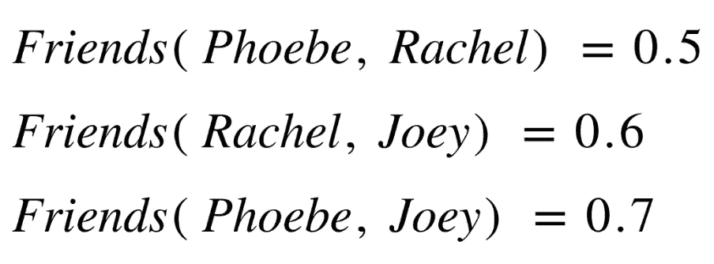
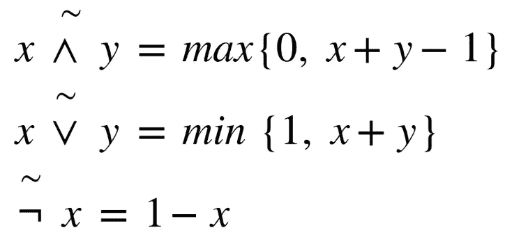
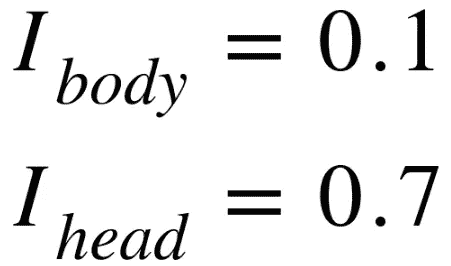
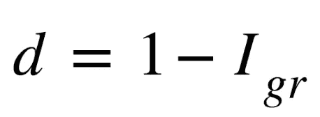
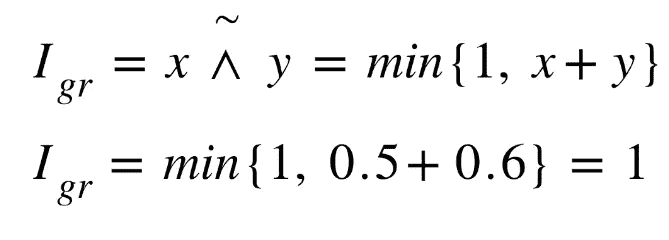
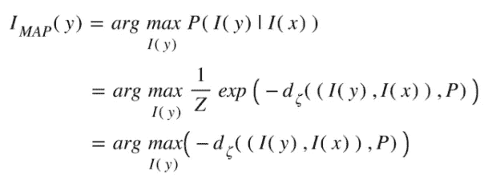

# 使用概率软逻辑推断新关系

> 原文：<https://towardsdatascience.com/inferring-new-relationships-using-the-probabilistic-soft-logic-3df1a99e0af9?source=collection_archive---------16----------------------->

Discovering new relationships/links (Photo by [Anastasia Dulgier](https://unsplash.com/photos/OKOOGO578eo?utm_source=unsplash&utm_medium=referral&utm_content=creditCopyText) on [Unsplash](https://unsplash.com/search/photos/railway-network?utm_source=unsplash&utm_medium=referral&utm_content=creditCopyText))

数据的主要目的是传递有用的信息，可以操纵这些信息来做出重要的决策。在计算的早期，这种有用的信息可以从直接数据中查询，例如存储在数据库中的数据。如果查询的信息在这些数据存储中不可用，那么系统将无法响应用户的查询。因此，目前，如果我们考虑存在于 web 上的大量数据和呈指数增长的 web 用户数量，则很难准确预测和存储这些用户将查询什么。简而言之，我们不能手工硬编码用户对每个预期问题的回答。那么解决办法是什么呢？最佳答案是从数据中提取知识，提炼并重组为知识图，我们可以用它来回答查询。然而，知识提取已被证明是一个不平凡的问题。因此，我们使用统计关系学习方法，该方法考虑过去的经验并学习事实之间的新关系或相似性，以便提取这样的知识。概率软逻辑(PSL)就是这样一个用于构建知识图的统计关系学习框架。

## 理解知识图表

知识图是由实体和它们之间的联系组成的事实的巨大网络。知识图可以建立在一个特定的领域上，也可以跨越几个领域，相互参照。我们已经讨论了如何从我的博客中提取的事实构建知识图表。无论如何，让我们快速回顾一下知识图管道作为复习。

首先，我们通过自由文本和各种来源提取事实。这些事实将被存储在知识库中，并对其提取者充满信心。然而，知识库中充满了需要剔除的冗余信息。因此，我们采取措施来提炼和微调传递到知识图上的事实，以便创建更准确、更相关的知识图[5]。细化知识图的一个重要部分是链接预测，这是预测知识图中两个实体之间的链接的过程。然后，基于精炼的知识图，基于相邻关系、新发现的链接及其为真的概率，很容易获取用户查询的结果。

## 链接预测

如前所述，我们执行链接预测来细化知识图。为了进一步理解链路预测，让我们考虑下面的例子

**例一**

这个例子是由 Pujura 等人[1]提出的。在这里，系统试图在从各种来源提取信息时识别关于国家吉尔吉斯斯坦的事实。因此，该系统已经识别出关于吉尔吉斯斯坦的以下所有事实。

1.  吉尔吉斯斯坦位于哈萨克斯坦
2.  吉尔吉斯斯坦位于俄罗斯
3.  吉尔吉斯斯坦位于前苏联
4.  吉尔吉斯斯坦位于亚洲
5.  吉尔吉斯斯坦位于美国

尽管这些事实中有些是真的，但不可能所有这些都是真的。因此，我们使用链接预测，通过考虑某些本体约束来预测最有可能的真实事实。例如，假设我们已经知道美国位于北美大陆，亚洲是另一个大陆。在这种情况下，很明显，一个地方不可能位于两个大陆上。因此，两个事实 4 或 5 中只有一个是真的。

以上是一个简单的逻辑推论，即如果一个地方 *P* 位于亚洲大陆，那么它不可能位于美国*T3，反之亦然。因此，如果我们已经知道一个事实，即吉尔吉斯斯坦位于亚洲，另一个我们不确定的事实，即吉尔吉斯斯坦位于美国，可以被认为是错误的。*

**例二**

考虑另一个领域，我们有一些人的社交网络信息。例如，假设我们想知道两个用户菲比和乔伊是否真的是朋友。这甚至可以被认为是脸书试图推荐朋友的简化场景。如果这两个用户在脸书上不是朋友，我们就没有直接的数据来推断这一点。然而，如果我们已经知道 Phoebe 是另一个叫 Rachel 的用户的朋友，而 Rachel 是同一个用户 Joey 的共同朋友，那么我们可以有把握地假设 Phoebe 和 Joey 也可能是朋友。现在，让我们尝试将这种间接关系映射为一个强制其约束的逻辑规则。

*但是坚持住…*

在现实世界中，我们有多个用户。在这种情况下，如果我们试图发现所有这些用户之间的新关系，并将上述或类似的规则应用于所有这些关系，我们可能会以大量新推断的关系而告终。仅仅基于规则的逻辑含义，我们不能说我们发现的所有关系都一定是真的或假的。因此，我们需要一种方法，根据我们已经知道是真实的事实，从概率上推断出我们在多大程度上确信一个新推断的关系是真实的。这就是我们使用 PSL 的地方。

# 什么是概率软逻辑(PSL)

总的来说，PSL 是一个框架，它可以基于相关领域和观察到的证据来联合推理事实之间的相似性[1，2]。PSL 观察已知为真的事实，并计算新推断出的事实的概率。为了做到这一点，最初，用户定义了一组通用逻辑规则，这些规则暗示了新的关系，例如，PSL 程序中的本体约束、相似性或友谊。然后，PSL 程序从概率上推断出它有多大把握，确定的新关系将是真实的。为此，PSL 采用了一套由用户提供的已定义的一阶逻辑规则，并在这些规则的基础上推断现实世界实体的适用性。

PSL 规则将采用通用格式，由如下所示的变量组成。

a、B 和 C 是变量，在我们的场景中，它们用于表示三个不同的脸书用户。通过将实际用户代入该规则，我们可以得到以前没有明确标识的新关系。因此，当我们将 Phoebe，Rachel 和 Joey 代入这个规则时，我们得到了下面的规则，正如前面所指出的。

PSL 不同于它的前辈，它试图根据我们已经从现有信息和链接中获得的知识，从概率上确定我们对新推断的关系的每一个实例有多确定。

但首先，让我们简要了解一下 PSL 的背景。

PSL 的大多数激励性概念都源于马尔可夫逻辑网络(MLN)[3]。除了单独查看事实，MLNs 还考虑了本体约束，如域或逆约束[4]。然而，mln 受限于它们只能为逻辑“关系”取布尔真值的能力，我们称之为“谓词”。这样做的缺点是，我们不能对新推断的事实给出置信度或概率。因此，PSL 选择了一个软真值，而不是确定的 1 或 0，并使用多个提取器来为新呈现的关系提供置信度。基于这些置信度(即概率)，我们可以用现有的和高度可能的、新推断的事实构建一个知识图。由于知识图是一个巨大的信息网络，因此在响应用户查询时，检索相关或相邻数据的信息变得很容易，这些数据很可能是真实的。

在下一节中，我们将从高层次上概述如何推断新的或缺失的链接，以及我们对新事实成立的信心程度。

# PSL 是如何工作的？

现在，让我们在 PSL 正式重申一个样本一阶逻辑规则(注意，我们需要指定这些规则作为输入，以及我们已经知道为真的事实/三元组，以便运行 PSL 程序)。

在哪里，

*   *A* 、 *B* 和 *C:* 实体(变量)
*   *朋友:*谓词/关系
*   *w:* 规则的权重

这条规则是传递性的基本规则，它规定如果 *A* 是 *B* 的朋友，并且 *B* 是 *C* 的朋友，那么 *A* 和 *C* 也很可能是朋友。上述规则是常量(真实世界的实体)通过一个称为 ***固定*** 的过程固定的模板。因此，如果我们取一组新的常数，它们是域内的真实世界的实体，如菲比、瑞秋和乔伊，那么我们将有作为*朋友(菲比、瑞秋)*、*朋友(瑞秋、乔伊)*和*朋友(菲比、乔伊)*的基态原子。这将给我们以下基本规则:规则的单个实例，其权重为 *w* 。

这些基础原子中的每一个都将具有在[0，1]范围内的软真值。因此，让我们假设这些基础原子中的每一个都具有以下软真值。

然后，我们需要验证上述接地是否满足规则。

## 验证接地是否满足规则

这通过计算每个基本规则的 ***满意距离*** 来完成。为了获得满意的距离， *d* ，我们使用 Lukasiewicz 范数和余范数，将基本规则视为规则中的基本原子上的公式。

**Lukasiewicz t-范数和余范数**

Lukasiewicz t-norms 提供了对规则中以下逻辑连接词的放松:

逻辑连接词顶部的波浪号表示 Lukasiewicz 提供的放松。

下一节阐述了我们如何转换基本规则，并应用 Lukasiewicz t-norms 来计算和验证接地是否满足规则。为了做到这一点，首先，

*   通过检查头部对身体的软真值来检查接地是否满足规则。

*如果不满足规则，那么我们，*

*   计算满意的距离。

**1。规则满意度**

为了验证一个根植是否满足基于头部和身体中原子的规则，我们需要看头部的整体软真值是否大于或等于身体的软真值，即

然而，目前我们所拥有的只是头部和身体中每个原子的单个软真值。因此，我们简单地将 lukasiewicz 范数分别应用于身体和头部的原子，并得到 Iᵦₒ𝒹ᵧ和 Iₕₑₐ𝒹.的单个软真值因为我们只有一个基态原子作为头部，

，也就是我们之前假设的 0.7，这样我们只需要把 Lukasiewicz 应用到物体的基态原子上。

由于物体中的原子是结合在一起的，我们应用:

同样地，我们对物体的推断值为 0.1，如下面的计算所示。

现在，由于我们对身体和头部的基本规则有以下推论，

，很明显，这个接地满足头部的软真值大于身体的软真值的规则。在这种情况下，满意的距离将为 0。

当接地不满足该规则时，即当头部的推断值不大于或等于身体的推断值时，我们继续计算满足的距离，该距离将是大于 0 的值。

**2。计算满意的距离**

计算满意度距离的一个简单方法是使用下面的公式 *d* 。

其中 *I* 𝓰ᵣ是基本规则的总体软真值。首先，为了计算出规则的总体软真值，我们需要将基本规则转换成它的析取范式。

任何公式都被写成一个蕴涵式

(1)正文中的文字或文字的连词

(2)标题中的文字或文字的析取

可以写成析取子句，因此，我们可以把基本规则转换成析取子句。随着言外之意被析取，身体中的原子被否定。基于此，我们得到了基本规则的以下析取子句。

在这种情况下，被否定的基态原子和我们的基态原子将获得如下所示的软真值。

然后，我们应用 lukasiewicz 范数的析取范数来计算 *I* 𝓰ᵣ.因此，

这使我们的满意距离为 0，这意味着接地满足规则，与我们检查头部对身体的软真值的评估相一致。因此，让我们尝试使用一个不同的场景，对原子使用不同的软真值。

让我们假设基态原子的新的软真值。

*   *朋友(菲比、瑞秋)= 0.7*
*   *朋友(瑞秋，乔伊)= 0.8*
*   *朋友(瑞秋，乔伊)= 0.4*

这将给我们一组被否定的基态原子，

*   *！朋友(菲比、瑞秋)= 0.3*
*   *！朋友(瑞秋，乔伊)= 0.2*

考虑到这些值， *I* 𝓰ᵣ = *min{1，0.3+0.2+0.4} = 0.9* 。

这样，满足的距离将是 0.1，表明接地不完全满足该规则。

递归地，我们可以使用头原子和体原子来验证规则的满足，如步骤(1)中所执行的，其中我们使用接地原子的新值来检查接地是否满足规则。这将使*I*ᵦₒ𝒹ᵧ*成为 *max{0，0.7+0.8–1 }，*也就是 0.5。对照软真值为 0.4 的ₕₑₐ𝒹，我们发现这个规则没有得到满足。因此，我们可以使用任何一种方法来检查接地是否满足规则。*

现在让我们试着勾勒出上述计算的全貌。

假设我们有一个 PSL 程序， *P，*，它包含 *n* 个定义的规则，其中 *I* 是这些规则的解释(解释是软真值的赋值)。如果 *R* ᵏ *如我们之前所讨论的，我们然后计算每个地面实例的满意度距离，并且作为结果，将具有所有地面实例的满意度距离的向量，即 *V* ᵏ.这个满意度距离的向量只代表了 PSL 项目的一个规则。因此，我们采用加权规则，并为 PSL 计划中的其他规则堆叠*满意度距离*的所有向量。这给我们留下了另一个矢量 v(I)=[w₁v₁(i)…wₙvₙ(i)]ᵀ]。知道这个 *V(I)，*如果泽塔是一个任意的距离度量，我们将在我们的推理阶段使用，那么，*

在这里，如果我们解析到一个*L1*-范数距离，我们可以得到一个对数线性表示，这是我们在统计关系学习模型中经常遇到的。这将具有如下所示的形式。

另一方面，我们也可以求解平方的*L2*-范数距离，通过使其成为满足距离的快速增长函数来补偿不满足的规则，如下所示。

接下来，我们继续推断具有未知真值的三元组的软真值，即新推断的信息或缺失的链接。

## 基于先前可用的证据推断新数据的软真值

给定观察到的三元组集合，推断三元组的最可能值是基于 MPE(最可能解释)推断，该推断遵循 MAP(最大后验概率)推断。这个推论被用来计算出先前未被观察到的基态原子最有可能的软真值。如前所述，我们有一组已知的三元组，用作我们的观察值，并以 PSL 的规则为基础。因此，让我们将这组具有观察到的软真值的三元组命名为 ***x*** ，将这组具有未知软真值的三元组命名为 ***y*** 。这给我们带来了我们的预期任务，即给定观察值， *I* ₓ，为 *I* ₘₐₚ *(y)* 找到最可能的软真值赋值，这可以通过下面等式中所示的推理来执行。

该映射推断导致基于作为观察到的三元组， *x* 给出的证据，推断未知三元组， *y，*的最可能软真值分配。最终，我们以软真理的形式获得了新推断的事实或信息的概率，我们发现这些概率为 *I* ₘₐₚ *(y)。有了这些概率，我们就可以决定这些事实在多大程度上是真实的。这就是自动完成搜索结果、youtube 播放列表和脸书好友建议使用概率显示相关结果的方式。*

**结论**

本文主要对概率软逻辑(PSL)这一联合概率推理框架进行详细阐述。PSL 的总体意图是有一种方法来评估一个推断出的、以前看不见的事实在给定的领域中有多真实。因此，一般假设是推断的软真值越高，事实为真的可能性就越高。推断的软真值越低，就越不可能成立，这意味着没有足够的证据或相关事实来支持新推断的事实。这些概率有助于支持决策过程，以根据已知事实识别新信息(事实)。

然而，由于这种推断和假设不包括人类决策的应用或考虑，很难仅仅基于新推断的软真值来决定性地说一个事实是精确准确的还是不准确的。我目前从事这方面的工作，我们研究如何将软真值和人类评估的数据关联起来，以便清楚地将事实标记为真或假，并使我们的决策与实际的人类评估更加一致。我会在接下来的文章中公布更多细节。

**参考文献**

[1]m .布罗谢勒、l .米哈尔科娃和格图尔(2012 年)。概率相似逻辑。arXiv 预印本 arXiv:1203.3469。

[2]金米格，a .，巴赫，S. H .，布罗意切勒，m .，黄，b .，&格图尔，L. (2012 年 2 月)。概率软逻辑简介。NIPS 概率规划研讨会:基础与应用(第 1 卷，第 3 页)。

[3]m .理查森和多明戈斯，P. (2006 年)。马尔可夫逻辑网络。机器学习，62(1–2)，107–136。

[4]巴赫，S. H .，布罗意切勒，m .，黄，b .，&格图尔，L. (2015)。铰链损失马尔可夫随机场和概率软逻辑。arXiv 预印本 arXiv:1505.04406。

[5]保罗海姆，H. (2017)。知识图精化:方法和评估方法综述。语义网，8(3)，489–508。