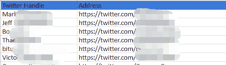
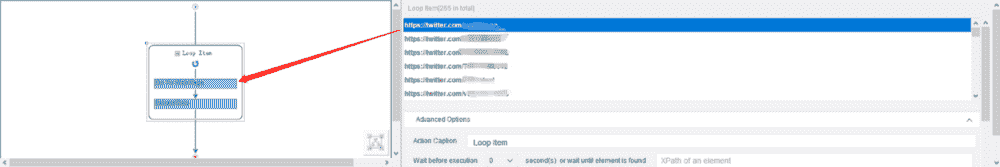
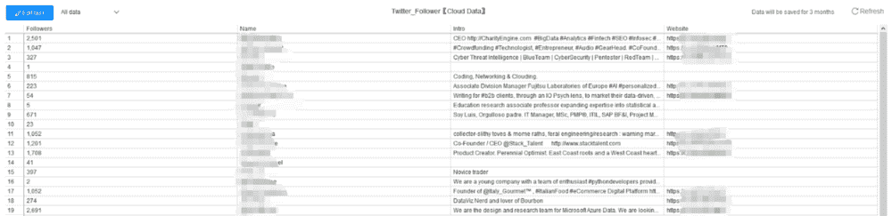
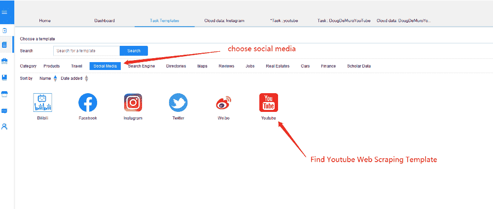
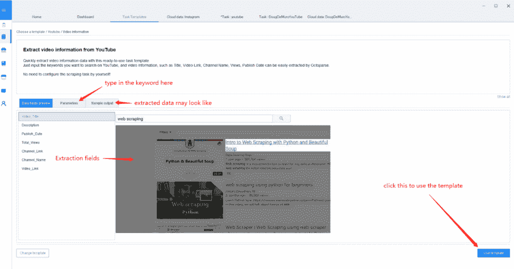
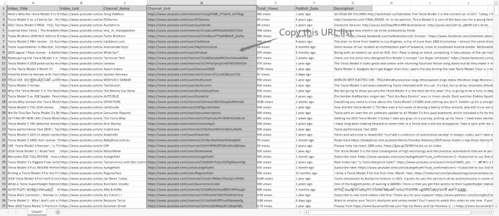
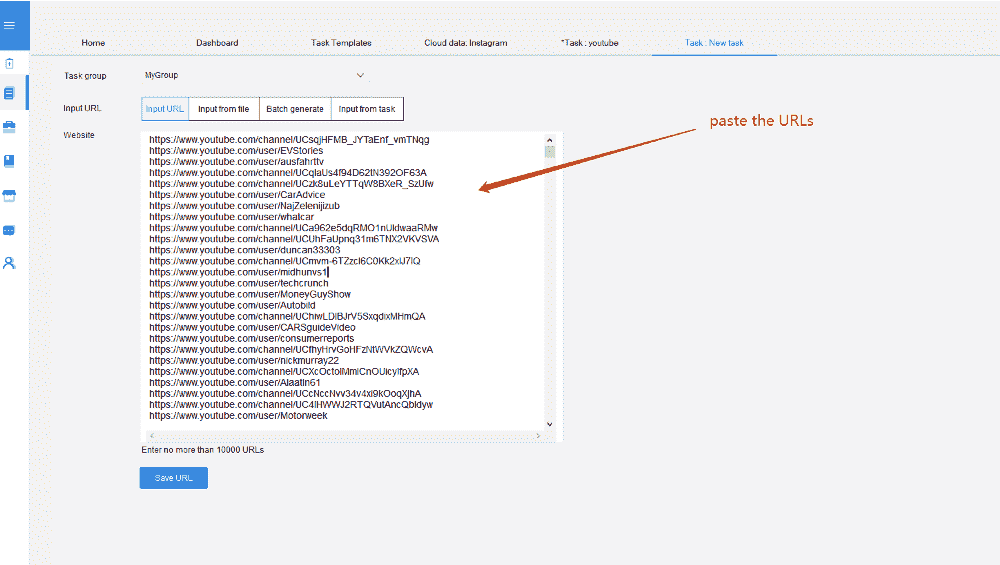

# 使用网络抓取的影响者营销

> 原文：<https://towardsdatascience.com/influencer-marketing-using-web-scraping-568ef4c072c3?source=collection_archive---------18----------------------->

Photo by [Kaleidico](https://unsplash.com/@kaleidico?utm_source=unsplash&utm_medium=referral&utm_content=creditCopyText) on [Unsplash](https://unsplash.com/search/photos/digtial-marketing?utm_source=unsplash&utm_medium=referral&utm_content=creditCopyText)

影响者营销对我们来说不再是一个陌生的概念。在美国零售业中，只有 33%的零售商没有使用或不打算使用任何形式的影响者营销。然而，通过口碑广告来提升你的品牌知名度是一个很好的方法。棘手的部分是如何找到合适的人和/或渠道来推广你的品牌。

如果你在社交媒体上搜索最有影响力的人，你会碰壁。相反，你应该从你的观众群开始，然后扩展人脉。例如，获取你的评论者的信息并就新闻与他们联系是找到你的影响者的好方法。获得这些候选人的最佳方式是通过[在你的观众中进行网络搜集](https://www.octoparse.com/?source=your_stories_page---------------------------)。许多企业没有预算购买昂贵的工具，如数据集成。然而，有很多便宜的替代品供你收集有价值的信息，其中之一就是网络抓取软件。

# 什么是网络抓取

Web 抓取是一种自动化数据提取过程的技术。它涉及到解析一个网站的过程，并收集你需要的数据片段。我将向你展示如何使用网络抓取工具，并使这些数据可用于数字营销。进行 web 抓取不需要编程技能。我使用的工具是 [Octoparse](https://www.octoparse.com/?source=your_stories_page---------------------------) ，我将解释为什么它能为营销专业人士带来难以置信的价值。

# 找到你的“传道者”。

根据 Joshua 的说法，评论是我们可以用来扩展营销策略的地方。我不是说我们留下评论并为你的评论者鼓掌。当评论者的用户名是可点击的时，可以通过提取个人资料信息与他们联系。每当我们有了新的内容，我们就会联系这些人。这样我们就把评论者变成了传道者。除此之外，你可以通过滚雪球的方法来更有创造性的发展，创建你的福音传播者池来推进你的营销过程。

# Twitter 福音传播者:

盲目发消息求推文是行不通的。一个很好的开始是利用你的观众群。这个想法是:

1.  使用 IFTTT.com 将你的 Twitter 提及和新关注者提取到电子表格中
2.  收集关注者的数量、联系方式和对这些人的描述。
3.  向人们伸出援手。(确保你给每个人都准备了一封写得很好的推介信)

首先，你需要将两个 IFTTT 食谱与你的 Twitter 和 Google drive 连接起来。打开这些食谱: [**在电子表格中跟踪新的关注者**](https://ifttt.com/applets/101754167d-track-new-followers-in-spreadsheet?source=your_stories_page---------------------------) 和 [**将你的 Twitter 用户名的提及存档到你 IFTTT 账户中的电子表格**](https://ifttt.com/applets/n5tLDhyq-archive-mentions-of-your-twitter-username-to-a-spreadsheet?source=your_stories_page---------------------------) 。

这些食谱顾名思义。他们收集用户 ID 以及提到或关注你的人的链接，并将数据发送到你的电子表格中。

我们需要找到能给你的网站带来流量的有影响力的人。要做到这一点，我们需要刮他们:

*   关注者数量
*   Bios
*   网站
*   Twitter Id

您可以使用 Octoparse 软件完成所有这些工作:

**首先，**通过导入收集的 URL 建立一个新任务。

**其次**，一旦你导入了 URL 列表，Octoparse 会生成一个 URL 的循环列表。通过在内置浏览器中单击元素来选择所需的元素。在这种情况下，点按“关注者”并选取“从操作提示中提取所选元素的文本”您将看到提取的数据出现在数据字段中。

**第三，**重复上述步骤，获取他们的个人资料、网站和 Twitter ID。

**最后一个**，运行任务。

你应该能得到这样的床单。您将看到每个提及您的关注者/人及其信息。

然后，将数据导出到电子表格中。你根据关注者数量和背景过滤掉不合格的人。

**注:**如果你滥用这种方法就错了。请记住不要发送垃圾邮件或不相关的信息。他们的存在是对你伟大工作的一种认可。你对他们的尊重是尊重你内容的另一种方式！

# YouTube 影响者:

Youtube 影响者营销是新的黑色。通过口碑策略提高品牌知名度和转化率是一个很好的方法。因此，有影响力的人越来越多。找到合适的影响者是成功营销活动的关键。

“ [61%的营销人员](http://mediakix.com/influencer-marketing-industry-statistics-survey-benchmarks/?source=your_stories_page---------------------------)同意为一项活动寻找最佳影响者具有挑战性，这表明这个问题远未解决。”

以下是您需要注意的指标:

1.  内容的质量:他们为他们的观众提供了价值吗？他们有什么想法吗？
2.  观众是谁？他们与你的目标一致吗？
3.  什么是参与度:点赞数，关注数，评论数。

例如，推广一个新的汽车品牌 XYZ。最好的方法是通过汽车评论频道。这个想法是:

1.  使用 Octoparse 抓取模板抓取信息，包括视频标题，视频网址，频道网址，观看次数，出版日期，描述。
2.  使用通道 URL 创建一个抓取任务，以获取订阅者的数量。
3.  导出数据，并根据我们提到的指标过滤掉不合格的候选人。
4.  发送请求信并协商您的预算。

Octoparse 抓取模板是一个预先格式化的模块。它允许您在没有任何配置的情况下提取数据。你所要做的就是输入关键词/目标网站。

**首先，**打开 Octoparse，选择“任务模板”

**然后，**在分类栏上选择“社交媒体”。你会发现“YouTube”图标。

**第三，**点击 YouTube 图标。您将看到这个模板可以完成什么样的数据，您还可以看到一个示例输出。如果您对此感兴趣，您需要在参数处键入关键字。在这种情况下，“汽车评论。”

**第四，**点击“使用模板”并选择您希望运行任务的方式(通过内部部署、云或设定计划)

你应该可以得到这样一个表格:

然而，我们仍然需要知道每个频道的用户数量。为此，请复制 Youtube 频道的 URL 列表。创建新的刮擦任务，并将列表粘贴到参数框中:

*   首先，打开 Octoparse，在高级模式下输入 URL 列表，设置一个任务。这会将您带到配置窗口，您可以在其中解析网页并选择元素。
*   其次，选择元素。在这种情况下，请选择 YouTube 频道名称。并按照指南提示选择“提取所选元素的文本”
*   第三，重复上述步骤提取用户号码
*   最后，运行任务。不到一分钟就能得到结果。以您选择的格式导出数据:Excel、CSV、txt。在这种情况下，我将其导出到 Excel。

你应该能够得到每个 Youtube 频道的订户号码列表，将列表复制到我们刚刚创建的 excel 中。这是一个收集数据的例子:[汽车评论 youtube 视频电子表格。](https://docs.google.com/spreadsheets/d/1xdlH0Gnkzxokrk2wc9wKjPVbB2cQZ1ADO9FwDTJsdlk/edit?usp=sharing&source=your_stories_page---------------------------)然后你就可以过滤掉那些不符合条件的，把数据降序排列，根据你的标准重新组织名单，联系你名单上出现的名字。

这只是网络抓取对营销有所帮助的一小部分。有了它，你可以变得更有创造力。例如，你可以提取 Youtube 视频的评论、Twitter 帖子、产品评论、竞争对手的博客评论，甚至脸书公共社区的帖子和评论。这里的想法是用自动化的数据提取代替单调的手工复制和粘贴工作。使用 Octoparse 的一个好处是它有各种各样的网络抓取模板。这会让你节省很多时间。

最后一点，我们都知道内容营销对于数字营销有多重要。然而，问题是我们以自我为中心，容易相信我们创造的东西。当我们写作时，我们用我们的直觉来期望引起读者的兴趣。相反，这方面的一个很好的技巧是追求流行的内容，写更好的内容来超越它们。你可以抓取博客标题/排名/喜欢/评论等，然后把这些金块组合成小火花。

网页抓取超级强大。然而，当你不明智地使用它时，法律的反弹又会回来。我认为提高技能的最好方法是练习。我鼓励您复制这些技巧，并习惯于自动化数据提取，以获得池塘中的大鱼。

来源:

[https://www . octo parse . com/blog/a-revolutionary-web-scraping-software-to-boost-your-business](https://www.octoparse.com/blog/a-revolutionary-web-scraping-software-to-boost-your-business)

 [## 影响者营销调查结果:2019 年行业基准

### 我们的年度影响者营销调查揭示了今年一些令人兴奋的发现，其中大多数表明 2019 年将…

mediakix.com](https://mediakix.com/influencer-marketing-resources/influencer-marketing-industry-statistics-survey-benchmarks/) 

[https://www . emarketer . com/content/what-retailers-need-to-know-on-influencer-marketing](https://www.emarketer.com/content/what-retailers-need-to-know-about-influencer-marketing)

【https://ahrefs.com/blog/web-scraping-for-marketers/ 