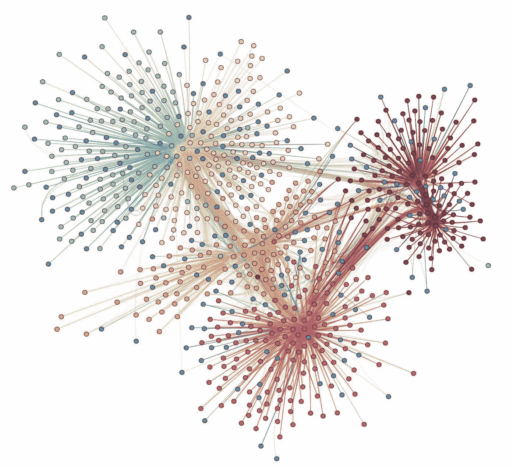
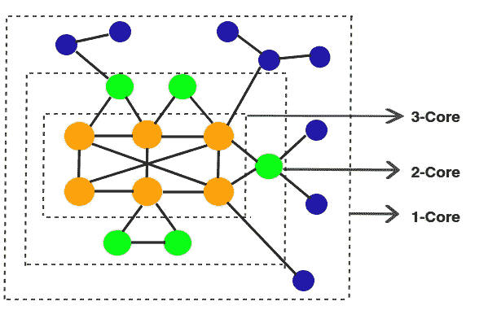

# 社交网络中有影响力的社区:简化版

> 原文：<https://towardsdatascience.com/influential-communities-in-social-network-simplified-fe5050dbe5a4?source=collection_archive---------24----------------------->

## 在大规模网络中发现有影响力的团体

## 为什么要研究社交网络中的社区？

社交网络是大规模现实世界网络的主要例子。它们表现出不同的行为，从密集的网络部分到稀疏连接的个体，从刚性连接到高度动态的图形部分。这使得它们成为数据科学家分析的一个有趣问题。

社区或模块结构被认为是大规模真实世界图的一个重要属性。系统通常以图形表示的学科，如社会学、生物学和计算机科学，也包含这种大规模网络和社区结构的例子，其应用可以极大地激励该领域的研究。

## 你如何正式定义有影响力的社区？

一个人的影响力是由这个人有多少联系来定义的。很明显，直觉告诉我们，有些人与很有影响力的人有联系，但他们自己却没有太多的联系。这些人也应该算是有影响力的。

虽然在处理这种情况时有各种各样的影响力定义，但最流行和被接受的影响力定义仍然是个人拥有的联系数量，我们现在将继续研究这个问题。

*一个社区的强大取决于它最薄弱的环节。*在定义一个社区的影响力时，人们提出了许多不同的方法，比如取社区中所有人的平均值或者*简单地求和*。但是被广泛认同和普遍使用的定义是使用社区中最没有影响力的个人的影响力作为社区的影响力。

## 什么是 k-core？

图的 k-core 是通过移除图中连接数或*度*小于‘k’的所有节点来计算的。**注意**，在从图中移除所有这样的节点之后，如果新的图现在包含度小于“k”的节点(由于移除了那些先前的节点)，则它们也被移除，并且重复该过程，直到图中的所有节点的度至少为“k”。

k-影响力社区被定义为影响力至少为“k”的社区(连通子图)。通俗地说，一个图的 k-核中存在的每一个连通分支都是一个 k-影响力社区。许多算法都利用了这一点，允许它们找到 k 核，并将它们与社区相关联。

## 内存问题

从术语“大规模”图可以明显看出，这些算法面临的最大问题之一是，由于内存限制，无法同时处理完整的数据。这些限制迫使研究人员发挥创造力，引入本地和在线搜索。这些方法基于试探法，可能不会返回全局最佳结果，但非常接近于此，并且可以处理非常大的图。

## 下一步是什么？

有影响力的社区搜索是一个相对年轻的领域，甚至像社区的定义，其影响力等基本定义。正如在上面的讨论中所指出的，仍在辩论中。因此，未来工作的一个可能方向是探索更多的凝聚力定义，以获得紧密团结的社区。

博客中介绍的细节很少。请参考我们的论文 [*这里*](https://arxiv.org/abs/1902.01629) *进行更详细的调查。*

*这个博客是努力创建机器学习领域简化介绍的一部分。点击此处的完整系列*

 [## 机器学习:简化

### 在你一头扎进去之前就知道了

towardsdatascience.com](/machine-learning-simplified-1fe22fec0fac) 

*或者只是阅读系列的下一篇博客*

 [## 深度学习—模型优化和压缩:简化

### 看看最先进的机器学习模型的压缩、修剪和量化领域

towardsdatascience.com](/machine-learning-models-compression-and-quantization-simplified-a302ddf326f2) 

## 参考

*[1]加内什、普拉哈尔、萨凯特丁利瓦尔、拉胡尔阿加瓦尔。"在大规模网络中发现有影响力社区的文献综述."arXiv 预印本 arXiv:1902.01629 (2019)。
[2]，，，，余，。大型网络中有影响力的社区搜索。继续。VLDB 捐赠。，8(5):509–520，2015 年 1 月
【3】李建新、王新觉、、杨晓春、蒂莫斯·塞利斯和杰弗里·于。大型社交网络上最有影响力的社区搜索。第 871–882 页，2017 年 4 月。
[4]、、于、。在庞大的网络中寻找有影响力的社区。《VLDB 日报》，26(6):751–776，2017 年 12 月
【5】张力军，林，。一种在线搜索 top-k 影响力社区的优化和渐进方法。继续。VLDB 捐赠。，11(9):1056–1068，2018 年 5 月*