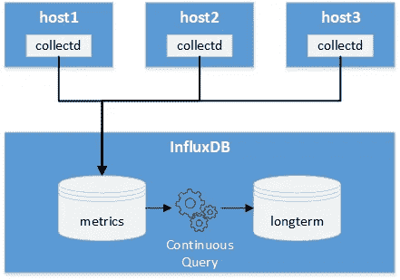

# InfluxDB 数据保留

> 原文：<https://towardsdatascience.com/influxdb-data-retention-f026496d708f?source=collection_archive---------7----------------------->

运营团队经常使用时间序列数据来调查性能问题。因为我们无法提前预测性能问题的来源，所以我们经常犯谨慎的错误，尽可能频繁地收集尽可能多的数据。这使得获取环境中最近一小时、一天或一周内发生的事情的详细信息变得非常容易。但是，随着主机数量和数据量的增加，保留超过一两周的数据会变得很困难。

有许多原因可以解释为什么有必要将数据保留更长的时间。在下列情况下，参考几周、几个月甚至几年前的数据通常很有用:

*   容量规划—通过查看过去 12 至 24 个月的资源利用率，您可以预测未来的使用情况，以便预测下一财年的预算需求。
*   性能下降—用户经常报告说，应用程序性能“似乎比几周或几个月前慢了”。手边有历史数据，就有可能量化任务需要多长时间，或者负载增加和性能降低之间是否存在关联。

在处理时间序列数据时，不可避免地会遇到无法无限期完整保留所有数据的情况。必须在数据保留时间、数据保留量和数据粒度之间进行权衡。本文介绍了如何在 [InfluxDB](https://www.influxdata.com/) 中实现数据保留策略，以确保您可以对数据进行降采样，将其保留一段指定的时间，并执行定期备份以避免数据丢失。

出于本例的目的，我们将关注运行在 3 台主机上的 [*收集的*](https://collectd.org/) 系统守护进程收集的 CPU 利用率指标。在这个场景中， *collectd* 以 10 秒的间隔从每个被监控的主机提交 CPU 数据(“load_shortterm”)。使用 *collectd* 守护程序将数据直接发送到 InfluxDB，并存储在“指标”数据库中，该数据库使用 7 天保留策略进行定义。目标是将这些数据保留在“长期”数据库中，保留策略为 3 年。



## InfluxDB 配置

默认情况下，InfluxDB 不监听 *collectd* 输入。为了允许由 *collectd* 代理提交数据，必须将 InfluxDB 服务器配置为侦听 *collectd* 连接。本节介绍如何在 RHEL/CentOS 系统上配置 *collectd* 。

第一步是在 InfluxDB 服务器上创建一个数据库，将传入的 *collectd* 数据存储 7 天。为此，在 InfluxDB 服务器上打开一个终端窗口，并使用`influx`命令连接到服务器。运行以下命令创建新数据库:

```
CREATE DATABASE metrics WITH DURATION 7d
```

下一步是在 InfluxDB 服务器上安装 *collectd* ，以便 InfluxDB 可以使用 [types.db](https://collectd.org/documentation/manpages/types.db.5.shtml) 规范文件:

```
# Install the collectd RPM (available from the EPEL repo)
yum install collectd# Locate the types.db file installed by the RPM
rpm -ql collectd | grep types.db
```

更新 InfluxDB 配置文件(`/etc/influxdb/influxdb.conf`)监听*收集的*数据，然后重新启动 *influxd* 服务:

```
[[collectd]]
  enabled = true
  bind-address = ":8096"
  database = "metrics"
  typesdb = "/usr/share/collectd/types.db"
```

一旦 InfluxDB 正在监听 *collectd* 输入，您将需要在 3 台主机上安装 collectd 代理，并将其配置为向您的 InfluxDB 服务器发送数据。

## 数据识别

如果您不熟悉 InfluxDB 数据模型，弄清楚如何定位数据可能是第一个挑战。被收集的每种类型的数据被称为“测量”,并且每个测量可以具有任意数量的与之相关联的“标签”。对于由 collectd 代理报告的数据，您配置代理报告的每种数据类型都有一个度量。

可在`influx`命令窗口中执行以下命令，以查询数据库并识别将在后续步骤中用于定义连续查询的测量值。

```
# Switch to the InfluxDB database containing the CollectD data
USE metrics# Display a list of metrics in the database
SHOW MEASUREMENTS# Display the tags (keys) used to uniquely identify CPU load
SHOW SERIES FROM load_shortterm
```

`SHOW SERIES`命令应该产生类似如下的输出:

```
load_shortterm,host=host1,type=load
load_shortterm,host=host2,type=load
load_shortterm,host=host3,type=load
```

## 数据保留政策

在 InfluxDB 中，有许多选项可用于定义长期保留策略。一种选择是在现有的`metrics`数据库中创建新的保留策略，并将长期数据与短期数据一起存储:

```
CREATE RETENTION POLICY longterm_policy ON metrics DURATION 156w REPLICATION 1
```

但是，我会避免在单个数据库中创建多个保留策略，除非您有特别的理由这样做。如果单个数据库中有多个保留策略，那么在对数据进行操作时，您的查询将需要显式引用保留策略(`database.policy.measurement`)。由于明确引用了保留策略，这将使您的查询更加脆弱。

此外，`metrics`数据库中的输入数据是大量的瞬时数据。备份整个数据库的成本非常高，丢失一周的非常精细的数据所带来的影响也不值得。

更好的方法是专门为您希望保留的任何长期数据定义一个单独的数据库。这样做将便于以后更改保留策略或备份整个数据库，而不会影响任何外部报告或查询。以下示例显示了如何创建保留策略为 3 年(156 周)的数据库:

```
CREATE DATABASE longterm WITH DURATION 156w
```

## 数据聚合

创建一个连续查询，将数据从 10 秒的间隔向下采样到 15 分钟的间隔:

```
CREATE CONTINUOUS QUERY aggregate_load ON longterm
BEGIN
  SELECT max(value) AS value 
  INTO longterm.autogen.load_shortterm 
  FROM metrics.autogen.load_shortterm 
  GROUP BY time(15m),* 
END
```

***重要提示:***

*   您选择的聚合函数将取决于您的用例。在这种情况下使用了`max`函数，因为我们通常关心一个时间间隔内的平均峰值负载。使用平均值计算会稀释这些尖峰信号，并使识别活动中的短尖峰信号变得更加困难。
*   `INTO`和`FROM`子句要求完全合格的度量(数据库.策略.度量)。如果您将默认保留策略定义为数据库创建的一部分，如以上示例所示，则默认情况下，保留策略将被称为“自动生成”。
*   `GROUP BY`子句包含一个`*`通配符，意思是“所有标签”这确保了仅在所有标签都相同的数据点上执行聚合。如果没有这个通配符(或一个显式的标记列表)，将会对所有主机的所有数据执行聚合，从而导致一个无意义的聚合。在大多数情况下，应该在`GROUP BY`中使用通配符，以确保在相同的唯一项目上执行聚合。
*   上面显示的多行格式是为了可读性。当在`influx`命令中执行该命令时，您需要在一行中构建该命令。

一旦您成功地创建了一个连续查询，您应该会看到在第一个时间间隔结束时出现测量值。这可以通过列出测量值来验证，方法与您之前发现它们的方法相同:

```
USE longterm
SHOW MEASUREMENTS
SHOW SERIES FROM load_shortterm
```

下面的 Grafana 图表显示了原始数据(10 秒间隔)和聚合数据(15 分钟间隔)之间的差异。


Grafana chart of metrics.load_shortterm


Grafana chart of longterm.load_shortterm

## 数据备份

InfluxDB 附带了一个用于执行数据库备份的命令行实用程序。执行相当简单:

```
influxd backup -portable -database longterm /backup/longterm
```

可以指定附加参数，以通过特定的保留策略、碎片或日期范围来限制导出。

## 调试提示

默认情况下，InfluxDB 服务将其日志输出写入`/var/log/messages`。每次连续查询运行时都会生成几行输出。以下命令可用于查找连续查询执行消息:

```
tail -f /var/log/messages | grep "Finished continuous"
```

匹配线看起来会像这样:

```
Jan  7 15:00:00 influxdbhost01 influxd: 
   ts=2019-01-07T20:00:00.127002Z 
   lvl=info 
   msg="Finished continuous query" 
   log_id=0BoYFF20000 
   service=continuous_querier 
   trace_id=0CrUFfTl000 
   op_name=continuous_querier_execute 
   name=aggregate_load 
   db_instance=longterm 
   written=129 
   start=2019-01-07T19:59:00.000000Z 
   end=2019-01-07T20:00:00.000000Z 
   duration=7ms
```

日志输出包含几条重要信息:

*   *名称* —连续查询的名称
*   *已写入* —已写入的测量记录的数量
*   *持续时间* —查询执行的时间

显然，定义一个连续的查询，并安排其运行频率高于完成查询所需的时间，这不是一个好主意。

## 总结

连续查询是一种有选择地对数据进行降采样并将其保留更长时间的便捷方式。通过创建周密的保留策略和备份程序，可以将历史时间序列数据保留数月甚至数年。让这些历史数据在与实时指标相同的可视化界面中易于访问，将使应用程序所有者和运营人员能够基于历史背景和趋势做出明智的决策，而不是依赖“直觉”方法进行预算、容量规划或问题调查。