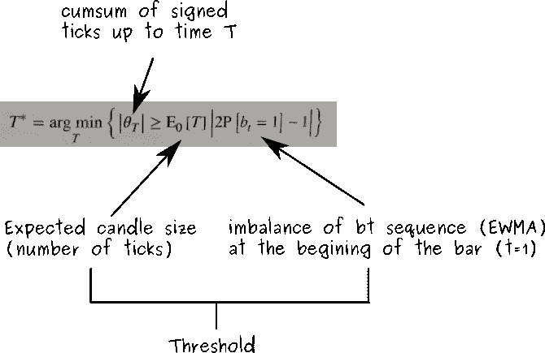

# 金融机器学习的信息驱动棒线:不平衡棒线

> 原文：<https://towardsdatascience.com/information-driven-bars-for-financial-machine-learning-imbalance-bars-dda9233058f0?source=collection_archive---------1----------------------->

Photo by [Javier Allegue](https://unsplash.com/@soymeraki), at [Unsplash](http://unsplash.com)

在之前的文章中，我们谈到了[分笔成交点](/advanced-candlesticks-for-machine-learning-i-tick-bars-a8b93728b4c5)、[成交量棒线](/advanced-candlesticks-for-machine-learning-ii-volume-and-dollar-bars-6cda27e3201d)和[美元棒线](/advanced-candlesticks-for-machine-learning-ii-volume-and-dollar-bars-6cda27e3201d)，它们是替代类型的棒线，允许根据分笔成交点的数量、成交量或交易的美元价值进行市场活动相关的采样。此外，我们还看到了与传统的基于时间的条形图相比，这些条形图如何显示更好的统计属性，例如更低的序列相关性。在本文中，我们将讨论信息驱动棒线，特别是不平衡棒线。这些棒线旨在提取编码在观察到的交易序列中的信息，并通知我们交易不平衡的变化。不平衡变化的早期检测将允许我们在达到新的平衡之前预测趋势的潜在变化。

## 不平衡棒背后的概念

Lopez de Prado 在他的书*金融机器学习的进步* (2018)中首次在文献中描述了不平衡棒。用他自己的话说:

> 信息驱动棒线的目的是当新信息到达市场时更频繁地取样。[……]通过使取样与消息灵通的交易者的到来同步，我们也许能够在价格达到新的均衡水平之前作出决定。

不平衡棒线可以应用于分笔成交点、成交量或美元数据，分别生成分笔成交点(TIB)、成交量(VIB)和美元(DIB)不平衡棒线。成交量和美元棒线只是分笔成交点棒线的扩展，因此在本文中，我们将主要关注分笔成交点不平衡棒线，然后我们将简要讨论如何扩展它们来处理成交量或美元信息。

不平衡棒线背后的主要思想是，基于交易序列的不平衡，我们产生一些预期或阈值，每当不平衡超过阈值/预期时，我们就对棒线取样。但是我们如何计算不平衡呢？我们如何定义门槛？让我们试着回答这些问题。

## 什么是蜱不平衡？

给定一个交易序列，我们应用所谓的*分笔成交点规则*来生成一个签名分笔成交点列表(bt)。你可以在公式 1 中看到刻度规则。基本上，对于每笔交易:

1.  如果价格高于上一笔交易，我们将签字分笔成交点设为 1；
2.  如果价格比前一次交易低，我们将签字分笔成交点设为-1；
3.  如果价格与上一笔交易相同，我们将签字分笔成交点设置为与上一笔签字分笔成交点相同。

**Formula 1**. Tick rule to define signed ticks [1,-1]. pt is the price of trade t and delta-pt is the increment in price respect p(t-1). b(t-1) is the signed tick at t-1.

通过应用*分笔成交点规则*，我们将所有交易转换为有符号分笔成交点(1 或-1)。这个 1 和-1 的序列可以相加(累计和)来计算市场在任何时间 t 的不平衡程度(公式 2)

**Formula 2**. Cumulative sum of signed ticks up to time T.

带符号的分笔成交点不平衡背后的直觉是，我们想要创建一个指标来查看有多少交易是朝着“高价”方向(+1)或“低价”方向(-1)完成的。在分笔成交点不平衡的定义中，我们假设，一般来说，如果有更多的消息灵通的交易者相信某个特定的方向，就会有更多的分笔成交点朝向某个特定的上涨/下跌方向。最后，我们假设有更多的消息灵通的交易者朝着某个特定的方向出现，这与信息的到来(如有利的技术指标或新闻发布)相关联，这些信息可以引导市场达到新的平衡。不平衡棒的目标是尽早发现这些信息的流入，这样我们就能及时得到潜在交易机会的通知。

## 我们如何设定门槛？

在每个不平衡棒线的开始，我们查看旧的有符号分笔成交点序列，并通过计算指数加权移动平均(EWMA)来计算有符号分笔成交点序列向 1 或-1 的不平衡程度。最后，我们将 EWMA 值(预期的不平衡)乘以预期的棒线长度(分笔成交点的数量),结果是我们的带符号分笔成交点的累积和必须超过的阈值或预期(绝对值),以触发新蜡烛线的采样。

## 我们如何定义分笔成交点不平衡棒线？

在数学术语中，我们将分笔成交点不平衡棒线(TIB)定义为满足以下条件的连续分笔成交点子集:

**Formula 3**. Tick imbalance bar definition.

## 直观的例子

让我们看一个直观的例子:

**Figure 1**. Example of tick imbalance bars for the BTC-USD pair.

在图 1.1 中，您可以看到大约。从 2017 年 1 月 31 日开始，在 Bitfinex 交易所对 BTC-美元进行 5000 笔交易(来源: [CryptoDatum.io](https://cryptodatum.io) )。

在图 1.2 中，你可以看到我们是如何应用分笔成交点规则并转换 1.1 中的所有交易的。转换成带符号的刻度(1 或-1)。请注意，有超过 5000 个带符号的分笔成交点，并且大多数时候它们是相互重叠的。

在图 1.3 中，我们将指数加权移动平均(EWMA)应用于整个有符号分笔成交点序列。我们可以观察到产生的 EWMA 是一个介于-1 和 1 之间的随机振荡波，它表示正负符号分笔成交点的总体趋势/频率。

如图 1.4 所示。我们用红色显示在公式 3 的最后一项中计算的阈值或期望值。该阈值在每个条形的开始处计算。请注意，在图中，我们显示了正阈值和负阈值，但实际上，由于我们使用绝对值(公式 3)，所以我们只关心正阈值。蓝色表示每个特定时间点的有符号分笔成交点的累计总和。请注意，累积和会振荡，直到达到阈值下限或上限，在该点对新蜡烛线进行采样，累积和被重置为 0，并且基于该特定点的 EWMA 失衡计算新阈值(期望值)。

最后，在图 1.5 中，我们表示生成的分笔成交点不平衡棒线。

## 实施和意见

如果您遵循了上面的解释，您可能会想知道:

1.  TIB 的具体实现。
2.  如何计算「预期蜡烛尺寸」？

要回答问题 1，请参考[这个](https://github.com/BlackArbsCEO/Adv_Fin_ML_Exercises/issues/1) Github 问题，以及父库。它们为理解和实现 Python 中的分笔成交点不平衡条提供了很好的入门内容，但是要小心错误和对 TiB 的不同解释。

在同一期 Github 中，对问题 2 进行了彻底的讨论。Lopez de Prado 的官方定义指出，预期蜡烛线大小，很像时间 t=1 时的“预期不平衡”，应该作为先前棒线的 T 值的 EWMA 来计算。然而，根据我的经验，就像线程中的其他人一样，在几次迭代之后，条形的大小最终会爆炸式增长(非常大，有数千个刻度)。原因很简单:随着阈值的增长，需要越来越多的有符号分笔成交点来达到阈值，这反过来又使“预期蜡烛线大小”在正反馈循环中增长，不断增加蜡烛线大小，直到无穷大。我尝试了不同的解决方案来解决这个问题:(1)限制最大值。蜡烛尺寸和(2)固定蜡烛尺寸。事实证明限制最大值。例如，将蜡烛大小设置为 200 会使所有预期的蜡烛大小在几次迭代后都变为 200。因此，这两种解决方案的效果都不明显，遵循奥卡姆剃刀原理，我选择了最简单的一种(解决方案 2)。由于现在蜡烛线的大小变成了一个需要考虑的变量，在 [CryptoDatum.io](https://cryptodatum.io) 中，我们决定为三种不同的蜡烛线大小提供分笔成交点不平衡棒线:100、200 和 400。

我解释阈值和蜡烛线大小的方式是一种“挑战”。每当你在一根棒线的开始设定一个新的期望/阈值，我们都在挑战时间序列，以超越我们的期望。在这些“挑战”中，蜡烛大小成为又一个参数，允许我们指定我们希望这个挑战“有多大”。如果我们选择一个更大的蜡烛尺寸，我们实质上是增加了“挑战”的难度，结果，我们将得到更少的棒线样本，尽管原则上，有更高的意义。

## 成交量和美元不平衡棒线

到目前为止，我们只讨论了分笔成交点不平衡棒线。事实证明，生成成交量和美元棒线是微不足道的，它只涉及在公式 2 中添加最后一个乘法项:要么是成交量(在成交量不平衡棒线的情况下——VIB)，要么是美元/法定价值(在美元不平衡棒线的情况下——DIB)。

## 统计特性

正如我们对[分笔成交点](/advanced-candlesticks-for-machine-learning-i-tick-bars-a8b93728b4c5)、[成交量](/advanced-candlesticks-for-machine-learning-ii-volume-and-dollar-bars-6cda27e3201d)和[美元](/advanced-candlesticks-for-machine-learning-ii-volume-and-dollar-bars-6cda27e3201d)棒线所做的那样，我们将研究两个统计特性:(1)序列相关性和(2)回报的正态性。我们将通过运行移位序列(shift=1)的皮尔逊相关检验来分析第一个，并通过运行正态性的 Jarque-bera 检验来分析后者。

让我们来看看皮尔逊相关检验:

**Figure 2**. Pearson correlation of the shifted series of returns (shift=1)

与其他替代棒线(分笔成交点和成交量棒线)类似，不平衡棒线的总体自相关性低于传统的基于时间的蜡烛图。正如我们在[原始文章](/advanced-candlesticks-for-machine-learning-i-tick-bars-a8b93728b4c5)中解释的，这是一个很好的特性，因为这意味着数据点更加相互独立。

现在让我们来看看 Jarque-Bera 正态性检验:

**Figure 3**. Jarque-Bera normality test

我们拒绝不平衡棒线和时间棒线的正态性的零假设。不管是好是坏，这并不令人惊讶，因为结果与我们在以前的文章中看到的一致。

## 我们学到了什么？

*   不平衡棒线是通过观察资产价格的不平衡产生的。
*   不平衡由带符号刻度的累积和的大小来衡量。
*   通过应用*记号规则*计算有符号记号。
*   每次不平衡超过我们的预期(在每个条形开始时计算)时，对条形进行采样。
*   不平衡棒的目的是在达到新的平衡之前，尽早发现市场方向的变化。
*   与传统的基于时间的蜡烛图和结果的非正态性相比，不平衡条显示出更低的自相关性。

*这个项目是我们在*[*cryptodatum . io*](https://cryptodatum.io)*研究的一部分，这是一个加密货币数据 API，旨在提供即插即用的数据集来训练机器学习算法。如果您喜欢我们在本文中展示的数据，您可以在*[*https://cryptodatum . io*](https://cryptodatum.io.)获得免费的 API 密钥并亲自使用它

