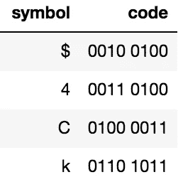
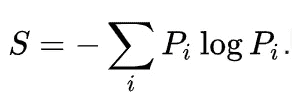
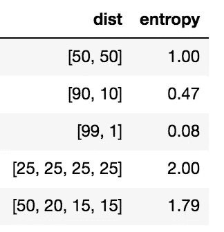

# 信息熵

> 原文：<https://towardsdatascience.com/information-entropy-c037a90de58f?source=collection_archive---------7----------------------->

## 信息论的外行介绍

如果你看我过马路，或者看我玩俄罗斯轮盘赌，哪一个会更刺激？可能性是一样的——我活着或者死去，但是我们都同意过马路有点无聊，俄罗斯轮盘赌……也许太刺激了。这部分是因为我们非常清楚当我过马路时会发生什么，但是我们不知道在俄罗斯轮盘赌中会发生什么。

从另一个角度来看，我们观察过街的结果比从俄罗斯轮盘赌中获得的信息要少。一种正式的说法是，俄罗斯轮盘赌游戏比过马路有更多的“熵”。熵被定义为“缺乏秩序和可预测性”，这似乎是对这两种情况之间差异的恰当描述。

# 信息什么时候有用？

信息只有在可以存储和/或交流时才是有用的。当我们忘记保存正在处理的文档时，我们都有过惨痛的教训。在数字形式中，信息存储在“位”中，或者是一系列可以是 0 或 1 的数字。键盘上的字母存储在一个 8 位的“字节”中，这允许 2⁸ =256 种组合。重要的是要知道，信息存储和通信几乎是一回事，因为你可以认为存储是与硬盘的通信。



Examples of symbols and their 8 digit codes

# 信息存储

数学家克劳德·香农洞察到，一些信息越可预测，存储它们所需的空间就越少。过马路比俄罗斯轮盘赌更容易预测，因此您需要存储更多关于俄罗斯轮盘赌游戏的信息。香农有一个概率分布“熵”的数学公式，它输出平均存储其结果所需的最少比特数。

# 熵



Formula from entropy from Wikipedia

以上是计算概率分布熵的公式。对于分布中所有可能的结果，它涉及以 2 为基数对 P*log(p)求和。Python 中有一个函数可以做到这一点:

```
import numpy as np
def entropy(dist):
    su=0
    for p in dist:
        r= p/sum(dist)
        if r==0:
            su+=0
        else:
            su+= -r*(np.log(r))
    return su/np.log(2)
```

# 例如:俄罗斯轮盘赌

如果我们将过马路的例子量化为十亿分之一的死亡几率，将俄罗斯轮盘赌量化为二分之一，我们将分别得到熵([1，999_999_999]) ≈ 3.1*10^-8 比特和熵([50，50])=1 比特。这意味着，如果我们将这两个实验重复一万亿次，那么至少需要 31000 位来存储过马路的结果，需要 1 万亿位来存储俄罗斯轮盘赌的结果，这符合我们早先的直觉。



Some distributions and their entropies

# 例如:英语

英语有 26 个字母，如果你假设每个字母有 1/26 的概率是下一个，那么英语的熵是 4.7 比特。然而，一些字母比其他字母更常见，一些字母经常一起出现，所以通过巧妙的“猜测”(即不分配 1/26 的概率)，我们可以更有效率。

随机猜测平均花费我们 13.5 次猜测来得到正确的字母。假设我们得到了这个句子中每个单词的第一个字母:

h _ _/A _ _/Y _ _/D _ _/M _/F _ _？

如果我们花了 13.5*16=216 次猜测来填充 16 个空格，那就非常糟糕了。我们很可能会用平均不到两次的时间就猜出这个句子是“你好吗，我的朋友？”。因此，即使我们详尽地猜测第一个字母，花了我们 13.5 次猜测，也要花我们大约 5.1 次猜测/字母来填补所有的空白，这是对随机猜测的巨大改进。

香农的实验表明，英语的熵在 0.6 到 1.3 比特之间。从这个角度来看，3 面骰子的熵为 1.58 位，平均需要 2 次猜测来预测。另外，请注意，键盘上的编码系统使用每个字母 8 位。因此，从理论上讲，它可以使所有只有英语语言的文件缩小至少 6 倍！

# 应用程序

香农的工作在数据存储、宇宙飞船通信、甚至互联网通信中得到了应用。。即使我们不在这些领域中的任何一个领域工作，“KL divergence”也是从 Shannon 的工作中衍生出来的一个想法，它经常被用于数据科学中。它通过比较熵来告诉你一个分布在估计另一个分布时有多好。

信息的交流和存储让人类变得伟大，香农的工作彻底改变了我们在数字时代的交流和存储方式。