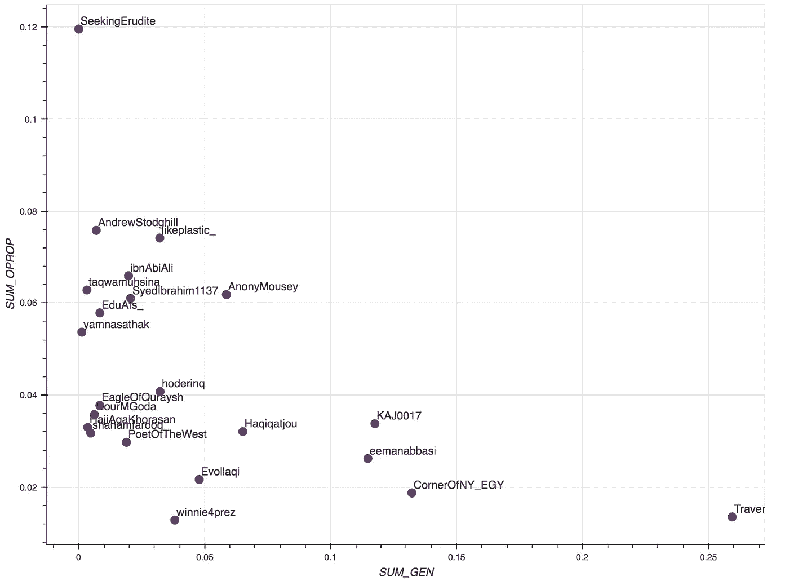

# 分析 Twitter(自我)社区内的信息流

> 原文：<https://towardsdatascience.com/information-flow-within-twitter-community-def9e939bb99?source=collection_archive---------15----------------------->

## 主题建模以理解 Twitter 社区中的信息主题和用户角色

> **重要提示:**请[下载此笔记本文件](https://drive.google.com/uc?export=download&id=1c3oJPqdBnD22vJ-MNoYlsyJlBnIG_1Cb)并在浏览器中打开 ***。***
> 
> 这将有助于你理解，因为很多图表都是交互式的。(也就是说，你可以随意使用它们，放大、缩小、保存、更清晰地查看标签等。)


**Figure 0.0: Twitter Community Detection**

在这个项目的第一阶段，我从更好地理解用户的 twitter 世界的动机开始。处理社交网络的复杂性，**最初阶段需要我们在分析信息流的基础上，将用户的影响——Twitter 的“朋友”——捆绑到社区中。**我们试图将信息“持续存在”的用户群聚集在一起，这表明想法、思想等的循环。围绕着自我使用者(在这种情况下就是我自己)曾经“追随”过的某个焦点。这种方法强调社交媒体的信息共享属性，将每个用户视为一个“节点”,向其他节点传送和生成信息。在练习结束时，我们已经完成了一个相对的空间映射，这有助于我们将潜在 Twitter 世界中的信息网络可视化**【图 0.0】**。也就是说，我们已经追踪到了“哪里”——实现了我们所关注的用户在众目睽睽之下举行的秘密会议(隐藏在巨大的流量中)。这样一个情报网络的发现不可避免地引发了下一个好奇:流动的到底是什么？换句话说，在这些社区中有哪些信息在流动和持续？

**信息系统和数据科学**经常在**社交媒体分析领域携手合作。**允许它们结合的是**自然语言处理(NLP)** 领域，处理语言通常需要某种形式的量化，因此我们可以在用数学折磨信息之前对其建模。对于这个项目，我将研究一些标准的 NLP 方法来量化和“观察”文本信息(tweets)。接下来是对各种关系的一些分析和绘图，我们可以用它们来对社区概况进行一些描述性的推断。

这个职位有两个更高的目标:

1.  向所有人(技术人员和非技术人员)介绍将社交媒体文本信息作为数据处理的一些基本知识——可能有助于他们了解他们的数据如何被分类使用。*甚至可能引入一些隐私问题……*
2.  为了探索我们可以从自然语言处理中获得的结果的质量，特别是在基于 Twitter 信息的社区环境中
3.  为了获得以数据为中心的视图，了解这个社区作为一个整体以及单个用户向根用户(在本例中是我)提供了什么

# 我们将讨论什么

> 1.量化信息(术语频率和命名实体)
> 
> 2.发现推文中的话题
> 
> 3.建立用户档案(基于他们的 tweet 内容和在公共信息流中的角色)

## 范围和数据

我将在这篇文章中分析社区内的属性，而不深入社区间分析所获得的见解。这意味着，我们一次只关注一个社区。为了展示整个流程，**我将使用第一阶段中我的社区#6，一个由来自不同领域和兴趣的年轻穆斯林组成的社区[图 1.0]** 。回想一下，这是一个**“主观”分析**——组成这个社区的用户群只是我从更广泛的社区中关注的用户的子集。从这个意义上说，这个社区是一个更大的社区的样本——这意味着洞察力可以很好地转化，但不一定完全准确。

```
**Side Note:** I have actually begun to follow more people that I would say are from the 'Muslim Community' since I collected this data... but they will (unfortunately ?) not be included in this analysis as this is building off my algorithmically-found ego-community.
```


**Figure 1.0: Community #6 — The Infamous Muslim Community (Blue)**

此外，由于我们再次关注信息的“流动”,我们将只查看在社区中“流动”的推文——我将其近似为在社区中被转发不止一次的推文。这些推文分为两类:

> **社区内流** —由社区内的某个人生成(最初发布)的推文，然后由社区内的某个人传播(转发)。
> 
> **社区外流量** —由不在社区内的用户生成，然后由社区内的某个人传播的推文。


**Figure 1.1: Information Flow Ratio**

**图 1.1** 显示了流量比率的周分布，表明每周，**在社区内传播的推文由社区外产生的推文组成，比社区内产生的推文多 10-25 倍。**这可以看作是社区的社会属性。

```
Flow Ratio: #ofRTsGeneratedOutside/#ofRTsGeneratedWithin
```

**下图 1.2** 显示了该分析将关注的几周信息流。请注意，对于任何给定的用户，可以从 twitter 获取的最大 tweets 数量是大约 3200 条。因此，如果一个用户在一年中发了超过 3200 条推文(包括引用和转发),我们不会拥有他们 2018 年的所有推文，所以分布有点偏斜，但外部和内部流之间的差异是显而易见的。


**Figure 1.2: Tweet Data Timeline**

流的这种分类导致对用户的进一步分类，以服务于社区内的 3 种角色的混合:

> **生成者**——作为在社区内发布信息的人。(创建信息)
> 
> **内部** **传播者** —将社区成员生成的信息传播(转发/引用)给社区内其他用户的人。(在社区内传播信息)
> 
> **外部** **传播者** —将非**社区成员生成的信息传播给社区内用户的人。(将外部信息带入社区)**

**当然，**一个用户可以担任不同数量的多个角色**，我们稍后将对此进行分析。**

**最后，推文也被分类，但以一种更复杂的方式。每条推文都经过预处理，以清除用户提及、标签、网址、媒体等。直到我们有了他们的原始文本，我们可以使用突出的文本处理库(在这个例子中是 *spacy* )来标记和标注推文。**图 1.3** 是我们以这种方式从预处理文本中获得的数据样本。**

```
Tweet = "Happiness is a category of slaves"
```

****

****Figure 1.3 Sample Tweet Processing****

# **信息提取**

## **单词不仅仅是单词，而是数字**

> **词语从来都不是“唯一的词语”，它们很重要，因为它们定义了我们能做什么的轮廓。—斯拉沃热·齐泽克**

**为了开始我们的研究，重要的是回到基础，回到携带信息的单位:单词。说到提到的齐泽克的话，发现“词”就是定义“轮廓”:约束社区的形状的表面边界(我承认我完全盗用了他的说法来为自己谋利，我只能相信他会为此感到自豪)。这在一个领域似乎非常明显(文字携带信息……咄),但在信息系统领域变得更有意义，因为它有助于回答一个关键问题:我们如何量化“信息”?答案近乎稚气:**靠‘数’字。****

> ****重要提示:**请记住，我们所有的分析和见解都是与时间相关的，它们仅表明社区在我们拥有其推文历史的时间范围内的行为(粗略地说，是 2018 年)。**

**让我们看看这些频率，并画出一些更重要的术语**【图 2.1】**。让我们也具体看看“命名实体”(NE) **【图 2.2】**。如何看待这些图表:**

*   ****中红色**的“内部流程”中的术语频率**
*   ****中蓝色**中“外流”一词的出现频率**
*   **x 轴是频率(即 0.1 = 10%)**
*   ****编号标签是术语在相应流**中的排名(即 1 =特定流中出现次数最多的术语)**
*   **图表按“等级差异”排序，暗示:**

1.  ***靠近顶部的词是在外流中出现最显著的词，在内流中出现不那么显著***
2.  ***中间的单词在两个流中同样重要***
3.  ***靠近底部的词是在内流中出现频率较高的词，在外流中出现频率较低***

****

****Figure 2.1: Comparing Terms across Flows** (Blue=OutsideFlow, Red=WithinFlow)**

****

****Figure 2.2: Comparing Named Entities across Flows** (Blue=OutsideFlow, Red=WithinFlow)**

## **数字背后的含义**

**我们如何从上述数字中提取洞察力？我会指出一些，剩下的让你记下来。**

****样本读数:****

*   *****【穆斯林，伊斯兰，穆斯林，伊斯兰】*** 是两个流中出现频率较高的新词，也是总体上出现频率最高的一些词——可能指向该社区的主要讨论点或身份。**
*   *****【自由主义、意识形态、女权主义、资本主义、自然……】***是一些可以在**图 2.1** 底部附近找到的主要术语——它们在内向流动中比外向流动中更重要，这意味着社区倾向于围绕这些术语在自身内部生成信息，而不是从外部输入信息。**
*   *****【Trump、学生、学校、攻击……】***是在**图 2.1 和 2.2** 顶部附近找到的一些术语——该社区围绕这些术语传播的信息更多地是从社区外部生成的(很可能与分享新闻有关)**
*   *****【伊斯兰教法、十一辩经、古兰经、陀思妥耶夫斯基……】***是在**图 2.2** 底部附近发现的一些术语——围绕这些实体的重要信息在社区内产生并传播。有趣的是，陀思妥耶夫斯基可能看起来是这个列表中的一个奇怪的人，但追踪它会突出社区内部某篇文章的产生和传播:**

```
"On the heels of the horrific Pittsburgh synagogue massacre guest contributor examines Dostoevsky's predictions about ideological radicalization and asks what shapes the psychology of the modern terrorist" - @TraversingTrad
[https://traversingtradition.com/2018/10/29/dostoevskys-strange-ideas-and-the-modern-terrorist/](https://traversingtradition.com/2018/10/29/dostoevskys-strange-ideas-and-the-modern-terrorist/)
```

**查看该数据的另一种方式(如果点不多且标记清晰)是在散点图中，其中轴是来自不同流量的相对频率(对数标度)**【图 2.3】**。下面的图是针对命名实体的，描述了我们上面所做的一些分析(例如请注意图表右上角的[ ***穆斯林、穆斯林、伊斯兰教、伊斯兰教]*** 等术语，表示外流和内流的重要性)**

****

**Figure 2.3: Named Entity Scatter Plot**

**本着与上述观点相同的精神，我们可以继续提取更多有助于定义社区的比较属性。然而，尽管这项工作可能证明是有价值的，但当我们意识到这项任务的乏味时，我们的精神最终会衰退。我们也将开始认识到一些不准确之处，并开始问一些问题，比如‘等等，这个术语真的很重要吗，或者它只是因为与另一个术语相关而出现，而另一个术语才是真正重要的术语?’？".这让我们更深入——我们不只是想要一堆单词，我们想要真正了解所有这些单词代表什么的关键。如果单词定义了这个社区的轮廓，我们现在想得到轮廓的“潜在来源”——是什么“导致”这些术语出现？这就是**主题建模的 NLP 技术背后的动机。****

# **主题建模和分析**

## **主题术语简介**

**简而言之，主题建模采用由各种“术语”(推文中的单词)组成的“文档”(在我们的例子中是推文)集合，并找到 N(主题的数量)个唯一的加权策略来应用于术语，使得每个“文档”被分类到 N 个主题的混合中。有许多关于这方面的教程和细节你可以搜索，所以我就不赘述了。具体来说，我使用 TF-IDF 对推文进行了矢量化(基本上是量化)，然后使用 LDA 来找到“主题”。**图 3.1** 描绘了我们在 WithinFlow 中的最终主题。这种方法不能让我们很好地了解社区围绕主题的“观点”,而只能了解主题是什么——我们知道他们在谈论什么，但不一定知道他们对此的看法。*(尽管更复杂的分析当然也可以评估意见——我们稍后在讨论极性和主观性时会看到一个小例子。)***

```
*There are many other terms that have a weight associated to them from one or more of the topics but I have only included some of the more significant ones for readers to get an idea of what the topic 'means'.*
```

****

****Figure 3.1: Topic Models** (term based from WithinFlow)**

****

****Figure 3.2: Topic Names****

****图 3.1** 中气泡的大小表示术语(在 y 轴上)对主题的‘权重’(即，WithinFlow 中的主题 1 将“*文章*作为其最重要的术语)。如果我们在每个主题中取 7 个最重要的术语，我们会得到每个主题的术语摘要**【图 3.2】**。然后，我们可以采用相同的主题模型，并将其应用于外部信息流，以查看主题权重在来自社区外部的信息流中的比较情况。**图 3.3** 显示了两个流的主题权重的比较。**

```
Roughly speaking, I can vaguely see some specific topics popping out: 
Philosophy (#6), 
Feminism / Women Studies (#4), 
Ramadan (#5), 
Statehood / Muslim-Related Politics (#3), 
Prophetic Sayings (Hadith) + Religious anecdotes (#2), 
Article Sharing (#1)The others still make sense but seem to be a mix of things.
```

****

****Figure 3.3: Topic Weights** (Blue=OutsideFlow, Red=WithinFlow)**

**虽然我们已经将术语聚集到主题中，但我们需要更上一层楼，看看这些主题如何模拟整个推文。**

## **话题-推文简介**

**每条推文都被赋予一个权重，构成一个*话题向量*。然后，我们可以在 *topicVector* 上进行一些特征缩减后，在空间上将推文映射到二维空间。我们可以看到形成的集群以及与任何特定主题都没有太大关联但在相对空间中位于它们之间的推文。**图 3.4** 可视化 WithinFlow **的推文和聚类(如果您** [**下载笔记本文件**](https://drive.google.com/uc?export=download&id=1c3oJPqdBnD22vJ-MNoYlsyJlBnIG_1Cb) **，您可以将鼠标悬停在(并放大)每个点上，并探索每个点对应的推文——将鼠标悬停在不同的聚类上将向您显示哪些“种类”的推文有助于我们的主题！).****

```
Note that the size of the circles (each circle = a tweet) represent the tweet's  weight for their respective topic — the larger circles are on the outskirts, meaning those tweets are more closely related to their respective topics. It's as if the ‘latent’ topic sources surround the overall information flow.
```

****

****Figure 3.4: WithinFlow Tweets Visualization in Reduced Topic Space****

**我们可以看到孤立的聚类是紧密围绕各自主题的推文，但其他推文分散在其他主题中(例如，一条推文可能 10%是主题 1，40%是主题 2，50%是主题 3，等等)。“环”中间的推文是权重较低的多个主题的混合，因此不会孤立成一个集群。这些推文可以被解释为不属于任何主题，或者很难分类——尽管如此，它们仍然是离群值。**

**我们还可以将我们的主题模型应用于外部流程，如图**图 3.5** 所示。我们在外向流推文集群中看到更多的混合和更少定义的边界——这是意料之中的，因为通常来自外部的信息不会像内部传播那样定义明确。我们再次鼓励你打开笔记本文件，将鼠标悬停在不同的集群上，感受一下这些集群代表了什么，以及哪种推文导致了集群混淆。**

****

****Figure 3.5: OutsideFlow Tweets Visualization in Reduced Topic Space****

## **话题盈利能力**

**使用主题权重，我们可以通过选择权重最大的主题，将每条推文归类到特定的主题中。然后，我们可以分别可视化每个流量中每个主题的转发计数(该推文被转发的次数)分布——通过这种方式，我们可以衡量我们主题的“盈利能力”属性。**图 3.6** 中的每个图表显示了每种信息流的转发次数分布(蓝色=内流，橙色=外流)。这些分布给了我们一个概率上的概念，关于这个话题的一条推文有多少转发。**

```
Note that the x-axis is log10 scaled (i.e. 2 = 100 retweets, 3 = 1000 retweets, etc.). This means even slight differences between the distributions in the charts can indicate large profit (#ofRetweets) increases/declines.
```

****

**Figure 3.6: ReTweet Count Distribution (log10 scaled)**

****样本阅读:****

*   **WithinFlow 中主题#3(国家地位)的推文最有可能获得 10-100 次转发。**
*   **话题 2(圣训、预言)中的推文获得相同数量的转发(约 10-100)，无论它们是内部生成的还是从社区外部带来的。**
*   **主题#1(文章分享)中的推文在 WithinFlow 中的平均转发量高于 OutsideFlow，但只有 OutsideFlow 推文的转发量超过 100 次。**

## **话题的极性和主观性**

**另一个可以探索的有趣衡量标准是推文的**极性** **(文本中表达了多少‘情绪’，范围从-1.0 到 1.0——有多‘极化)**及其**主观性(表达有多‘个人化’，范围从 0 到 1)** 。我使用了一种非常弱的方法来计算这些度量(简单地聚合 tweet 中每个词的极性&主观性，这可以从预定义的库和映射中获得),但是我们仍然可以制作一些很酷的、看起来像外星人的图表！这些是联合密度图，基本上模拟了双变量(2 个变量)分布——它们很直观地告诉我们大多数推文在极性-主观性尺度上的位置。颜色表示“密度”，例如，WithinFlow(红色)的 maxTopic=3 图表显示了一个以(极性= ~0.1，主观性= ~0.25)为中心的深红色圆圈，这表明主题 3 中的大多数推文都具有这些极性/主观性值。**

********

****Figure 3.7: Subjectivity/Polarity Density Graphs** (Red = WithinFlow, Blue=OutsideFlow)**

****样本读数:****

*   **话题#4 ( *女人-穆斯林-男人-堕胎-盖头-女权主义者-想要*)中的推文在 WithinFlow(在社区内部生成)中比从社区外部带入流中的推文更加*主观* 。**
*   **主题 3(国家地位)中的推文在 WithinFlow 中的极性/主观性尺度上更加分散，相比之下，OutsideFlow 中的推文更加密集。**

> **这些是总体趋势，我将再次花时间提醒读者，我们的分析既是主观的(基于我个人的追随者)，也是时间的(2018 年的信息流)。**

**让我们继续关注用户，因为每个人都知道… **真正的八卦不是关于想法…而是关于人！**既然我们知道哪条推文来自社区中的哪个用户，我们可以再上一层楼，在用户层面进行调查。**

## **主题-用户配置文件**

> ****参考消息:**所有这些用户资料都是公开的(在我收集这些数据的时候，所以从法律上来说，我很酷)。如果一个用户有 1000 多名追随者(我“直觉地”认为这是一个非常随意的数字..)，我只是认为他们是公开的，应该可以对他们的推文进行分析。对于 1000 名粉丝，我已经发信息问他们是否同意，如果他们不同意就删除他们的数据。然而，**
> 
> ****如果你因为任何原因希望你的名字被删除，请告诉我！****

**在我们将用户简档与我们生成的主题混合在一起之前，让我们先分别对我们的用户进行简档分析……有一些算法可以帮助我们从一个文档子集(即特定用户的推文)中找到与整个文档集(信息流中的所有推文)相比最有区别的术语。**图 3.8** 显示了用户生成的推文中最具鉴别性的术语(*gendiscsterms*)以及他们传播的推文(*propdiscsterms*)，这些术语将他们与信息流的其他部分“区分开来”。*这并不意味着这些是他们最重要的术语！***

```
"N/A" means there weren't enough tweets to really discriminate any terms.. sorry!*For those of you who know '@dimashqee', his account has been deactivated so we don't know which tweets he has retweeted, even though he tends to be a major player in this community around certain topics.
```

****

****Figure 3.8: Discriminative Terms by User****

**这些已经给了我们一个用户的概念！但是我们希望能够根据用户对我们在信息流中发现的主题的贡献来描述他们。为了做到这一点，我们可以根据发推的用户和转发的用户来合计我们的主题权重。这使我们能够根据我们之前强调的 3 个角色(生成者、内部传播者、外部传播者)来描述社区中的用户。**图 3.9、图 3.10 和图 3.11** 描绘了用户主题*的占有率*——阅读它们:**

*   ****占用百分比:**圆圈的大小表示特定用户“占用”该主题的特定信息流(内流或外流)的百分比(根据图表，这可能意味着他们生成了多少信息或传播了多少信息)**
*   **所有列的总和为 100%**
*   **最后一列' **TopicSum** '表示用户在图表的相应角色中“占据”的信息流的总百分比。**

```
Some of the numbers are hard to see here, I once again point the readers to the linked notebook in which you can hover over the points and see the complete topic Name as well as a clearer Occupation %.Occupation sounds a little.. harsh, but it is meant to be indifferent here.. :)
```

****

****Figure 3.9: Internal Propagation Occupation Percentages****

****

****Figure 3.10: Internal Generation Occupation Percentages****

****

****Figure 3.11: External Propagation Occupation Percentages****

**我们还可以使用散点图来查看用户空间的高级角色配置文件。**图 3.12、3.13 和 3.14** 显示了社区中不同用户角色之间的更高层次的关系(即**图 3.12** 是用户在社区中的总内部传播占有率%与用户在社区中的总生成占有率%之间的比较)。**

```
**GEN** = Generator, **IPROP** = Internal Propagator, **OPROP** = Outer/External Propagator*Note: those with very low occupation % are excluded.*
```

****

****Figure 3.12: Internal Propagation Occupation vs. Generation Occupation****

****

****Figure 3.13: External Propagation Occupation vs. Generation Occupation****

****

****Figure 3.14: External Propagation Occupation vs. Internal Propagation Occupation****

****在我看来，图 3.9–3.14**是更有价值的衡量标准之一，不仅可以通过内容，还可以通过活动类型来捕捉用户行为。以下是从上述 6 个数字中可以获得的一些高水平读数示例。**

****样本读数:****

*   **@TraversingTradition 是该社区内部信息流的主要产生者，今年产生了超过 24%的内部材料，但只有 7%的内部材料传播到社区的其他地方。它似乎只有效地参与了社区中 6/9 的主要话题。**
*   **“AndrewStodghill”和“@ SeekingErudite”是两种信息流中的大型传播者，但却是非常低级的生成者。这些用户可被视为信息流连续性的重要节点，尽管他们不一定产生材料。**
*   **thesalafieminist(' @ AnonyMousey ')将最大比例的外部信息带入主题#2(女权主义/女性研究)的信息流**
*   **每个主题似乎都有一种 30-70 法则…每个主题中 30%的用户(~5)产生并传播~70%的信息。**
*   **话题#4 的世代职业(与女权主义、盖头等相关。)比话题#2(与先知语录(圣训)、宗教轶事和语录等相关)的世代职业分布要分布得多。)由单个用户独占 50%。这种趋势可能会促进进一步的研究，因为它可能暗示主题#4 比主题#2 有更少的“回音室”。**

> **当然，还有更多的见解，这完全取决于你想回答什么样的问题，以及你是否想确定单个用户的行为，等等。**

**…但是等等，还有更多！我们还可以按主题分解各种用户角色，并探索主题间的相关性。为了把你从一大堆图表中解救出来，我把分析放在了附录 A 中，供感兴趣的人参考。**

# **结束语**

*   **我们的分析帮助我们**成功地形成了围绕所选自我社区的信息流**的术语级、推文级和用户级概况。**
*   **总的来说，成绩还是比较满意的！最初对用户社区的细分有助于限制问题，并找到真正相关和有见地的主题，而不是盲目地在一组推文中建立主题模型。信息流的主要贡献者进一步证实了这一点，比如在我们的用户特征分析阶段强调的“@TraversingTradition”。**
*   **提醒一下，一旦编程，这种分析(以及更详细、更先进的流程)需要几分钟才能完成— **这意味着当你同意使用 Twitter 作为公共平台时，你也在向工具和算法公开你的数据，这些工具和算法比你想象的更高效和有效**。当然，我的目的不是“恶意的”(我保证！)但是更恶意的目的会有相同的访问…**
*   **由于我亲自跟踪这些用户，从这一分析中提取的这些用户的特征、内容和行为并不太令人惊讶，并且似乎与我随着时间的推移对社区定性获得的直观理解一致。然而，由于这种分析可以为任何一组用户完成，**这种主题建模分析可以先发制人地给我们一个这个社区可以提供的总信息增益(和/或特定用户)的概念**。在今天的社交媒体模型中，这种理解的明显用例指向有针对性的营销和广告，**但人们也可以想象为研究、调查、政策制定等获取社会学信息的用途。不太“公司化”的。****
*   **在我们的分析中，内外流的权重都很高的术语，如 ***【伊斯兰教，穆斯林等等。]*** 帮助我们反向验证我们的社区检测——对我们的用户算法分组感觉良好。**
*   **虽然我们只对一个社区进行了分析——但社区间的比较肯定是有空间的，甚至可以构建定义社区信息流的基本指标，并发现社区实际上是以可预测的方式组成的？(即根据他们的用户角色的分布)**
*   **此处的分析主要是描述性的，但是**这些信息也绝对可以用于构建预测模型**，帮助我们了解未来可能产生的效果和影响。**

**这篇文章的主要目的是对信息流的实质进行分类，所以我一直羞于对我们的观察进行解释，并提取预测性的见解。这是因为，在解释时，我们面临着技术官僚方法的软限制:观察，尽管精心策划和有趣，可能意味着任何事情和一切。对于这个问题，**(我相信)数据科学家必须做出勇敢的尝试，利用社会学领域为我们提供一两个理论来解释我们的发现——强调一个我非常珍视的哲学观点:用“理论”支持数据科学相关分析过程的必要性。**尽管社区检测也源于“社会学”自我网络的概念，但这仍然是对社会学领域非常肤浅的引用。为了进一步分析信息流的内容，我们需要更深层次的东西。*(提示:高夫曼？布迪厄？萨特？..海德格尔？)***

**[社区检测(阶段 1)](/generating-twitter-ego-networks-detecting-ego-communities-93897883d255) 帮助我们找到了信息流向的“哪里”，主题建模(阶段 2)帮助我们找到了信息流向的“什么”——下一个阶段(3)是“为什么”。在未来，我计划通过介绍数据科学分析和社会学理论(在社交媒体分析领域)之间的联系以及它们如何帮助我们解释和限制我们的结果的意义来结束这个项目。敬请关注…**

# **附录 A —角色之间的主题间关联**

**我知道这看起来像很多图表、点和线，但不要被吓倒！**图 A.1 和 A.2** 按主题显示了外部和内部用户角色(外部传播方与内部传播方/生成方)之间的关系(例如**图 A.1** 的左上图显示了主题 0 的外部传播占有率%与主题 0 的代占有率%之间的关系，右上图显示了主题 0 的外部传播占有率%与主题 8 的代占有率%之间的关系。在我们的例子中，我们有一个很小的样本量(大约 22 个用户)，因此这些图表不能全信，但是原则上，我们可以使用这些可视化来更深入地理解特定的主题关系。**

**要阅读下面的图，最好是在从左到右或从上到下扫描时寻找奇怪之处。我们正在寻找的是特殊的行为，即，如果主题 X 的内部传播占用百分比与主题 Y 的生成占用百分比的关联方式不同于与其他主题的关联方式，这可能暗示主题之间存在相互影响。**

```
**GEN** = Generator, **IPROP** = Internal Propagator, **OPROP** = Outer/External Propagator
```

****

****Figure A.1: External Propagation Occupation vs. Generation Occupation [by Topics]****

> ****图 A.1 的样本读数****
> 
> **有一个更强的趋势表明，围绕主题#0 传播外部信息的用户倾向于围绕主题 4、5、6、7、8 生成更少的信息。**
> 
> **一般来说，看对角线，围绕某个主题产生更多信息的用户倾向于传播较少的外部信息。**

****

****Figure A.2: External Propagation Occupation vs. Internal Propagation Occupation [by Topics]****

> ****图 A.2 的样本读数****
> 
> **内部传播的话题#2 和外部传播的话题#2 之间特别强的正相关。**
> 
> **看对角线，似乎一般来说，在内部传播更多给定主题的用户也倾向于在外部传播更多相同的主题。**

> **感谢您的阅读！**

***我在这些帖子中的总体目的是探索我个人好奇的概念的实践方法——因此，无论你在哪个领域，如果你有任何有趣的想法想讨论或合作，在你认为数据科学可以提供一些价值的地方，请随时给我发消息，我们可以谈谈。***