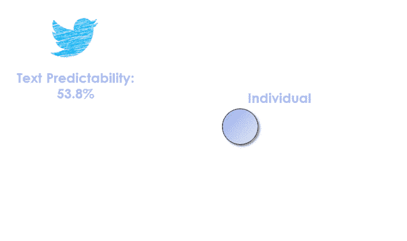
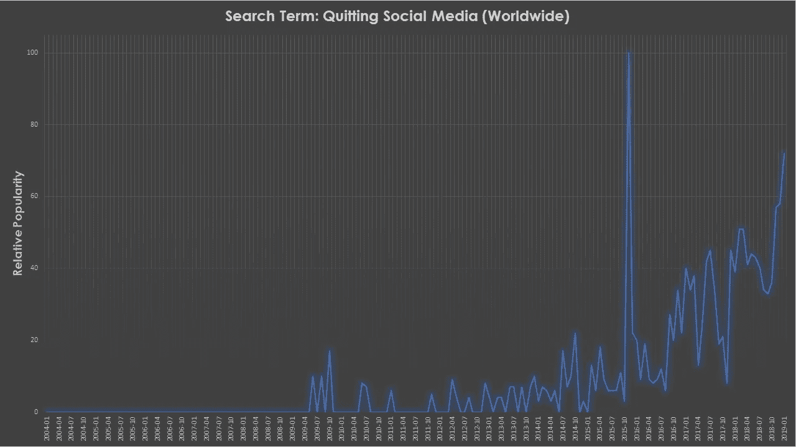

# 信息在你和你的朋友中流动

> 原文：<https://towardsdatascience.com/information-flows-in-you-and-your-friends-1a1e2e0f0734?source=collection_archive---------14----------------------->

## 使用社交媒体信息的可预测性上限，即使一个人已经删除了他们的社交媒体存在

你已经喝得够多了。婴儿照片，朋友们的政治演说，甚至可爱的猫的照片！担心你的隐私和未来的职业安全。你决定删除你在脸书、推特和 Instagram 上的账户。你有一个好公司:[数百万脸书用户](https://www.recode.net/2018/2/12/16998750/facebooks-teen-users-decline-instagram-snap-emarketer)在 2017 年开始离开该平台，未来看起来也不会太好。 [Twitter](https://www.statista.com/statistics/282087/number-of-monthly-active-twitter-users/) 努力寻找新用户以保持活跃用户群不变，只有 Instagram 在增长。删除你的账户和你发布的所有内容后，你和数百万人都认为你是安全的。结果，你不是。因为，从信息论的角度来看，*就像你从未离开过*。

相反，如果你是一名数据科学家，试图建立基于社交媒体信息的预测性机器学习模型(社交媒体创造了每天产生的 [2.5 万亿](https://www.socialmediatoday.com/news/how-much-data-is-generated-every-minute-infographic-1/525692/)字节数据的很大一部分)，你可能会认为能够使用个人数据进行预测会非常有用。从 Target [在受影响者的父母知道之前识别怀孕](https://www.forbes.com/sites/kashmirhill/2012/02/16/how-target-figured-out-a-teen-girl-was-pregnant-before-her-father-did/#6780de5d6668)到[预测政治忠诚度](https://www.washingtonpost.com/news/monkey-cage/wp/2016/12/21/using-these-4-steps-pollsters-could-use-social-media-data-to-improve-election-forecasts/?utm_term=.ec4919d6c3bf)和选举结果，社交媒体数据是数据科学和机器学习的名副其实的宝库。因此，如果你是一名数据科学家，你很幸运！因为即使你感兴趣的人和他们生成的所有内容可能已经从社交媒体上消失，你仍然有机会预测他们的行为或情绪。以下是方法。

Limits of text predictability based on the availability of data from friends and the individual.

我们在这里引用的是佛蒙特大学的 James P. Bagrow、Xipei Liu 和 Lewis Mitchell 最近在自然人类行为杂志上发表的一篇文章。在这项工作中，作者探索了你可以从社交媒体中提取多少预测能力的极限，特别是在有问题的个人删除他们的社交媒体资料的情况下。原来，还挺多的！高达 **95%** **的预测力**围着你转，不用你也能聚集。该怪谁呢？你的朋友！在你的封闭社会环境中嵌入了太多关于你的信息，数据科学家原则上不需要个体本身在场就能达到合理的预测准确度。在文章的最后，我们将讨论这种方法的潜在局限性，所以请不要离开。

但是让我们回到实际的出版物。进行这项研究的研究人员以信息论为指导。由贝尔实验室研究员克劳德·香农在第二次世界大战后构想的[信息论](https://en.wikipedia.org/wiki/Information_theory)是一门对通信过程中的数据丢失和压缩，或者简而言之，信息流等主题感兴趣的整体学科。香农还在信息论中引入了熵的概念，用事件的预期结果来表示不确定性的数量。熵值为 1 意味着我们根本无法预测哪一个事件会发生(例如，硬币的哪一面是由抛硬币产生的)，而熵值为零意味着预期结果没有不确定性。这很重要，因为在这种情况下预测个人行为意味着根据过去预测他们未来(在 Twitter 上)会写什么。因此，较低的熵意味着你能够更好地预测一个人接下来会说什么，或者在给定提示的情况下会说什么(例如政治)。

在他们的工作中，Bagrow *等人*使用预测未来文本所需的信息比特中给出的熵率。4 比特的熵率将对应于从 24 = 16 个字中随机选择每个预测字。这听起来可能不多，但考虑到社交媒体用户拥有大约 5000 个单词的词汇量，这是一个巨大的进步！这里一个重要的考虑是，信息论处理通信的限制，因此给定的熵率及其相应的可预测性意味着给定该数据的预测生成模型的上限。随机可预测性(词汇量为 5000 个单词)将为 0.02%，而 Twitter 用户在他们的数据集中的平均可预测性为 53%(对应于 6.6 位的熵率)。这意味着，在一个建立在 Twitter 数据上的理想模型中，超过每秒钟预测的单词都是正确的。

然而，这个故事的主要部分是关于你的朋友。类似于熵，交叉熵是预测*你的*短信所需的来自你朋友的比特数。在这篇文章中，作者为每个人选择了 15 个最亲密的朋友(这是这个人在 Twitter 上最常提到的)。第一个重要的点是，你的社交圈里有关于你的信息。将你和你的朋友的预测信息结合起来，可预测性增加到 60%以上(无限数量的朋友为 64%)，尽管这里肯定存在收益递减，这意味着添加到模型中的第一个朋友的影响比第十个朋友的影响更明显。这一切都很好，可以改善预测，但现在来了弥天大谎。将你自己从社交媒体网络中移除，并且*只使用你的朋友来预测你的文本，你最终对 15 个朋友的预测率为 56%,对无限多个朋友的预测率为 61%。我要明确一点:仅仅使用 8-9 个朋友(不使用个人本身),你就可以打破使用真实个人的信息，你可以获得个人+朋友的最大可预测性的 95%!*

如果你是一个想要利用这一点的数据科学人士，这里有另一个见解:这种可预测性对于发布很多帖子(从而强烈影响/影响他们的朋友)的个人以及不发布很多帖子(否则他们的表达会太多样化)并经常提到个人的朋友来说尤其明显。因此，当一个人删除个人资料时，他在网络中留下的印记会因其个性和网络而异。

以下是这项研究的一些注意事项/限制:与所有此类研究一样，不幸的是，这种社交嵌入效应仅在实践中有效，前提是你在某个时候是社交媒体的积极用户，以便确定你的社交圈。然而，如果有其他方法将你和你的朋友联系起来(GPS 协同定位，在没有标签的帖子中提及，等等)。)如果他们在社交媒体上，这条警告就无效了。另一个考虑是，通过社交媒体获得的可预测性可能仅限于发布在社交媒体上的文本。虽然这仍然允许探索情绪和态度，但建立在此基础上的模型可能无法准确预测，比如说，个人撰写的长篇文章。最重要的限制，也是作者提到的，是这些嵌入的信息可能会随着你的社交圈的发展而改变(见鬼，他们中的一些人甚至会退出社交媒体)。因此，从个人退出社交媒体的那一刻起，你可能有很短的时间来开发一个表现良好的模型(这对你来说是好事，个人！).有趣的是，看看这是否可以通过在模型中包括更多的朋友，仔细选择“变化”程度低的朋友来保持嵌入，或者简单地依赖于旧的存档社交媒体数据(互联网什么都不会忘记)来缓解。

This is why prediction from your friends after you quit social media will be important. Source: [Google Trends](https://trends.google.com/trends/explore?date=all&q=quitting%20social%20media)

总之，我认为这篇文章是我们在环境中保存信息的一个很好的例子。以城市为例。除了十字路口、[天然港湾](http://www.newworldencyclopedia.org/entry/Harbor)和[商路](https://en.wikipedia.org/wiki/Cities_along_the_Silk_Road)的记忆，它们还能是什么？同样，我们的朋友至少代表了我们的一部分，并带着我们的信息。显然，如果有足够多的朋友，这足以教会一个模型比直接“研究”我们更好地了解我们。随着前面提到的传统社交媒体平台的大量涌现，对于对你的政治倾向感兴趣的广告公司或机构来说，这可能是一个黄金机会，可以利用机器学习和数据挖掘来保持或扩大他们的预测潜力。我想知道仅仅建立在朋友基础上的机器学习模型在实践中有多容易建立/强大！如果你尝试一下，请告诉我！

您可能会对文章中的一些附加注释/琐事感兴趣:

-社交媒体文本比“传统文本”更极端，有些很容易预测，有些很难处理。

-基于认知极限，[邓巴的数字](https://en.wikipedia.org/wiki/Dunbar%27s_number)假设每个人最多有 150 个左右的朋友。然而，[脸书好友](http://www.pewresearch.org/fact-tank/2014/02/03/what-people-like-dislike-about-facebook/)的平均数量超过 300，而 [LinkedIn 好友](https://www.statista.com/statistics/264097/number-of-1st-level-connections-of-linkedin-users/)的平均数量超过 500。这意味着与传统的友谊网络相比，社交媒体平台可能会产生相当大的影响。

-与他们的朋友相比，个人自己的帖子中有更多的长期信息。与最近的帖子相比，前一段时间朋友的帖子对个人文本预测产生的收益递减影响清楚地表明了这一点。

-由于作者从他们的数据中排除了超链接，这里给出的限制可能是可扩展的。使用[共同训练](https://en.wikipedia.org/wiki/Co-training)或其他方法可能会产生一个包括关于这些超链接的信息的模型，因此能够利用更多的信息并实现更好的预测。