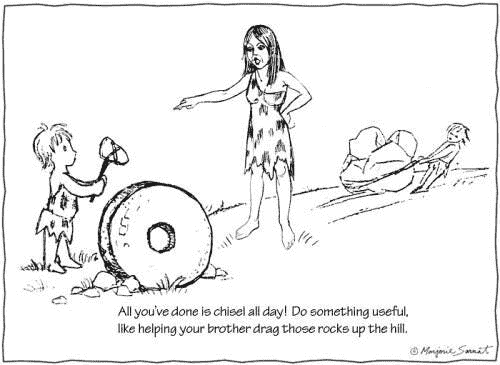
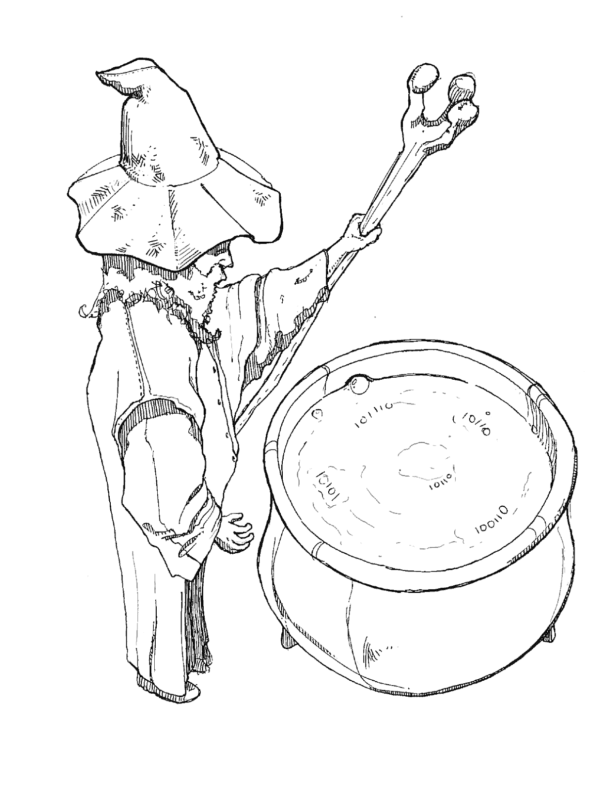

# 启动数据科学的数据计划要素

> 原文：<https://towardsdatascience.com/ingredients-in-a-data-program-to-jump-start-data-science-4cc01b5bb1ae?source=collection_archive---------35----------------------->

*Fig. 1 by* [*Marjorie Sarnat*](https://twitter.com/MarjorieSarnat)*. From left to right: Data Scientist, Business Manager, Data Analyst*

在过去的几年里，我遇到了一些数据科学家，他们在统计分析和机器学习领域大有可为，但当他们进入商业领域时，他们面临着许多挑战，这些挑战让他们难以起步。他们很快就被提供即时结果的压力所淹没，而孤岛式数据源的复杂环境又进一步加剧了这种压力。

在本文中，我为您的数据程序提出了一些要素，以帮助数据科学家更快地入门，这些要素也可以更广泛地应用于一般的数据工作者。

# 魔法？

如果你将“数据科学”和“魔术”这两个词一起谷歌，你会发现许多文章解释说，数据科学不是魔术的黑盒子(像[这篇文章](https://www.nielsen.com/us/en/insights/article/2019/the-true-magic-of-data-science/)，或者[这篇](https://blog.innertrends.com/data-science-no-magic-100-science/))。作者表达了当数据科学家的工作被误解或他们没有做好工作所需的东西时，他们所面临的挫折感。

如果你是一名渴望利用数据科学来发展业务的商业专业人士，那么被告知“数据科学不是魔法”可能会降低你的热情——就像当一个孩子第一次被告知圣诞老人不是真实的一样。

我想知道我如何才能鼓励人们继续对数据科学保持兴奋，同时也阐明我们需要数据科学计划取得成功的一些因素…然后，在万圣节前的一周，我有了以下想法。我一直在我家附近散步，意识到这是一个穿上戏服假装的季节。所以…

让我们*假装*一个数据科学家*是*一种魔术师…

Fig. 2 by [Roel Punzalan](https://www.linkedin.com/in/roel-punzalan-87730061/)

比方说，你让你的数据科学家为你调制一种药剂。你请他施展魔法，将数据转化为源源不断的精彩见解，供你的企业使用。当这个白胡子巫师向你走来时，你搓着双手，满怀期待。他把他的手杖重重地摔在地上，说道:

"首先，我需要 1)一个洞穴，2)一口大锅，3)一个巨大的火炉."

你挠了挠头，然后指着小房间里桌子上的一台笔记本电脑。

他摇了摇头，再次将他的手杖重重地砸向地面，重复道:“一个洞穴，一个大锅，一个巨大的熔炉……”

# 一个洞穴(情境+协作环境)

数据科学家首先需要的是背景。

很多时候，数据科学家被要求进行研究，却没有被告知他们应该解决的问题的足够背景，或者他们需要依赖的现有数据流。

因此，数据科学家花费大量时间试图理解和跟上他们需要的数据流，但这些数据流存在于他们自己的环境之外。

更为复杂的是，由于业务需求不断变化，数据流也在不断变化。

如果来自这种隔离环境的研究需要传递给希望在生产中使用该研究的某个方面的工程团队，这种隔离将在未来带来挑战。

这些挑战可以通过*在现有环境中满足数据科学家的需求来解决*:

1.  邀请他们作为(可选)参与者参加您的所有团队会议，这样他们可以熟悉您的团队、您的业务目标和现有的技术环境。
2.  考虑一下他们研究工作的节奏，以及它与你现有的 scrum 流程的关系。这可以被认为是一种类似于你如何管理 UX 设计需求的方式。
3.  为他们提供一种方法，让他们了解您的整个数据流和对象集。
4.  将路线图的一部分专门用于在现有环境中为数据科学研究开辟空间。

# 大锅(容器+计算能力)

在现有环境中开辟空间以满足数据科学需求通常需要考虑以下常见因素:

1.  存储和管理[可再生研究](https://en.wikipedia.org/wiki/Reproducibility#Reproducible_research)的地方(例如 jupyter 笔记本)
2.  分享研究的方法
3.  一种安全存储凭证的方法，同时以其他人可以输入自己的凭证的方式共享研究
4.  一种安全连接到所需数据集的方法
5.  访问存储和计算资源，他们可以根据需要增加或减少存储和计算资源。

数据科学专业的毕业生通常能够自我管理这些元素，但理想情况下，他们会获得一个环境的钥匙，让他们能够自我管理存储和计算资源(例如 AWS 或 GCP)。

与您的工程团队一起协调这些需求是一个好主意，他们可能能够将这些需求纳入现有的 repos 和 docker 映像，以便可以在本地环境以及您的 VPC(虚拟私有云)上的各种其他环境中共享和测试研究。

# 一个巨大的熔炉(实时数据)

您需要帮助您的数据科学家开始工作的最后一个障碍是为他们提供一个紧密代表实际生产数据的数据流。

如果研究要求需要进入生产:

*   就安全考虑事项与您的安全团队协调
*   与您的工程团队协作，通过 API、Kafka 流或相关生产数据库的副本来公开生产数据(通常，直接访问生产数据库不是一个好主意)

如果研究需求没有明确要求访问生产环境，请记住，生产环境通常包含难以在暂存环境中复制的脏数据。数据科学家通常需要考虑这些因素，并在通过算法运行数据之前运行清理/清理功能。使用虚拟数据测试的机器学习算法只有在虚拟数据代表生产数据的程度上才真正成功。

# 药剂(示例业务用例)

说了这么多，做了这么多——你有了一个洞穴、一口大锅和一个巨大的熔炉，并且正在运行——你的数据科学家会问你，“你到底需要我的药水做什么？”

你想预测未来的收入吗？优化你的供应链？为客户提供更好的产品推荐？或者，确定客户终止订阅的最重要原因？

虽然这些都是数据科学可以实现价值的好例子，但可以考虑从小处着手，获得“第一次胜利” [⁶](https://www.theseattledataguy.com/top-30-tips-data-science-team-succeeds/) 。例如，将客户反馈分为正面或负面(类似于垃圾邮件过滤器)，或者更简单地，验证数据中的现有计算。

有时，企业会意识到他们需要一名数据科学家，但不知道具体原因。这可能是一个不错的开始，但是你很快就会想去做一些具体的事情。如果您为数据科学家提供足够的业务目标背景，他们可能会帮助您确定要测试的假设，从而帮助您确定行动方案。

# 为什么这很重要——即使你没有数据科学家

虽然在本文中，我主要关注数据科学家面临的挑战，但这些挑战可以归因于更广泛的数据工作者网络。数据和分析越来越被视为构成任何组织命脉的关键企业资产。

> “到 2022 年，90%的企业战略将明确提到信息是关键的企业资产，分析是一项基本能力。
> 
> 到 2022 年，30%的[首席数据官]将与他们的首席财务官合作，正式评估组织的信息资产，以改善信息管理和收益。
> 
> 到 2023 年，数据素养将成为商业价值的明确而必要的驱动因素，这表现在它被正式纳入超过 80%的数据和分析战略以及变革管理计划中。”——[高德纳公司](https://www.gartner.com/doc/reprints?id=1-1OBMC46L&ct=190726&st=sb)

# 附加帮助

数据科学已经发展成为一个庞大的学科体系。寻找一名优秀的数据科学家有时等同于寻找一只独角兽。思考这一挑战的另一种方式是将数据科学视为更多的团队工作。与其在一个人身上寻找一整套技能，不如在您的数据策略中考虑一些其他角色:

# 首席数据/分析官

CDO 或 CAO 通过分析计划推动业务价值，并定义跨业务垂直领域的标准

# 数据分析师

专注于将信息转化为有意义的见解，并利用现有工具实现标准数据管道。

# 数据工程师

关注特定于分析的架构需求，并构建自定义数据管道。

# 决策科学家

关注分析工作的成本，并跟踪投资回报(ROI)

# 数据管家

拥有特定的数据集并管理质量和可靠性

# 无服务器技术

过去几年云技术的进步为启动您的数据科学项目提供了一些绝佳的机会。

# 最后的想法

[GitLab](https://about.gitlab.com/) 的数据团队一直是我的灵感来源，影响着我如何思考创建一个为成功而设置的数据程序。他们的理念、过程和数据管道都可以在他们的[手册](https://about.gitlab.com/handbook/business-ops/data-team/)和[数据团队知识库](https://gitlab.com/gitlab-data/analytics)中公开获得。他们的 CI/CD 方法使数据工作者能够比我迄今为止遇到的任何方法都更快、更可持续地投入工作。

您的数据团队是否花费更多时间收集和移动数据，或者分析和提供见解？

你如何将你的数据科学家纳入你的软件开发过程？

我很想听到关于这些想法是否对任何人有帮助的反馈。

感谢阅读！谢谢你，[Edwin](https://www.linkedin.com/in/edwinfigueroa8/)——谢谢你帮我审阅我的文章，还有[Roel](https://www.linkedin.com/in/roel-punzalan-87730061/)——谢谢你的向导插图:)