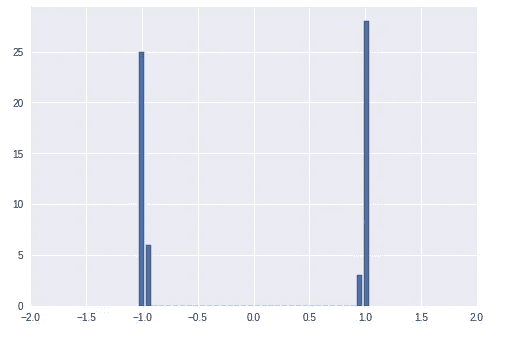

# 神经网络的初始化技术

> 原文：<https://towardsdatascience.com/initialization-techniques-for-neural-networks-f4ce8e64effc?source=collection_archive---------11----------------------->

## 因为有个好的开始总是更好！！

在这篇博客中，我们将看到深度学习中使用的一些初始化技术。任何在机器学习方面没有多少背景的人都必须知道，我们需要学习权重或超参数来建立模型。这些参数决定了我们的算法在未知数据上的表现。为了学习模型，我们需要初始化参数，应用损失函数，然后优化它。在这篇博客中，我们将关注网络的初始化部分。

如果你曾经构建过任何机器学习算法，你一定听说过我们需要“随机”初始化我们的权重作为起点，然后开始学习过程。随机这个词本身就很模糊。我们将会看到 random 这个词背后的真正含义以及不同的初始化技术。

1.  **零初始化**

这是初始化权重的最简单方法之一，方法是将所有权重都设置为零。现在让我们用一个简单的两层网络来想象这种技术的含义。

由于我们已经设置了所有的权重，即 w= 0，我们可以很容易地看到，在向前传递期间:

> **a1** = w1*x1 + w2*x2 + w3*x3， **h1** = g(w1*x1 + w2*x2 + w3*x3)
> 
> **a2** = w4*x1 + w5*x2 + w6*x3， **h2** = g(w4*x1 + w5*x2 + w6*x3)
> 
> **a3** = w7*x1 + w8*x2 + w9*x3，**H3**= g(w7 * x1+w8 * x2+w9 * x3)
> 
> **y**= g(h1 * w10+H2 * w11+H3 * w12)

很清楚的看到 a1 = a2 = a3 = 0，h1 = h2 = h3。-> **(1)**

现在让我们看看反向传播会发生什么

> ∇**w1**=∂l(w)̇/∂w1 =∂l(w)̇/∂l(y)̇*∂l(y)̇/∂l(h1)̇*∂l(h1)̇/∂l(a1)̇* ̇x1
> 
> ∇**w4**=∂l(w)̇/∂w4 =∂l(w)̇/∂l(y)̇*∂l(y)̇/∂l(h2)̇*∂l(h2)̇/∂l(a2)̇* ̇x1
> 
> ∇**w7**=∂l(w)̇/∂w7 =∂l(w)̇/∂l(y)̇*∂l(y)̇/∂l(h3)̇*∂l(h3)̇/∂l(a3)̇* ̇x1

由此我们可以看出，∇w1 = ∇w4 = ∇w7(从 1)，同理∇w2= ∇w5= ∇w7 和∇w3 = ∇w6 = ∇w9

从上面的论证中，我们可以看出每一步重量的变化是相同的。因此，隐藏层中的所有节点都在学习输入的相同参数，这导致冗余，并使我们的网络不太灵活，因此不太准确。这也叫做**对称性问题**。因此零初始化不是一个好的技术。

2.**用相同的随机值初始化**

在这种技术中，我们用相同的随机值初始化所有的权重。我希望你已经得到了这个技术的问题，因为它非常类似于零初始化，我们只是使用了一个随机值，但同样的问题仍然存在，因为权重的更新将再次处于相同的顺序。因此也不使用这种技术。

3.**用小随机值初始化**

在该技术中，我们从具有均值 0 和方差 1 的单变量“高斯”(正态)分布中随机初始化所有权重，并将它们乘以 10 的负幂以使它们变小。我们可以使用 numpy 在 Python 中这样做，如下所示

> W = np.random.randn(输入 _ 层 _ 神经元，隐藏 _ 层 _ 神经元)*0.01

通过绘制梯度值，我们可以得到一个类似于的正态曲线。

现在，我们将运行学习算法，看看分布如何随着不同的 eopchs 而变化

After 10 epochs

After 20 epochs

After 50 epochs

从上面的图中，我们可以很容易地看到方差在减小，梯度饱和到 0。这就是所谓的**渐变消失问题。**人们也可以将此形象化，因为每个梯度是作为导数相乘链的结果而获得的，并且每个值远小于 1，因此梯度为零。

当这些梯度用具有 sigmoid 激活的神经元向前传播时，当 sigmoid(0) = 0.5 时，神经元的输出接近 0.5，而在 tanh 的情况下，它将与梯度图一样以 0 为中心。

Applying sigmoid activation

因此，我们可以得出结论，如果我们取小的随机值，梯度在重复链倍增时消失，并且神经元在 sigmoid 的情况下达到饱和值 0.5，在 tanh 的情况下达到饱和值 0。因此，我们不能使用小的随机值作为初始化。

4.**用大随机值初始化**

我们刚刚看到，在小随机值的情况下，梯度消失。现在让我们看看当我们用大的随机值初始化权重时会发生什么。我们可以使用 numpy 在 Python 中这样做，如下所示

> W = np.random.randn(输入 _ 层 _ 神经元，隐藏 _ 层 _ 神经元)

当我们将权重初始化为大值时，绝对和 WiXi 将非常大，并且神经元在正向传递期间饱和到极限，如下所示。

Saturation with sigmoid activation

Saturation with tanh activation

下图显示，在饱和状态下，sigmoid 的导数为零。类似的论点也适用于 tanh。

现在，当我们通过网络反向传播时，导数将趋于零，因此在这种情况下梯度也将消失。因此，如果您认为我们已经初始化了较大的权重，因此梯度将会爆炸而不是消失，这与 sigmoid 和 tanh 由于在较大值饱和而激活的情况不同。

> 上面的两个论点告诉我们，在这两种情况下，无论是将权重初始化为小值还是大值，它们都会消失。在小值中，梯度因重复的链乘法而消失，而在大值中，梯度因导数本身变为零而消失。因此它们都不能使用。

在尝试任何新的方法之前，我们将试图建立一些直觉，为什么它会发生在数学上。

让我们来谈谈你的神经网络的输入，你必须知道，在输入网络之前，我们把输入标准化。为了便于讨论，让我们假设我们的输入来自均值为 0、方差为 1 的正态分布。对于 n 个输入，我们将上述网络中 a1 的等式推广为

**a1** = w1*x1 + w2*x2 + w3*x3 + …..+ wn*xn

现在我们将计算 a1 的方差

> Var(a1) = Var(∑WiXi)
> 
> =σVar(WiXi)
> 
> =σ[(E[Wi])Var(Xi)+(E[Xi])Var(Wi)+Var(Wi)Var(Xi)]
> 
> 将输入和权重都视为零均值，前两项将相互抵消。
> 
> =σVar(Wi)Var(Xi)
> 
> 因为所有的 WiXi 都是同分布的，所以我们可以写
> 
> =nVar(Wi)Var(Xi)

我们发现*Var(a1)=(nVar(Wi))Var(Xi)*或者我们可以说我们的输入 Xi 被缩放到 *(nVar(Wi))* 倍方差。更多的数学知识，我们将能够证明第 k 个隐藏层，*var(AK)=([(nvar(wi))]^k)var(xi).)的方差*这种说法的物理意义是，隐藏层中的任何神经元现在可以变化 n 倍的输入变化(这也是前一层输入的 n 倍方差),或者如果我们绘制分布，我们会发现 Var(ak)比 Var(Xi)的分布更广

现在让我们看看 *(nVar(Wi))^k* )在 *(nVar(Wi))* 的不同值下会发生什么

> 如果 *(nVar(Wi)) > >为 1，渐变将爆发*
> 
> 如果 *(nVar(Wi)) < <为 1，渐变将消失*

因此，我们的工作是限制 *(nVar(Wi)) = 1* ，这避免了爆炸或消失梯度的问题，并且方差的传播将在整个网络中保持恒定。

> *(nVar(Wi)) = 1*
> 
> *Var(Wi) = 1/n*

因此，如果我们将从均值为 0、方差为 1 的高斯分布获得的权重缩放至 1/ *√n，*，则我们有

> *nVar(Wi) = nVar(W/√n)*
> 
> = n * 1/n Var(W)
> 
> =1

最后，我们的任务是从方差为 1 的正态分布初始化权重，并将其缩放到 1/ *√n，*其中 n 是前一层中的节点数。在 Python 中，我们可以使用

> W = np.random.randn(输入 _ 层 _ 神经元，隐藏 _ 层 _ 神经元)* sqrt(1/输入 _ 层 _ 神经元)

这也被称为 **Xavier 初始化或**Glorot 初始化[http://proceedings.mlr.press/v9/glorot10a/glorot10a.pdf](http://proceedings.mlr.press/v9/glorot10a/glorot10a.pdf)

在 ReLU 激活函数的情况下，我们乘以 *√* 2/ *√n* 来说明负的一半(x < 0)对任何方差都没有贡献。这也被称为**贺初始化。**这是在[https://arxiv.org/pdf/1502.01852v1.pdf](https://arxiv.org/pdf/1502.01852v1.pdf)提出的

> W = np.random.randn(输入 _ 层 _ 神经元，隐藏 _ 层 _ 神经元)* sqrt(2/输入 _ 层 _ 神经元)

Xavier 初始化的一些其他变体包括除以输入层神经元和当前隐藏层神经元的数量之和。爱尔兰共和国

> *Var(Wi) =* 2/(输入 _ 层 _ 神经元+隐藏 _ 层 _ 神经元)

Tensorflow 实现文档[https://www . tensor flow . org/API _ docs/python/TF/contrib/layers/Xavier _ initializer](https://www.tensorflow.org/api_docs/python/tf/contrib/layers/xavier_initializer)

诸如 Keras 之类的高级 API 也使用 Glorot 初始化，尽管底层分布可以是高斯分布或均匀分布。下面是 Keras 中初始化器函数的 GitHub 链接。

 [## keras-team/keras

### 人类的深度学习。通过在 GitHub 上创建一个帐户，为 keras-team/keras 开发做出贡献。

github.com](https://github.com/keras-team/keras/blob/62d097c4ff6fa694a4dbc670e9c7eb9e2bc27c74/keras/layers/core.py#L798) 

# 让我们总结一下

如果你能跟上一些令人难以置信的数学。太棒了。因此，我们首先看到，我们不能使用零或相同的初始化，因为所有的权重往往以相同的幅度更新，因此阻碍了学习过程。此外，我们看到，如果我们将权重初始化为太小或太大的值，那么它们往往会饱和，梯度下降到 0。因此，需要初始化权重，以使隐藏层中神经元之间的变化保持恒定，Xavier 初始化允许我们这样做，因此它是任何网络初始化的最明显选择。

> 有一些技术，如**批量标准化**，它倾向于在将神经元传播到下一层之前，标准化每个隐藏层的神经元，就像我们在将输入输入到网络之前所做的一样。这减少了对权重初始化的强烈依赖，并允许我们对初始化有点粗心。

感谢阅读这篇文章。

更多这样的博客，你可以关注我，这样每当我有新的帖子时，你都会得到通知。

干杯！

还有，我们来连线一下 [**Twitter**](https://twitter.com/mayank_408) ， [**Linkedin**](https://www.linkedin.com/in/mayank-tripathi-a49563126/) ， [**Github**](https://github.com/mayank408) 。