# 初始化神经网络

> 原文：<https://towardsdatascience.com/initializing-neural-networks-3a774eb63745?source=collection_archive---------27----------------------->

## 设置

让我们从获取 MNIST 数据集开始。因为我们经常这样做，所以我们将定义一个函数来这样做。

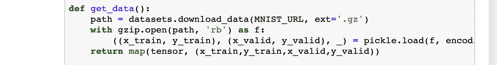

现在让我们计算数据的平均值和标准差。

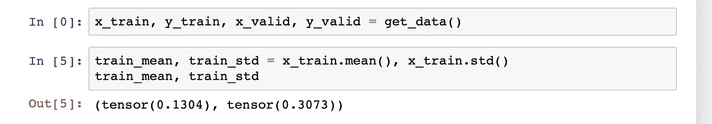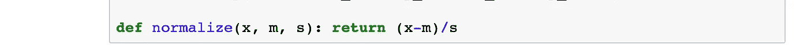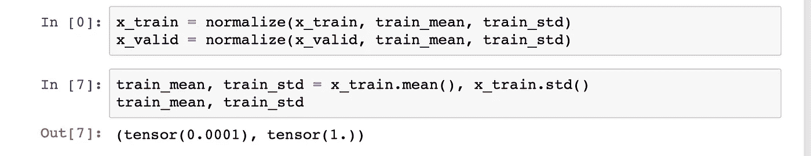

注意，我们用`train_mean`而不是`valid_mean`来标准化验证集，以保持训练集和验证集在相同的规模上。

由于平均值(或 sd)永远不会精确地为 0(或 1)，我们还定义了一个函数来测试它们是否接近 0(有一些阈值)。

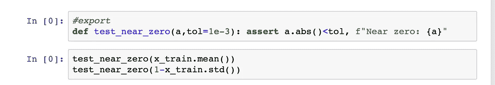

接下来，让我们初始化我们的神经网络。

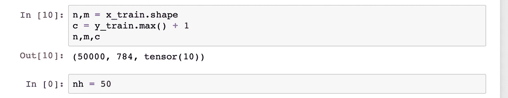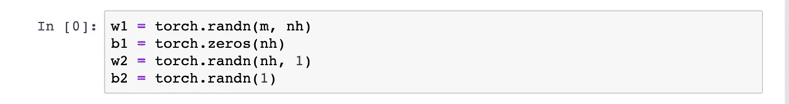

## 初始化问题

***初始化神经网络*** 是深度学习的重要组成部分。这就是为什么我们可以让我们的神经网络像今天这样深的核心。初始化决定了我们是否收敛得好，收敛得快。

我们希望以这样一种方式初始化我们的权重，即当我们通过不同的层时，均值和方差保持不变。我们当前的初始化不会发生这种情况。

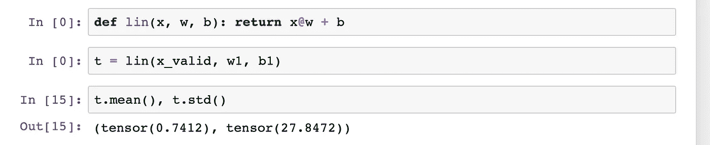

我们可以看到，仅仅一层之后，我们的激活值(一层的输出)相差甚远。如果我们对许多层重复这个过程，它将导致 ***渐变爆炸*** ，如下所示。

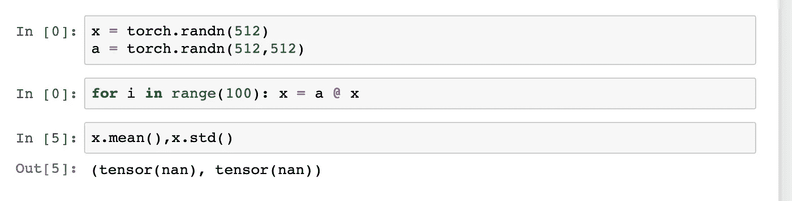

我们模型的激活增长远远超过合理的值，以至于达到无穷大。这甚至不需要 100 次乘法运算就能实现。

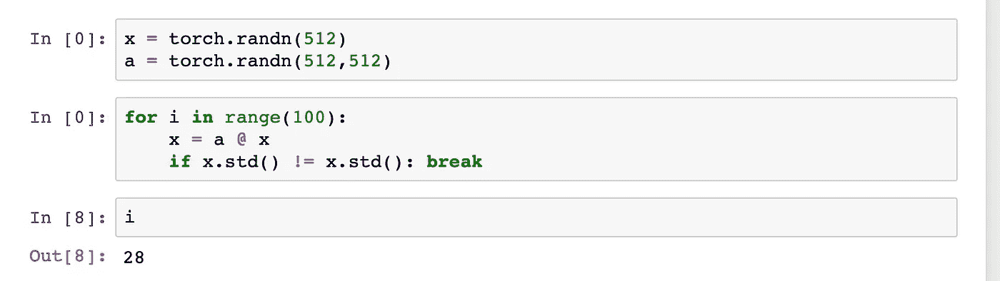

那么我们该如何应对呢？也许我们可以把它们缩小一个系数来防止它们爆炸。

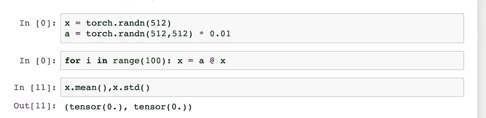

那也没用。虽然想法是正确的，但选择错误的因子会导致 ***渐变*** (值达到 0)。

## 选择正确的比例因子— Xavier init

比例因子的值应该是多少？

答案是(1 /⎷input).这种初始化技术被称为 ***Xavier 初始化*** 。如果你想了解相同背后的数学，可以阅读[原文](http://proceedings.mlr.press/v9/glorot10a.html)或者本文末尾提到的参考文章之一。阅读研究论文的一个好建议是搜索总结论文的文章。

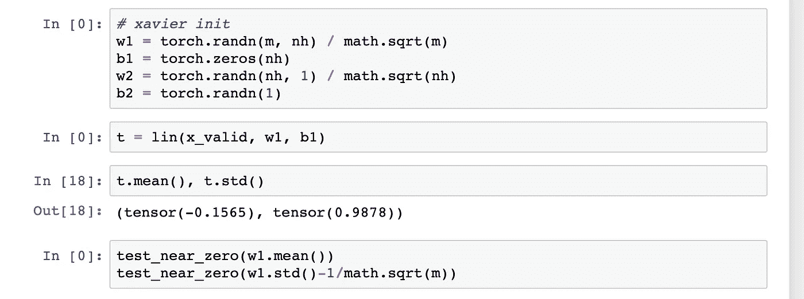

除以⎷input 确实有效。注意，如果我们想在反向传递中保持梯度，我们将除以⎷output.

Xavier 初始化文档也提供了如下所示的一些很好的可视化效果。

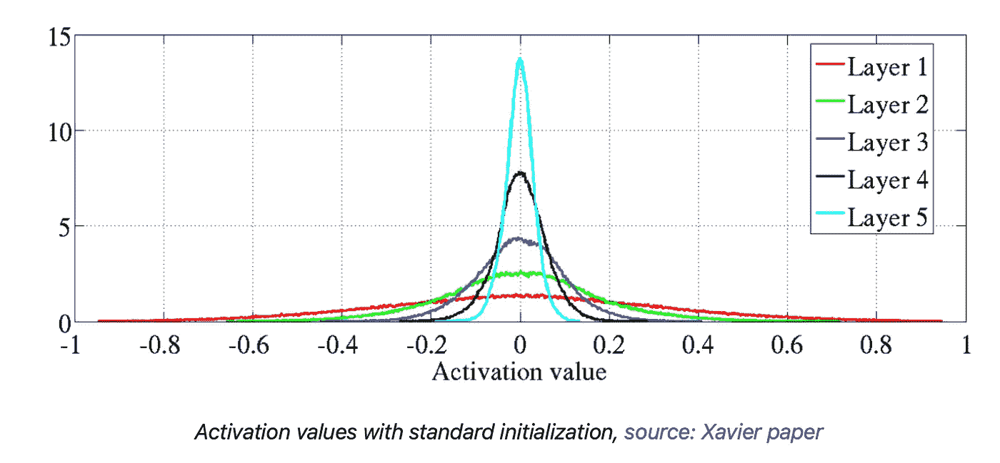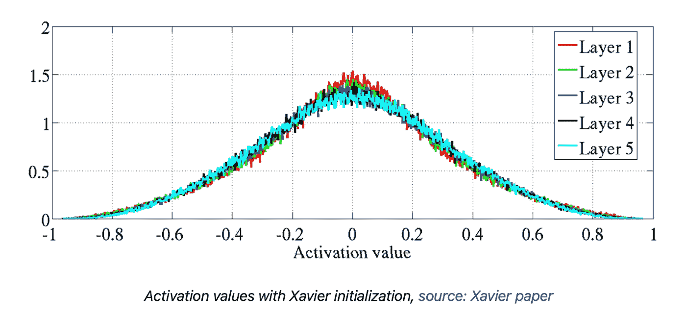

## Xavier 初始化有问题

Xavier init 论文假设我们的激活函数将是线性的(事实并非如此)。因此，它忽略了激活函数对均值和方差的影响。让我们想想 ReLU。

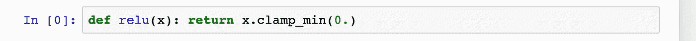

一个 ReLU 把分布中所有的负值都变成 0。这当然不能保持我们数据的均值和方差。如果说有什么不同的话，那就是它们的价值只有原来的一半。每一层都会发生这种情况，所以 1/2 会累加起来。

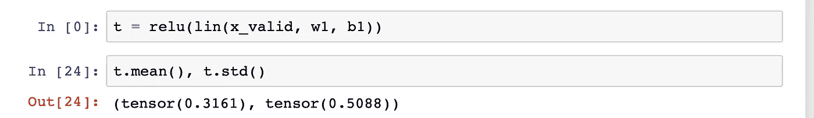

在一篇名为[深入研究整流器:在 ImageNet 分类上超越人类水平的性能的论文中提出了这个问题的解决方案。](https://arxiv.org/abs/1502.01852)

简单的想法是，由于我们的值每次都减少一半，我们只需在分子中增加一个额外的 2 来抵消它。这种初始化技术被称为***初始化****或 ***何初始化*** 。*

*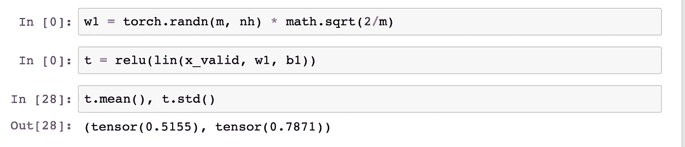*

*尽管我们的均值不太好，但它确实有助于我们的标准差。好的初始化能做的事情是惊人的。*

*有一篇名为 [Fixup initialization](https://arxiv.org/abs/1901.09321) 的论文，作者仅通过仔细的初始化，就训练了一个 10000 层深度的神经网络，没有任何归一化。这应该足以让你相信很好地初始化神经网络是重要的。*

*如果你想了解更多关于深度学习的知识，可以看看我在这方面的系列文章:*

* [## 深度学习系列

### 我所有关于深度学习的文章的系统列表

medium.com](https://medium.com/@dipam44/deep-learning-series-30ad108fbe2b) 

## 参考资料:

1.  [从基础开始深度学习，fast.ai](https://www.fast.ai)
2.  [理解深度神经网络中的 Xavier 初始化。](https://prateekvjoshi.com/2016/03/29/understanding-xavier-initialization-in-deep-neural-networks/)
3.  [深度神经网络如何初始化？](https://pouannes.github.io/blog/initialization/)
4.  [关于深度神经网络权重初始化的说明](https://madaan.github.io/init/#tl-dr)
5.  [多个随机变量乘积的方差](https://stats.stackexchange.com/questions/52646/variance-of-product-of-multiple-random-variables)*