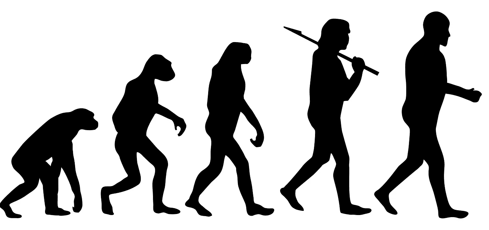
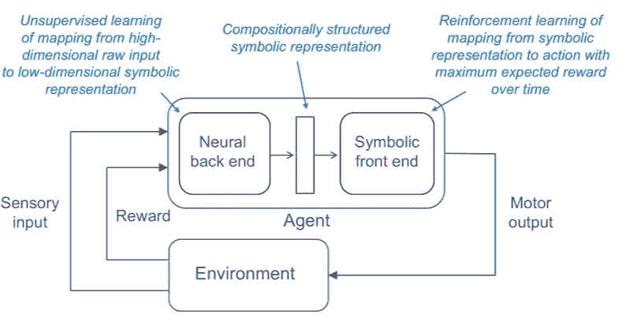

# 先天知识和深度学习

> 原文：<https://towardsdatascience.com/innate-knowledge-and-deep-learning-8e9405741ee2?source=collection_archive---------12----------------------->

## 我们生来就有某种先天知识吗？天赋论正在获得神经科学证据，并可能塑造人工智能和深度学习的下一个 R&D 步骤。

Figure 1: An elder [Plato](https://en.wikipedia.org/wiki/Plato) walks alongside [Aristotle](https://en.wikipedia.org/wiki/Aristotle), [The School of Athens, Raphael](https://en.wikipedia.org/wiki/The_School_of_Athens)

*“天赋论”..]认为人类的头脑生来就有想法或知识。这种信念，最著名的是由柏拉图作为他的形式理论提出的，后来由笛卡尔在他的《沉思录》中提出，目前正在获得神经科学的证据，可以证实我们生来就有关于我们世界的先天知识的信念。*

天赋论与“纯粹主义”的机器学习方法相冲突，在“纯粹主义”的机器学习方法中，机器学习算法只从数据中学习，而没有显式编程或配备预编程的计算和逻辑模块。“思想的实际内容极其复杂，不可救药；我们应该停止试图寻找简单的方法来思考头脑的内容，例如思考空间、物体、多重代理或对称的简单方法。所有这些都是任意的、内在复杂的外部世界的一部分。它们不是应该内置的，因为它们的复杂性是无穷无尽的；相反，我们应该只构建能够发现和捕获这种任意复杂性的元方法。 " ( [来源](http://bit.ly/2Uj1h9C))

截然不同的是，一个不同的思想流派建议将符号人工智能技术与深度学习相结合。

# 深度学习的未来

纽约大学教授加里·马库斯(Gary Marcus)等人提出了一种想法，即深度学习需要与更古老的象征性人工智能技术相结合，以达到人类水平的智能，辛顿对此表示蔑视。辛顿将此比作仅使用电动机来驱动汽油发动机的燃料喷射器，尽管电的能效要高得多。 " ( [来源](https://bloom.bg/2uw5kB3))

与此同时，混合模型可能会解决深度学习的明显限制，特别是“*深度学习目前缺乏一种通过明确的口头定义来学习抽象的机制，当有数千、数百万甚至数十亿个训练示例时效果最佳*”。([来源](http://bit.ly/2HZ7QHJ))

是否应该更好地将 GOFAI 融入深度学习？这场争论正在激烈地进行着。

# 新的神经学证据

在我看来，讨论最终归结为一个问题——我们人类是从经验中学习一切，还是天生就具备某种形式的先天知识？

发表在《美国国家科学院院刊》(PNAS)上的一项研究称，“*发现了一种突触组织原理，它以一种在动物中常见的方式对神经元进行分组，因此独立于个体经历*”([来源](http://bit.ly/2JQRpji))。这样的集群包含了物理世界中某些简单工作的表现。*神经元群或细胞集合体，在动物的新皮质中不断出现，本质上是细胞的“积木”。那么，在许多动物中，学习、感知和记忆可能是将这些片段放在一起的结果，而不是形成新的细胞组合*([来源](http://bit.ly/2FAHDg3))。

# 一条狭窄的分界线

鉴于越来越多的神经学证据支持先天知识的存在，为深度学习配备“先天”计算模块或原语可能是有意义的。很可能一些这样的原语将基于借鉴或受 GOFAI 启发的想法。

另一方面，很难预见深度学习架构在未来会是什么样子。Yoshua Bengio 自己承认，“然而，在神经网络能够与人脑拥有的一般智能相匹配之前，需要深度学习的新架构”。

在我看来，符号操作很可能会与神经架构深度耦合和纠缠在一起，而不是简单的并列，例如，神经后端和符号前端(如图 2 所示)。“M *模型更接近于通用计算机程序，建立在比我们当前的可区分层丰富得多的原语之上——这就是我们将如何达到推理和抽象，当前模型的根本弱点*”([来源](http://bit.ly/2NPB3Ez) [)。](http://bit.ly/2NPB3Ez).)

Figure 2: Deep Symbolic Reinforcement Learning, the neural back end learns to map raw sensor data into a symbolic representation, which is used by the symbolic front end to learn an effective policy ([source](https://arxiv.org/pdf/1609.05518.pdf))

这表明两种方法之间的分界线，“纯粹型”和“混合型”之间的界限非常模糊。因此，我认为，观点上的差异更多的是侧重点的差异，而不是根本性的差异。