# Python 中的简单神经网络

> 原文：<https://towardsdatascience.com/inroduction-to-neural-networks-in-python-7e0b422e6c24?source=collection_archive---------0----------------------->

# 什么是神经网络？

神经网络大致基于人类大脑的工作方式:许多神经元连接到其他神经元，通过它们的连接传递信息，并在神经元的输入超过特定阈值时触发。我们的人工神经网络将由人工神经元和突触组成，信息在它们之间传递。突触或连接将根据神经元对决定输出的影响强度进行加权。这些突触权重将经历一个被称为**反向传播**的优化过程。对于训练过程中的每次迭代，反向传播将用于返回网络的各层，并根据它们对神经网络误差的贡献来调整权重。

神经网络本质上是将输入映射到正确输出的自我优化功能。然后，我们可以将一个新的输入放入函数中，它将根据用训练数据创建的函数来预测输出。

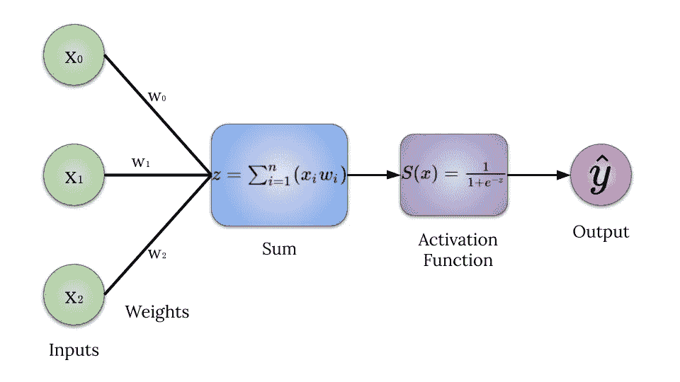

# 神经网络的目标

像所有的神经网络一样，这个神经网络必须学习数据中的重要特征，以产生输出。特别地，该神经网络将被给予具有六个样本的输入矩阵，每个样本具有三个仅由 0 和 1 组成的特征列。例如，训练集中的一个样本可能是[0，1，1]。每个样本的输出将是单一的 1 或 0。输出将由数据样本的第一个特征列中的数字决定。使用前面给出的例子，[0，1，1]的输出将是 0，因为第一列包含 0。下面将给出一个示例图表来演示每个输入样本的输出。

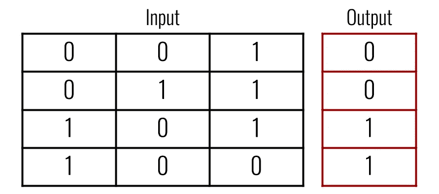

# 完整代码

[https://gist.github.com/a-i-dan/8d0a40b8690b40d9a46c4cb1d326fce5](https://gist.github.com/a-i-dan/8d0a40b8690b40d9a46c4cb1d326fce5)

```
Output:[[0.99089925]] - Correct: 1
[[0.006409]] - Correct: 0
```

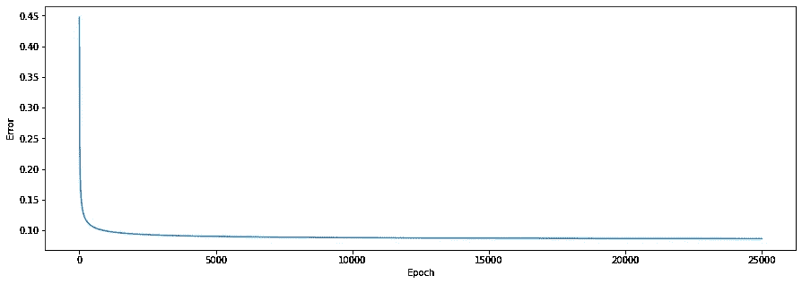

# 代码分解

```
import numpy as np
import matplotlib.pyplot as plt
```

在开始之前，我们需要导入必要的库。这个例子只需要两个库，如果不画出损失，我们只需要 Numpy。Numpy 是一个 python 数学库，主要用于线性代数应用。Matplotlib 是一个可视化工具，我们将使用它来创建一个图，以显示我们的误差如何随着时间的推移而减少。

```
inputs **=** np**.**array([[0, 1, 0],
                   [0, 1, 1],
                   [0, 0, 0],
                   [1, 0, 0],
                   [1, 1, 1],
                   [1, 0, 1]])

outputs **=** np**.**array([[0], [0], [0], [1], [1], [1]])
```

如前所述，神经网络需要数据来学习。我们将使用 Numpy 的`.array()`函数创建输入数据矩阵和相应的输出矩阵。输入中的每个样本由三个由 0 和 1 组成的特征列组成，这些特征列产生一个 0 或 1 的输出。我们想让神经网络知道输出是由每个样本中的第一个特征列决定的。

```
**class** **NeuralNetwork**:

    **def** **__init__**(self, inputs, outputs):
        self**.**inputs  **=** inputs
        self**.**outputs **=** outputs
        self**.**weights **=** np**.**array([[**.**50], [**.**50], [**.**50]])
        self**.**error_history **=** []
        self**.**epoch_list **=** []
```

我们将采用面向对象的方法来构建这个特定的神经网络。我们可以首先创建一个名为“NeuralNetwork”的类，并通过定义`__init__`函数来初始化该类。我们的`__init__`函数将输入和输出作为参数。我们还需要定义我们的权重，为了简单起见，从每个权重为. 50 开始。因为数据中的每个要素都必须连接到隐藏层，所以我们需要数据中每个要素的权重(三个权重)。出于绘图目的，我们还将创建两个空列表:loss_history 和 epoch_list。这将跟踪我们的神经网络在训练过程中每个时期的错误。

```
**def** **sigmoid**(self, x, deriv**=**False):
    **if** deriv **==** True:
        **return** x ***** (1 **-** x)
    **return** 1 **/** (1 **+** np**.**exp(**-**x))
```

该神经网络将使用 sigmoid 函数或逻辑函数作为激活函数。sigmoid 函数是一种流行的非线性激活函数，其范围为(0–1)。该函数的输入将总是被压缩，以适应在 *y=0* 和 *y=1* 处的 sigmoid 函数的两条水平渐近线。sigmoid 函数有一些限制其使用的众所周知的问题。当我们看下面的曲线时，我们注意到当我们到达曲线的两端时，这些点的导数变得非常小。当这些小导数在反向传播过程中相乘时，它们会变得越来越小，直到变得无用。由于导数或梯度变得越来越小，神经网络中的权重将不会更新太多，如果有的话。这将导致神经网络停滞不前，每增加一次训练迭代，情况就会变得越来越糟。

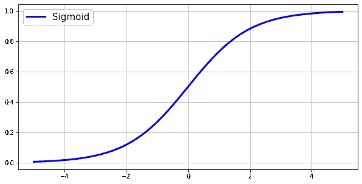

sigmoid 函数可以写成:

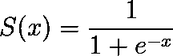

sigmoid 函数的导数可以写成:

*s′(x)=s(x)⋅(1−s(x)*

# 如何求导

导数只是一个花哨的词，用来表示给定点的斜率或切线。仔细看看上图中的 sigmoid 函数曲线。其中 *x=0* 处的斜率远大于 *x=4* 或 *x=-4* 处的斜率。权重的更新量基于导数。如果斜率是较低的值，则神经网络对其预测有信心，并且需要较少的权重移动。如果斜率是更高的值，则神经网络的预测更接近 0.50，或 50%(对于 sigmoid 函数，可能的最高斜率值是在 *x=0* 和*y = 0.5*。 *y* 是预测。).这意味着神经网络对其预测不是很有信心，并且需要对权重进行更大的更新。

我们可以通过以下步骤找到 sigmoid 函数的导数:

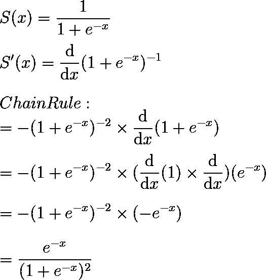

然后我们可以用一个很酷的技巧来继续简化:给 *e^-x* 加一减一。加一减一不会改变什么，因为它们相互抵消了。这是一种奇特的加零方式。

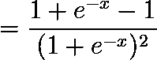

通过在分子中加减一，我们可以再次拆分分数，并拉出另一个 sigmoid 函数！

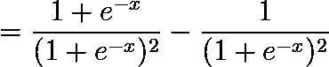

现在我们可以简化，最后得到 sigmoid 函数的简化导数。

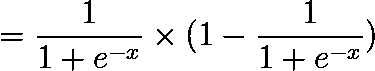

如果我们将 sigmoid 函数写成 *S(x)* ，那么导数可以写成:

=*(s(x)⋅(1−s(x))*

```
**def** **feed_forward**(self):
    self**.**hidden **=** self**.**sigmoid(np**.**dot(self**.**inputs, self**.**weights))
```

在我们的神经网络的训练过程中，输入数据将通过网络的权重和函数被前馈。这个前馈函数的结果将是隐藏层的输出，或者是隐藏层对给定权重的最佳猜测。输入数据中的每个要素对于其与隐藏图层的连接都有自己的权重。我们将从每个特征的总和乘以其相应的权重开始。一旦我们将输入矩阵和权重矩阵相乘，我们就可以将结果通过 sigmoid 函数压缩成介于(0–1)之间的概率。前向传播函数可以写成这样，其中 *xᵢ* 和 *wᵢ* 是矩阵中的单个特征和权重:

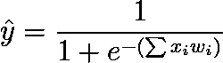

再次重申，隐藏层将按以下步骤计算:

*   将每个特征列与其权重相乘
*   对特征和权重的乘积求和
*   将总和传递给 sigmoid 函数以产生输出$\hat y$。

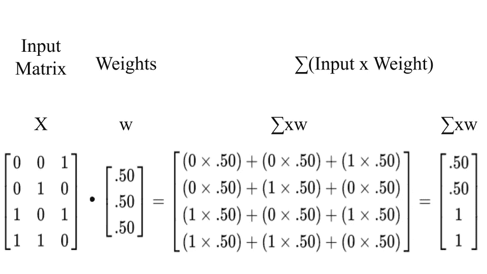

上图显示了将每个特征与其对应的权重相乘，然后对乘积求和的过程。训练数据中的每一行都将这样计算。得到的 4x1 矩阵将被输入到 sigmoid 激活函数中，如下所示:

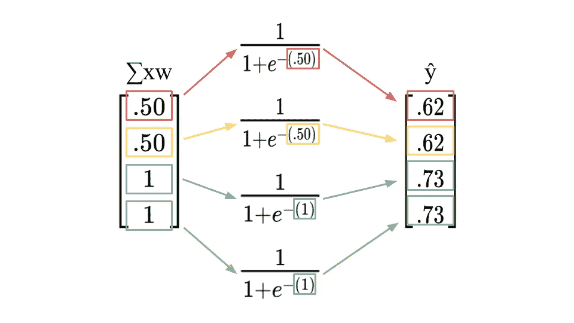

上述过程将导致隐藏层的预测。 *∑xw* 矩阵中的每一行都将进入 sigmoid 函数。颜色代表∑ *xw* 矩阵中每一行的单独过程。**注意:**这个计算只代表**一次训练迭代**，所以得到的 *ŷ* 矩阵不会很精确。通过以这种方式计算隐藏层，然后使用反向传播进行多次迭代，结果将更加准确。

```
**def** **backpropagation**(self):
    self**.**error  **=** self**.**outputs **-** self**.**hidden
    delta **=** self**.**error ***** self**.**sigmoid(self**.**hidden, deriv**=**True)
    self**.**weights **+=** np**.**dot(self**.**inputs**.**T, delta)
```

这是整个神经网络中最酷的部分:反向传播。反向传播将通过神经网络的层返回，确定哪些权重对输出和误差有贡献，然后基于隐藏层输出的梯度改变权重。这将被进一步解释，但是现在，整个过程可以被写成这样，其中 *y* 是正确的输出， *ŷ* 是隐藏层预测:

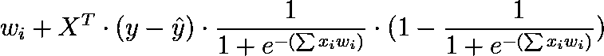

为了计算隐藏层预测的误差，我们将简单地取正确输出矩阵 *y* 和隐藏层矩阵 *ŷ* 之间的差。这个过程将在下面显示。

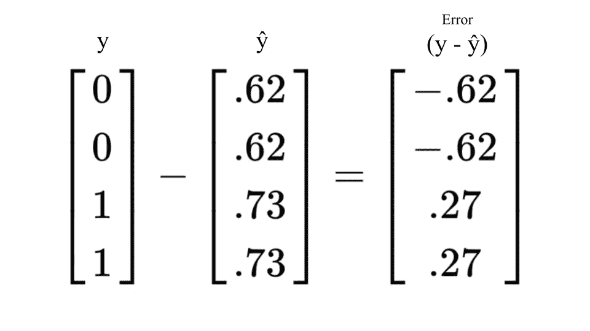

我们现在可以将误差和隐藏层预测的导数相乘。我们知道 sigmoid 函数的导数是 *S(x)(1 — S(x))* 。因此，每个隐藏层预测的导数将是[(*ŷ)(1-ŷ)]*。例如，隐藏层的预测矩阵中的第一行包含值$0.62$。我们可以用 0.62 美元代替 *ŷ* ，结果将是预测的导数。*0.62 *(1–0.62)= 0.2356*。对 *ŷ* 矩阵中的每一行重复这一过程，将得到一个 4×1 的导数矩阵，然后与误差矩阵相乘。

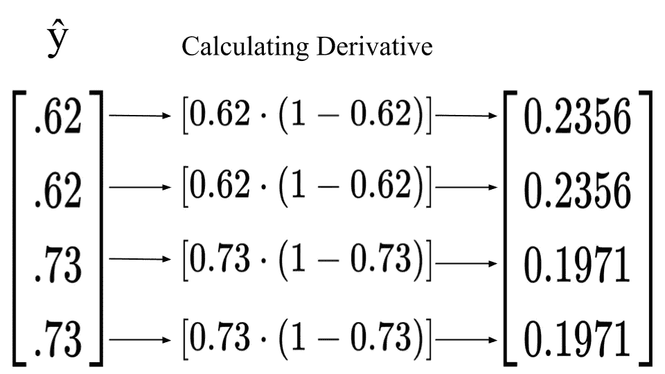

将误差和导数相乘可以得到所需的变化。当 sigmoid 函数输出具有更高置信度的值(接近 0 或接近 1)时，导数将更小，因此所需的变化将更小。如果 sigmoid 函数输出更接近. 50 的值，则导数是更大的值，这意味着需要更大的变化，以便神经网络变得更有信心。

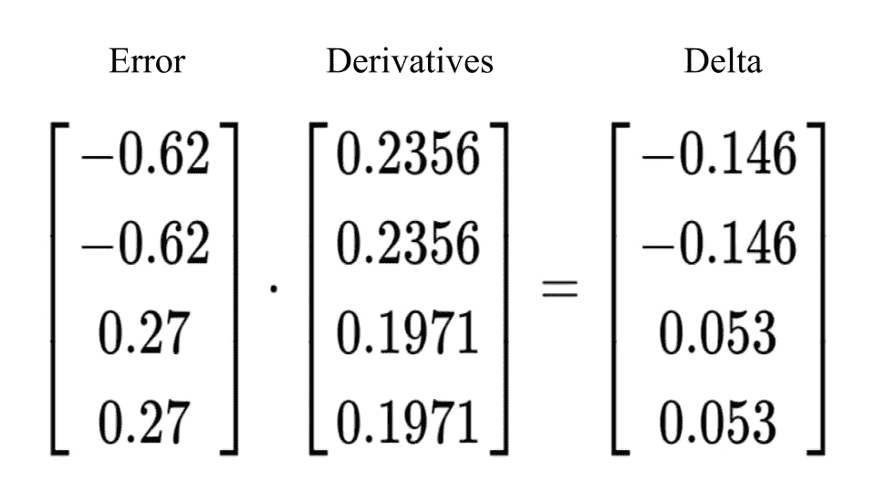

这一步将导致添加到权重中的更新。我们可以通过将上述步骤中的“误差加权导数”与输入相乘来获得此更新。如果输入中的要素为 0，则权重的更新将为 0，如果输入中的要素为 1，则更新将添加到中。这将产生一个(3×1)矩阵，它与我们的权重矩阵的形状相匹配。

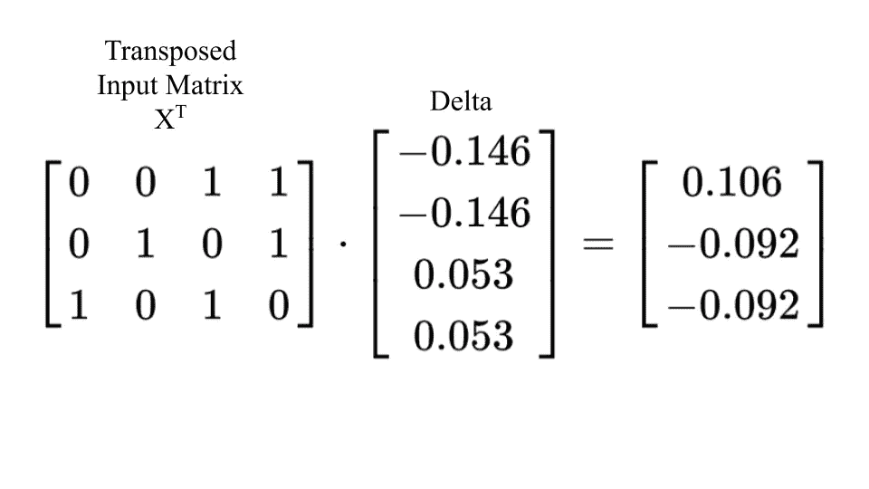

一旦我们有了更新的矩阵，我们可以将它添加到我们的权重矩阵中，以正式更改权重，使其变得更强。即使在一次训练迭代之后，也有一些明显的进步！如果查看更新后的权重矩阵，您可能会注意到矩阵中的第一个权重值更高。记住，我们的神经网络必须知道输入中的第一个特征决定了输出。我们可以看到，在每个输入示例中，我们的神经网络已经为连接到第一个特征的权重分配了更高的值！

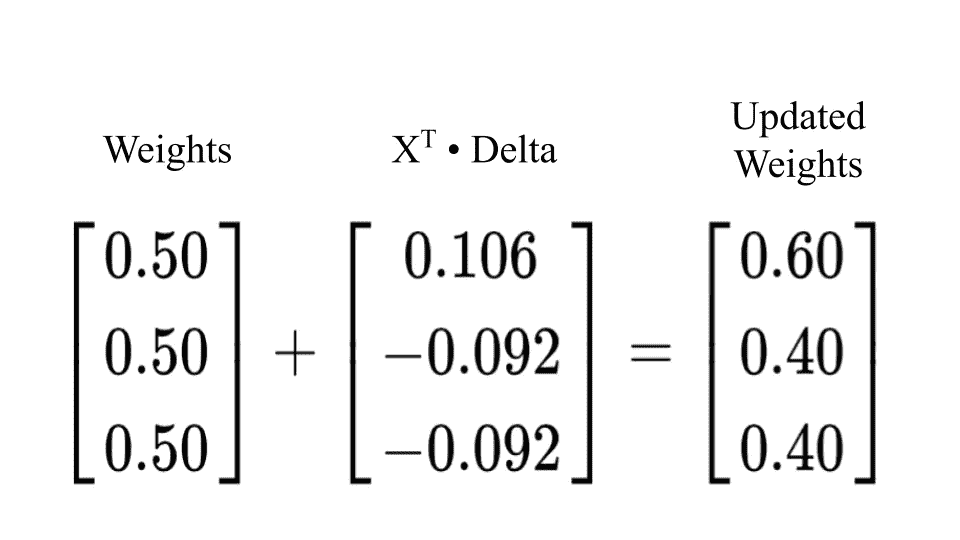

```
**def** **train**(self, epochs**=**25000):
    **for** epoch **in** range(epochs):
        self**.**feed_forward()
        self**.**backpropagation()

        self**.**error_history**.**append(np**.**average(np**.**abs(self**.**error)))
        self**.**epoch_list**.**append(epoch)
```

训练神经网络的时候到了。在训练过程中，神经网络将“学习”输入数据中的哪些特征与其输出相关，并且它将学习做出准确的预测。为了训练我们的神经网络，我们将创建具有 25，000 个历元或迭代次数的训练函数。这意味着神经网络将重复权重更新过程 25，000 次。在 train 函数中，我们将调用我们的`feed_forward()`函数，然后调用`backpropagation()`函数。对于每次迭代，我们还将跟踪在`feed_forward()`函数完成后产生的错误。我们将通过将错误和纪元附加到先前初始化的列表来跟踪这一点。我确信有一种更简单的方法可以做到这一点，但是对于快速原型开发来说，这种方法现在已经很好了。

对于我们神经网络中的每个权重，训练过程遵循以下等式:

*   *xᵢ* —输入数据中的特征
*   *wᵢ* —正在更新的重量
*   *Xᵀ* —转置输入数据
*   *y* —正确输出
*   *ŷ* —预测产量
*   (y — *ŷ* ) —错误
*   ∑*xᵢw*ᵢ-输入特征和权重的乘积之和
*   *S(∑xᵢwᵢ)* —乙状结肠功能

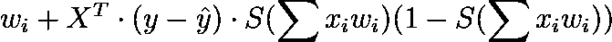

```
**def** **predict**(self, new_input):
    prediction **=** self**.**sigmoid(np**.**dot(new_input, self**.**weights))
    **return** prediction
```

既然神经网络已经被训练并且已经学习了输入数据中的重要特征，我们就可以开始进行预测了。预测函数看起来类似于隐藏层，或`feedforward()`函数。前向传播函数本质上也进行预测，然后反向传播检查误差并更新权重。我们的预测函数将使用与前馈函数相同的方法:将输入矩阵和权重矩阵相乘，然后通过 sigmoid 函数返回 0-1 之间的值。希望我们的神经网络能够做出尽可能接近实际输出的预测。

```
NN = NeuralNetwork(inputs, outputs)
```

我们将从 NeuralNetwork 类创建 NN 对象，并传入输入矩阵和输出矩阵。

```
NN.train()
```

然后我们可以在我们的神经网络对象上调用`.train()`函数。

```
example **=** np**.**array([[1, 1, 0]])
example_2 **=** np**.**array([[0, 1, 1]])

**print**(NN**.**predict(example), ' - Correct: ', example[0][0])
**print**(NN**.**predict(example_2), ' - Correct: ', example_2[0][0])
```

输出

```
[[0.99089925]]  - Correct:  1
[[0.006409]]  - Correct:  0
```

现在我们可以创建两个新的例子，我们希望我们的神经网络对其进行预测。我们将这些称为“示例”和“示例 _2”。然后我们可以调用`.predict()`函数并传递数组。我们知道，输入中的第一个数字或特征决定了输出。第一个示例“example”在第一列中有一个 1，因此输出应该是 1。第二个示例在第一列中有一个 0，因此输出应该是 0。

```
plt**.**figure(figsize**=**(15,5))
plt**.**plot(NN**.**epoch_list, NN**.**error_history)
plt**.**xlabel('Epoch')
plt**.**ylabel('Loss')
```

训练完成后，我们可以绘制每次训练迭代的误差。该图显示，在较早的时期，误差有很大的下降，但是在大约 5000 次迭代之后，误差稍微稳定下来。


我希望这是对使用 python 和面向对象方法的神经网络的一个很好的介绍。