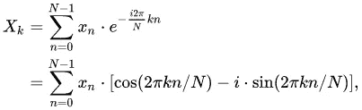
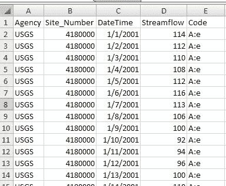
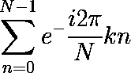
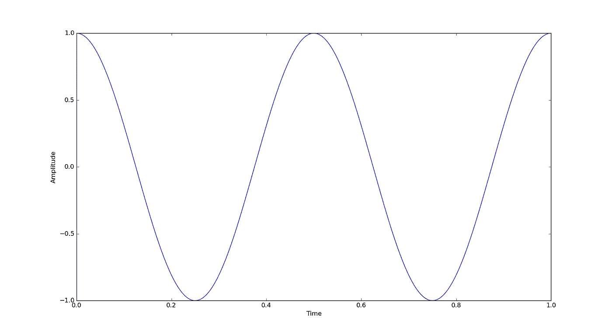
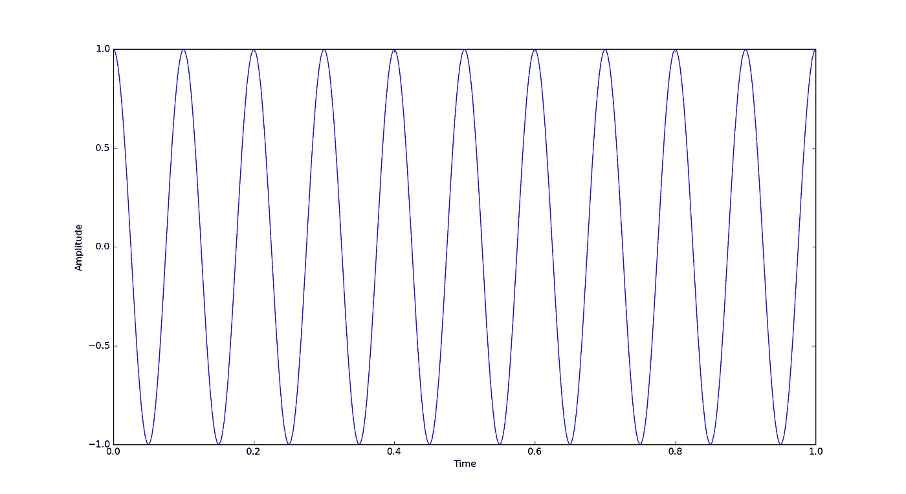
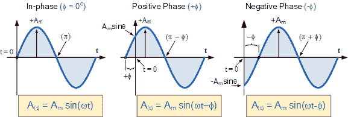
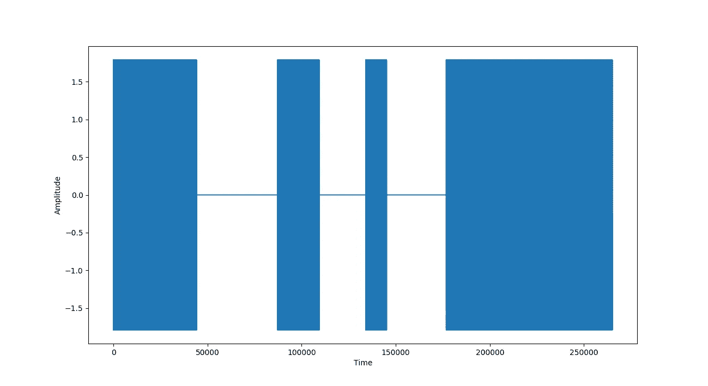
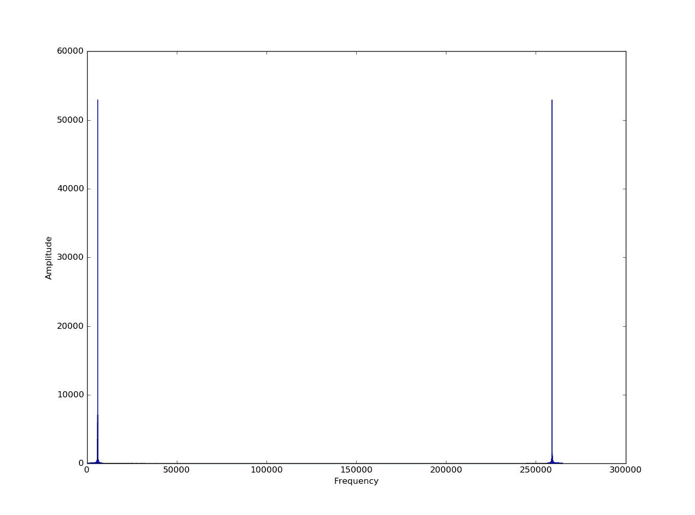
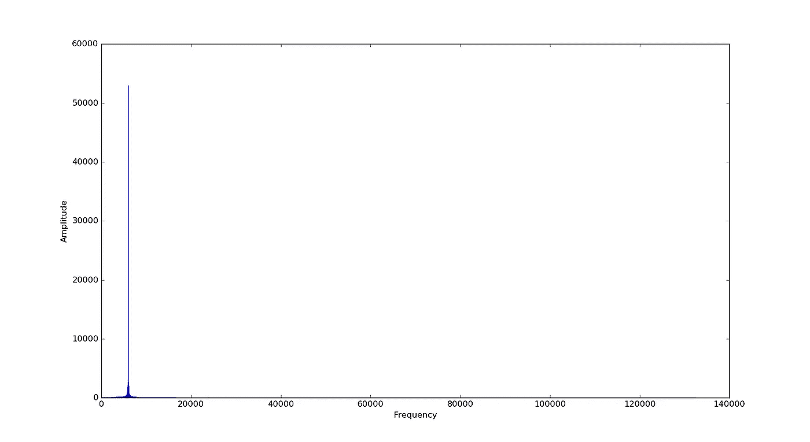
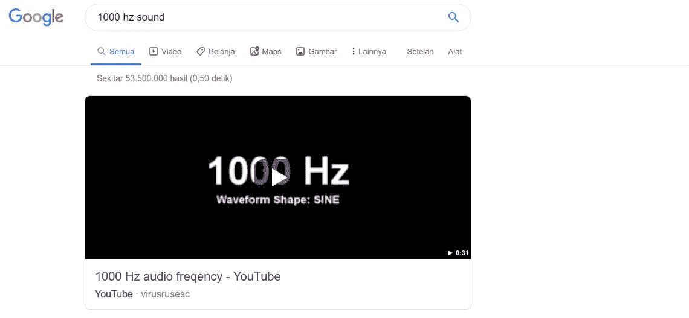

# 对傅里叶变换的理解及其简单实现

> 原文：<https://towardsdatascience.com/insight-to-the-fourier-transform-and-the-simple-implementation-of-it-eee293317efd?source=collection_archive---------13----------------------->


source: [https://pa1.narvii.com/6397/fbeec74f0468cf51eb46f4f869190563cf50829b_hq.gif](https://pa1.narvii.com/6397/fbeec74f0468cf51eb46f4f869190563cf50829b_hq.gif)

在这篇文章中，我不会给你一个傅立叶变换或傅立叶级数的推导细节。相反，我们将探索这种转换的输出以及它是如何工作的。

因此，我们将在这个故事中讨论的傅里叶变换公式被称为离散傅里叶变换(DFT)。公式是这样的。



X is the output of DFT (signal in frequency spectrum), x is signal input (signal in time spectrum), N is a number of sample and k is frequency (limited in 0 to N-1 Hz). Source: [https://en.wikipedia.org/wiki/Discrete_Fourier_transform](https://en.wikipedia.org/wiki/Discrete_Fourier_transform)

它用于**将信号的有限样本从时间频谱转换到频率频谱**。坚持住！时间谱和频率谱中的信号是什么？我所指的时间频谱中的信号**只是一个时间序列数据**，如随时间变化的股价、随时间变化的降雨率等。



example of time series data: USGS streamflow over time data. Source: [https://d32ogoqmya1dw8.cloudfront.net/images/geoinformatics/steps/1354035151.png](https://d32ogoqmya1dw8.cloudfront.net/images/geoinformatics/steps/1354035151.png)

如果我们在 2d 图中绘制时间序列数据，我们将在 x 轴上得到**时间**，在 y 轴上得到幅度(或在波的情况下的振幅)。因此，与频谱中的信号不同的是，如果我们将其绘制在 2d 图中，我们将在 x 轴获得**频率，在 y 轴获得幅度。**

好了，现在我们知道了 DFT 的实际输出，但是它是如何工作的？你知道你可以用 DFT 公式的一部分产生任意频率的周期正弦波吗？你可以用这个零件来生产那个。



您可以使用下面的脚本来可视化这个公式生成的波。

```
#!/usr/bin/python3import numpy as np
from matplotlib import pyplot as plt#setting
k = 2
res = 400t = np.linspace(0, res, res)time = np.linspace(0, 1, res)
hz = np.exp(-2j * np.pi * k * t / len(t))plt.ylabel("Amplitude")
plt.xlabel("Time")
plt.plot(t, hz)
plt.show()
```

你会得到这样的东西



对于 k =2，我们得到一个 2 Hz 正弦波，如果我们设置 k = 10



我们得到了一个 10 赫兹的正弦波。

(再)坚持住！这个公式有一个“I”，这意味着输出必须有一个虚部。是，右边这个部分公式的输出是幅度+(相位)I。在这个上下文中，相位大约是正弦波的一个角度。



在这个故事中，为了简单起见，我们将忽略虚部，也就是所谓的相位，并且我们不会在这个故事中使用它作为我们的实现示例。

在 DFT 的完整公式中，你要在你的实信号和 k Hz 的正弦信号之间做一个**点运算。这就是为什么**你可以从真实信号**中提取 k Hz 正弦波的一个分量。你将**从 0 Hz 提取到 k-1 Hz** 。但是，有一个情节转折？在现实世界中，我们不会使用普通的 DFT 来提取它，而是使用快速傅立叶变换(FFT)来提取。FFT 只是一种更有效的计算 DFT 的方法。我们不会在这个故事中讨论 FFT 算法，但是为了你的信息，普通 DFT 和 FFT 的**结果几乎是相同的**。**

这就是理论，现在我们将实施它。通过傅立叶变换，**我们将尝试计算出哔哔声的频率**。我们将在这个实验中使用[这个声音](https://freesound.org/people/GowlerMusic/sounds/264862/)。让我们用这个脚本来看看这个声音的“形状”。

```
#!/usr/bin/python3from scipy.io import wavfile
from matplotlib import pyplot as plt
import numpy as np#setting
datasound = '7detik.wav'fs, data = wavfile.read(datasound)
data = np.array(data, dtype=float)#normalize
data = (data - np.mean(data)) / np.std(data)time = range(len(data))plt.ylabel("Amplitude")
plt.xlabel("Time")
plt.plot(time, data)
```

我们得到了这个。



要将这些数据从时间频谱转换到频率频谱，也就是 FFT，让我们运行下面的脚本。

```
#!/usr/bin/python3from scipy.io import wavfile
from matplotlib import pyplot as plt
import numpy as np#setting
datasound = '7detik.wav'fs, data = wavfile.read(datasound)
data = np.array(data, dtype=float)
#print(len(data), np.shape(data), fs)#normalize
data = (data - np.mean(data)) / np.std(data)time = range(len(data))fftdata = np.fft.fft(data)
fftdatafreq = np.zeros((len(data)))
for i in range(len(fftdata)):
 fftdatafreq[i] = abs(fftdata[i].real)plt.ylabel("Amplitude")
plt.xlabel("Frequency")
plt.plot(time, fftdatafreq)

plt.show()
```

你会得到这样一个图表。



哇，在一些或一个频率和另一个频率之间有一个巨大的差异振幅。其实，**FFT 的输出是对称的**(看看上图就知道了，)。这意味着我们只需要一半的频率来显示。

```
plt.plot(time[:len(fftdatafreq) // 2], fftdatafreq[:len(fftdatafreq) // 2])
```

我们得到了下图。



好了，现在是有趣的部分。我们将尝试计算出这种哔哔声的频率。让我们用这个代码检查具有最高振幅的 bin。

```
maxfreq = np.argmax(fftdatafreq)
print('dominant freq ', maxfreq)
```

结果是

```
dominant freq  6009
```

6009?这是不是意味着这个嘟嘟声的频率是 6009？没那么快！我们在这里使用的 FFT 函数

```
fftdata = np.fft.fft(data)
```

假设我们数据的总持续时间是 1 秒，尽管实际上并不是这样。让我们检查一下哔哔声的实际持续时间。该功能

```
fs, data = wavfile.read(datasound)
```

返回 1 秒(fs)内的**采样率**和**声音(data)的数组真实数据**。让我们检查 fs 的值和数据数组的长度。

```
print(len(data), fs)
```

是回归

```
265039 44100
```

所以数组的长度是 265039，采样率是 44100。并且查看声音的持续时间是 265039 / 44100 = 6.009954648526077 秒。

**表示在这 6.009954648526077 秒中，我们的主频已经形成了 6009 个当时的正弦波**。从逻辑上思考，所以主频是**6009/6.009954648526077 = 999.8411554525939Hz**或者我们可以把这个数四舍五入到 **1000 Hz** 。总结一下，我们的嘟嘟声的频率是 1000 Hz。要验证它**只需谷歌“1000 赫兹声音”**。



播放视频并与我们的哔哔声进行比较。非常相似不是吗？

仅此而已。FFT 的应用非常广泛，尤其是在电气工程中。最初的计划是我想用 FFT 计算出每日降雨量的模式，但是我的降雨量数据并不充分。另一篇文章再见。