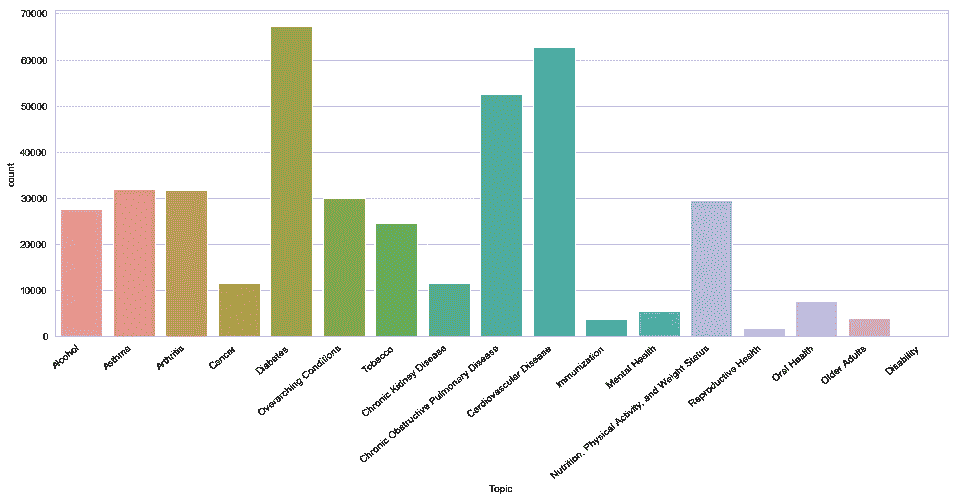
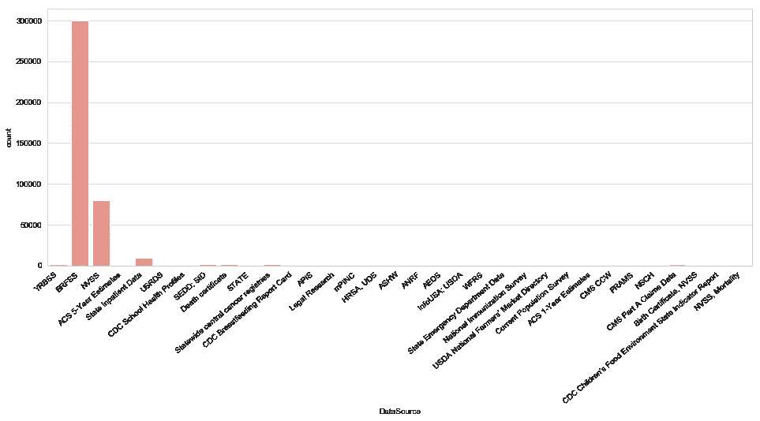
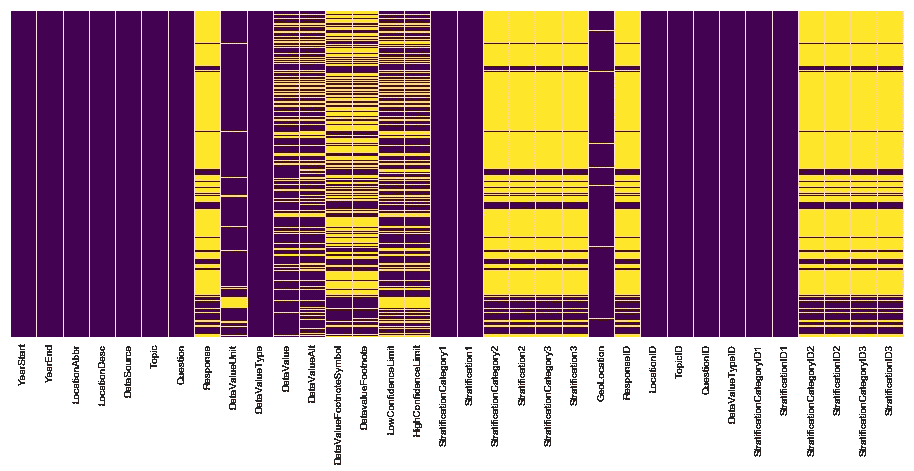
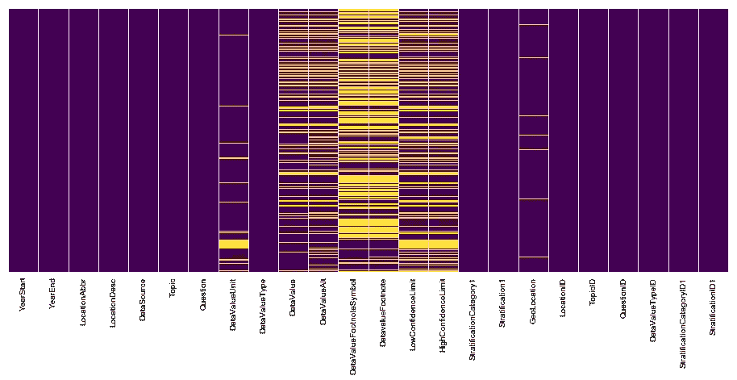

# 检查 15 年 CDC 慢性病数据集

> 原文：<https://towardsdatascience.com/inspecting-a-cdc-chronic-disease-dataset-e1685a6b525a?source=collection_archive---------10----------------------->

## 使用 Python 和数据科学技术对人口健康指标进行探索性数据分析


Photo by [Dan Gribbin](https://unsplash.com/@dangribbin?utm_source=medium&utm_medium=referral) on [Unsplash](https://unsplash.com?utm_source=medium&utm_medium=referral)

最近，我接受了一个个人项目，以应用我一直在学习的 Python 和机器学习。由于我对人口健康感兴趣，我决定从了解我在 [Kaggle](https://www.kaggle.com/cdc/chronic-disease/home) 上找到的 15 年人口健康特定数据集开始。这个数据集来自美国疾病控制和预防中心的慢性病指标。在这个博客系列中，我想用 exploration 演示数据集中有什么。稍后，我将深入探讨数据可视化。目前，我不确定我是否看到只有这个数据集的实际机器学习的机会。

根据 Kaggle 的概述，该数据集中提供的有限背景信息指出，这些指标是从 2001 年到 2016 年在州一级收集的，共有 202 个指标。使用 jupyter notebook 和文件上的 pd.read_csv()，有 403，984 行，34 列，或属性。通过跑步。info()方法，下面输出中的第二列显示我们有一些丢失的数据。在下面的最后一列中，有不同类型的数据，其中一些是数字型的，比如整数和浮点值，而另一些是包含字符串的对象。

```
<class 'pandas.core.frame.DataFrame'>
RangeIndex: 403984 entries, 0 to 403983
Data columns (total 34 columns):
YearStart                    403984 non-null int64
YearEnd                      403984 non-null int64
LocationAbbr                 403984 non-null object
LocationDesc                 403984 non-null object
DataSource                   403984 non-null object
Topic                        403984 non-null object
Question                     403984 non-null object
Response                     79323 non-null object
DataValueUnit                374119 non-null object
DataValueType                403984 non-null object
DataValue                    297817 non-null object
DataValueAlt                 273666 non-null float64
DataValueFootnoteSymbol      188019 non-null object
DatavalueFootnote            187853 non-null object
LowConfidenceLimit           246819 non-null float64
HighConfidenceLimit          246819 non-null float64
StratificationCategory1      403984 non-null object
Stratification1              403984 non-null object
StratificationCategory2      79323 non-null object
Stratification2              79323 non-null object
StratificationCategory3      79323 non-null object
Stratification3              79323 non-null object
GeoLocation                  401416 non-null object
ResponseID                   79323 non-null object
LocationID                   403984 non-null int64
TopicID                      403984 non-null object
QuestionID                   403984 non-null object
DataValueTypeID              403984 non-null object
StratificationCategoryID1    403984 non-null object
StratificationID1            403984 non-null object
StratificationCategoryID2    79324 non-null object
StratificationID2            79324 non-null object
StratificationCategoryID3    79323 non-null object
StratificationID3            79323 non-null object
```

让我们了解一下每个专栏都是关于什么的。虽然有些列名相对来说不言自明，但我使用 set(dataframe['ColumnName'])来更好地理解唯一的分类数据。以下是一些例子:

**题目** : 400k+行数据分为以下 17 类。有一个名为 TopicID 的对应列，它只是给出了一个缩写的标签。

```
{'Alcohol',
 'Arthritis',
 'Asthma',
 'Cancer',
 'Cardiovascular Disease',
 'Chronic Kidney Disease',
 'Chronic Obstructive Pulmonary Disease',
 'Diabetes',
 'Disability',
 'Immunization',
 'Mental Health',
 'Nutrition, Physical Activity, and Weight Status',
 'Older Adults',
 'Oral Health',
 'Overarching Conditions',
 'Reproductive Health',
 'Tobacco'}
```



Distribution of the data by topic. Diabetes, Chronic Obstructive Pulmonary Disease, and Cardiovascular Disease are the top 3 topics

**问题**:在每个话题中，都有一些问题。我们将使用相应的列 QuestionID。这些是数据集具有值的 202 个唯一指标，我们将对此进行进一步分析。

```
{'Activity limitation due to arthritis among adults aged >= 18 years',
 'Adults aged >= 18 years with arthritis who have taken a class to learn how to manage arthritis symptoms',
 'Adults with diagnosed diabetes aged >= 18 years who have taken a diabetes self-management course',
 'Alcohol use among youth',
 'Alcohol use before pregnancy',
 'All teeth lost among adults aged >= 65 years',
 'Amount of alcohol excise tax by beverage type (beer)',... 'State child care regulation supports onsite breastfeeding',
 'States that allow stronger local tobacco control and prevention laws',
 'States with strong polices that require retail licenses to sell tobacco products',
 'Taking medicine for high blood pressure control among adults aged >= 18 years with high blood pressure',
 'Television viewing among high school students',
 'Timeliness of routine health care checkup among women aged 18-44 years',
 'Visits to dentist or dental clinic among adults aged >= 18 years',
 'Visits to dentist or dental clinic among adults aged >= 18 years with diagnosed diabetes'}
```

**数据源**:考虑到我们有这么多的指标，有 33 个数据源我并不奇怪。然而，下面的直方图显示，大部分数据来自两个来源，BRFSS，即 CDC 的[行为风险因素监测系统](https://www.cdc.gov/brfss/index.html)和 NVSS，即[国家生命统计系统](https://www.google.com/url?sa=t&rct=j&q=&esrc=s&source=web&cd=1&cad=rja&uact=8&ved=2ahUKEwi6y_65j-HgAhWNUt8KHU6WBQAQFjAAegQICBAB&url=https%3A%2F%2Fwww.cdc.gov%2Fnchs%2Fnvss%2Findex.htm&usg=AOvVaw1WouJ9qe19F_ytzMqKy17C)。

```
{'ACS 1-Year Estimates',
 'ACS 5-Year Estimates',
 'AEDS',
 'ANRF',
 'APIS',
 'ASHW',
 'BRFSS',
 'Birth Certificate, NVSS',
 'CDC Breastfeeding Report Card',
 "CDC Children's Food Environment State Indicator Report",
 'CDC School Health Profiles',
 'CMS CCW',
 'CMS Part A Claims Data',
 'Current Population Survey',
 'Death certificate',
 'HRSA, UDS',
 'InfoUSA; USDA',
 'Legal Research',
 'NSCH',...
```



CDC’s BRFSS and NVSS make up almost the entirety of this dataset

**data value unit**:data value 中的值由以下单位组成，包括百分比、金额、年份和千例数。

```
{' ',
 '$',
 '%',
 'Number',
 'Number ',
 'Years',
 'cases per 1,000',
 'cases per 1,000,000',
 'cases per 10,000',
 'cases per 100,000',
 'gallons',
 nan,
 'pack sales per capita',
 'per 100,000',
 'per 100,000 residents'}
```

**DataValueType** :以下几个类别很有见地，表明当我们想要查看跨州数据比较时，有年龄调整后的数字与原始数字相比较，这有助于我们进行比较。

```
{'Adjusted by age, sex, race and ethnicity',
 'Age-adjusted Mean',
 'Age-adjusted Prevalence',
 'Age-adjusted Rate',
 'Average Annual Age-adjusted Rate',
 'Average Annual Crude Rate',
 'Average Annual Number',
 'Commercial host (dram shop) liability status for alcohol service',
 'Crude Prevalence',
 'Crude Rate',
 'Local control of the regulation of alcohol outlet density',
 'Mean',
 'Median',
 'Number',
 'Per capita alcohol consumption',
 'Percent',
 'Prevalence',
 'US Dollars',
 'Yes/No'}
```

**数据值 vs 数据值 Alt** :数据值似乎是我们未来分析的目标数据列。使用。head()方法，该列由 string 对象形式的数值组成，而 DataValueAlt 是数值 float64。后来，我想使用 pandas pivot_table 方法，它只需要数字数据。因此，我将使用 DataValueAlt 进行后续分析。

**分层和分层类别相关列**:与分层相关的列有 12 列，是性别、种族、年龄等每个指标内的子组。在分层类别 1 中，有性别、总体和种族。例如，在分层 1 中，值由种族类型组成。在 ID 列中，如分层 ID1，我们有相应的种族标签。

**缺失数据:**

使用下面的 matplotlib 和 seaborn 生成热图，很容易看到哪里有数据，哪里缺少数据以及缺少多少数据。黄色代表丢失的数据。列是每个指标，纵轴是 40 万行数据。

```
import matplotlib.pyplot as plt
%matplotlib inlineplt.figure(figsize=(16, 6))sns.heatmap(df.isnull(),yticklabels=False,cbar=False,cmap='viridis')
```



Large portions of missing data is related to Stratification Categories 2 and 3 and the related Stratification 2 and 3\. The horizontal axis consists of the column names.

在热图中，响应和与分层类别 2/3 和分层 2/3 相关的列包含的数据不到 20%。虽然分层类别 1 和分层 1 似乎有潜在有用的数据，但让我们确认 2 和 3 中有什么数据。对于每个分层列，我遵循类似的方法:

```
df['StratificationCategory2'].count()df_strat2cat = []for i in df['StratificationCategory2']:
    if (pd.isnull(i) is False):
        if i is not ' ':
            df_strat2cat.append(i)
```

例如，列的计数返回 79k，其中包含数据。我想看看里面有什么，所以我设置了 for 循环来遍历特定分层 2 或 3 列中的每个元素，并将非空值或带有空格的值追加到一个名为 df_strat2cat 的新数组中。这意外地产生了一个没有值的数组。在对其他分层列重复此操作后，我删除了这组列。

```
df_new = df.drop(['Response','ResponseID','StratificationCategory2','StratificationCategory3','Stratification2','Stratification3','StratificationCategoryID2','StratificationCategoryID3','StratificationID2','StratificationID3' ],axis = 1)<class 'pandas.core.frame.DataFrame'>
RangeIndex: 403984 entries, 0 to 403983
Data columns (total 24 columns):
YearStart                    403984 non-null int64
YearEnd                      403984 non-null int64
LocationAbbr                 403984 non-null object
LocationDesc                 403984 non-null object
DataSource                   403984 non-null object
Topic                        403984 non-null object
Question                     403984 non-null object
DataValueUnit                374119 non-null object
DataValueType                403984 non-null object
DataValue                    297817 non-null object
DataValueAlt                 273666 non-null float64
DataValueFootnoteSymbol      188019 non-null object
DatavalueFootnote            187853 non-null object
LowConfidenceLimit           246819 non-null float64
HighConfidenceLimit          246819 non-null float64
StratificationCategory1      403984 non-null object
Stratification1              403984 non-null object
GeoLocation                  401416 non-null object
LocationID                   403984 non-null int64
TopicID                      403984 non-null object
QuestionID                   403984 non-null object
DataValueTypeID              403984 non-null object
StratificationCategoryID1    403984 non-null object
StratificationID1            403984 non-null object
dtypes: float64(3), int64(3), object(18)
```

使用 df_new，seaborn 热图显示最少的黄色和大部分紫色。如果我们想更进一步，我们可以填充缺失的数据，但此时，我将把额外的工作留到稍后阶段。



概括地说，我使用 pandas 将 CSV 数据文件导入到数据帧中。然后，我使用各种方法来更好地理解每一列中的数据，因为上下文信息非常有限。分层 2 和 3 列的组是无用的，并且这些被移除。在下一篇文章的[中，我们将采用生成的数据框架来理解数据，甚至进一步理解具体指标之间的关系。](https://medium.com/@danielwu3/relationships-validated-between-population-health-chronic-indicators-b69e7a37369a)

阅读分析的第二部分:[https://medium . com/@ Daniel Wu 3/relationships-validated-between-population-health-chronic-indicators-b 69e 7a 37369 a](https://medium.com/@danielwu3/relationships-validated-between-population-health-chronic-indicators-b69e7a37369a)