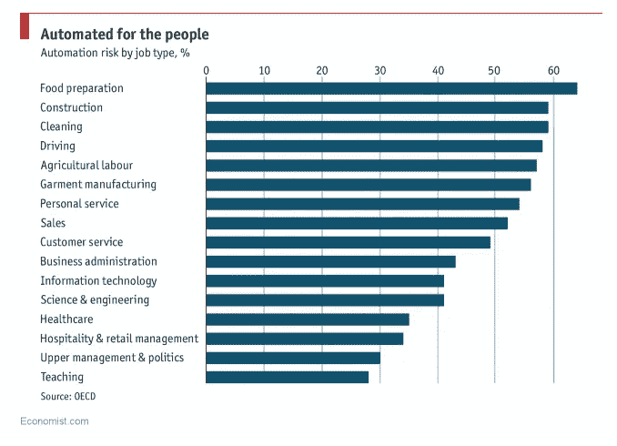

# 受到乐观主义的启发，与技术联姻，跨越人工智能鸿沟

> 原文：<https://towardsdatascience.com/inspired-by-optimism-married-to-technology-crossing-the-ai-chasm-2c5cad993faf?source=collection_archive---------29----------------------->

下面的视频(长度 17 分钟。)在今年早些时候出版了，我仍然发现它鼓舞人心，并惊叹于由影响力和资源支持的乐观主义的力量。

技术如何成为解决自动化和人工智能导致的预期失业的积极力量？

根据一项[研究](https://www.mckinsey.com/~/media/mckinsey/featured%20insights/future%20of%20organizations/tech%20for%20good%20using%20technology%20to%20smooth%20disruption%20and%20improve%20well%20being/tech-for-good-mgi-discussion-paper.ashx)，在未来十年，数百万工人可能需要改变职业，根据自动化/人工智能的采用速度，占全球劳动力的 2-14%。

如果你是下面图表中的一种工作类型(来自[《经济学家》](https://www.economist.com/graphic-detail/2018/04/24/a-study-finds-nearly-half-of-jobs-are-vulnerable-to-automation)关于人工智能在全球的影响)，并且你目前正在做卷饼、给建筑物换墙板或打扫房间，那么获得自动化取代风险较低的工作的道路可能会很陡峭。

这就引出了一个问题，即乐观情绪如何传播到美国人口中，根据这份[麦肯锡](https://www.mckinsey.com/featured-insights/future-of-work/the-future-of-work-in-black-america)报告，这些人口预计在经济上受自动化和人工智能影响最大:

*“我们测量了到 2030 年因自动化而可能失去的工作岗位的百分比，发现由于他们集中在面临自动化风险的职业中，与其他群体相比，非裔美国人的潜在工作岗位转移率最高。”这意味着“到 2030 年，由于自动化，可能会失去大约 132，000 个非裔美国人的工作岗位。”*

这些挑战对男性来说可能比女性更大。麦肯锡的论文指出，例如，非裔美国女性在 K-12 教育、护理和其他护理职业中的参与率较高，这使她们有更多机会获得医疗保健和教育部门的预期就业增长。这些工作*“自动化潜力较低，因为需要动态的、身体的运动和深层的人际关系。”*

虽然有些人提议以土地的形式进行赔偿，作为对非裔美国人当前和未来似乎根深蒂固的不平等的答案，但也许还有其他方法。

如果像小学教师或护士助理(和监狱看守)这样的“高接触”护理工作在不久的将来流失的风险很低，但对教育要求最低的入门级工作却有很高的风险，那么许多企业应该承担什么责任，这些企业更愿意雇用拥有“立即进入角色”的技术技能的工人，而不是培训他们所需的技能？

虽然有些人认为大学教育补贴是答案，但引用我一个更保守的 T2 熟人的话:

*“研究表明，受教育程度越高的人挣钱越多。但这完全是误导。拥有私人飞机的人也赚更多的钱，但这并不意味着你买了湾流就会变得更富有。”*

我想知道，是否有理由让人们更容易获得工具和 MOOCs，以比传统大学或训练营低得多的成本提供技能培训。如果像斯科特·贝尔斯基在“[创造力是新的生产力](https://marker.medium.com/creativity-is-the-new-productivity-d287d6ad7533)”中所提出的那样，创造性工作不太可能自动化，那么或许获得这一新的繁荣所需的设备和软件就是答案。

Image by [James Doucette](https://www.linkedin.com/in/james-doucette-1698a3ba/)

进入“创造力与生产力”领域存在成本障碍。例如，为了开始使用 Adobe 套件，你需要一台电脑(约 1000 美元)、软件(约 600 美元)、互联网接入(约 60 美元)和认证测试(约 80 美元)。对于每月最低工资估计为 1084.40 美元(税后)的人来说，这可能是一个挑战。然而，更有可能的障碍是围绕大学学位要求和微观证书的招聘实践。虽然像 EdX 这样的机构提供“微观硕士”,但接受独立于机构的成绩单而不是完整的学位(区块链？)是否能被招聘机构同等程度地接受，似乎还很遥远。

解决方案可能来自公私合作，就像最近宣布的 [Udacity](https://techcrunch-com.cdn.ampproject.org/c/s/techcrunch.com/2019/10/10/udacity-will-offer-100000-free-programming-classes-as-part-of-the-pledge-to-americas-workers/amp/) 一样。Udacity 承诺每年向 2 万名申请人提供免费的入门技术培训课程，面向“希望学习获得高薪工作和职业发展所需的热门技能的低收入个人。”此外，“该公司还将考虑向完成初步培训的人提供认证，以此表明成就，并展示对潜在雇主有意义的技能。”这一决定可能是因为大多数工人没有为“更强大的纳米学位项目”做好准备。如果候选人范围变得更窄，需要熟练技术员工的公司会愿意绕过对非大学学位申请者的“筛选”吗？**或者那些有技能但没有学位的人会成为亚马逊土耳其人的奴隶吗？**

是像商业圆桌会议的[学徒制 2020](https://www.businessroundtable.org/business-roundtable-ceos-launch-apprenticeship-2020-as-part-of-chicago-workforce-partnership-initiative) 那样的努力，专注于目前在芝加哥城市学院注册的大学生(新内容/旧交付模式)，还是 Udacity 的奖学金(直接面向社区经理的消费者——面向自学者)提供解决方案？还是会有其他更有机的方式，对社区做出承诺的公司不仅通过在施粥场做志愿者和粉刷公园长椅，还通过激发灵感为那些很快被落在后面的人提供替代路线来回报。在就业中心做志愿者？在大厅借笔记本电脑？或者像 [Sans Institute](https://www.sans.org/) 这样不那么依赖股东的组织会开始在网络安全方面培训高中生吗？(一些最优秀的黑客才十几岁)。

Image by [James Doucette](https://www.linkedin.com/in/james-doucette-1698a3ba/)

不管是好是坏，我们的未来都与科技结下了不解之缘，注意到在所有的关系中，分开一段时间没有坏处。解决不平等的挑战摆在我们面前，有待我们去解决。

对于那些喜欢更深入地阅读第二版[“恩格尔的停顿](https://en.wikipedia.org/wiki/Engels%27_pause)”的人来说，可以随意深入阅读 80 多页，点击这里的“[技术为好](https://www.mckinsey.com/~/media/mckinsey/featured%20insights/future%20of%20organizations/tech%20for%20good%20using%20technology%20to%20smooth%20disruption%20and%20improve%20well%20being/tech-for-good-mgi-discussion-paper.ashx)”。