# Instacart 市场购物篮分析第一部分:哪些杂货商品受欢迎？

> 原文：<https://towardsdatascience.com/instacart-market-basket-analysis-part-1-which-grocery-items-are-popular-61cadbb401c8?source=collection_archive---------14----------------------->

## [深入分析](https://medium.com/towards-data-science/in-depth-analysis/home)

## 通过土星云对 Instacart 订单的探索性数据分析

作为一名数据科学家，我的很大一部分职责是与业务利益相关方分享我的成果。作为一名数据记者，我的很大一部分职责是与我的读者分享代码块。

现在，我分享的报告需要在网络上正确呈现。我分享的代码也需要是可复制的。

[土星云](https://www.saturncloud.io/?source=jl-1)为我解决了这两个用例。

怎么会？

在这个由 3 部分组成的博客系列中，我将通过一个例子向您展示我如何使用土星云来传达我的结果。特别是，我将致力于 [Instacart 市场购物篮分析](https://www.kaggle.com/c/instacart-market-basket-analysis)，显示 Instacart 消费者会再次购买哪些产品的结果。

## **Instacart 数据集**

Instacart 是一款杂货订购和配送应用，是我最喜欢的技术平台之一。作为一名学业繁忙的研究生，我根本没有时间去买菜。Instacart 的目标是让网上购物变得简单，只需轻触一个按钮。顾客通过 Instacart 应用程序选择产品后，个人购物者会审核订单，并为顾客进行店内购物和送货。你可以把 Instacart 想象成杂货店购物的优步。

早在 2017 年，该公司[宣布了其首次公开数据集发布](https://tech.instacart.com/3-million-instacart-orders-open-sourced-d40d29ead6f2)，该数据集是匿名的，包含来自 20 多万 Instacart 用户的 300 多万份杂货订单样本。目标是预测哪些以前购买的产品将出现在用户的下一个订单中。在这篇文章中，我将做一些探索性的分析，以获得关于数据集的一些表层见解。

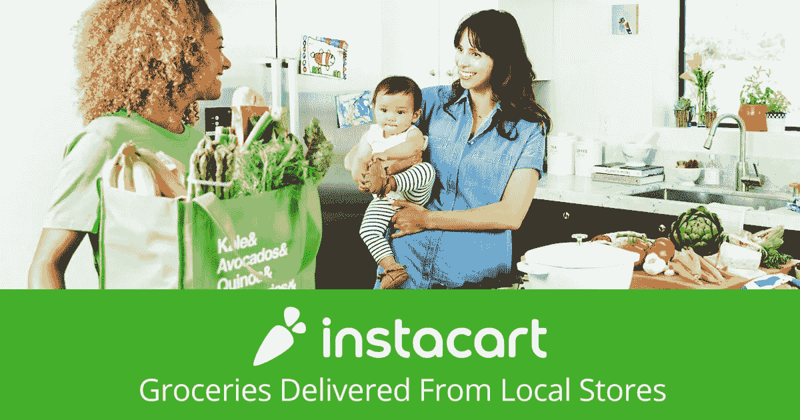

## **产品**

首先，让我们探索 Instacart 产品的数据。有两个 CSV 文件，即 **order_products_train** 和 **order_products_prior** ，指定每个订单购买了哪些产品。更具体地说， **order_products_prior** 包含所有客户以前的订单产品，而 **order_products_train** 仅包含某些客户的最新订单产品。

**订单 _ 产品 _ 列车**文件中有 1384617 件产品，**订单 _ 产品 _ 之前**文件中有 32434489 件产品。两个文件都有 4 个特征列:

*   订单的 ID(**order _ ID**
*   产品的 ID(**product _ ID**
*   订单中产品的排序( **add_to_cart_order** )
*   该产品是否被重新订购(**重新订购**)。

总体而言，49，685 种独特产品有 3，346，083 个独特订单。我们可以在下图中观察到，人们通常会订购 5 件左右的产品。

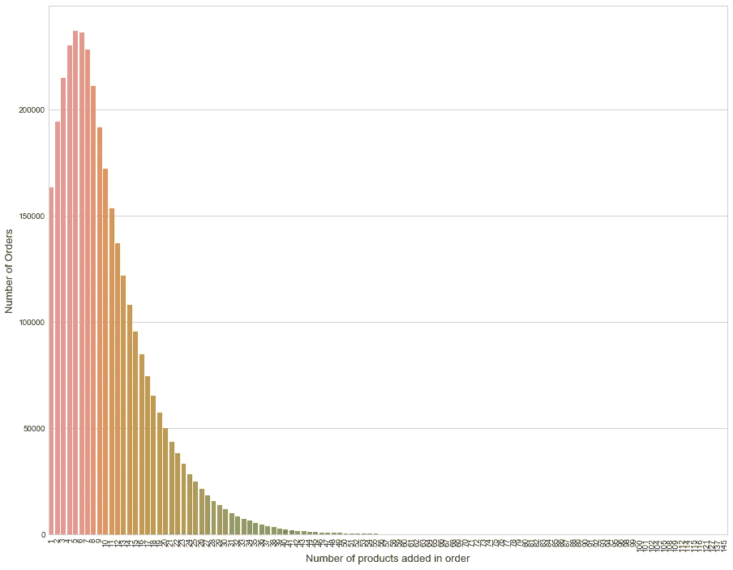

特别是，订购最多的前 5 种产品是香蕉(491，291)、袋装有机香蕉(394，930)、有机草莓(275，577)、有机小菠菜(251，705)和有机帽子鳄梨(220，877)。

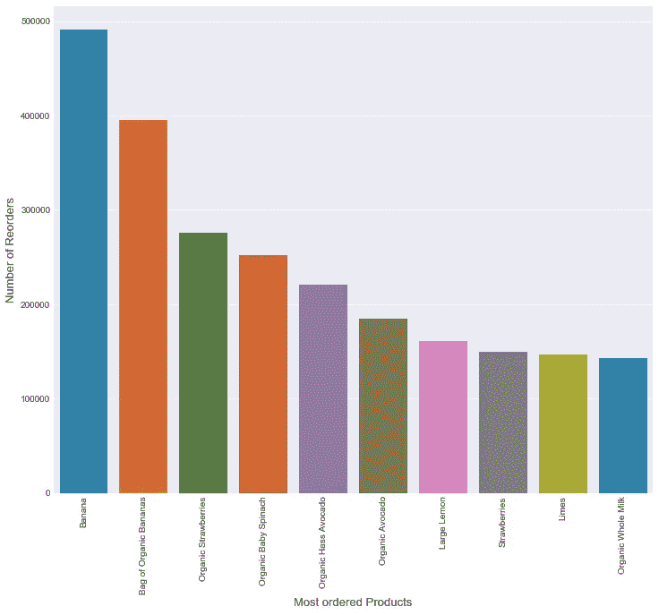

约 59%的订购产品是客户之前订购的。下图显示了通常最有可能重新订购的产品。按照概率，重新订购最多的前五种产品是 Serenity Ultimate Extrema 隔夜垫(0.933)、巧克力爱心棒(0.922)、玛卡毛茛(0.894)、Benchbreak Chardonnay (0.892)和有机蓝莓 B Mega (0.889)。

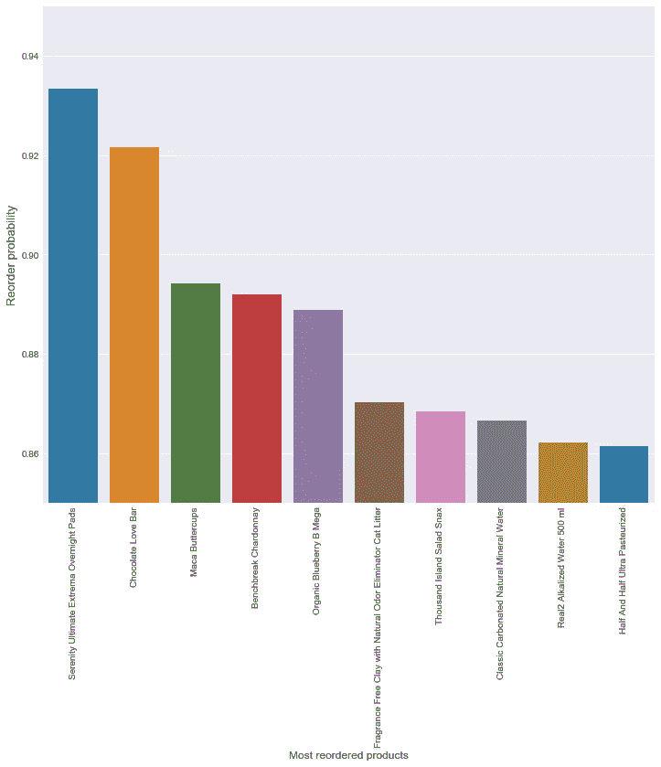

## **订单**

现在让我们来研究 Instacart 订单的数据。 **orders.csv** 文件有 3421083 个订单和 7 个特征列:

*   订单的 ID(**order _ ID**)
*   客户的 ID(**用户 id** )
*   订单所在的评估数据集——先前、训练或测试( **eval_set** )
*   订单的编号( **order_number** )
*   订单发生的星期几( **order_dow** )
*   订单发生的时间(**订单时间**)
*   自上一订单以来的天数( **days_since_prior_order**

看起来 Instacart 的客户通常在早上 8 点到晚上 7 点之间下单。

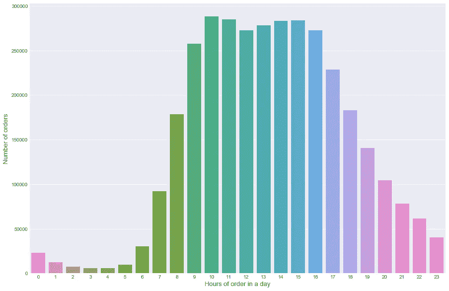

看起来他们大多在周末下订单(0 表示周六，1 表示周日)。

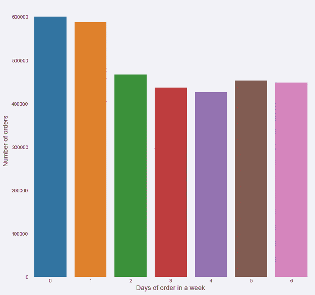

下图显示了 Instacart 客户的再订购周期。在第 7 天和第 30 天有明显的峰值，表明人们通常在一周或一个月后再订购。

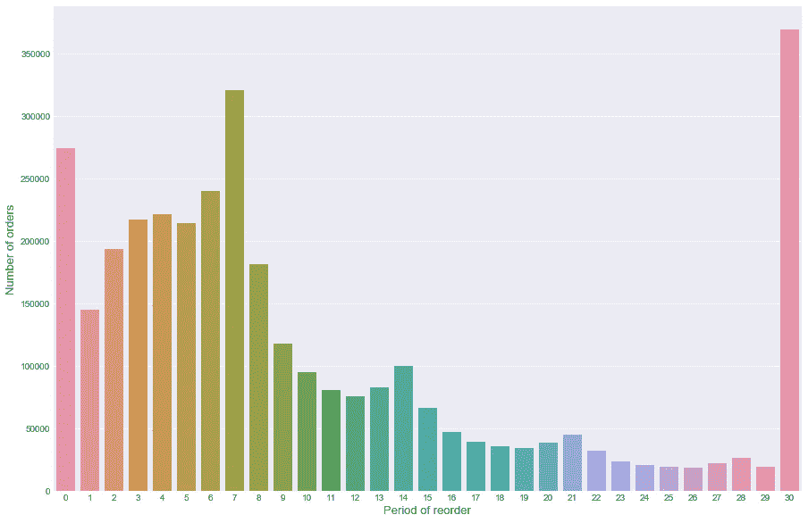

该数据集中总共有 206，209 个不同的客户。如下图所示，大多数客户下了大约 4 个订单。

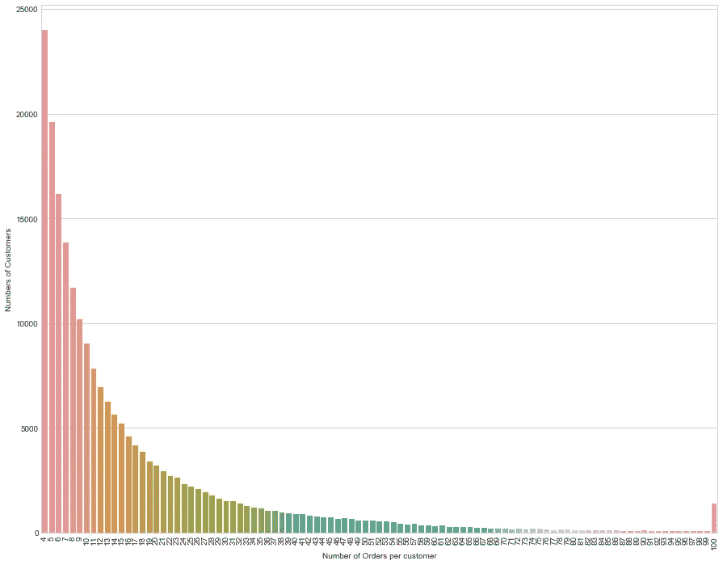

## **部门和过道**

我们来看看最重要的部门，按产品数量排序。排名前 5 位的部门分别是个人护理(6，563)、小吃(6，264)、茶水间(5，371)、饮料(4，365)和冷冻(4，007)。

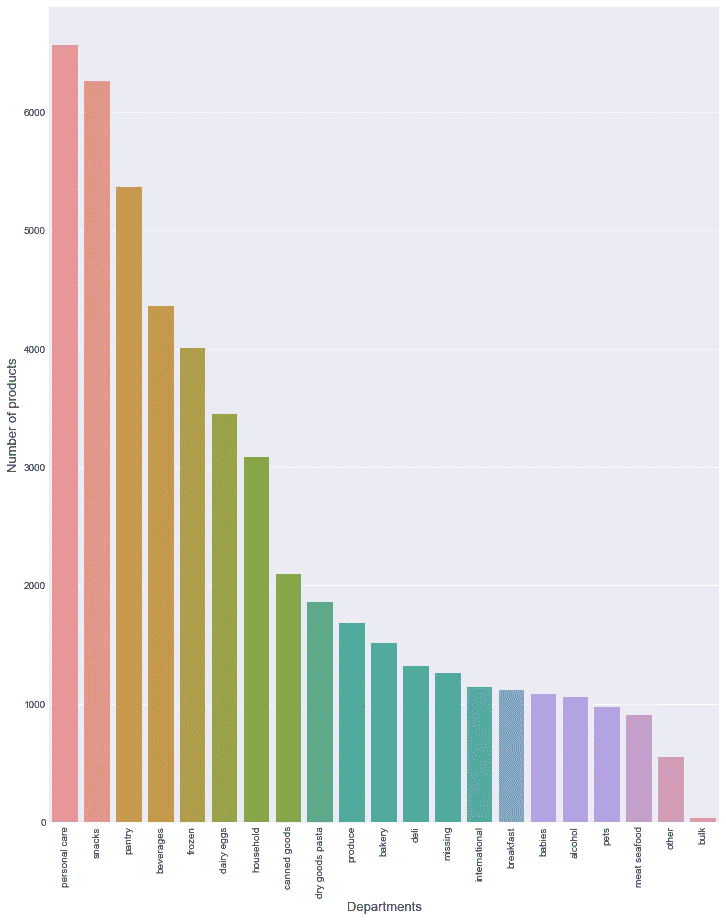

让我们看看所有部门中最重要的过道，按照产品数量进行分类。忽略“缺失”值，我们的前 5 名分别是巧克力糖(1，258)、冰淇淋(1，091)、维生素补充剂(1，038)、酸奶(1，026)和薯片椒盐卷饼(989)。

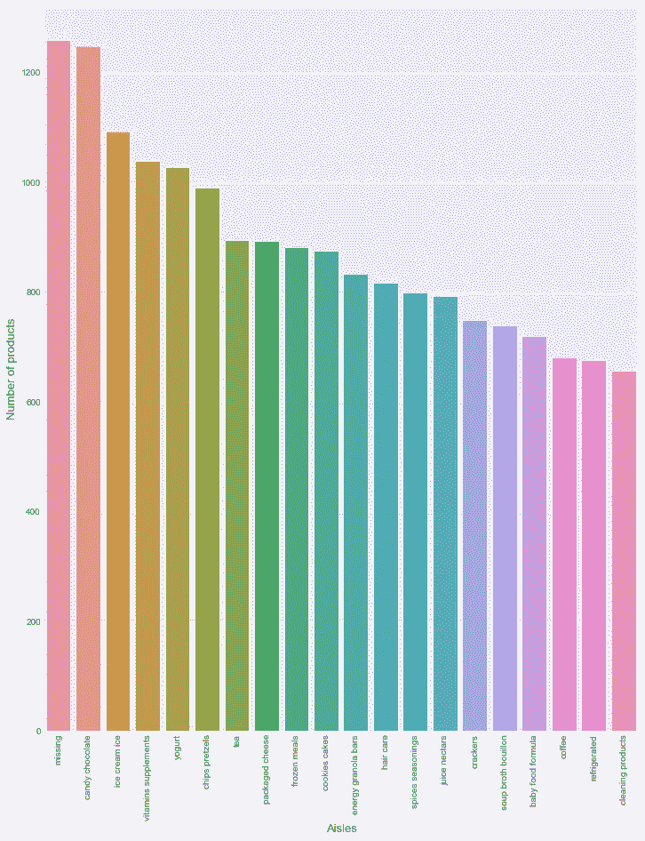

按订单数量排序的部门和通道的详细信息如何？按订单排序，最畅销的前 5 个部门是农产品(409，087)、乳制品鸡蛋(217，051)、零食(118，862)、饮料(114，046)和冷冻食品(100，426)。

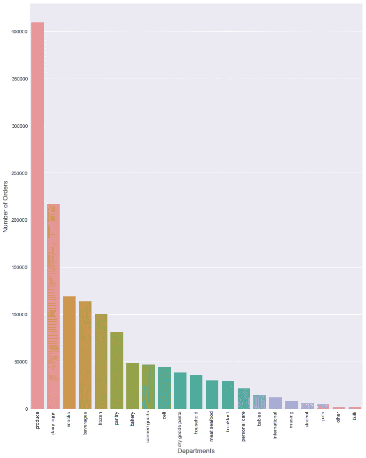

最后，我们查看所有部门中按照订单数量排序的最佳销售通道。前 5 名分别是新鲜蔬菜(150609)、新鲜水果(150473)、包装蔬菜水果(78493)、酸奶(55240)、包装奶酪(41699)。

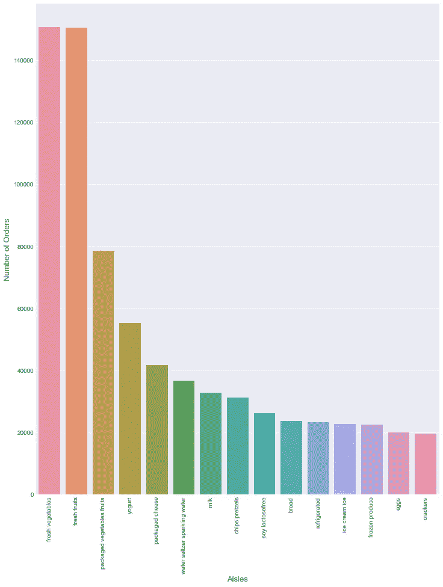

## **结论**

进行这种分析让我能够更细致地了解 Instacart 平台上客户购物行为的细节。了解最常购买的商品是 Instacart 优化其软件产品并在顾客购物时为他们推荐商品的第一步。

如果你有兴趣自己复制这个结果，你可以从[insta cart 网站](https://www.instacart.com/datasets/grocery-shopping-2017)下载数据集，并在[土星云上查看我的笔记本](https://www.saturncloud.io/published/khanhnamle1994/instacart-notebooks/notebooks/Instacart-Simple-Data-Exploration.ipynb/?source=jl-1)。就个人而言，快速轻松地共享笔记本的能力对任何数据科学家都非常有帮助。

在这个博客系列的下一部分，我将把客户分成不同的组，这可以帮助 Instacart 针对不同的需求提供更多个性化的推荐。此外，我将探索 Saturn 的特性，该特性允许我扩展云计算，因为我有更高的计算需求。