# Instacart 市场购物篮分析第二部分:哪些群体的客户是相似的？

> 原文：<https://towardsdatascience.com/instacart-market-basket-analysis-part-2-which-groups-of-customers-are-similar-618e88b0866d?source=collection_archive---------20----------------------->

## [深入分析](https://medium.com/towards-data-science/in-depth-analysis/home)

## 通过土星云对 Instacart 客户进行聚类

数据科学环境正在快速变化，变得越来越成熟。无论你是一名开发前沿深度学习算法的经验丰富的数据科学家，还是一名正在进行学校项目的研究生，能够几乎不费吹灰之力地在 Jupyter 笔记本(数据科学中的默认工作台)上发布和协作都是非常关键的。

到目前为止，还没有很多简单的共享笔记本的解决方案可供您的团队协作。如果你是一名刚从学校毕业的入门级数据科学家，这可能是一个大问题。我最近被介绍到[土星云](http://saturncloud.io/?source=jl-2)，发现共享工作和使用基于云的计算非常简单。


这是 3 部分文章系列的第 2 部分，我给出了一个例子，说明我如何使用 Saturn Cloud 来交流我在 [Instacart 市场篮子分析](https://www.kaggle.com/c/instacart-market-basket-analysis)挑战中的工作结果。在第 1 部分的[中，我进行了探索性数据分析阶段，以深入了解 Instacart 平台上客户购物行为的细节。](/instacart-market-basket-analysis-part-1-which-grocery-items-are-popular-61cadbb401c8)

## **客户细分**

在第 2 部分中，我将尝试找到一种可能的客户细分方法，使我们能够根据客户的不同购买行为对他们进行分类。客户细分是将客户群细分为具有相似特征的独立群体。这种方法是识别未满足的客户需求的有效方法。利用这些信息，Instacart 可以通过开发独特的吸引人的产品和服务来超越竞争对手。此外，该信息还将有助于下一个预测任务，该任务可用于向客户推荐新商品。

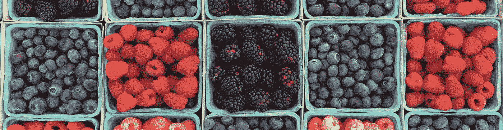

由于数据集中有成千上万的产品，我将依赖于代表产品类别的**通道**。即使有过道，功能的数量仍然会太多。因此，我将使用**主成分分析**来寻找新的维度，沿着这些维度聚类将更容易，然后尝试为已识别的聚类找到可能的解释。

## **数据预处理**

继续第 1 部分中的数据探索，这是我对数据集结构的理解:

*   用户由 *orders.csv* 文件中的 *user_id* 标识。 *orders.csv* 文件的每一行代表一个用户的订单。订单通过其 *order_id* 进行识别。
*   用户的每个订单都由一个 *order_number* 来表征，该订单指定了该订单何时相对于同一用户的其他订单做出。
*   每个订单都由一组产品组成，每个产品都有一个 *add_to_cart_order* 特性，表示它们被添加到购物车的顺序。
*   对于每个用户，我们可能有(n — 1)个先前订单和 1 个训练订单或(n — 1)个先前订单和 1 个测试订单，其中我们必须说明哪些产品已经重新订购。

为了便于分析，我将所有不同的数据帧合并成一个名为 **mt.** 的数据帧

```
_mt = pd.merge(prior,products, on = ['product_id','product_id'])_mt = pd.merge(_mt,orders,on=['order_id','order_id'])mt = pd.merge(_mt,aisles,on=['aisle_id','aisle_id'])
```

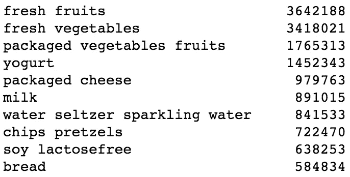

我们正在处理 134 种类型的过道和 49，677 种不同的产品。如左侧所示，最畅销的前 5 种商品是新鲜水果、新鲜蔬菜、包装蔬菜水果、酸奶和包装奶酪。

## **使用 PCA 和 K-Means 进行聚类**

目标是在不同的客户中找到所有可能的集群，并用假设他们所属的集群替换单个 user_id。这将最终提高下一个预测模型的性能。

首先要做的是创建一个数据框，其中包含每个用户的所有购买行为。这个 **cust_prod** 有 206，209 个用户和 134 列。

```
cust_prod = pd.crosstab(mt['user_id'], mt['aisle'])cust_prod.head(10)
```

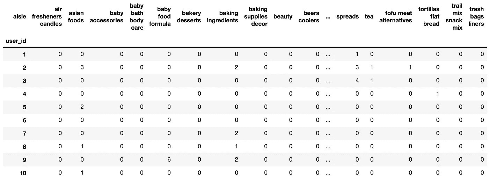

然后，我将主成分分析算法应用于 **cust_prod** 数据框架。这有助于将功能的数量从通道的数量减少到 6，这是我选择的主要组件的数量。

土星云在这里真的很有帮助，因为 PCA 算法的计算代价很高。由于我将我的笔记本托管在他们支持云的平台上，我可以利用 Saturn 提供的 GPU 来执行这个昂贵的操作。

```
from sklearn.decomposition import PCApca = PCA(n_components=6)pca.fit(cust_prod)pca_samples = pca.transform(cust_prod)ps = pd.DataFrame(pca_samples)ps.head()
```

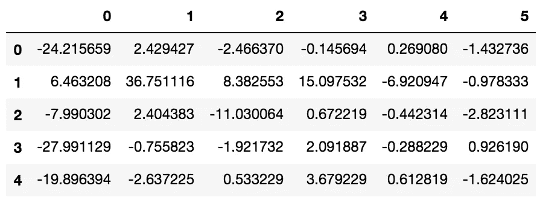

在绘制了几对组件并为 K-Means 聚类寻找了一个合适的组件对之后，我选择了(PC4，PC1)对，如下所示。由于每个组件都是原始数据集所有点的投影，我认为每个组件都很好地代表了数据集。

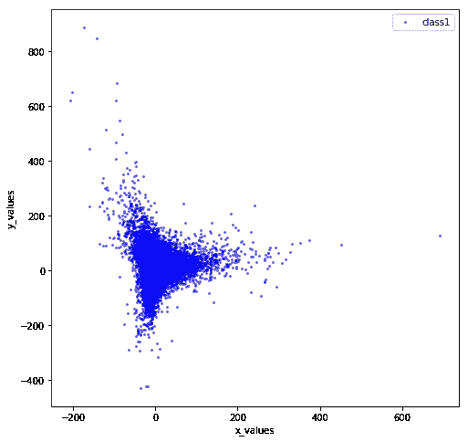

这是我们的星团是如何出现的。您可以看到有 4 个集群与 4 种不同的颜色(蓝色、绿色、紫色和橙色)相关联。值为 0，1，2，3 的圆是每个簇的质心。

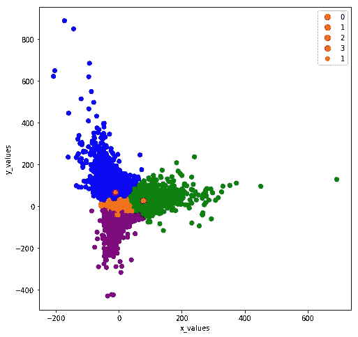

我想我已经找到了 Instacart 客户的可能聚类。让我们来看看每个集群的人们购买的前 10 种商品是什么。我将首先依赖绝对数据，然后依赖每个集群的前 8 个产品的百分比。

## **集群特征**

以下是分类 0 中的前 10 种产品。

```
c0.sort_values(ascending=False)[0:10]
```

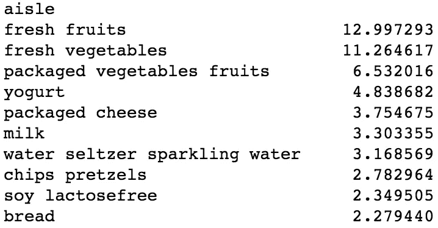

以下是第 1 类中的前 10 种产品。

```
c1.sort_values(ascending=False)[0:10]
```

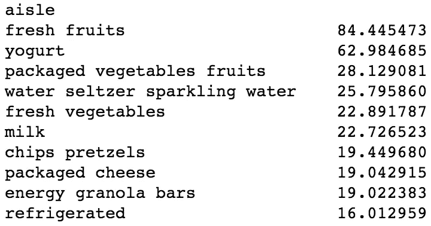

以下是第 2 类中的前 10 种产品。

```
c2.sort_values(ascending=False)[0:10]
```

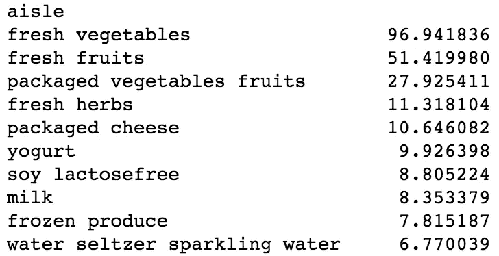

以下是第 3 类中排名前 10 的产品。

```
c3.sort_values(ascending=False)[0:10]
```

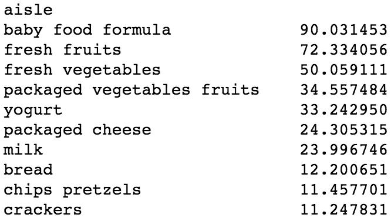

对聚类的粗略分析证实了最初的假设，即(1)新鲜水果，(2)新鲜蔬菜，(3)包装的蔬菜水果，(4)酸奶，(5)包装的奶酪，(6)牛奶，(7)苏打水，和(8)脆片椒盐卷饼是大多数顾客通常购买的产品。

我在这里可以检查的是，相对于这些货物，集群在数量和比例上是否有所不同，或者一个集群的特征是否是一些不在此列表中的货物。例如，我已经看到第 3 类的特点是“婴儿食品配方”产品，这与其他类有很大的不同。

下表描述了这些商品相对于每个聚类中其他前 8 名商品的百分比。集群之间很容易出现一些有趣的差异。

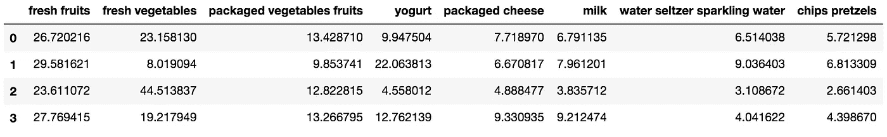

*   看起来第一组的人比其他组的人购买更多的新鲜蔬菜。如绝对数据所示，聚类 1 也是包括购买比任何其他顾客多得多的商品的顾客的聚类。
*   第二组的人比其他组的人买更多的酸奶。
*   第三组的人购买了大量的“婴儿食品配方奶粉”,这些产品甚至没有列在前八名，但却是这一组的主要特征。与这个观察一致(我认为),他们比其他人买更多的牛奶。

我认为另一个有趣的信息可能来自于查看每个集群中第 10 到第 15 个最常购买的产品，其中不包括通用产品(即蔬菜、水果、水等)。)谁都买。

在聚类 0 中，第 10 到第 15 位最常购买的商品是冷藏、冰淇淋、冷冻产品、鸡蛋和饼干。

```
c0.sort_values(ascending=False)[10:15]
```

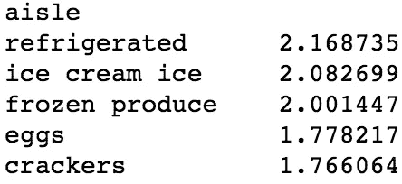

在第 1 组中，第 10 到第 15 位最常购买的商品是无乳糖大豆、面包、饼干、麦片和巧克力糖。

```
c1.sort_values(ascending=False)[10:15]
```

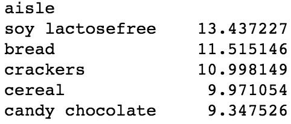

在聚类 2 中，第 10 到第 15 位最常购买的商品是鸡蛋、罐装罐装蔬菜、面包、薯片、椒盐卷饼和冷藏食品。

```
c2.sort_values(ascending=False)[10:15]
```

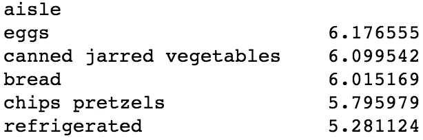

在聚类 3 中，第 10 到第 15 位最常购买的商品是不含乳糖的大豆、冷冻产品、苏打水、冷冻食品和鸡蛋。

```
c3.sort_values(ascending=False)[10:15]
```


正如您所注意到的，考虑更多的产品后，聚类开始明显不同。

## **结论**

对于任何企业来说，进行客户细分都有多种优势:确定合适的产品定价、制定有效的定制营销活动、设计最佳分销策略、选择具体的产品功能进行部署，以及对新产品开发工作进行优先排序。正如我的分析所证明的，Instacart 可以通过多种方式，利用公司拥有的庞大客户群，执行上述任何一种商业战略。

如果你有兴趣自己复制这个结果，你可以从 Instacart 网站下载数据集，并在[土星云上查看我的笔记本](https://www.saturncloud.io/published/khanhnamle1994/instacart-notebooks/notebooks/Customer-Segments-with-PCA.ipynb/?source=jl-2)。在这个博客系列的最后一部分，我将尝试进行关联规则挖掘，这是一种机器学习技术，有助于显示 Instacart 订单数据集中购买的产品之间的关系概率。