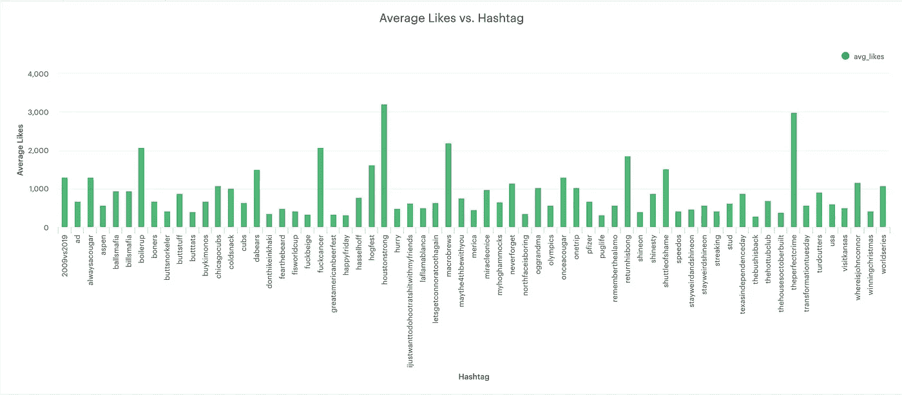

# 使用全景和模式的 Instagram 数据分析

> 原文：<https://towardsdatascience.com/instagram-data-analysis-ce03aa4a472a?source=collection_archive---------11----------------------->


picture credits to panoply.io

# 背景

该项目建立在 [Panoply](https://panoply.io) 于 2019 年 4 月发布的数据挑战之上。Panoply 是一个云数据仓库，你可以从不同的数据源(如 S3 自动气象站，谷歌分析等)收集数据。)，然后连接到不同的商业智能工具(即 Chartio、Mode 等。)进行分析和洞察。

Panoply 最近将他们的[数据仓库与 Instagram API](https://blog.panoply.io/instagram-on-panoply) 集成在一起，以收集数据。这个[挑战](https://blog.panoply.io/instagram-data-challenge)是关于使用 Panoply 作为 ETL 工具来探索 Instagram 数据的营销用途(即推广、细分等)。).

在这项挑战中，挑战者被要求建立一个 Panoply 帐户，并连接到 self Instagram 或提供的 Instagram 数据，以进行分析，得出见解，并为讲故事建立可视化。如果您有 Instagram 帐户，您可以使用自己 Instagram 帐户中的数据。或者，如果您更喜欢使用 Panoply 提供的数据，您可以从两个帐户中选择:

*   Kirsten Alana:insta gram 的顶级影响者。
*   Shinesty :一个创新和前卫的服装品牌。

然后，您可以使用您选择的任何 BI 工具进行数据可视化。本次挑战的最终交付成果将采用英语，数据可视化，用于交流您的发现和您使用过的 SQL 查询。

# 项目设计

我的项目步骤是:

1.  探索 Panoply，使用它在自己的网站上为挑战和文档提供的资源。
2.  创建 Panoply 免费试用帐户，连接到提供的数据源，连接到商业智能工具。
3.  探索数据集，理解模式和关系。
4.  研究并提出 Instagram 所有者希望跟踪和回答的问题/指标/关键绩效指标。这样他们就能获得发展品牌的洞察力。
5.  使用模式构建可视化并接受挑战。

# 工具

我将在这个项目中使用的工具和技术将是 Panoply，Instagram data，SQL 和[模式](https://mode.com/)。

# 过程

我开始阅读 Panoply 提供的资源，并探索他们的网站，以更好地了解 Panoply 是什么以及它如何在数据分析过程中发挥作用。然后我创建了 Panoply 帐户的免费试用版，并按照他们的文档连接到亚马逊 S3 收集提供的 Instagram 数据。

## 创建一个 Panoply 帐户

下面是唱出一个全景账户的流程:

1.  转到 [https://panoply.io](https://panoply.io/) 。


panoply.io landing page screenshot

2.使用电子邮件帐户注册一个免费的 21 天试用帐户。


sign-up page screenshot

## 连接到数据源并收集数据

下面是连接到亚马逊 S3 并使用 API 收集 Instagram 数据的流程。在这个挑战中，我使用了 Shinesty 的数据作为我的分析目标，Shinesty 是一个创新和前卫的服装品牌。

1.  转到数据源选项卡。


Data Sources tab screenshot

2.选择你想连接的数据源，对于这个项目，我使用亚马逊 S3。

输入您的凭证并开始从您的数据源收集数据到 Panoply 数据仓库。


Amazon S3 api info page screenshot

3.你的桌子准备好了。


Tables tab screenshot

## 用于分析的表格

收集数据后，我发现总共有 31 张表。经过探索和检查，我确定了 5 个最有用的表格，并用它们得出有意义的见解。下面是我使用过的表格和列。


shinestyinstagram_instagram_user table screenshot


shinestyinstagram_instagram_media table screenshot


shinestyinstagram_instagram_comment table screenshot


shinestyinstagram_instagram_media_tags table screenshot


shinestyinstagram_instagram_media_location table screenshot

## 韵律学

经过我的研究，我确定了一些 Instagram 账户所有者希望了解的指标和问题，以便在 API 提供数据的情况下提高他们的账户认知度。

*   每个标签的参与度。
*   一段时间内的表现。
*   用户评论时按星期几使用的性能。
*   当用户发表评论时，按一天中的小时使用性能。
*   创建帖子时按小时使用的绩效。
*   按媒体类型划分的性能。
*   不同介质的过滤性能。
*   使用位置标签的性能。
*   有位置标签的帖子与没有标签的帖子的性能差异。
*   最活跃的评论者。
*   队列分析。

## 可视化的连接模式

1.  前往 https://mode.com[的](https://mode.com/)创建一个免费的非商业账户。


Mode home page screenshot

2.进入您的帐户控制面板后，点击左侧您姓名旁边的向下箭头。


home dashboard screenshot

3.然后会出现一个新的下拉菜单，选择 Connect a Database 选项卡。


drop down menu for connecting a database screenshot

4.然后，您可以使用您的凭证连接到不同的数据库。


connect to database screenshot

对于这个项目，我们使用了 Amazon Redshift，因为这是 Panoply 用来存储我们的表的数据库。在您进入并收集到您的 Panoply 数据库后，Mode 将开始收集所有表格到您的帐户数据库中。一旦完成，您就可以开始使用 SQL 来分析模式中的数据。


using SQL to analyze the data in Mode screenshot

## 分析

下面是我用来回答指标部分的问题的查询。

*   **为使用的每个标签寻找参与度**:

```
with t AS
(SELECT
value as hashtag,
likes_count as likes,
comments_count as comments
FROM public.shinestyinstagram_instagram_media m
left JOIN public.shinestyinstagram_instagram_media_tags mt
ON m.id = mt.instagram_media_id
) 
select 
     hashtag,
     AVG(likes) as avg_likes,
     AVG(comments) as avg_comments
from 
     t
where hashtag is not null
group by 1
```

下面的视频告诉你每个标签的平均赞数，# housetonstrong 和#theperfectcrime 的平均赞数最多。



Average Likes vs. Hashtag

下面的视频告诉你每个标签的平均评论，其中#buttstuff 和#macrobrews 的表现最好。


Average Comments vs. Hashtag

下面视觉结合以上两者。


Performance By Hashtag

*   **了解一段时间内的表现**:

```
SELECT
DATE_TRUNC(‘week’, created_time)::DATE as week,
SUM(comments_count) AS total_comments,
AVG(comments_count) AS avg_comments,
SUM(likes_count) AS total_likes,
AVG(likes_count) AS avg_likes,
count(distinct id) as nums_of_post
FROM
public.shinestyinstagram_instagram_media
GROUP BY
1
ORDER BY 
1
```


Performance Over Time

*   **使用 when a user comment 按星期几查找性能:**

```
select 
TO_CHAR(created_time, ‘DY’) as day,
COUNT(distinct media_id) AS nums_of_post_got_commented,
COUNT(distinct from_username) AS nums_of_commenter,
ROUND((nums_of_commenter/ cast(nums_of_post_got_commented as FLOAT)), 0) as average_commenter_per_post
from 
public.shinestyinstagram_instagram_comments
group by 
1
order by 
1
```

下图显示，周四和周五是用户最喜欢评论的时间。


Engagement Performance by Day of Week

*   **使用用户何时发表评论来查找一天中每个小时的表现:**

```
select 
TO_CHAR(created_time, ‘HH24’) as hour,
COUNT(distinct media_id) AS nums_of_post_got_commented,
COUNT(distinct from_username) AS nums_of_commenter,
ROUND((nums_of_commenter/ cast(nums_of_post_got_commented as FLOAT)), 0) as average_commenter_per_post
from 
public.shinestyinstagram_instagram_comments
group by 
1
order by 
1
```


Engagement Performance by Hour

*   **使用帖子创建时间查找一天中的小时绩效:**

```
SELECT
TO_CHAR(created_time, ‘HH24’) as hour,
SUM(comments_count) AS total_comments,
AVG(comments_count) AS avg_comments,
SUM(likes_count) AS total_likes,
AVG(likes_count) AS avg_likes,
count(distinct id) as nums_of_post
FROM
public.shinestyinstagram_instagram_media
GROUP BY
1
ORDER BY 1
```

我展示这个查询的目的是因为我认为在一天的早上 7 点到下午 4 点使用这个洞察力来推荐发布 IG 帖子是不合适的。因为这个查询在创建帖子时使用来计算赞和评论的数量。相比之下，当用户发表评论时用来计算性能的最后一个视觉效果，我认为会更准确。所以我建议@shinestythreads 在每天晚上 11 点到凌晨 2 点发布，以获得更多的评论参与度。不幸的是，API 没有提供相同的信息，我想用它来计算喜欢的参与度。


Performance by Hour

*   **按媒体类型查找绩效:**

```
SELECT
type,
SUM(likes_count) as total_likes,
AVG(likes_count) as avg_likes,
SUM(comments_count) as total_comments,
AVG(comments_count) as avg_comments,
COUNT(distinct id) as nums_of_post
FROM
public.shinestyinstagram_instagram_media
GROUP BY
1
```

IG 目前提供三种类型的媒体:图像、视频和轮播。下图显示了视频媒体的平均评论数最多，轮播媒体的平均点赞数最多。而视频媒体表明自己是获得参与度的最佳媒体。


Performance by Media Type using average comments


Performance by Media Type using average likes

*   **通过过滤器查找不同介质的性能:**

```
SELECT
filter,
type,
SUM(likes_count) as total_likes,
AVG(likes_count) as avg_likes,
SUM(comments_count) as total_comments,
AVG(comments_count) as avg_comments,
COUNT(distinct id) as nums_of_post
FROM
public.shinestyinstagram_instagram_media
GROUP BY
1, 2
```

在下图中，我们可以看到除了普通的图像媒体滤镜之外，名为 Crema 的滤镜具有最佳的性能。


Performance by Filter for Image Media

在下面的视频中，我们可以看到除了视频媒体的普通过滤器之外，名为 Ashby 的过滤器具有最佳性能。


Performance by Filter for Video Media

对于轮播媒体，我们可以做同样的事情来获得洞察力，但我没有在这里这样做，因为@shinestythreads 只有针对轮播媒体的普通过滤器。

*   **通过使用的位置标签了解性能:**

```
SELECT
location,
SUM(likes_count) as total_likes,
AVG(likes_count) as avg_likes,
SUM(comments_count) as total_comments,
AVG(comments_count) as avg_comments
FROM
(SELECT
name as location,
m.likes_count,
m.comments_count
FROM
public.shinestyinstagram_instagram_media_location l
LEFT JOIN public.shinestyinstagram_instagram_media m
ON l.instagram_media_id = m.id
) as t
GROUP BY
1
```

该图向我们展示了在所有带有位置标签的帖子中，奥古斯特国家高尔夫俱乐部的平均喜欢和评论参与度最高。


Performance by Location Tag

*   **找出有位置标签的帖子与没有位置标签的帖子的性能差异:**

```
WITH t AS
(SELECT
m.id,
m.likes_count,
m.comments_count,
l.name as location
FROM
public.shinestyinstagram_instagram_media m
LEFT JOIN
public.shinestyinstagram_instagram_media_location l
ON
m.id = l.instagram_media_id
),w as
(SELECT
*,
(CASE WHEN location IS NULL THEN 0 ELSE 1 END) AS have_location
FROM t
)SELECT
have_location,
SUM(likes_count) as total_likes,
AVG(likes_count) as avg_likes,
SUM(comments_count) as total_comments,
AVG(comments_count) as avg_comments
FROM
w
GROUP BY
1
```

与没有位置标签的帖子相比，有位置标签的帖子有更多的平均喜欢，但平均评论稍少。


Performance of Location Tag vs. No Location Tag

*   **找出最活跃的评论者:**

```
SELECT
*
FROM
(SELECT
from_username as username,
COUNT(media_id) as nums_of_comments,
RANK() OVER(ORDER BY nums_of_comments DESC)
FROM
public.shinestyinstagram_instagram_comments
GROUP BY
1
ORDER BY
2 DESC
) as t
WHERE
rank >1 and rank <=15
```

这个视图向我们展示了谁是最活跃的评论者(用户)，不包括用户@shinestythreads。


Most Active Commenters

*   **队列分析:**

```
with t AS(selectmedia_id,from_username as username,DATE_TRUNC('week', created_time) as weekfrompublic.shinestyinstagram_instagram_comments),w AS(selectusername,min(week) as first_time_commentingfromtGROUP by1)SELECTx.cohort::DATE AS week,MAX(x.week_number) OVER (PARTITION BY x.cohort) AS total_nums_of_week,x.week_number,MAX(x.nums_of_commenter) OVER (PARTITION BY x.cohort) AS nums_of_new_commenter,x.nums_of_commenter,x.nums_of_commenter/MAX(x.nums_of_commenter) OVER (PARTITION BY x.cohort)::FLOAT AS retention_rateFROM(SELECTw.first_time_commenting as cohort,FLOOR(EXTRACT('day' FROM t.week - w.first_time_commenting)/7) AS week_number,COUNT(DISTINCT t.username) AS nums_of_commenterFROMt tLEFT JOINw wONt.username = w.usernameGROUP BY1,2) as xORDER BY 1,2,3
```


以上是我为这个项目所做的所有分析。对于我用过的数据，因为保密的原因，我没有上传到我的 Github 上。如果你有兴趣了解我为这个项目使用了哪些资源，请访问我的 Github [repo](https://github.com/khsio/project_panoply_instagram_data_challenge) 。

如有疑问，欢迎在下方评论。非常感谢您的阅读！